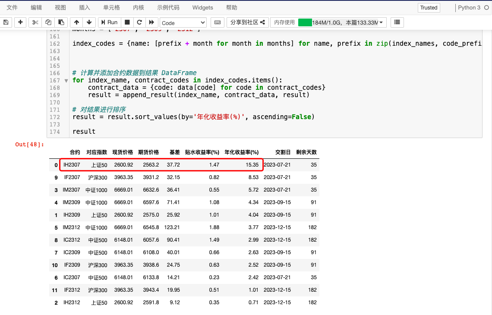
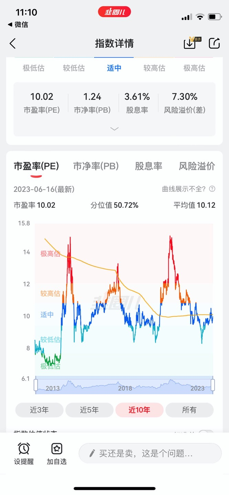

# 2023-06 即刻归档

## 月度总结
- 本月共归档 4 条内容，活跃了 4 天，时间范围从 2023-06-18 到 2023-06-30。
- 发帖最集中的一天是 2023-06-18，当天共记录 1 条。
- 本月最常出现的话题是：小散户的日常 (1), 你不知道的行业内幕 (1), 高考加油站 (1)。
- 带媒体链接的内容有 1 条，短笔记风格的内容有 0 条。
- 最长的一条发布于 2023-06-30，正文约 697 字。

## 2023-06-18

### [16:26](https://m.okjike.com/originalPosts/648ebfa6395998dfd47856e0)
在GPT4的协助下, 实现一个功能: 比较不同股指期货合约吃贴水, 看哪个收益最大. 在一步步的提示下, 先让AI实现从集思录和中金所抓取数据的功能, 再计算排序输出, 然后把各模块合并, 最后得到的代码反正比自己写的好. 问题来了: 现在上证50的估值并不高, 为什么IH2307的吃贴水收益这么大, 会有哪些我不知道的风险?

#小散户的日常

---

## 2023-06-22

### [15:04](https://m.okjike.com/originalPosts/6493f29186c3544bb27fa47d)
一头“冠军”松阪牛被卖2600万日元,约合当时168万人民币,比网友命贵。

日本和牛已经成为世界价格最高的牛肉品种,与法国松露和俄罗斯鱼子酱并称世界三大名贵食材。

在中国,人均100元左右就能品尝和牛,但实际为澳洲和牛。

日本和牛养殖户武田正吾将51头日本和牛卖给美国人,被日本和牛登记协会除名。

由于疯牛病和核泄漏事故,日本暂停和牛出口,同时澳洲逃过疯牛病肆虣,从而进入全球和牛市场。

进口日本和牛最多的国家不是中国也不是美国。

#你不知道的行业内幕

---

## 2023-06-27

### [16:49](https://m.okjike.com/originalPosts/649aa2adcb80d8107b43ded9)
当前形势下，全球都在推崇人工智能、大数据，部分机械化重复劳动的基层岗位势必会受到人工智能的影响，比如翻译、法务、会计、记者、程序员、插画师等。

如何选择专业能让孩子尽可能少地被机器人影响？打不过，就加入。建议孩子们在本科阶段多学一些计算机、数学底层基础的课。当无法与人工智能抗衡的时候，不如成为那批最会利用人工智能技术提高自身工作效率的就业者。

#高考加油站

---

## 2023-06-30

### [20:35](https://m.okjike.com/originalPosts/649ecc1b0496a46ed6139f2c)
使用自己生成的数据来训练AI系统会导致“模型崩溃”的几个主要原因:

1. 生成的数据集失去了多样性。AI系统最初是在包含各种多样数据的训练集上训练的,比如人类创作的文字、图片等,这些数据展示了丰富的多样性。但AI系统生成的数据集难以做到同样丰富多样,容易过度集中在某些类型或属性上,导致新训练的AI系统无法很好地理解和处理现实世界的复杂性。

2. 生成的数据集存在误导性信息。AI系统生成的数据并不一定准确可靠,可能包含不切实际或误导性的信息,这些错误信息会被新AI系统学习和吸收,使其产生误判或误解。人类创作的内容更加真实可信,是训练AI的理想数据源。

3. 丧失少数信息的代表性。生成的数据集难以像人类数据那样公平地表示数据中的少数信息或群体,这可能导致新AI系统在处理这些少数信息时表现不佳,甚至“遗忘”它们。而人类创作的数据天然就包含各种少数信息的代表性。

4. 缺失反例数据。人类创作的数据集通常包含正常情况的数据以及相应的反例数据,后者对AI系统的训练至关重要。而AI自身难以生成包含可靠反例数据的完整数据集,新训练的AI系统因此可能无法很好地处理异常情况。

5. 丧失多样性导致过拟合。如果AI系统生成的数据集过于单一和集中,会导致新训练的AI系统过于依赖这些有限数据,产生过拟合的问题,无法很好地泛化到更广泛的数据和情况,最终导致性能下降和“模型崩溃”。

所以,总体而言,使用自己生成的数据来训练AI,会使新系统失去广博多样的数据支持,学习到不完备甚至误导性的信息,获得有限的学习视角,最终导致泛化能力下降和模型崩溃。而定期添加人类数据可以在很大程度上避免这些问题。

#AI探索站

---
