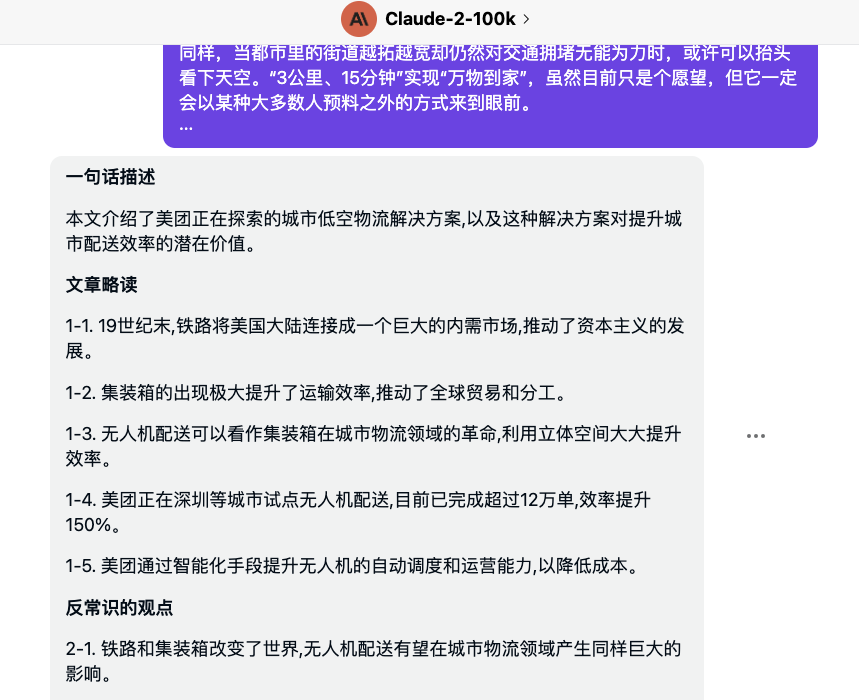
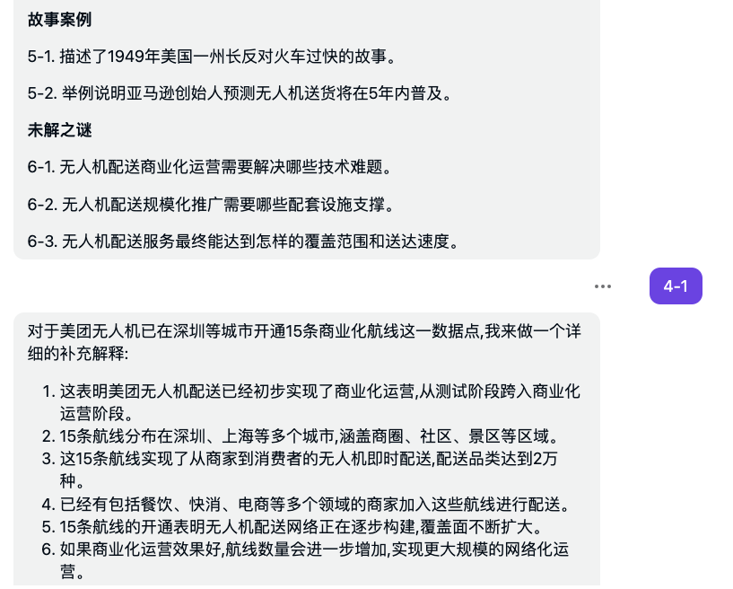

# 2023-08 即刻归档

## 月度总结
- 本月共归档 3 条内容，活跃了 2 天，时间范围从 2023-08-02 到 2023-08-05。
- 发帖最集中的一天是 2023-08-05，当天共记录 2 条。
- 本月最常出现的话题是：AI探索站 (1), 随手拍张照 (1), 二手交易 (1)。
- 带媒体链接的内容有 2 条，短笔记风格的内容有 1 条。
- 最长的一条发布于 2023-08-05，正文约 792 字。

## 2023-08-02

### [12:18](https://m.okjike.com/originalPosts/64c9d900aac630c848fbd6a7)
最近综合看到的各种总结类的prompt, 写的一个比较全的总结prompt:

针对给定的原文按照以下模板生成总结:

**▎一句话描述**
{使用一句话概括原文主要内容}  

**▎文章略读**
{按照以下结构生成文章要点, 对复杂的观点可以机灵必要的扩展阐述}:
1-1.{要点1}  
1-2.{要点2}
1-3.{要点3}
...

**▎反常识的观点**
{按照以下结构生成文章的一些反常识的观点, 没有可以略过}:
2-1.{观点1}  
2-2.{观点2}
2-3.{观点3}
...

**▎阅读收获**
{作为一名挑剔的读者，阅读本文的收获有哪些, 请按照以下结构将收获点列出}:
3-1.{收获点1}  
3-2.{收获点2}
3-3.{收获点3}
...

**▎有价值数据**
{文中有哪些有意思,有价值的数据, 请按照以下结构将数据列出, 没有可以略过}
4-1.{数据1}  
4-2.{数据2}
4-3.{数据3}
...

**▎故事案例**
{文中有哪些有意思的故事或案例, 请按照以下结构将故事或案例列出, 没有可以略过}
5-1.{故事1}  
5-2.{故事2}
5-3.{故事3}
...

**▎未解之谜**
{作为一名好奇的读者，文章还有哪些尚未解答的问题, 请按照以下结构将收获点列出, 没有可以略过}:
6-1.{未解答1}  
6-2.{未解答2}
6-3.{未解答3}
...

请保持总结语言简明扼要,突出原文主要观点。要点按重要性顺序排列,每点用一句话概括描述(内容复杂可以稍微扩展)。如果用户后续输入编号如1-2,请针对该编号的内容进行详细阐述。详细阐述时请用通顺的语言描述该内容的细节、论据或例子等。

原文如下:
{原文内容}

#AI探索站

---

## 2023-08-05

### [17:12](https://m.okjike.com/originalPosts/64ce1267aac630c84860092a)
虽然很热，但风景绝佳

#随手拍张照

---

### [19:57](https://m.okjike.com/originalPosts/64ce390febdb17148cbced07)
本人自住房子，已经收拾妥当，准备迎接新的主人!🔑

房子坐标杭州闲林竹海水韵春风里

18层电梯楼位于七楼的中间层，中间套，两梯四户。🏢

三房🛏️ 两厅🛋️ 一卫🚽，面积88.36平方米。🏡

满五不唯一税费少。💰

自住用心装修的现代简约风格，主打一个高性价比和实用。

卧室书房均铺设了大自然品牌纯实木地板，环保又健康。

南北通透，阳台主卧书房都朝南，采光极好。☀️

奇数层，空间突出（相对偶数层），阳台面积大，看书喝茶，养花种草都不会嫌小。

储物收纳空间极多，阳台，卧室，书房，餐厅，入户玄关哪都有储柜，整洁有序。

家电家具都是自用品牌，海尔冰箱🍨，格力空调❄️，SONY电视📺，LG洗衣机👗，能率热水器 🚿，一件不带走，全送！

再加上床垫，床架，餐桌茶几，真皮沙发也全送，一件不带走。

有车的朋友们，还附带有车位，位置正对楼下地下车库，选购有优惠。🚗

单元楼位于小区中心，出行便利，视野开阔无遮挡。

门口的小广场，适合年轻人遛娃，老年人广场舞。

邻里中心有健身房💪，瑜伽室🧘‍♀️，游泳池🏊‍♂️，网球场🎾，读书阅览室📚，老年食堂，照料中心，社区设置齐全。

楼下日用超市，水果菜场，餐馆，理发，宠物店生活设施齐全。

绿树成荫，🌳水道纵横，极具水乡湿地特色。🦆

私立幼儿园就在家门口，公立幼儿园300米内，私立英特小学600米内，私立英特中学900米内，金成少年宫1.3公里内。🏫

离七彩汇商业中心900米内，离浙大附属第一医院（余杭院区）🏥4.1公里公交直达，离最近地铁站2.9公里公交直达，打车起步价，门口公交20分钟一趟，出行便利。

已经空出，随时可看房，即买即住，拎包入住，非常方便。

无论是刚需上车的你，还是需要一个温馨的老人养老之所，或者是想找个过渡或长住的地方，这个房子都是不错的选择。👋
#二手房 #刚需 #卖房 #一镜到底看我家

#二手交易

---
