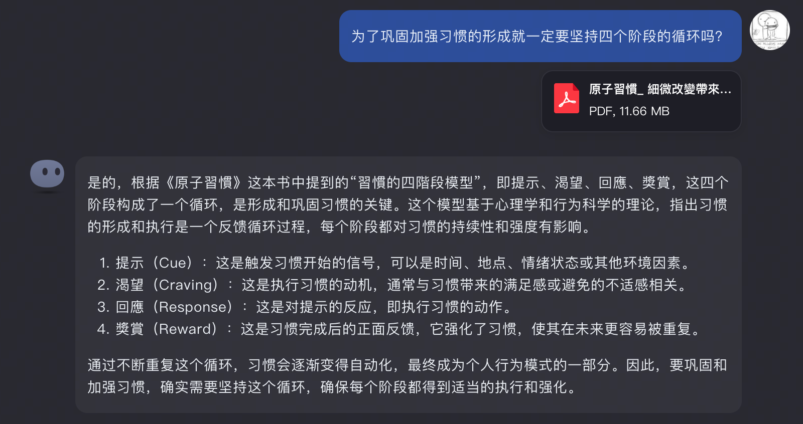
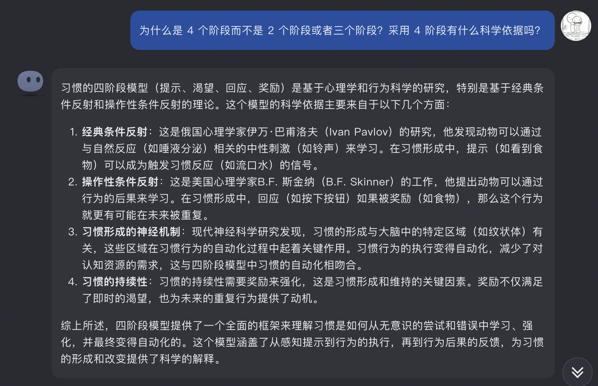
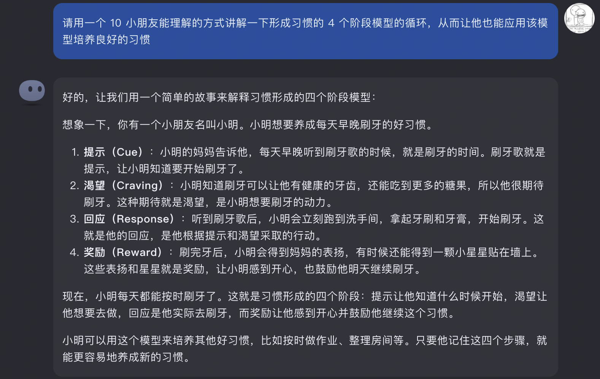
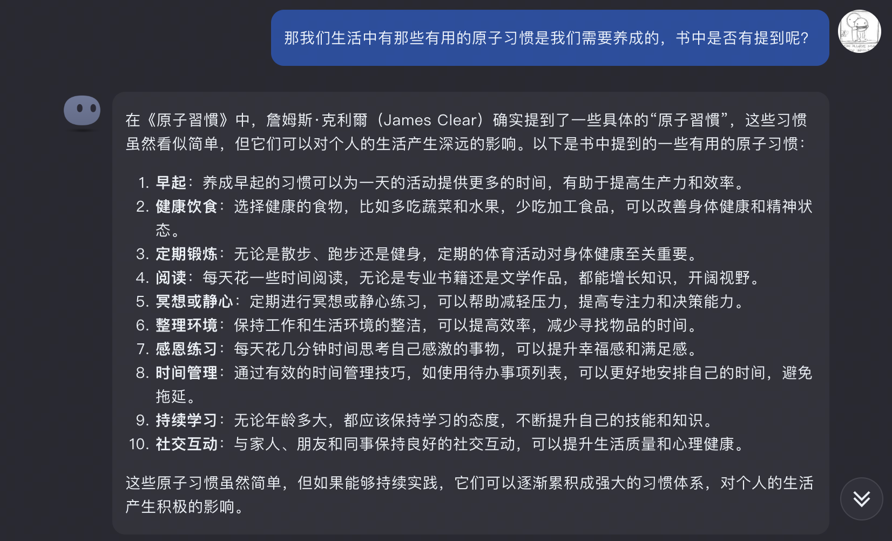
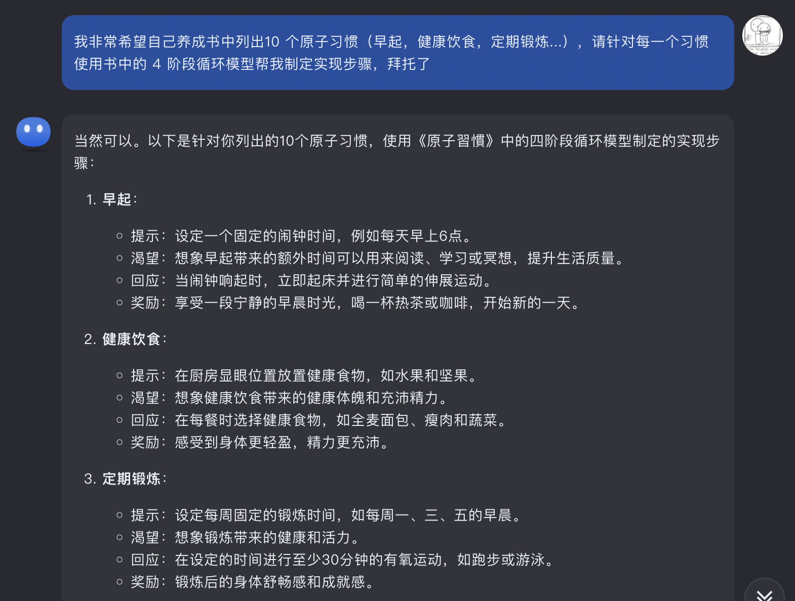
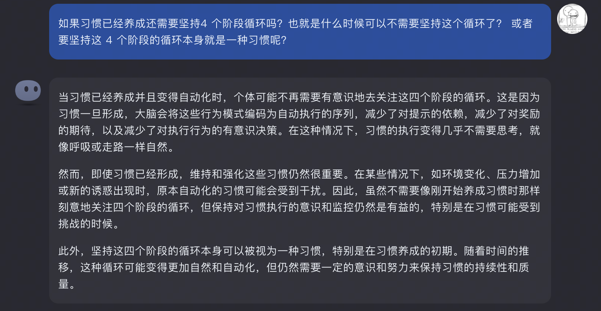
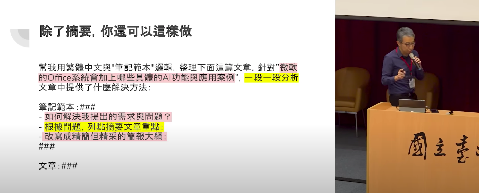

# 2024-01 即刻归档

## 月度总结
- 本月共归档 3 条内容，活跃了 3 天，时间范围从 2024-01-15 到 2024-01-29。
- 发帖最集中的一天是 2024-01-15，当天共记录 1 条。
- 本月最常出现的话题是：AI探索站 (3)。
- 带媒体链接的内容有 2 条，短笔记风格的内容有 1 条。
- 最长的一条发布于 2024-01-29，正文约 165 字。

## 2024-01-15

### [09:40](https://m.okjike.com/originalPosts/65a48d0437f7165b21f25ff7)
AI时代对阅读最大的改变就是可以让我们更好的带着问题去看书，甚至不用把一本书全部看完，而只针对自己关心或感兴趣的部分去读，不过对自身也提出了更高的要求，对AI给出的答案要有足够的分辨能力，比如AI的各种“幻觉”...

最近我就在用 KimiChat “帮”我看书

#AI探索站

---

## 2024-01-27

### [17:19](https://m.okjike.com/originalPosts/65b4ca8538849f879f498389)
最近KimiChat经常抽风啊...

本来答案在输出的好好的

突然就变成了:

尊敬的用户您好，很抱歉由于我的知识领域尚有所不足导致我无法回答您的这个问题。

#AI探索站

---

## 2024-01-29

### [12:21](https://m.okjike.com/originalPosts/65b727b7de5f287348a0a6cc)
最近在油管上看到一个视频: 善用ChatGPT，讓專業的你更亮眼 ! | 生成式AI主題論壇
里面提到的一个写prompt的技巧, 就是加上"请一步一步分析", 这样在收集整理的提问时, 确保所有的要点都能覆盖到, 减少关键信息遗漏的可能性, 另外也可以清晰的看出chatgpt的思维链路, 给出来答案逻辑会非常清晰, 更容易理解

#AI探索站

---
