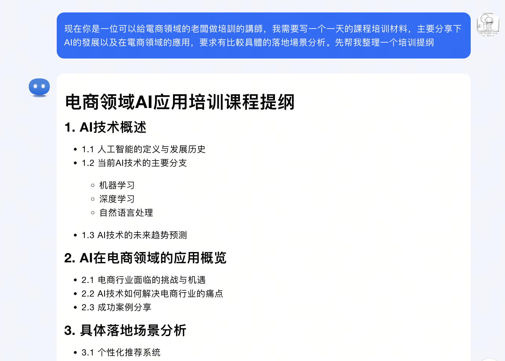
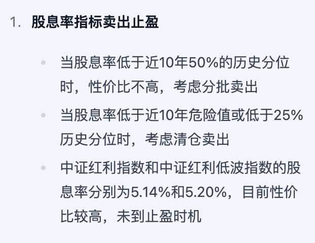
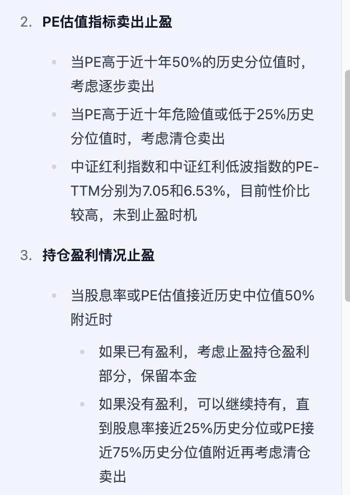
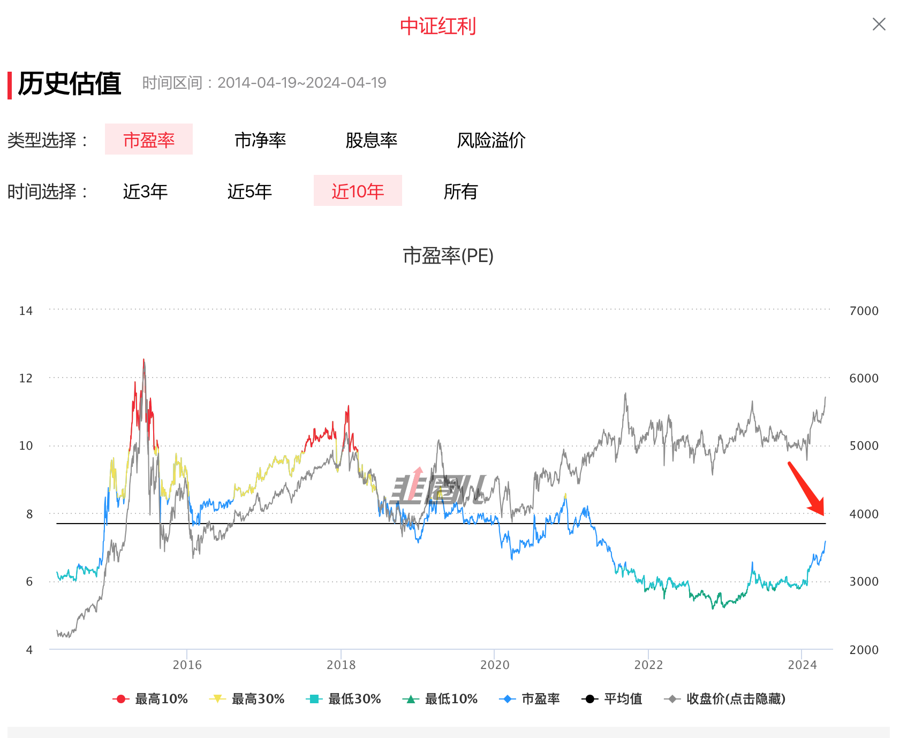
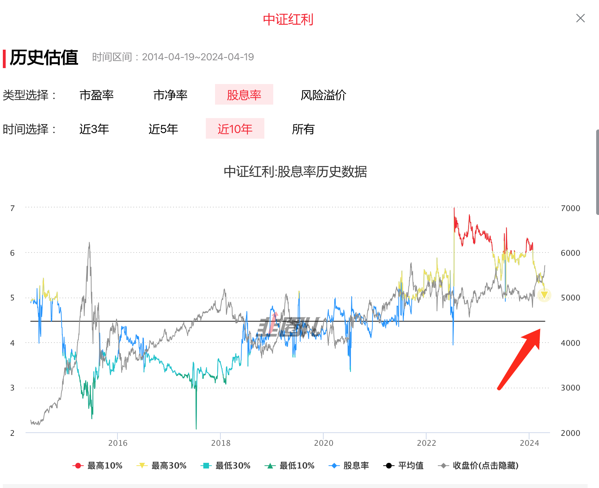
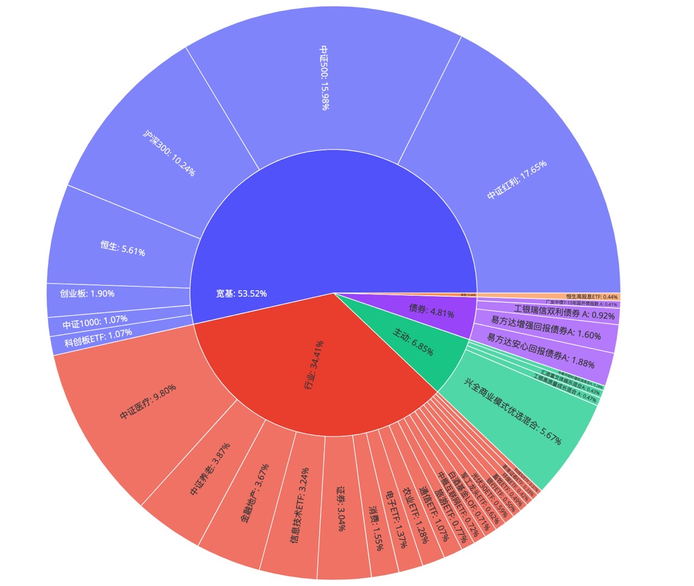

# 2024-04 即刻归档

## 月度总结
- 本月共归档 2 条内容，活跃了 2 天，时间范围从 2024-04-17 到 2024-04-22。
- 发帖最集中的一天是 2024-04-17，当天共记录 1 条。
- 本月最常出现的话题是：AI探索站 (1), 小散户的日常 (1)。
- 带媒体链接的内容有 2 条，短笔记风格的内容有 2 条。
- 最长的一条发布于 2024-04-17，正文约 38 字。

## 2024-04-17

### [12:21](https://m.okjike.com/originalPosts/661f4e61a922aa28d011410c)
是不是让AI帮我整理一个针对这个内容的培训材料也可以去做培训了? #KIMI

#AI探索站

---

## 2024-04-22

### [11:16](https://m.okjike.com/originalPosts/6625d67238849f879f9c5387)
A股的投资全靠红利支撑了

#小散户的日常

---
