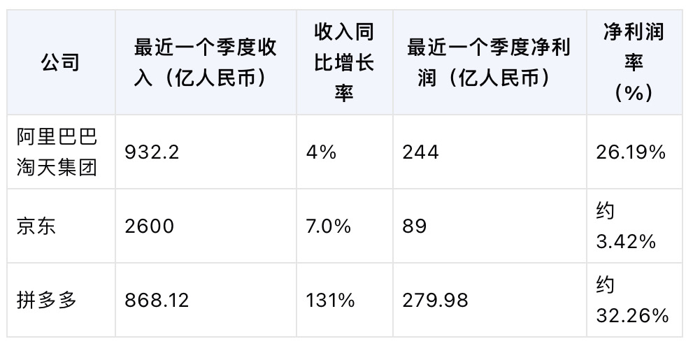

# 2024-05 即刻归档

## 月度总结
- 本月共归档 1 条内容，活跃了 1 天，时间范围从 2024-05-23 到 2024-05-23。
- 发帖最集中的一天是 2024-05-23，当天共记录 1 条。
- 本月最常出现的话题是：小散户的日常 (1)。
- 带媒体链接的内容有 1 条，短笔记风格的内容有 1 条。
- 最长的一条发布于 2024-05-23，正文约 45 字。

## 2024-05-23

### [10:02](https://m.okjike.com/originalPosts/664ea3bb928d2cdfd554376a)
让AI帮忙整理的，大差不差。
拼多多太逆天了，再这样下去，阿里的电商头把交椅真的要让位了…

#小散户的日常

---
