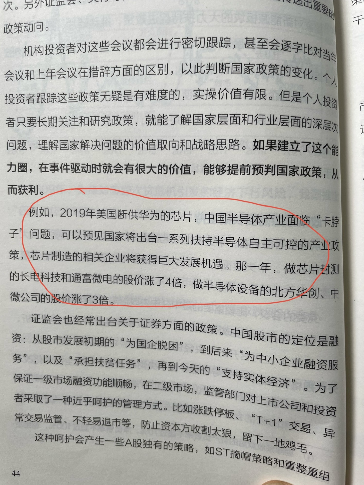
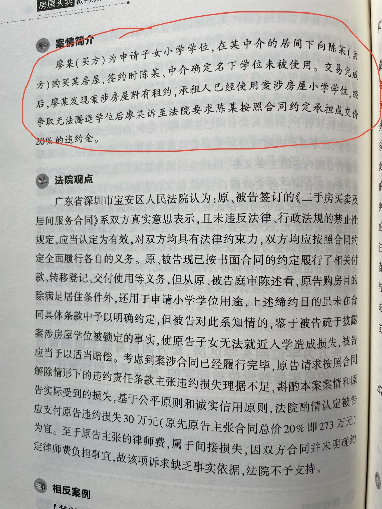
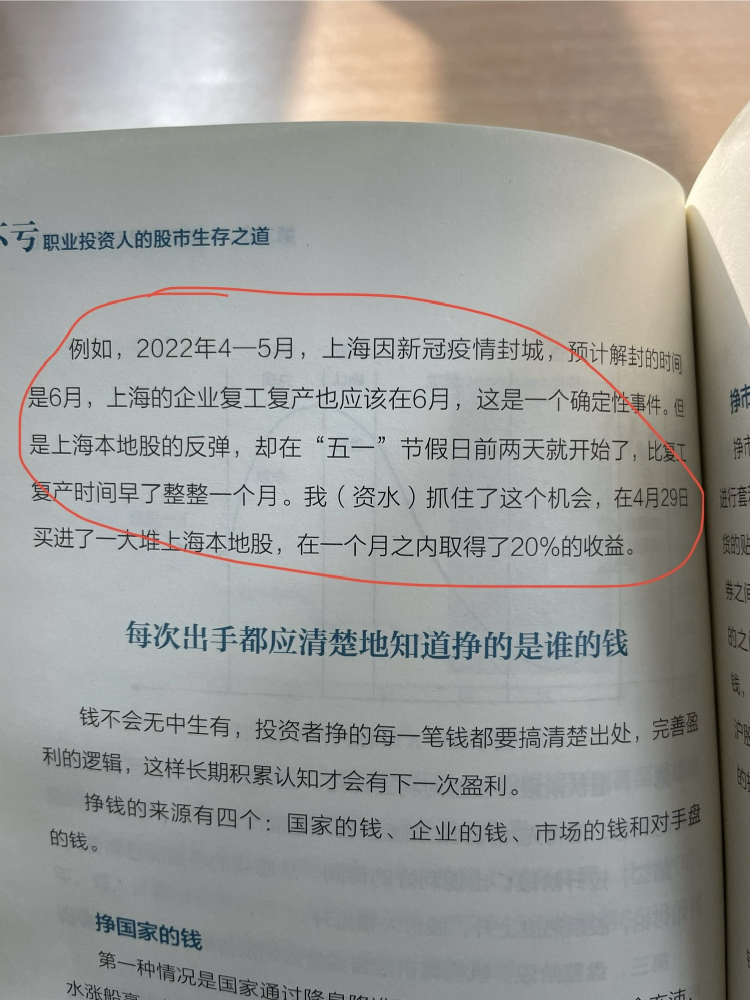

# 2024-10 即刻归档

## 月度总结
- 本月共归档 4 条内容，活跃了 3 天，时间范围从 2024-10-28 到 2024-10-30。
- 发帖最集中的一天是 2024-10-29，当天共记录 2 条。
- 本月最常出现的话题是：小散户的日常 (2), 买房攻略群组 (1), 你不知道的行业内幕 (1)。
- 带媒体链接的内容有 4 条，短笔记风格的内容有 3 条。
- 最长的一条发布于 2024-10-29，正文约 106 字。

## 2024-10-28

### [09:50](https://m.okjike.com/originalPosts/671eeddb02dc435305af0cf9)
看新闻联播的意义

#小散户的日常

---

## 2024-10-29

### [11:06](https://m.okjike.com/originalPosts/67205151edb465edbd6b0b9a)
买学区房无法锁定学位算违约，赔全款20%。

PS: 原来2020年深圳宝安租房也是可以使用学区的。以后新增人口减少，要在好的学区上学，租房就可以了，有可能租金会上涨，学区房出租是否是一项好的投资呢？
#读书笔记

#买房攻略群组

---

### [15:29](https://m.okjike.com/originalPosts/67208eefc79063fd7bfe0d54)
提前预判需要对信息有很强的敏感度和解读能力
#读书笔记

#小散户的日常

---

## 2024-10-30

### [13:00](https://m.okjike.com/originalPosts/6721bd619d53db7b44d64fb8)
去小红书找信息差，去闲鱼变现。

#你不知道的行业内幕

---
