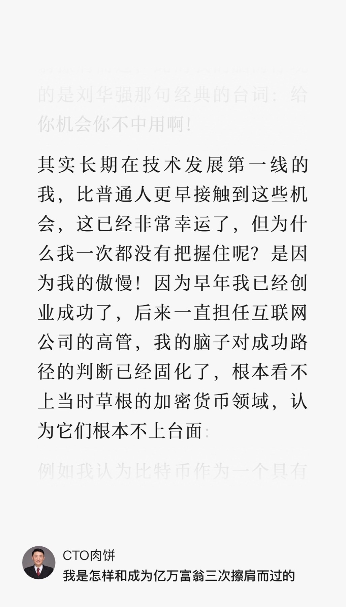

# 2024-11 即刻归档

## 月度总结
- 本月共归档 1 条内容，活跃了 1 天，时间范围从 2024-11-23 到 2024-11-23。
- 发帖最集中的一天是 2024-11-23，当天共记录 1 条。
- 本月最常出现的话题是：Web3研究所 (1)。
- 带媒体链接的内容有 1 条，短笔记风格的内容有 0 条。
- 最长的一条发布于 2024-11-23，正文约 130 字。

## 2024-11-23

### [11:00](https://m.okjike.com/originalPosts/6741456353ab99f7fd97b755)
robbin说他和亿万财富擦肩而过都是因为傲慢, 我感觉本质还是认知问题吧, 首先理解加密货币还只是第一关, 他第一关都没过, 假设他第一关通关了, 而接下来要实现亿万富翁目标还必须经受比特币的高波动并坚定持有这一关, 他这一关能否通过呢? 这个很难说啊...

#Web3研究所

---
