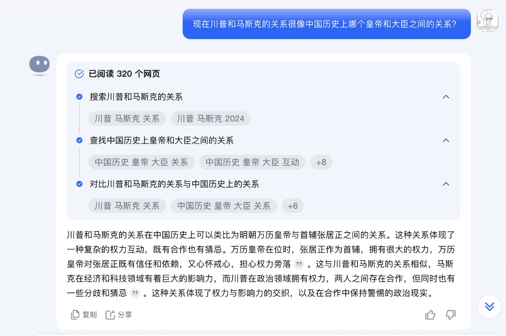
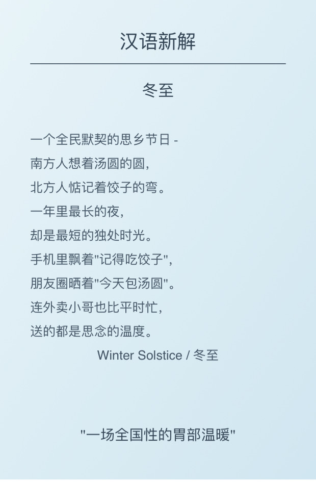

# 2024-12 即刻归档

## 月度总结
- 本月共归档 6 条内容，活跃了 4 天，时间范围从 2024-12-06 到 2024-12-21。
- 发帖最集中的一天是 2024-12-06，当天共记录 2 条。
- 本月最常出现的话题是：AI探索站 (3), Web3研究所 (2), 家长会 (1)。
- 带媒体链接的内容有 3 条，短笔记风格的内容有 6 条。
- 最长的一条发布于 2024-12-06，正文约 55 字。

## 2024-12-06

### [09:59](https://m.okjike.com/originalPosts/67525a7bcc17b0c5d356fe32)
没有人能随随便便成功

#Web3研究所

---

### [22:08](https://m.okjike.com/originalPosts/6753054107153b36fc26c716)
身高，牙齿，眼睛三样在小孩的成长中最重要，因为它们是不可逆的，错过了，受损了几乎没法补救。悔恨遗憾将伴随一生…

#家长会

---

## 2024-12-11

### [07:36](https://m.okjike.com/originalPosts/6758d0638d6dd8c09c727441)
以前有了想法要创业，会有“只差一个程序员了”的困境，现在有了AI加持，程序员都可以省了…

#AI探索站

---

## 2024-12-12

### [13:36](https://m.okjike.com/originalPosts/675a76660b60fe16633d4a98)
评论区两种观点快打起来了…

法币靠信用，比特币靠共识，当信用越来越不可靠，共识才会被越来越多的人接受

#Web3研究所

---

## 2024-12-21

### [11:01](https://m.okjike.com/originalPosts/67662fa053ab99f7fd13b1ac)
把 AI 当历史学家使唤。。。

#AI探索站

---

### [15:58](https://m.okjike.com/originalPosts/67667511f0513f1316323427)
AI眼中的冬至

#AI探索站

---
