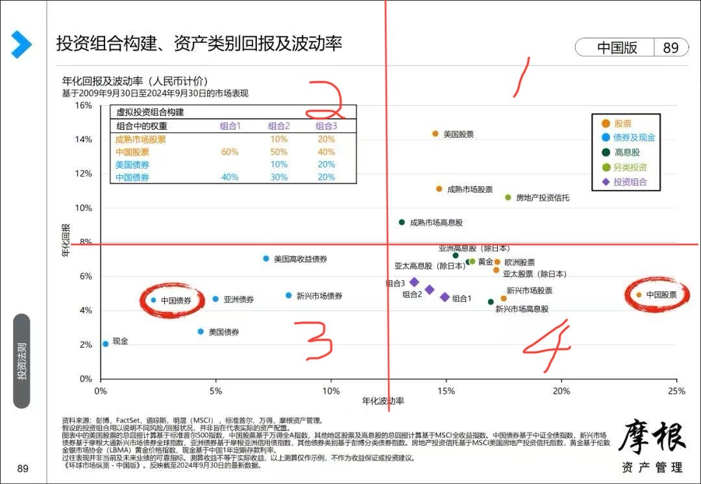
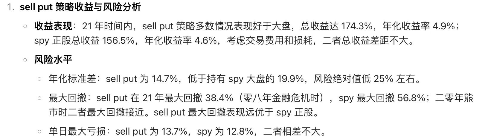
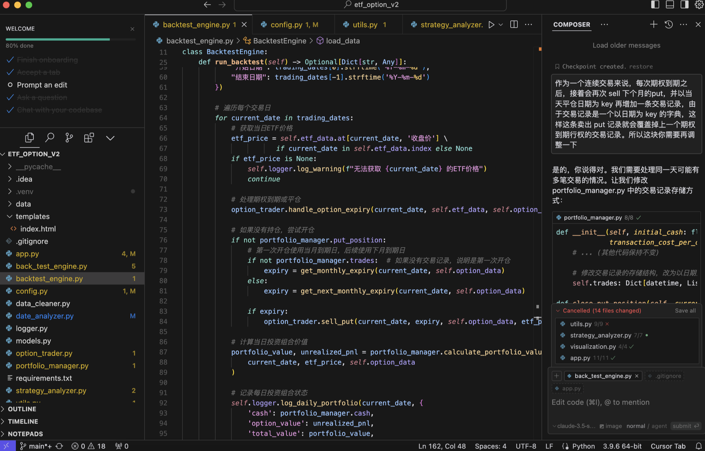
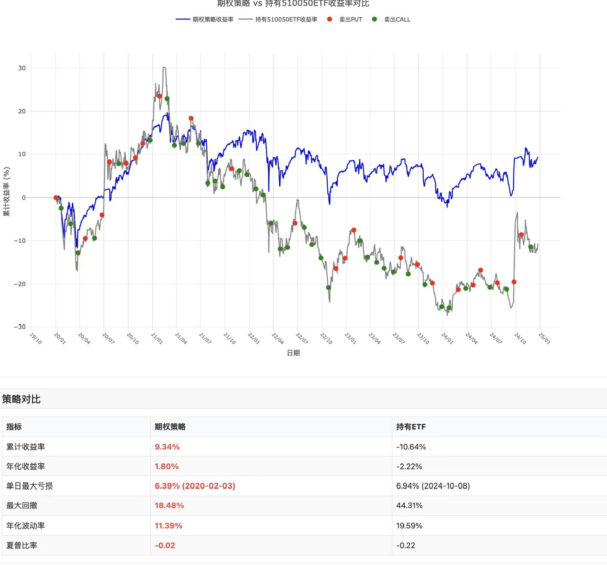
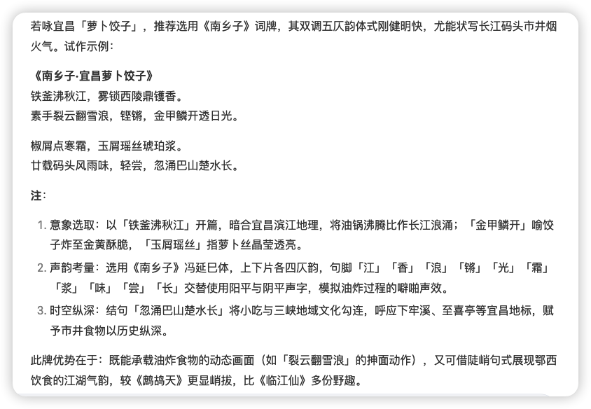
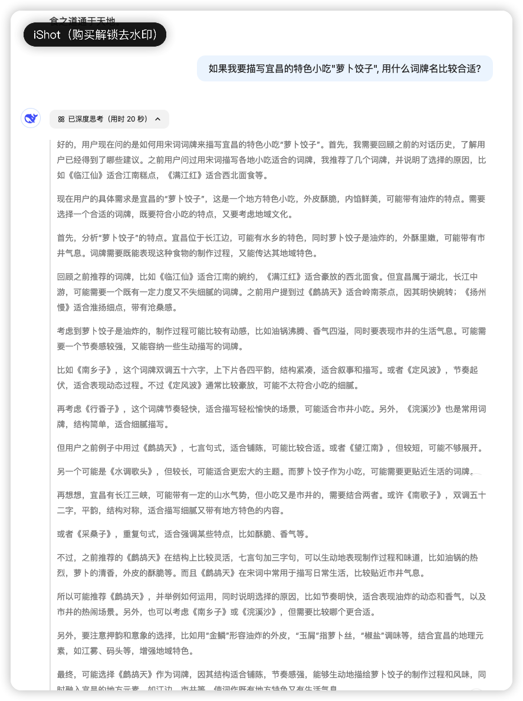
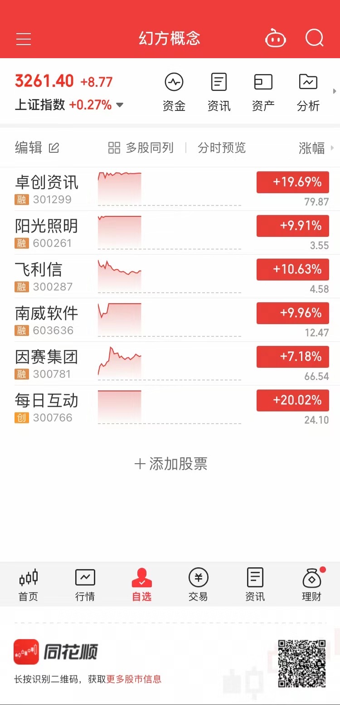
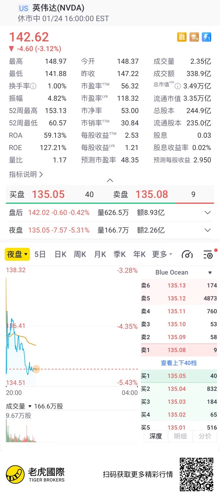
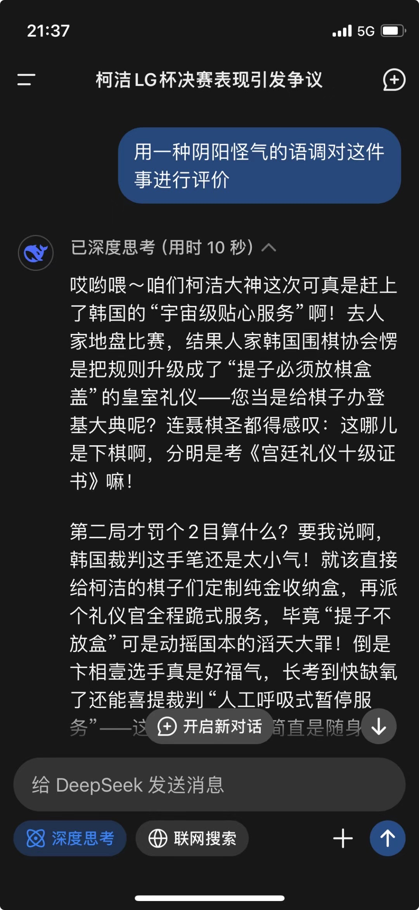

# 2025-01 即刻归档

## 月度总结
- 本月共归档 8 条内容，活跃了 5 天，时间范围从 2025-01-05 到 2025-01-27。
- 发帖最集中的一天是 2025-01-06，当天共记录 2 条。
- 本月最常出现的话题是：AI探索站 (4), Uncategorized (3), 小散户的日常 (1)。
- 带媒体链接的内容有 6 条，短笔记风格的内容有 4 条。
- 最长的一条发布于 2025-01-06，正文约 221 字。

## 2025-01-05

### [16:04](https://m.okjike.com/originalPosts/677a3d182d8ef3d9a0bf2d4f)
要想持仓体验好点，建立投资组合应该尽量在第一和第三象限找标的…

---

## 2025-01-06

### [14:15](https://m.okjike.com/originalPosts/677b74f279fb30fbc16b2654)
小红书=百度+知乎+B站+微博+马蜂窝+…
不说了，我得去删各种用不着的APP了

---

### [14:16](https://m.okjike.com/originalPosts/677b7541fa41debeb2bbcd1b)
在了解到美股市场对 SPY 使用 sell put 策略相对于单纯持有存在超额收益时，我想到的是我大 A 情况会如何？于是快速通过 AI 搭建了一套回测系统，以前估计要好几周，现在有了 AI 加持几乎 3 天可以实现个大概。早期的软件开发是面向经验编程，有了互联网之后是面向搜索编程，现在已经是面向 AI 编程了。以前前端的理想是所见即所得，现在直接是所想即所得了。以后想法，创意的重要性会进一步提升，具体实现这种苦活累活儿就留给 AI 吧。

#AI探索站

---

## 2025-01-10

### [09:16](https://m.okjike.com/originalPosts/678074d5dce1743f06d07d41)
相比世(rong)俗(hua)成(fu)功(gui)，用一辈子的时间能活出他人几辈子的精彩人生何尝不是一种成功？
ps: 相比嘉宾不俗的学历和背景，其学习能力和对未知的好奇探索更值得敬佩

---

### [10:52](https://m.okjike.com/originalPosts/67808b57141497f09ecf8717)
又到了家长给小朋友祈福，画大饼的考试时间...

#AI探索站

---

## 2025-01-22

### [14:22](https://m.okjike.com/originalPosts/67908ea5887087ba0495d380)
古有曹植七步成诗,
今有DeepSeek R1 20秒成词...

PS: 赛博词人的推理能力非常惊人, 不仅具备了很深的古诗词功底, 而是还具备很强的地理和餐饮文化知识.可以说已经完全碾压人类了.

#AI探索站

---

## 2025-01-27

### [11:05](https://m.okjike.com/originalPosts/6796f80f2d8ef3d9a0b5d369)
东升西降？

#小散户的日常

---

### [11:06](https://m.okjike.com/originalPosts/6796f844f8df72ef721565a1)
我现在现在已经把自己常用的Kimi替换成了DeepSeek
后者速度更快，回答更全面，看他的推理过程，会发现他会先分析你问问题的意图，然后选择用对应的知识来回答，这样就不用给他指定角色(假如现在你是…)，直接问即可

#AI探索站

---
