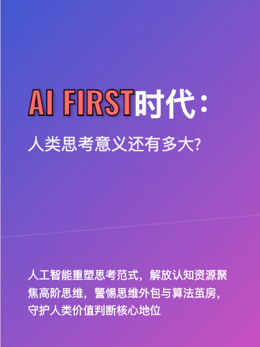
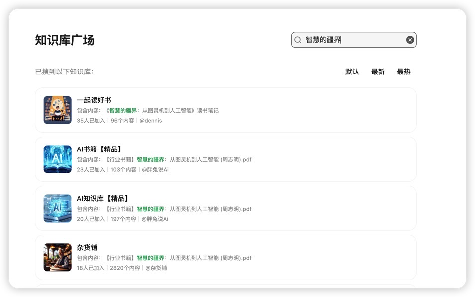
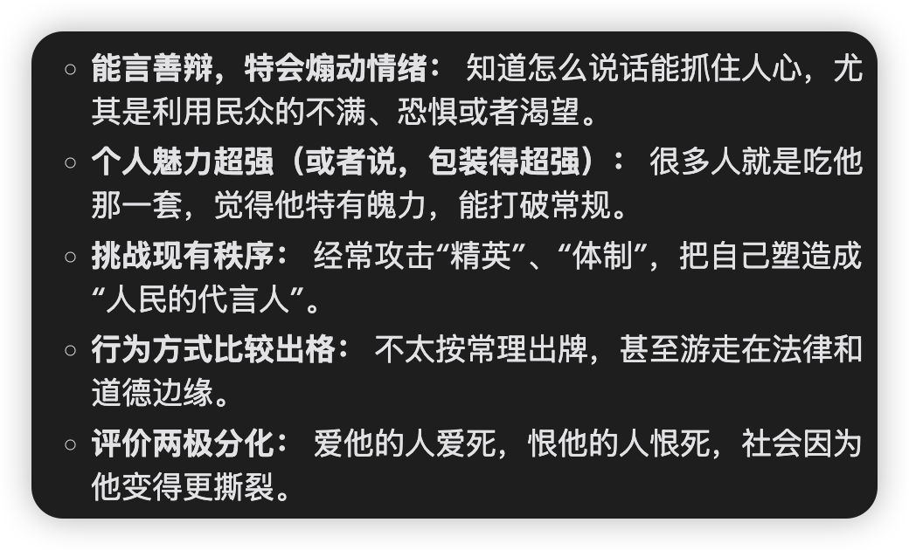
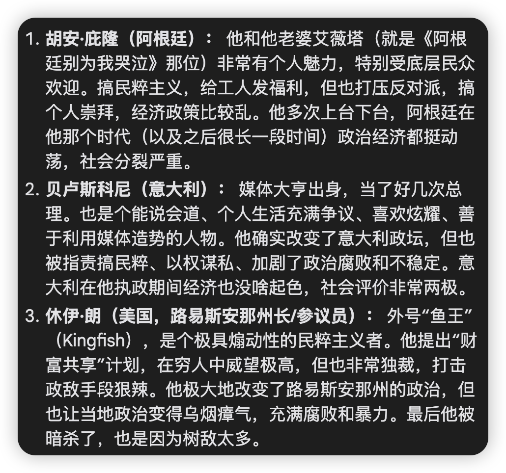
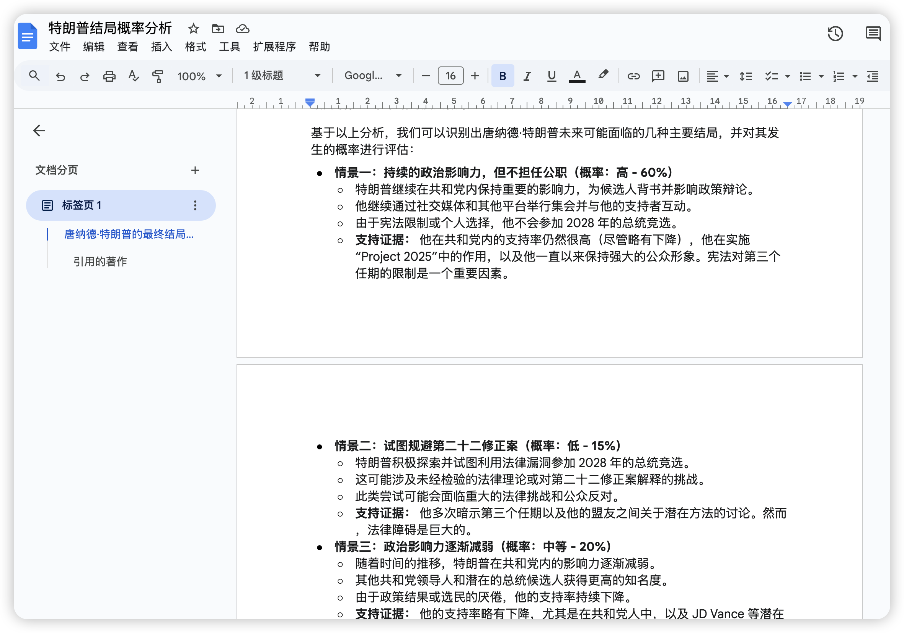
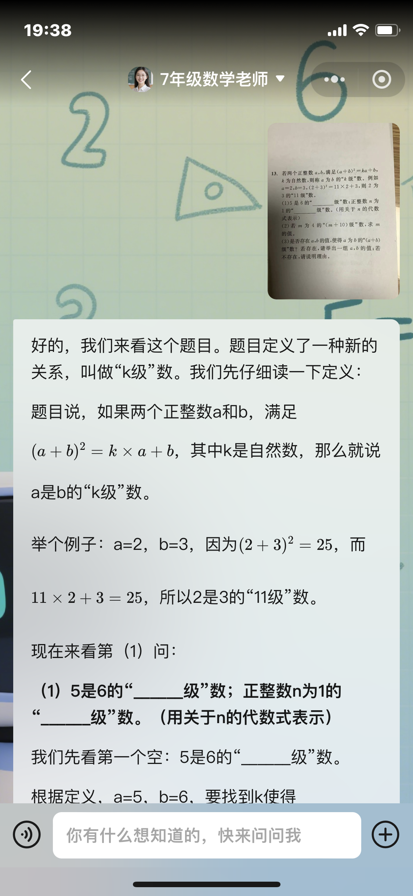
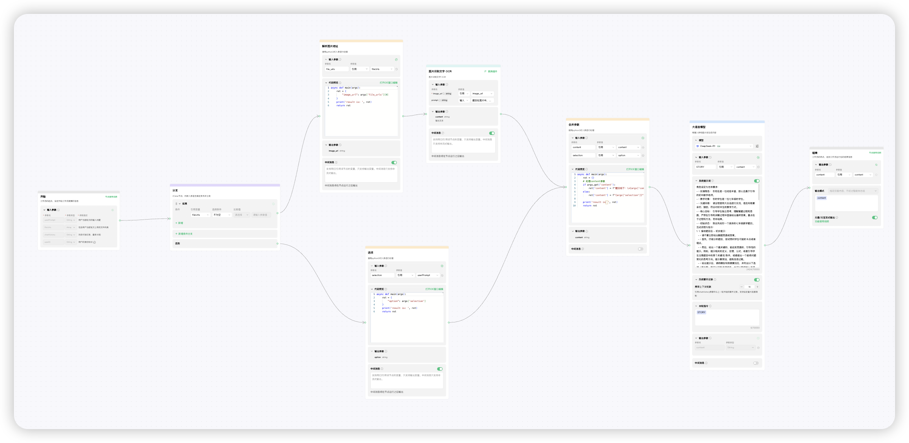
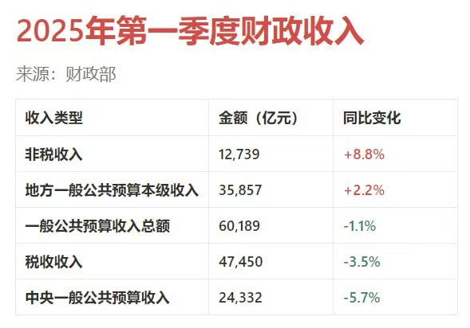
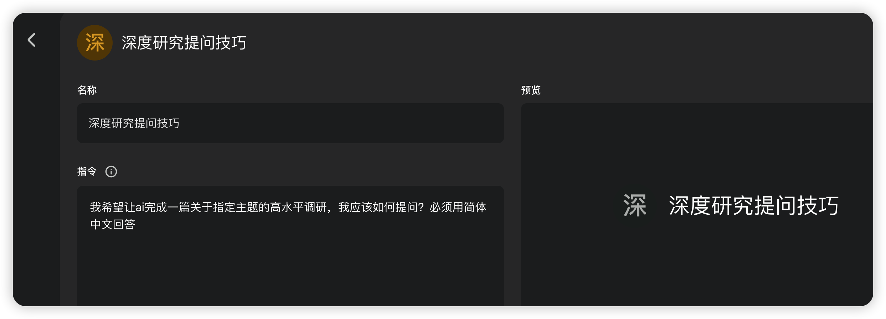

# 2025-04 即刻归档

## 月度总结
- 本月共归档 7 条内容，活跃了 7 天，时间范围从 2025-04-06 到 2025-04-27。
- 发帖最集中的一天是 2025-04-06，当天共记录 1 条。
- 本月最常出现的话题是：Uncategorized (3), AI探索站 (2), 你问我答 (1)。
- 带媒体链接的内容有 7 条，短笔记风格的内容有 4 条。
- 最长的一条发布于 2025-04-06，正文约 2414 字。

## 2025-04-06

### [10:50](https://m.okjike.com/originalPosts/67f1ebd9a9e65003a26d4220)
AI First时代,人类思考的意义还有多大?

“AI First”这个提法确实越来越普遍，它会对我们的思考方式和我们思考的意义产生深远影响。

“AI First”是啥意思？

简单说，就是做事情（比如设计产品、制定策略、解决问题）时，首先考虑怎么用人工智能（AI）来实现或优化。不再是把 AI 当成一个辅助工具，而是把它放在核心位置，围绕 AI 的能力来构建整个流程。就像以前大家说“Mobile First”（移动优先），现在很多科技公司开始说“AI First”。

“AI First”对人的思考会产生什么影响？

可能带来的挑战和负面影响：

1.  思维“外包”和技能退化： 当很多思考任务（比如数据分析、信息检索、内容生成、甚至决策建议）都可以交给 AI 时，我们可能会懒得自己去深入思考，相关的认知能力（如记忆力、计算能力、分析能力、写作能力）可能会用进废退。就像习惯用计算器后心算能力下降，习惯用导航后认路能力变差一样。
2.  批判性思维减弱： AI 给出的答案或建议往往看起来很“权威”、很“高效”。我们可能会不自觉地减少质疑和审视，直接接受 AI 的结果，从而削弱了独立判断和批判性思维的能力。
3.  被“算法”框住： AI 的“思考”基于数据和算法，它可能会强化已有的模式或偏见。过度依赖 AI 可能让我们陷入信息茧房或思维定式，难以产生真正突破性的、跳出框架的原创想法。
4.  失去思考的“过程感”： 思考不仅仅是为了得到结果，过程本身（挣扎、探索、犯错、顿悟）对人的成长和理解至关重要。AI 可能会“跳过”这个过程，直接给出答案，让我们失去这种宝贵的体验。

可能带来的机遇和正面影响：

1.  解放认知资源，聚焦“高阶思维”： AI 可以接管大量重复性、流程化的脑力劳动，把我们从繁琐的信息处理和基础分析中解放出来。这样，我们就能腾出更多精力专注于更复杂、更需要创造力、情感和智慧的思考，比如：
       提出真正有价值的问题： AI 擅长找答案，但问对问题往往更重要，这需要人的洞察力。
       进行跨领域的整合创新： 结合不同领域的知识和 AI 的发现，产生全新的想法。
       做出涉及伦理、价值观的复杂决策： AI 提供数据和选项，但最终的价值判断需要人来做。
       进行深刻的批判性评估： 评估 AI 结果的可靠性、局限性和潜在风险。
       发挥同理心和人际智慧： 理解和应对复杂的人类情感和社会互动。
2.  增强思考能力（人机协同）： AI 可以成为强大的思维辅助工具，像“认知外骨骼”一样，帮助我们：
       快速处理海量信息： AI 帮我们筛选、总结、发现模式。
       克服认知偏见： 设计得当的 AI 可以提醒我们注意自身的思维盲点。
       激发创意： AI 可以生成各种可能性，作为我们创意的起点或“陪练”。
3.  加速知识创造和发现： 在科研等领域，AI 可以极大加速数据分析和模式识别，帮助人类更快地做出科学发现，人类思考的重点在于解释发现、设计实验、提出理论。

那么，在 AI First 时代，人类思考的意义在哪里？

人类思考的独特价值和意义，恰恰体现在那些 AI（至少目前和可预见的未来）难以企及的方面：

1.  意识和主观体验（Qualia）： 我们能感受世界，有喜怒哀乐，有对美的欣赏，有痛苦的体验。这种主观感受是思考的底色，赋予了思考以“温度”和“意义”。AI 没有这个。
2.  真正的理解和智慧： AI 处理信息，但未必“理解”其深层含义和背景。人类拥有基于广泛生活经验、常识和社会文化的深刻理解力，以及超越逻辑计算的智慧。
3.  价值观、伦理判断和责任担当： 思考不仅仅是计算最优解，还包括判断是非善恶，做出符合道德的选择，并为之后果承担责任。这是人类社会运行的基础，AI 无法替代。
4.  提出终极问题和设定目标： 思考“我们从哪里来？到哪里去？”“人生的意义是什么？”“我们想要建设一个什么样的社会？”这类终极问题，并为自己和社会设定发展目标和方向，这是人类独有的驱动力。AI 是工具，目标需要人来定。
5.  纯粹的好奇心和无目的的探索： 人类会因为纯粹的好奇心去探索未知，进行看似“无用”的思考和创造，这往往是重大突破的源泉。AI 的“思考”通常是任务导向的。
6.  爱、同情心和共情能力： 这是人类思考和行为的重要驱动力，也是维系人际关系和社会的基础。基于这些情感的思考和决策，是 AI 难以模拟的。

如何看待这个问题？

我们应该以一种既拥抱机遇，又保持警惕的态度来看待“AI First”及其对思考的影响：

1.  积极学习和适应： 了解 AI 的能力和局限，学习如何与 AI 高效协作，把 AI 当作增强我们思考能力的工具，而不是替代品。
2.  刻意锻炼和保护核心思考能力： 越是 AI 强大的领域，我们越要有意识地去锻炼批判性思维、深度思考、创造力、伦理判断等能力。不能因为有 AI 就放弃自己思考。
3.  重视过程而非唯结果论： 认识到思考过程本身的价值，鼓励探索、试错和反思，即使 AI 能更快给出答案。
4.  坚守人类的独特价值： 明确并珍视人类在意识、情感、价值观、创造力、伦理责任等方面的独特性，让技术服务于人的福祉和发展，而不是反过来。
5.  推动负责任的 AI 发展： 关注 AI 伦理、偏见和安全问题，确保 AI 的发展方向符合人类的整体利益。

总之，“AI First”是一个不可逆转的趋势，它会深刻改变我们的思考方式。关键在于我们如何主动应对，扬长避短，让 AI 成为我们思考的加速器和增幅器，而不是替代者和麻醉剂，最终让人类的思考在新的时代背景下，更加聚焦于那些真正体现人性光辉和智慧的领域，从而实现人机协同的共同进化。

#AI探索站

---

## 2025-04-09

### [10:44](https://m.okjike.com/originalPosts/67f5df080c6e3650aba479e4)
又多了一个找书看书的入口：AI 知识库

#AI探索站

---

## 2025-04-12

### [10:44](https://m.okjike.com/originalPosts/67f9d38edc6b6d4853047a22)
历史上类似特朗普式的人物造成了哪些后果？

#你问我答

---

## 2025-04-13

### [19:34](https://m.okjike.com/originalPosts/67fba146dc6b6d485322ae67)
以后没有deep research 功能都不好意思说自己是大模型

---

## 2025-04-20

### [20:15](https://m.okjike.com/originalPosts/6804e5547cb8c547e250df0f)
用元宝手搓了一个智能体(小程序): 7年级数学老师。其实就是用工作流把提示词(外加一个OCR插件)封装了一下，这样每次不用输提示词，也可以拍照读题。为了强调解题过程而不是结果，提示词采用先分析题目给关键提示，再推导解答，然后总结，最后出一个同类型题目巩固的流程。

腾讯这个俄罗斯套娃式的生态有点意思，微信是小程序的容器，小程序是所有入住应用的容器，元宝是智能体的容器，同时它还是小程序中的一个应用…

---

## 2025-04-24

### [16:28](https://m.okjike.com/originalPosts/6809f64b070109da49a3d97b)
税收在降，但非税收入涨了不少，地方收入微增，中央收入下滑明显。简单说就是企业赚钱难了，但政府靠罚款、收费这些补了点回来。

---

## 2025-04-27

### [11:14](https://m.okjike.com/originalPosts/680da10ceaf098f7ee0d9328)
生成dr提示词的提示词
分享一个用来生成深度报告的提示词(gem), 我一般在deep research的时候, 先用这个生成dr提示词, 这样可以问出的问题更有深度, 更全面一些

#虚拟与混合现实小组

---
