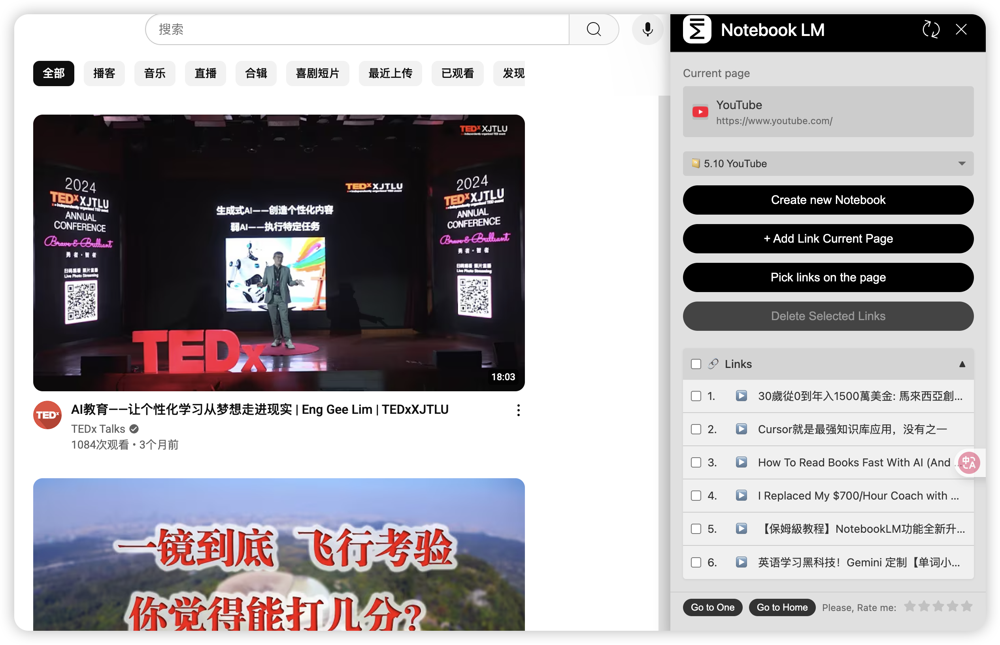
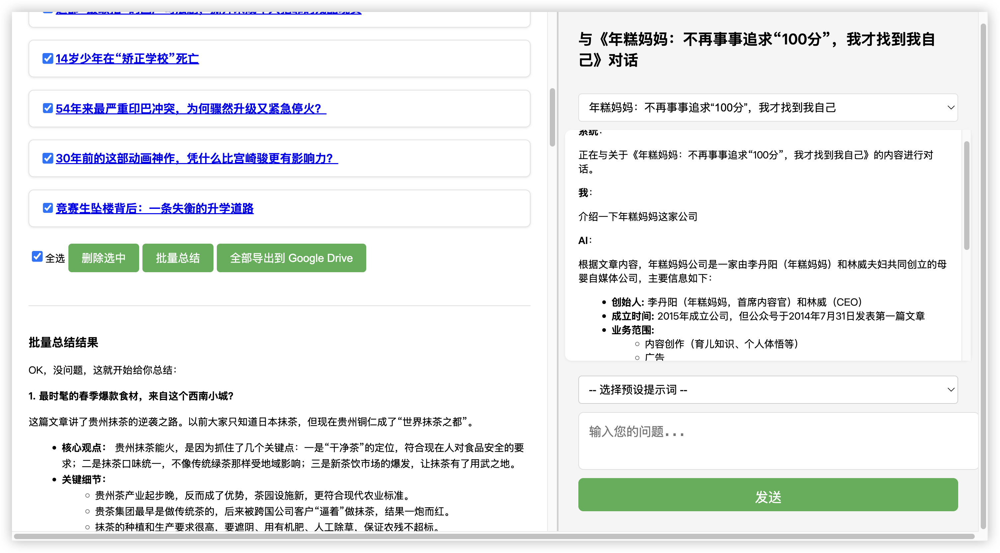
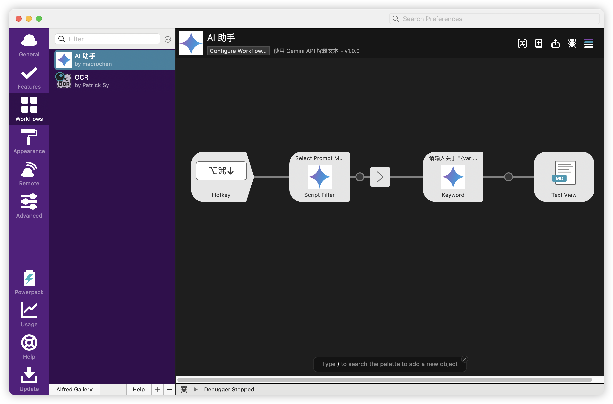
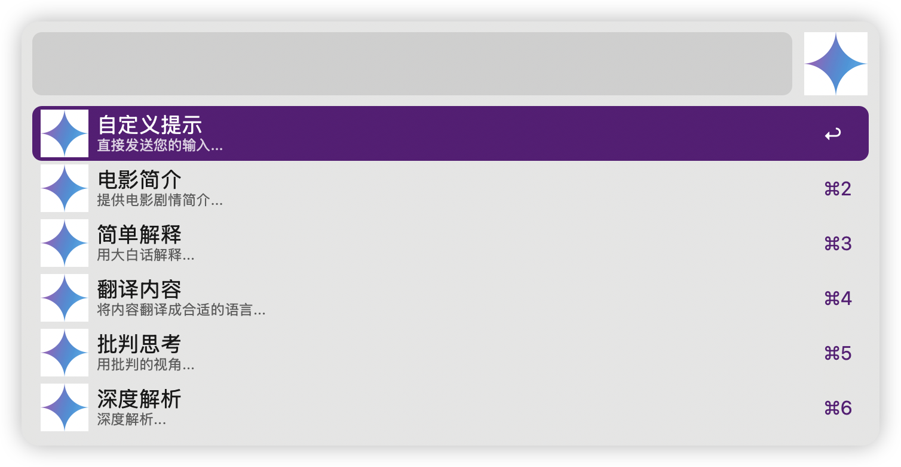
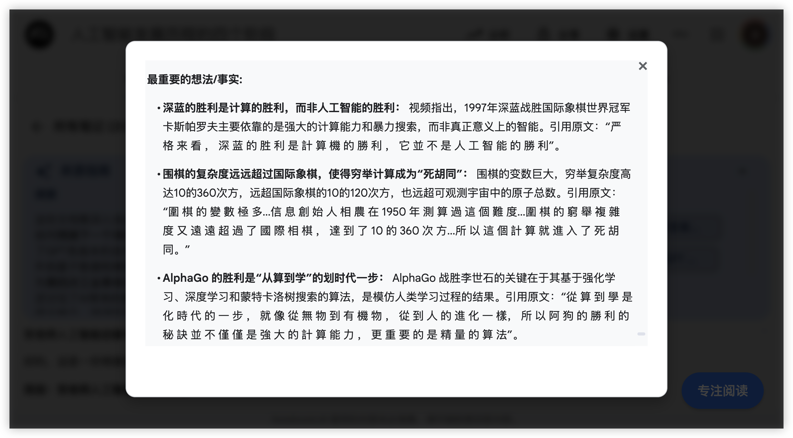

# 2025-05 即刻归档

## 月度总结
- 本月共归档 26 条内容，活跃了 11 天，时间范围从 2025-05-01 到 2025-05-28。
- 发帖最集中的一天是 2025-05-23，当天共记录 10 条。
- 本月最常出现的话题是：无用但有趣的冷知识 (9), 浴室沉思 (2), 健康科普站 (2)。
- 带媒体链接的内容有 4 条，短笔记风格的内容有 15 条。
- 最长的一条发布于 2025-05-23，正文约 477 字。

## 2025-05-01

### [08:30](https://m.okjike.com/originalPosts/6812c08f243fcf28662592a9)
好消息，notebooklm支持中文音频输出了

#一起听播客

---

## 2025-05-10

### [10:41](https://m.okjike.com/originalPosts/681ebced1ab958e77e051906)
发现 notebooklm 一个非常棒的用途：用来总结油管视频， 不管有没有字幕，瞬间秒杀各种 summary 插件，结合 notbooklm 插件使用效果更佳。
不过这个插件有个问题， 它会浮在页面上，把页面的内容遮住，我写了个油猴脚本，空出一块区域专门给插件用，解决了这个问题

#产品安利社

---

## 2025-05-14

### [06:51](https://m.okjike.com/originalPosts/6823ccf17e779d3ef3d36ba1)
为了解决公众号的信息过载，最近手搓了一个 chrome 插件，一次性将觉得有看头的公众号文章收集起来，批量进行总结，然后边看边就指定的文章问 AI 问题

#Chrome插件分享站

---

## 2025-05-15

### [16:19](https://m.okjike.com/originalPosts/6825a3a651bd007517c620f8)
“有福同享”的敌人永远是“有难同当”。

#今日金句

---

### [16:20](https://m.okjike.com/originalPosts/6825a3b58b92a89c17b618b9)
超额收益来自于非共识的正确。而在今天这个AI已经越来越智能、越来越易得的时代下，这句话的“含金量”还会继续上升： 随着AI的发展，共识越来越容易达成，因此“非共识的正确”的价值会更高。

#一起做投资人

---

## 2025-05-18

### [10:12](https://m.okjike.com/originalPosts/68294201dc6b6d48532a59ef)
财新：针对境外收入追缴税款行动已持续一年

下一个目标会是数字货币么? 毕竟大陆人炒美股也是不允许的

#财经圈大小事

---

## 2025-05-22

### [18:48](https://m.okjike.com/originalPosts/682f0103f855a92510751bd3)
2010年移动互联网兴起后，“以玩耍为主的童年”逐渐被“以手机为主的童年”取代，“Z世代”（1995年后出生的一代）在青春期这个大脑最具可塑性的时期遇到了手机，因而遭受了一些根本性的伤害，比如社交障碍、睡眠剥夺、注意力碎片化和成瘾问题。

#浴室沉思

---

### [19:08](https://m.okjike.com/originalPosts/682f059ddc6b6d48538c35f9)
爬行脑是美国神经学专家保罗·麦克里恩提出的“三脑理论”中的一个概念。

位置： 位于大脑半球最下面，由脑干和小脑组成。
功能： 负责心跳、呼吸、视觉、平衡等本能的、不需要动脑子的事情，也就是那些永不停息的工作。
特点： 非常“节能”。
作用： 当我们长时间高强度学习、工作时，爬行脑会跳出来喊停，让我们不自觉地发呆、摸鱼、想吃高糖高热量的食物，启动身体的保护机制。

#无用但有趣的冷知识

---

## 2025-05-23

### [10:48](https://m.okjike.com/originalPosts/682fe203e900708e25144dec)
推荐普通吐司/切片面包/主食面包、全麦面包、硬质面包的原因：

普通吐司/切片面包/主食面包: 相比其他添加了大量糖油的面包，普通吐司的脂肪和热量相对合理，脂肪含量较低（3%-4%）。
全麦面包: 全麦粉比普通小麦粉更健康，含有更高的膳食纤维、B族维生素和蛋白质。选择全麦粉在配料表第一位，且糖分添加较少的全麦面包更佳。
硬质面包（法棍、碱水包、普鲁士结、贝果等）: 原料单纯，通常只有面粉、酵母/苏打、盐和水，无油、无糖、无蛋，是面包中最健康的一类。

#无用但有趣的冷知识

---

### [11:05](https://m.okjike.com/originalPosts/682fe5f7dc6b6d48539b542f)
有氧运动减少内脏脂肪的效果优于力量训练和控制饮食。
有氧运动只需减重2.4%，就能达到控制热量摄入减重5%所完成的减少内脏脂肪的效果。
每周5次，每次30分钟的低强度有氧运动（如慢走）即可有效减少内脏脂肪。

#我们都爱运动

---

### [11:41](https://m.okjike.com/originalPosts/682fee6ee900708e2515373c)
旱芹钾含量是西芹的8.5倍。
西芹不溶性膳食纤维含量是旱芹的2倍多。
芹菜叶的营养价值也很高，不要扔掉。

#无用但有趣的冷知识

---

### [11:44](https://m.okjike.com/originalPosts/682fef24cc4836dcedfe0b30)
炸鸡的脂肪含量是17.3%
北京烤鸭脂肪含量高达52%。
猪肋条脂肪含量高达59%。
猪颈肉脂肪含量高达60.5%。
腊肉脂肪含量高达68%。

#无用但有趣的冷知识

---

### [15:02](https://m.okjike.com/originalPosts/68301d6cf0d718ce7a7c7a23)
内的尿酸，仅有20%来自摄入的食物，其它80%来自自身身体代谢。

#无用但有趣的冷知识

---

### [15:44](https://m.okjike.com/originalPosts/68302768a7d7b23a52a2cb0f)
虾皮钙含量高但不好吸收，而且盐分多，不适合补钙。

#无用但有趣的冷知识

---

### [18:11](https://m.okjike.com/originalPosts/683049cd7d59dc9f4c06ef23)
大脑从43.7岁开始进入不稳定状态，66.7岁衰老速度最快，89.7岁进入平稳期。

#健康科普站

---

### [18:52](https://m.okjike.com/originalPosts/68305375ca977f7fc719a58f)
人体内80%的嘌呤来自于内源性代谢，饮食干预对尿酸水平的影响有限。

#健康科普站

---

### [19:00](https://m.okjike.com/originalPosts/6830554d7d59dc9f4c07c1f9)
常见的玻璃制品有钠钙玻璃、钢化玻璃、高硼硅玻璃、水晶玻璃四类，耐温从好到差性能排名为：钢化玻璃 > 高硼硅玻璃 > 水晶玻璃 > 钠钙玻璃。

#无用但有趣的冷知识

---

### [19:22](https://m.okjike.com/originalPosts/68305a6da7d7b23a52a68ac1)
如何过好一个高质量的周末
工作疲惫，周末却越休越累？你可能没做到“心理脱离”。

1. 什么是“心理脱离”？
“心理脱离”指工作外时间，心理上与工作断开，不再思考或担心。它让大脑真正休息，恢复精力，避免疲惫，提升幸福感。

2. 为何“做点平时不常做的事”能放松？
平时工作模式固定，大脑易紧绷。尝试反差大的活动，能切换大脑模式，刺激不同脑区，让工作脑区休息。这能带来新鲜感和掌控感，有效放松。

3. 怎么找“反差大”活动？
根据工作特点找反向活动：

脑力 vs. 体力： 多动身体（爬山、家务）。

重复 vs. 创意： 搞点创意（画画、烘焙）。

社交 vs. 独处： 尝试独处（阅读、冥想）。

室内 vs. 户外： 多去户外（徒步、露营）。

学新技能： 投入新学习（外语、编程）。

4. 高质量周末实用建议：
补觉适度。

周末集中运动。

参与生活小事（遛狗、做饭）。

尝试“主题周”或兴趣班。

总结：
高质量周末的关键是“心理脱离”。通过做与工作反差大的活动，让大脑真正休息，恢复精力。积极行动，你就能拥有充满活力和幸福感的周末！

#今天是周五吗

---

## 2025-05-24

### [19:35](https://m.okjike.com/originalPosts/6831aefeca977f7fc72fafef)
alfred 的最新版本竟然没有集成一丁点的 ai 功能，只好自己手搓一个 ai 助手workflow，主打一个方便迅捷，阅后即焚。

#AI探索站

---

### [19:49](https://m.okjike.com/originalPosts/6831b23421bd3455c1f9e9b3)
NotebookLM 的布局真的是一言难尽，整个页面被切割成三个豆腐块，一旦看的内容长一点，简直就像在看手机屏幕。关键还没有手机操作灵活，于是手搓了一个油猴脚本，让阅读的面积更大，更聚焦。

#大产品小细节

---

## 2025-05-25

### [16:31](https://m.okjike.com/originalPosts/6832d559dc6b6d4853cb03b8)
google gemini(提示词) +  veo3 (视频) + 剪映(字幕+音乐)

芦叶满汀洲，寒沙带浅流。
二十年重过南楼。
柳下系船犹未稳，能几日，又中秋。
黄鹤断矶头，故人今在否？
旧江山浑是新愁。
欲买桂花同载酒，终不似，少年游。

#AI探索站

---

## 2025-05-27

### [07:46](https://m.okjike.com/originalPosts/6834fd6fdc6b6d4853ee5b33)
复旦大学：本科新生4337名，研究生新生12321名（研究生是本科生的近3倍）
北京大学：本科新生4326名，研究生新生10803名
西安交通大学：本科新生6100多名，研究生新生11129名
中山大学：本科新生8000多名，研究生新生1.2万多名
哈尔滨工业大学：本科新生7934名，研究生新生10000多名
至少有53所双一流大学研究生新生人数超过本科生新生人数。

#无用但有趣的冷知识

---

### [19:45](https://m.okjike.com/originalPosts/6835a5df70b03946c4d4c835)
地铁建设硬性指标： GDP3000亿、财政收入300亿、城区人口300万，初期客流强度不低于每日每公里0.7万人次。

#你不知道的行业内幕

---

### [19:45](https://m.okjike.com/originalPosts/6835a5f4c7f3486fef851cc6)
地铁亏损城市逐年增加： 2020年15个，2021年19个，2022年27个，2023年28个。

#无用但有趣的冷知识

---

## 2025-05-28

### [08:18](https://m.okjike.com/originalPosts/6836565c6a15763e91cdc5d8)
AI 辅助开发揭示了一个真相：软件行业最宝贵的不是写代码，而是设计和构建系统的架构，而这恰恰是 AI 无法取代的。代码本身是负债，需要维护和替换，真正的资产是代码背后的业务能力。AI 擅长局部优化，但无法进行整体设计，所以能战略性地管理和减少负债的人才更有价值。

#工程师的日常

---

### [14:39](https://m.okjike.com/originalPosts/6836af9d2b50c689182da311)
有些人的执行力是情绪驱动的，在情绪极致或deadline前反而爆发力强，喜欢那种火烧眉毛再力挽狂澜的感觉

#浴室沉思

---
