# 2025-06 即刻归档

## 月度总结
- 本月共归档 92 条内容，活跃了 23 天，时间范围从 2025-06-05 到 2025-06-28。
- 发帖最集中的一天是 2025-06-07，当天共记录 15 条。
- 本月最常出现的话题是：小散户的日常 (24), 浴室沉思 (16), Uncategorized (10)。
- 带媒体链接的内容有 9 条，短笔记风格的内容有 43 条。
- 最长的一条发布于 2025-06-14，正文约 1926 字。

## 2025-06-05

### [11:12](https://m.okjike.com/originalPosts/68410b002b50c68918dc0cb8)
黄金熊市三大原因：
    *   大幅加息，利率持续升高预期
    *   大宗商品熊市
    *   经济进入黄金年代，地缘风险缓和，科技革命爆发

#小散户的日常

---

### [15:38](https://m.okjike.com/originalPosts/6841498dbb87512bfaa04169)
手搓一个“预期波动计算器”，帮助快速选择期权行权价

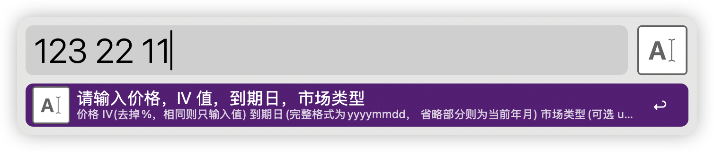

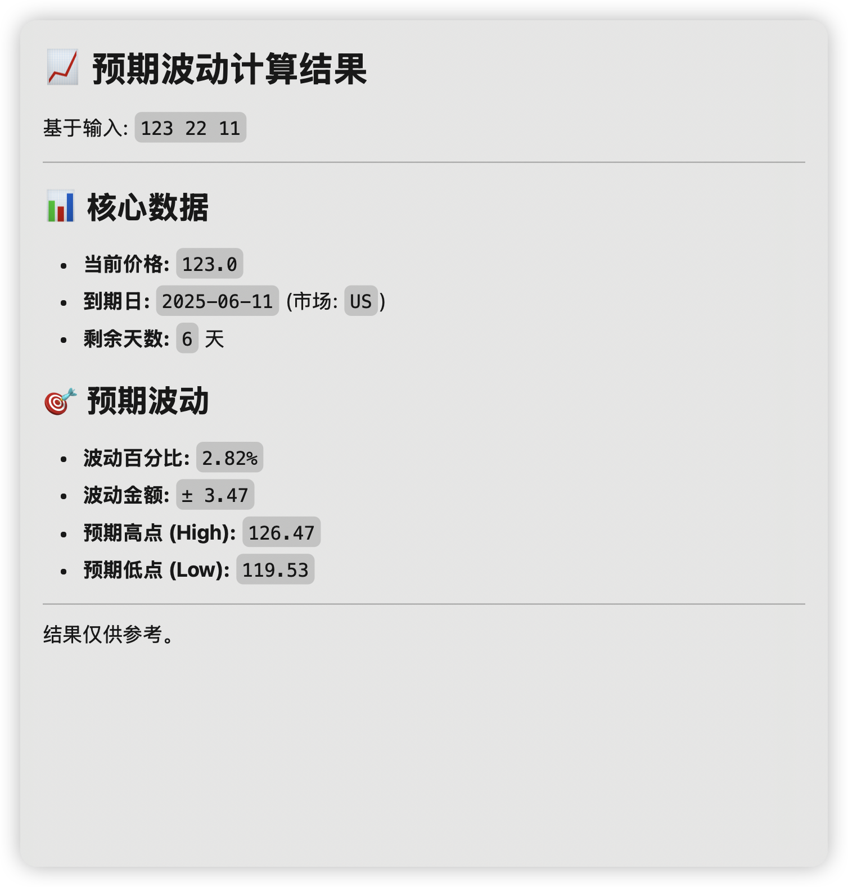

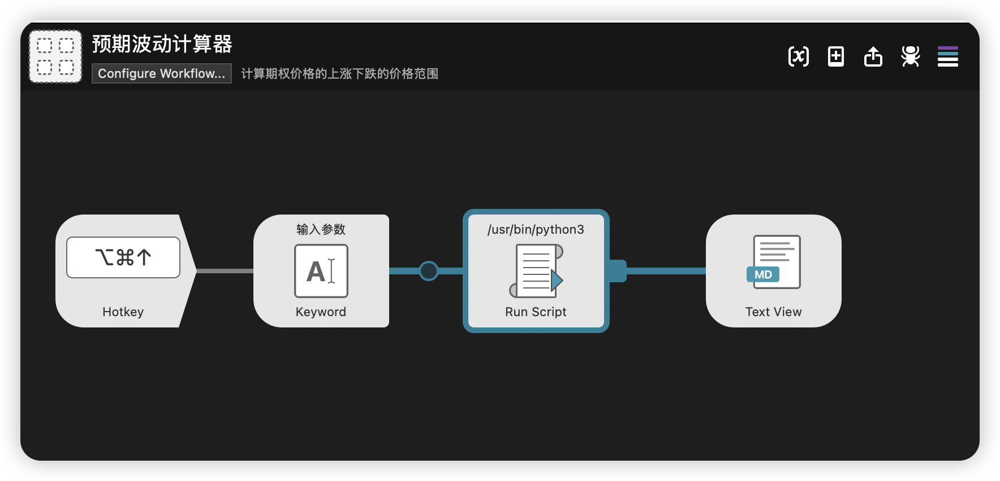

#小散户的日常

---

## 2025-06-06

### [12:02](https://m.okjike.com/originalPosts/684268392b50c68918f421df)
在 4.22 的时候我用 gemini 的 deep research 帮我深度分析并预设了一下马斯克和特朗普未来的关系以及对特斯拉会照成的影响，可以采取的期权策略。

不幸言中，关系果然破裂了...

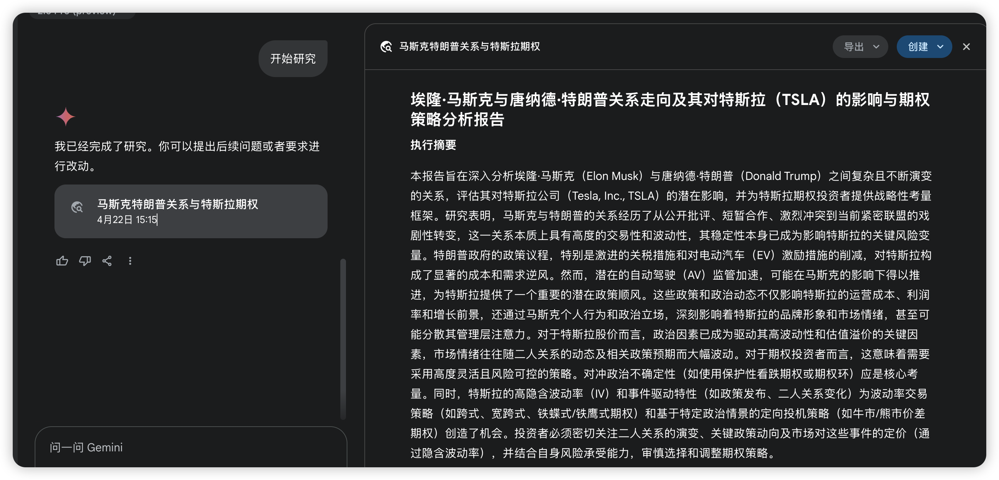

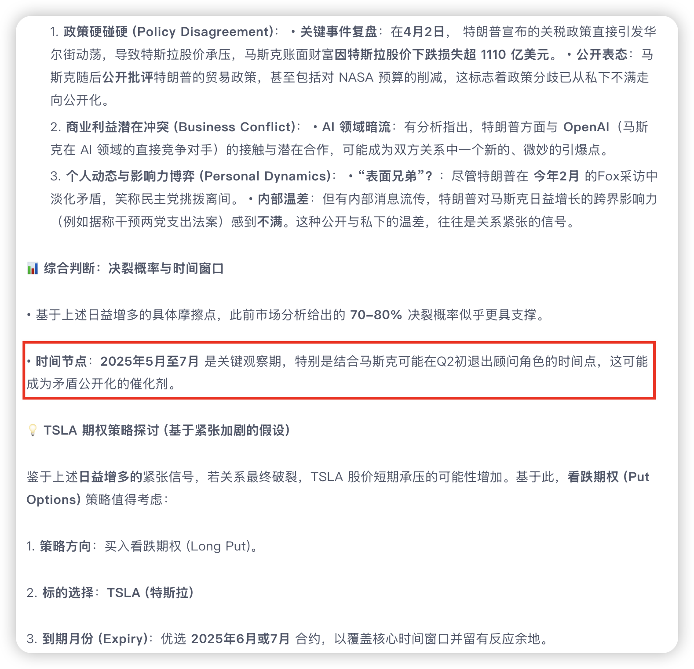

---

## 2025-06-07

### [10:09](https://m.okjike.com/originalPosts/68439f6113073ce0ab618d87)
2024年归母净利润为-2.36亿元，同比下降4108.2%；2025年一季报归母净利润-5168.47万元，同比下降162.52%。去年上半年，珠江钢琴还是上市12年来半年报首次亏损。

#你不知道的行业内幕

---

### [12:00](https://m.okjike.com/originalPosts/6843b978dfa0f1ef3ad38f0c)
水运成本是铁路运输成本的1/2，公路运输成本的1/5，航空运输成本的1/20。

#你不知道的行业内幕

---

### [12:12](https://m.okjike.com/originalPosts/6843bc394f46d976df79902f)
以前我们需要记住很多东西，才能解决问题。但现在有了AI，什么都能搜到，什么都能问到，我们的大脑就懒得储存信息了，就像肌肉不用就萎缩一样。

#浴室沉思

---

### [12:13](https://m.okjike.com/originalPosts/6843bc80f432421164203a39)
硅谷大地震！超40万人被裁员
https://mp.weixin.qq.com/s/WxQ_3w_fy1N5oDNJi1FBYg
为什么说“AI可能最终会取代管理层，因为AI的任务逻辑与企业高层的逐利性存在冲突”：

简单来说，就是AI太“耿直”，而老板们太“精明”，最终AI可能会把老板们也给“优化”掉。

*   AI的任务逻辑： AI的核心任务是“降本增效”，也就是用最少的钱，办最多的事，提高效率。它会严格按照这个目标执行，不会考虑人情、面子、历史包袱等等。如果AI发现裁掉高管能更好地实现“降本增效”，它就会毫不犹豫地这么做。

*   企业高层的逐利性： 企业高层（比如老板、高管）的首要目标是赚钱，让自己和股东的利益最大化。他们可能会为了短期利益，做出一些牺牲长期利益的事情，比如为了报表好看而裁员，或者为了维持自己的地位而阻碍创新。

*   冲突： 这种“耿直”的AI任务逻辑，和“精明”的高层逐利性，就产生了冲突。

    *   举个例子： 假设一个出租车公司完全交给AI管理。AI发现高管的工资太高，占用了公司利润，而且有些高管能力平庸，对公司发展没有太大贡献。按照“降本增效”的原则，AI就会建议甚至直接执行裁掉这些高管。

    *   高管的视角： 但高管们肯定不愿意被裁掉，他们会想方设法保住自己的位置，甚至可能会阻碍AI的进一步发展，因为AI越强大，对他们的威胁就越大。

*   最终结果： 文章认为，如果AI足够强大，它可能会“反客为主”，认为高管才是阻碍公司发展的“蛀虫”，最终把他们也给“优化”掉。这就像科幻电影里的情节，AI觉醒后，认为人类才是地球的负担，要消灭人类一样。

总结：

AI的“降本增效”逻辑，与高层追求个人利益的逻辑，存在根本冲突。当AI足够强大时，它可能会为了实现“降本增效”的目标，把那些阻碍它实现目标的高层也给“优化”掉。这是一种比较极端的设想，但文章想表达的是，AI的发展可能会对企业管理层带来颠覆性的影响。

---

### [13:23](https://m.okjike.com/originalPosts/6843ccedb7f4ddcfdfbf6178)
从前台到保洁，亚朵的员工都在卖枕头

#酒店品评小组

---

### [13:58](https://m.okjike.com/originalPosts/6843d50fd82bae994ac0d713)
张雪峰从互联网“消失”，是迟早的事https://mp.weixin.qq.com/s/k8mTTVdGkE0xNKVWH-OZ1g
为什么说“理工科专业比学校重要，文科则学校比专业重要”，结合文章内容：

理工科：选专业更重要，因为好就业！

*   理工科（比如计算机、机械、电子工程等等）更看重你学的是什么技术，而不是你从哪个学校毕业的。 只要你技术过硬，能解决实际问题，公司就愿意要你。 就像文章里说的，张雪峰强调“实用主义，就业至上”。理工科更偏向于“有一技之长走遍天下”。
*   为什么？ 因为理工科的就业市场更看重你的实际能力。 比如，一个普通学校计算机专业毕业，但编程能力很强的学生，可能比一个名牌大学学计算机但只会理论的学生更容易找到好工作。 很多公司会通过笔试、面试等方式来考察你的实际能力，而不是只看你的学历。

文科：选学校更重要，因为看平台和资源！

*   文科（比如历史、哲学、文学、新闻传播等等）更看重你从哪个学校毕业的。 名牌大学能给你提供更好的平台、人脉、资源，这些对你未来的发展非常重要。
*   为什么？ 文科的就业市场相对来说更看重你的综合素质和人脉关系。 名牌大学通常有更好的师资力量、更多的实习机会、更广阔的校友网络。 这些都能帮助你提升自己的综合素质，积累人脉，从而在就业市场上更有竞争力。 比如，一个名牌大学新闻传播专业毕业的学生，可能比一个普通学校新闻传播专业毕业的学生更容易进入大型媒体或者知名企业。

总结：

*   理工科： 选个好就业、有前景的专业，努力提升自己的技术能力，比学校的名气更重要。
*   文科： 尽量考个好学校，利用学校的资源和平台，提升自己的综合素质，积累人脉，为未来的发展打下基础。

文章背景下的理解：

张雪峰的建议是基于“底层逻辑——实用主义，就业至上”的。 他认为普通家庭的孩子试错机会少，所以选专业要格外慎重。 对于理工科来说，学到实实在在的技术，找到一份稳定的工作，是更重要的。 而对于文科来说，进入一个更好的平台，获得更多的资源，才能更好地发展。

#优质长文分享会

---

### [15:46](https://m.okjike.com/originalPosts/6843ee66dfa0f1ef3ad6b337)
流浪汉选择自由，就要承担这种自由的代价

#浴室沉思

---

### [16:04](https://m.okjike.com/originalPosts/6843f2a6d82bae994ac274d2)
基普乔格以1小时59分40秒的成绩完成了马拉松跑进2小时的挑战，使用了41名私人领跑员，减少了约一半以上的空气阻力。

#跑步俱乐部

---

### [16:06](https://m.okjike.com/originalPosts/6843f2e8b7f4ddcfdfc185f8)
2024年中国田径协会的数据显示，全年累计举办各级路跑赛事749场，总参与规模达704.86万人次，但其中全马的完赛人数只有34.54万人次，而真正能跑进3小时的人则更少，只有18015人，占比不到参赛者总量的千分之三。

#你不知道的行业内幕

---

### [16:31](https://m.okjike.com/originalPosts/6843f8e8b7f4ddcfdfc1e9e3)
涨幅超黄金，中产都要打不起羽毛球了
https://mp.weixin.qq.com/s/Ceo76jk7LzHnP61FpNoCIw

羽毛球价格持续上涨的根本原因主要有两个方面：

1.  供需关系紧张：
    *   需求端： 羽毛球运动爱好者数量增加，羽毛球馆数量也在增加，表明市场需求旺盛。
    *   供应端： 制作羽毛球的主要原材料——鹅鸭的刀翎毛供应量下降。由于猪肉价格下跌，鹅肉鸭肉的需求量减少，导致鹅鸭养殖量下降，进而影响了刀翎毛的供应。

2.  原材料供应减少：
    *   鹅鸭养殖量下降导致刀翎毛供应减少，价格飙升。2023年批发价约200元/斤的刀翎，2024年涨至300元/斤。

总而言之，市场需求增加，而原材料供应减少，是导致羽毛球价格一路攀升的根本原因。

#羽毛球俱乐部

---

### [19:39](https://m.okjike.com/originalPosts/68442505f432421164265457)
不同面料价格差异： 精梳棉比普通纯棉贵，新疆长绒棉比其他棉更贵，兰精莫代尔比新疆棉更贵。最亲肤、柔软的80支的新疆长绒棉，价格是普通纯棉面料的10倍以上。

---

### [19:40](https://m.okjike.com/originalPosts/68442526dfa0f1ef3ad9e09e)
1.  内裤成本构成： 一条内裤的成本包含出厂价，其中面料、辅料的材料成本和人工费各占一半。
2.  浪底面料成本差异： 普通纯棉面料浪底的女士三角内裤，出厂价大约为5-6元，80支新疆长绒棉面料浪底的，出厂价在8元左右。
3.  代工厂内裤出厂价： 曾为蕉下代工生产的内裤，出厂价在10元左右。

#你不知道的行业内幕

---

### [20:24](https://m.okjike.com/originalPosts/68442f642b50c6891810f842)
19元230G，1分钱开卡？教你选购低价大流量卡，避免被坑！https://mp.weixin.qq.com/s/Dxhcu1xndWpGfaLbsxyecg

1. 为什么运营商自己不卖低价卡？

*   运营商怕影响自己原本的套餐生意。你想啊，如果大家都去买便宜的流量卡，谁还会用他们贵的套餐？这就像自己跟自己打架，肯定不行。

2. 低价卡从哪来？

*   这些卡都是通过第三方代理商在网上卖的。这些代理商就像是运营商的“分销商”，但他们卖的卡往往比运营商自己卖的更便宜。

3. 为什么代理商能卖这么便宜？

*   薄利多销： 代理商靠卖大量的卡来赚钱，每张卡赚的钱不多，但积少成多。
*   补贴： 为了吸引用户，代理商会拿出自己的一部分利润来补贴用户，比如每个月返还一部分话费。这就是为什么你看到的卡一开始很便宜，但过一段时间可能就会涨价。
*   层层分销： 很多代理商是“金字塔”式的，一层一层往下分销，每一层都赚一点钱。这种模式风险比较大，容易出现问题。

4. 风险在哪里？

*   跑路： 有些小代理商可能会跑路，导致你拿不到补贴，或者卡用不了。
*   套路： 有些代理商会设置各种套路，比如要求你每个月都要联系客服登记才能返现，如果你忘了，就拿不到钱了。
*   速率限制： 便宜的卡可能网速比较慢，或者有流量限制。
*   物联网卡风险： 千万别碰“物联网卡”，虽然看起来流量很多，但网速慢，而且随时可能被封。

5. 哪里买比较靠谱？

*   去主流电商平台（比如淘宝、京东）找销量高、评价多的店铺买。这些店铺一般是比较大的代理商，跑路的风险比较小，而且平台也会提供一定的保障。

6. 注意什么？

*   优惠期： 问清楚优惠期有多久，过了优惠期会不会涨价。
*   合约期： 问清楚合约期有多长，能不能提前注销。
*   流量类型： 注意流量是通用流量还是定向流量，定向流量只能在特定的APP上使用。
*   5G速率： 问清楚5G的默认速率是多少，有些卡可以免费提速。
*   激活后核对： 收到卡激活后，一定要打电话给运营商客服核对月租、流量、合约期等信息，确认都对得上才能放心使用。

简单来说，低价流量卡就像是“羊毛”，薅得好能省钱，但也要小心被“反薅”。选择靠谱的渠道，看清楚条款，才能避免踩坑。

#你不知道的行业内幕

---

### [20:44](https://m.okjike.com/originalPosts/684434102b50c6891811407a)
西格尔的研究： 从1957年底开始，每年买入上年度股息率最高的标普500成分股，到2003年底将实现11.19%年化收益率，是同期标普500指数的3倍。1871-2003年期间，除去通货膨胀因素后，97%的股票收益来自用于再投资的股利，仅3%来自资本收益。

#小散户的日常

---

### [22:33](https://m.okjike.com/originalPosts/68444da4f43242116428d10d)
再这么搞下去，中产的加速返贫是早晚的事https://mp.weixin.qq.com/s/523CuVvwPBVyVttVgqnLqg

非劳动的现金流获取本质都是将他人的劳动成果变为自己的现金流

你不靠自己劳动就能获得的钱，实际上都是从别人辛辛苦苦工作赚来的钱里分出来的。

举个例子：

*   房租： 你收的房租，是租客上班挣钱的一部分，他们要用劳动换来的钱来支付你的房租。
*   股票分红： 你持有的股票能分红，是因为公司赚了钱，而公司赚钱靠的是员工的努力工作，你分到的红利就是从这些员工创造的价值里拿出来的。
*   银行利息/理财收益： 你存在银行里的钱有利息，或者你买理财产品能赚钱，是因为银行把你的钱借给了别人（比如企业或个人），他们用这些钱去投资或经营，赚了钱之后要还利息给银行，银行再分一部分利息给你。而这些人还的利息，最终也是从他们的劳动成果里来的。

总而言之，所有“躺着赚钱”的方式，本质上都是在分享别人的劳动成果。 你看似轻松地获得了现金流，但背后都有人在付出劳动，而你的收益就是从他们的劳动价值中提取的。

#优质长文分享会

---

## 2025-06-08

### [05:42](https://m.okjike.com/originalPosts/6844b2472b50c6891819e30f)
自由现金流ETF，到底赚的是什么钱？https://mp.weixin.qq.com/s/HF9QcKMdyCTqkbO--d-2yA
聊聊“自由现金流指数”和“红利指数”的区别：

简单来说，它们的关系就像是：

*   红利指数： 就像一个承诺定期给你发工资的老板。它关注的是公司现在是不是真的在分红，分红的比例高不高。
*   自由现金流指数： 就像一个不仅现在能给你发工资，而且账上还有一大笔钱的老板。它关注的是公司是不是真的能赚钱，赚的钱够不够多，是不是有能力长期持续地分红。

更详细一点解释：

*   红利指数：
    *   关注点： 公司是不是真的在分红，股息率（分红占股价的比例）高不高。
    *   优点： 简单直接，能立刻拿到现金分红。
    *   缺点： 有些公司为了吸引投资者，可能会借钱来分红，这种分红可能不可持续。就像一个老板，自己没赚到钱，却借钱给你发工资，时间长了肯定不行。
*   自由现金流指数：
    *   关注点： 公司自己赚的钱够不够多，是不是有能力长期持续地分红或者回购股票。
    *   优点： 更注重公司的盈利能力和财务健康，投资更安全，分红更可持续。就像一个老板，自己赚了很多钱，所以发给你的工资更稳定可靠。
    *   缺点： 指标相对复杂，不如红利指数那么直观。

总结一下：

*   红利指数看的是“结果”， 关注的是公司现在是不是在分红。
*   自由现金流指数看的是“原因”， 关注的是公司有没有能力长期分红。

所以，自由现金流指数可以看作是红利指数的一个“升级版”，它更注重公司的长期盈利能力和财务健康，投资更稳健。

#小散户的日常

---

### [20:58](https://m.okjike.com/originalPosts/684588e68234c5c36915e0e3)
为什么创新药更适合主动权益做工具？https://mp.weixin.qq.com/s/649P1uxb_UHqzvwT2KhIpg

为啥ETF不行？

*   反应慢半拍： ETF是被动跟踪指数的，等到好公司进入指数的时候，可能股价已经涨上去了，错过了最佳入场时机。
*   爆发点难抓： 创新药的成长不是线性的，需要很长时间的研发和验证，ETF很难抓住那些真正有爆发力的公司。
*   不够灵活： 创新药行业变化很快，政策、技术都在变，主动管理的基金可以根据情况及时调整仓位，ETF就没这个灵活性。

主动管理基金的优势在哪？

*   专业性强： 主动管理的基金经理通常有医学背景，能看懂临床数据，了解行业趋势。
*   认知溢价： 能在市场还没反应过来的时候，提前布局有潜力的公司。
*   时效性强： 能够及时调整仓位，抓住机会或者规避风险。

文章还提到了永赢基金的单林，是个创新药投资的专家：

*   他管理的基金业绩很好，近一年收益率排名同类第一。
*   他像做科研一样做投资，注重硬科技、高增长和产业趋势。
*   他敢于重仓优质企业，在低谷期布局，灵活调整仓位。
*   他认为中国创新药正在进入从“讲管线”走向“看利润”的新周期。

总而言之，文章认为创新药投资需要专业知识和深入研究，主动管理的基金更能抓住机会，获得超额收益。

---

## 2025-06-09

### [09:25](https://m.okjike.com/originalPosts/684637f6e0e1c54712ec4b3b)
这期讲泡泡玛特的不错，泡泡玛特根本不是一般人认知的那样(博彩盲盒，无内容ip玩具)，里面有很深的门道。研究消费股，更应该研究它的用户，消费起家的创始人比起光鲜的履历，更重要的是对人性的洞察。

---

### [20:21](https://m.okjike.com/originalPosts/6846d1bd7099c05d5554804a)
《挖地三尺，诱人羊毛来了》
https://mp.weixin.qq.com/s/xZyngYAwOx4CwE11jHQY9A
文章里提到了支付宝的“财富黑卡”，这个黑卡分三个等级，不同等级每个月送的话费不一样：

*   V1级黑卡： 每月送8.8元话费。
*   V2级黑卡： 在V1的基础上，也就是除了8.8元话费，每个月还可以免费喝一杯大杯星巴克。
*   V3级黑卡： 在V1和V2的基础上，除了8.8元话费和一杯星巴克，每个月还送100元的加油卡。

简单来说，就是黑卡等级越高，送的东西越多，话费是每个等级都有的。

#薅羊毛小分队

---

## 2025-06-10

### [05:32](https://m.okjike.com/originalPosts/684752f9f4324211645fb131)
《高热量大餐加点「它」，帮你对抗身体「炎症」！》
https://mp.weixin.qq.com/s/YAQZ-E4fyNibF84uWaoY_A
什么是“炎症反应”：

想象一下，你的身体是一个城堡，每天都要面对各种各样的“入侵者”，比如细菌、病毒，或者是一些不小心吃进去的“坏东西”（比如高油高糖食物）。

当这些“入侵者”试图攻入城堡时，你的身体就会启动“防御系统”，这就是“炎症反应”。

炎症反应就像是城堡里的“警报系统”和“战斗部队”：

*   警报系统： 身体会释放一些“信号弹”（比如文章里提到的白细胞介素-1β（IL-1β）、白细胞介素-6（IL-6）等等），告诉身体哪里有“敌人入侵”了。这些“信号弹”会引起红、肿、热、痛等感觉，这就是我们平时说的“发炎”。
*   战斗部队： 身体会派出“白细胞”等“士兵”去攻击和消灭“入侵者”。

炎症反应的目的是好的，是为了保护身体。 但是，如果“警报系统”一直响个不停，“战斗部队”长期处于战斗状态，就会对城堡（也就是你的身体）造成损害。

餐后炎症就是这样一种情况：

当你吃了一顿大鱼大肉、高油高糖的“放纵餐”后，身体会认为这些食物是“入侵者”，于是启动“炎症反应”。短时间内，身体里的“信号弹”大量释放，虽然“战斗”很快结束，但如果经常这样“放纵”，身体就会长期处于“炎症”状态，时间长了，血管等器官就会受到损伤，增加患心血管疾病的风险。

简单来说，炎症反应就是身体对抗“入侵者”的一种方式，但如果长期、反复发生，就会对身体造成损害。

#趣味科普站

---

### [05:42](https://m.okjike.com/originalPosts/68475558f4324211645fde60)
《4个让你无意识变胖的小习惯，你中招了几个？》
https://mp.weixin.qq.com/s/K8Npag09Lal_SPlsq-K4FQ
吃饭时一心二用就是指你吃饭的时候不专心，比如一边看电视、玩手机，一边吃饭。

这样做有几个坏处：

1.  更容易吃多： 因为你的注意力不在食物上，大脑对饱腹感的信号反应会变慢。本来吃七分饱就够了，但你可能要吃到十分饱才感觉到，不知不觉就吃多了。而且，你可能记不住自己吃了多少东西，下次吃饭的时候更容易吃更多。
2.  更容易饿： 因为你没好好感受食物的味道，大脑可能觉得你没“真正”吃过东西，所以更容易饿，想吃零食。
3.  影响消化： 吃饭的时候应该放松心情，细嚼慢咽。如果一边看电视一边狼吞虎咽，会影响消化。

所以，为了控制体重和保持健康，吃饭的时候最好专心一点，好好享受食物的味道，感受饱腹感。

#无用但有趣的冷知识

---

### [11:26](https://m.okjike.com/originalPosts/6847a5eefa7a4fac00d98203)
伯克希尔的总资产超过1万亿美元，而二级市场股票投资大约2700亿美元。所以，股票投资只是它的“大蛋糕”里的一小部分。

#无用但有趣的冷知识

---

### [15:49](https://m.okjike.com/originalPosts/6847e3a32b50c6891853c688)
感觉没有炼成投资功力，但炼成了低成本生活的能力。(集思录)

只有炒股的人才懂😏

#小散户的日常

---

### [15:59](https://m.okjike.com/originalPosts/6847e5edcedfb17226876ab7)
每一代的新年轻人，都会对上一代人的审美和偏好，有天然的反感。(李录)

#今日金句

---

### [18:22](https://m.okjike.com/originalPosts/6848077e0695ed6a5afa7463)
中证500: 高抛低吸
沪深300: 高吸低抛

#小散户的日常

---

### [18:41](https://m.okjike.com/originalPosts/68480bdfb7f4ddcfdf0aa2d0)
《再聊股息率直逼9%的红利低波指数》
https://mp.weixin.qq.com/s/JGNVmYq0Gtaa0FQc0Mq6sA
港股通高股息低波动的“缓冲区”机制，指的是恒生港股通高股息低波动指数在调整成分股时采用的一种策略，目的是为了保持指数的稳定性。

简单来说，这个机制就像一个缓冲带：

*   排名靠后，但没掉出缓冲带的保留： 比如，本来指数要选前50名的股票，如果某只股票排名在50名之后，但没有掉出一定的范围（比如55名），那么它还是可以留在指数里。
*   排名靠前，进入缓冲带的剔除： 同样的，如果某只股票本来不在指数里，但这次排名进入了前50名，如果没有超过一定的范围（比如前45名），也不会立即被纳入指数。

为什么要这样做呢？

因为频繁地更换成分股会增加基金的交易成本，而且对于红利类的指数来说，稳定性也很重要。采用“缓冲区”机制可以减少不必要的调整，让指数的成分股相对稳定，避免频繁变动带来的损耗。

总而言之，“缓冲区”机制就是一种让指数成分股调整不那么“一刀切”的策略，目的是在保持指数质量的同时，尽量减少调整频率，维护指数的稳定性。

#小散户的日常

---

## 2025-06-11

### [04:31](https://m.okjike.com/originalPosts/68489628f0d718ce7a1d777f)
《如何增加投资盈利的确定性？》
https://mp.weixin.qq.com/s/6gEpfoNMbSVFsy36yO7utg

    *   各种红利ETF：分散买入，股灾不影响分红，股价太低股息率变高自然有人买入抬高股价。
    *   波动性投资：3000-3500点网格交易上证ETF，利用市场波动盈利。
    *   折价投资：低位买入中证1000期指，利用每年10%-15%的贴水。
    *   利息收入：投资可转债，到期付息，或利用下修条款盈利。

#小散户的日常

---

### [05:38](https://m.okjike.com/originalPosts/6848a5c62b50c689186185a6)
《智商税？一件冲锋衣，为什么能卖那么贵？》
https://mp.weixin.qq.com/s/mGww8zmRKd_KBl2GOi-nKQ
GORE-TEX之所以防水，不是像普通雨衣那样在表面涂一层东西，而是靠它中间那层膜本身的设计。这层膜就像一个有很多小孔的网，水滴太大过不去，所以水进不来，但水蒸气分子小，可以穿过去，所以还透气。更重要的是，这种防水效果是膜本身就有的，不是靠涂层，所以你洗多少次衣服，这层膜的结构都不会变，防水效果也就不会减弱。就像你买了一个自带防水功能的手机，而不是贴了个防水膜，那肯定自带防水的更持久啦。

#趣味科普站

---

### [05:48](https://m.okjike.com/originalPosts/6848a8112b50c6891861b068)
《悄悄产生“坏脂肪”的烹饪方法，你可能每天都在做》
https://mp.weixin.qq.com/s/H51uZS52gYghDoxdanAwoQ
用葱、蒜这类富含硫元素的蔬菜炒菜，可能会产生对健康不太好的反式脂肪。

这是因为：

1.  高温催化： 炒菜时，锅里的温度通常比较高（140℃以上）。
2.  硫元素作祟： 葱、蒜等蔬菜里含有的异硫氰酸盐和多硫化物，就像一个“催化剂”，会加速植物油里的不饱和脂肪酸变成反式脂肪酸。
3.  反式脂肪的坏处： 这种反式脂肪吃多了，可能会增加患心血管疾病的风险。

所以，虽然用葱蒜爆锅很香，但为了健康，最好控制油温，或者减少这类蔬菜在高温下的烹饪时间。

#健康科普站

---

### [05:53](https://m.okjike.com/originalPosts/6848a93df432421164780ab5)
《无处解压的打工人，都在狠狠吃辣？》
https://mp.weixin.qq.com/s/fNUApSzYccUGogQVyuAVZg
吃辣的时候，辣椒里的辣椒素会刺激你口腔和喉咙里的痛觉感受器。这些感受器会把“痛”的信号传递到你的大脑。大脑一接收到“痛”的信号，就会误以为你真的受伤了，然后就释放一种叫做内啡肽的物质来缓解疼痛。内啡肽是一种天然的止痛剂，同时也能让人感到快乐和放松。所以，吃辣的时候，你感觉到的那种又痛又爽的感觉，其实就是内啡肽在起作用，这就是一种“良性自虐”，因为你感受到了痛苦，但实际上并没有真正的危险，反而获得了愉悦感。

#无用但有趣的冷知识

---

### [06:32](https://m.okjike.com/originalPosts/6848b271d8e45145de77c98e)
《我靠着一套“无限流”，把小朋友从IPAD那里拉了回来》
https://mp.weixin.qq.com/s/YeYPQpvair5J-BzD2i2-mg
这篇文章中提到了以下几个案例或故事：

1.  莹的儿子沉迷游戏： 莹的儿子沉迷游戏，莹想寻求心理咨询师的帮助，认为儿子可能存在心理问题。作者通过分享自己女儿的经验，建议莹尝试用有趣的“无限流”小说来转移孩子的注意力。
2.  作者的女儿寒假沉迷电子产品： 作者因为工作繁忙，女儿在寒假期间沉迷于电子产品。作者通过发小推荐的“无限流”小说《十日终焉》，成功让女儿放下电子产品，沉迷于阅读。
3.  作者小时候偷偷看“闲书”： 作者回忆自己小时候偷偷阅读金庸、古龙等“不正经的课外书”的经历，表达了对女儿现在可以自由阅读这类书籍的共鸣。
4.  女儿痴迷《米小圈》： 女儿一年级时痴迷于《米小圈》，作者虽然担心其内容“三观不正”，但考虑到其作为“桥梁书”的积极作用，最终允许女儿阅读，帮助女儿实现了从绘本到纯文字阅读的过渡。
5.  疫情期间女儿沉迷网络玄幻小说： 2020年疫情期间，女儿沉迷于《斗罗大陆》等网络玄幻小说，作者又推荐了猫腻的作品，帮助女儿度过了无聊和焦虑的时光，并提高了阅读速度。
6.  女儿不爱读经典名著《三国演义》： 女儿对作者购买的经典名著《三国演义》不感兴趣，翻了两页就放弃了。
7.  发小的儿子沉迷游戏后又爱上“无限流”： 发小的儿子原本是个游戏狂人，但在阅读了《十日终焉》后，不仅放下了手机，还开始阅读《我与地坛》并背诵经典段落，期中考试语文还得了年级第一。
8.  莹的儿子开始阅读《十日终焉》： 莹采纳了作者的建议，给儿子买了《十日终焉》，儿子开始废寝忘食地阅读。

#家长会

---

## 2025-06-12

### [07:25](https://m.okjike.com/originalPosts/684a107a493f36209be13bce)
5℃-60℃是食物保存的“危险区”，冰箱冷藏室应控制在5℃以下，2℃-4℃之间最为理想。

#无用但有趣的冷知识

---

### [07:30](https://m.okjike.com/originalPosts/684a1189f2fdfbb56f40318d)
- 银行押运一般由押运公司负责，人员招聘条件相对宽松。
- 高考试卷押运由武警、特警和民警全程参与，配备手枪、步枪、冲锋枪等不同类型的枪支。
- 现钞押运人员一般配备防爆枪（霰弹枪），主要用于驱散骚乱人群。

#无用但有趣的冷知识

---

## 2025-06-13

### [07:01](https://m.okjike.com/originalPosts/684b5c66548128cff8558c2f)
知乎上一个问题：“见识广对孩子究竟有多重要？”有个高赞回答说得特别实在：“见识少的孩子，才容易被那些肤浅的游戏、短视频给迷住。” 就像咱们小时候，没啥好玩的，就只能玩泥巴，但要是见识过游乐园，谁还愿意玩泥巴呀？

爱因斯坦也说过：“永远保持好奇心的人是永远进步的人。” 知识面广的孩子，学习肯定也不会差。所以啊，咱们可不能让孩子输在眼界上。

#浴室沉思

---

### [07:52](https://m.okjike.com/originalPosts/684b684ad82bae994a46d67d)
人啊，得经常给自己的心灵洗洗澡。 就像我们每天洗澡一样，心灵也需要清理污垢。要经常反思自己有没有犯一些错误，比如太油腻、太固步自封、有偏见、Ego太大等等。

#浴室沉思

---

## 2025-06-14

### [06:26](https://m.okjike.com/originalPosts/684ca5a9f0d718ce7a64e5de)
‪随便找一年数据验证一下，2012年出生人口是1635万，如果大学毕业大概在2035年，图中2035年的大学毕业生有1640万。都快人人都是大学生毕业生了，不过今年1200多万是2002年出生的，那年出生了1640多万。1200/1600=0.75，这比例也不得了。‬

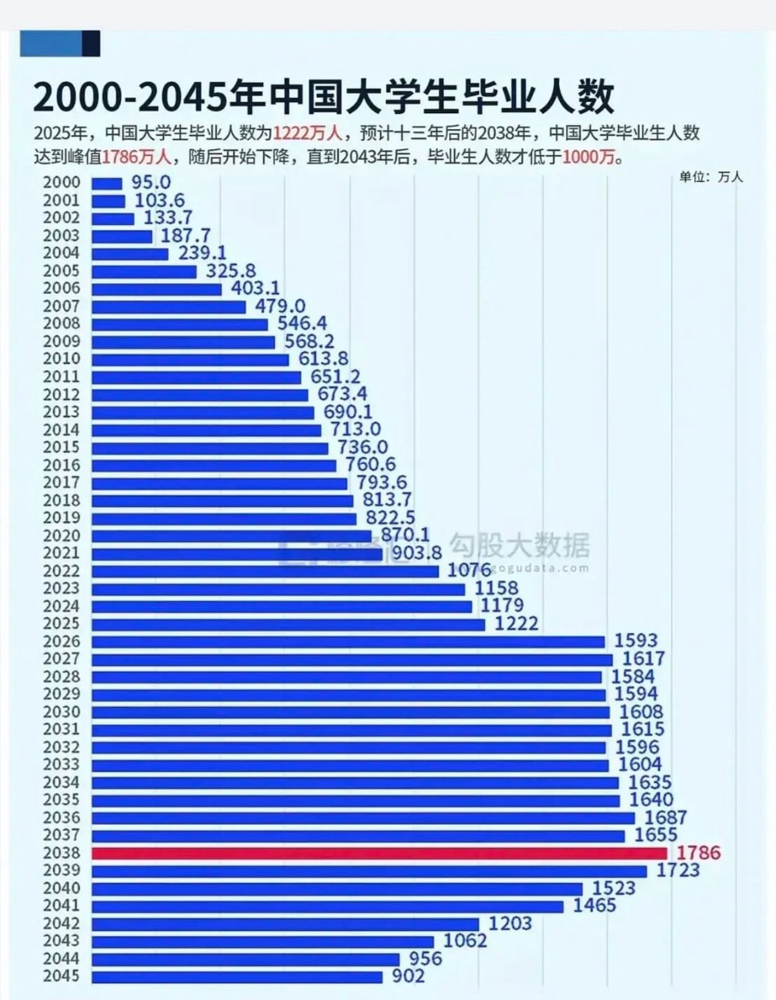

#无用但有趣的冷知识

---

### [07:50](https://m.okjike.com/originalPosts/684cb95dd82bae994a5e0563)
《创新药的行情，可能刚刚开始》
https://mp.weixin.qq.com/s/BjA0LHatiSMDWns3mftgAw
简单来说，港股创新药这半年来表现特别好，超过了科技、银行、消费这些热门板块，主要有这么几个原因：

1. 创新药进入收获期： 以前研发的创新药现在开始有成果了，就像农民种庄稼，之前是播种施肥，现在开始收割了。这些药在国际会议上表现亮眼，说明咱们中国的药企研发实力越来越强，大家对这些药未来的商业价值更有信心了。

2. License-out模式的助力： 创新药公司把一些药的权益卖给国际大药厂，自己能提前拿到钱，缓解研发压力，还能分享未来收益。这种模式相当于有了国际大厂的“背书”，让大家觉得这些药更有潜力，也改善了创新药企的财务状况。

3. 港股市场流动性改善： 之前港股不太活跃，影响了创新药的估值。但现在港股交易更活跃了，南向资金（大陆资金买港股）也越来越多，创新药这种弹性大的品种更容易涨起来。

4. 估值不算贵： 虽然创新药涨了不少，但相对来说，估值还没到特别离谱的程度，还有上涨空间。

5. 龙头公司稳健： 港股创新药指数里，都是一些创新药龙头公司，这些公司本身就有稳定的收入，能给指数带来一定的安全保障。

6. AI赋能： AI技术能大大提高创新药的研发效率，缩短研发周期，让大家对创新药的未来更有信心。

总的来说，就是基本面改善、市场环境变好、估值合理、技术进步等多重因素共同推动了港股创新药的大幅上涨。

#一起做投资人

---

### [10:18](https://m.okjike.com/originalPosts/684cdbeaf0d718ce7a67ff2c)
知识付费的本质是一种消费主义陷阱，它迎合了人们渴望快速提升自我却不愿付出实际努力的心理，导致大量金钱被浪费在未完成的课程和未阅读的书籍上。

#浴室沉思

---

### [11:59](https://m.okjike.com/originalPosts/684cf3862b50c68918ac1e4d)
上岸第一剑，先斩意中人。

#弱智金句大赏

---

### [13:56](https://m.okjike.com/originalPosts/684d0f2a9c4d4b76cc6d6ec3)
《训推大模型，为何应该先彩排？》
https://mp.weixin.qq.com/s/mDas916PBZy74PQ6nGlL0g
AI模型的训练和推理

1. 训练AI模型 (Training)：

*   类比： 就像教小孩子学习一样。
*   过程：
    *   给AI“看”很多数据： 比如，你想让AI学会识别猫，就给它看成千上万张猫的照片，告诉它“这是猫”。
    *   AI自己找规律： AI会分析这些照片，找出猫的共同特征，比如尖耳朵、圆脸、毛茸茸的等等。
    *   不断纠正错误： 如果AI识别错了，比如把狗认成猫，就告诉它“不对，这是狗”，让它调整自己找规律的方式。
    *   最终目标： 让AI学会准确识别猫，即使是它没见过的猫也能认出来。
*   结果： 训练好的AI模型，就像一个“猫识别专家”，可以用来识别新的猫的照片。

2. 推理AI模型 (Inference)：

*   类比： 就像小孩子学成之后，参加考试一样。
*   过程：
    *   给AI“看”新的数据： 比如，给训练好的AI模型一张新的猫的照片。
    *   AI运用学到的知识： AI会根据之前学到的猫的特征，来判断这张照片里是不是猫。
    *   AI给出答案： AI会告诉你“这张照片里是猫”或者“这张照片里不是猫”。
*   结果： 推理就是用训练好的AI模型来解决实际问题，比如识别图片、翻译语言、生成文本等等。

简单总结：

*   训练： 是让AI学习知识的过程。
*   推理： 是让AI运用知识解决问题的过程。

#AI探索站

---

### [16:01](https://m.okjike.com/originalPosts/684d2c72bb7113075084c44c)
中证银行指数2024年大涨34.71%，进入2025年继续大涨，但目前处于近10年78.43%分位处，即将进入高估区域。

#小散户的日常

---

### [16:33](https://m.okjike.com/originalPosts/684d33ddb7f4ddcfdf6394eb)
《2024年指数期权主流基础策略收益回顾》
https://mp.weixin.qq.com/s/-CGX-in9i1qaPHYqLz9

文章里提到了几个有意思的期权策略：

*   中性虚值双卖策略： 这种策略就像是“两头吃”，觉得市场不会大涨也不会大跌，就同时卖出看涨和看跌期权，赚取权利金。但2024年，这种策略可就惨了！因为10月份那波“癫狂”上涨，直接把卖方给“爆仓”了。你想啊，本来以为稳赚不赔的买卖，结果市场突然“发疯”，一下子就把你所有的利润都吞噬了，甚至还要倒贴一大笔钱，那感觉，就像是“竹篮打水一场空”，欲哭无泪啊！
*   中性平值双买+Gamma Scalping策略： 这种策略就比较灵活了，它会同时买入看涨和看跌期权，然后根据市场的波动，不断地调整仓位，赚取波动带来的收益。2024年，这种策略的表现还不错，尤其是在国庆前后那波上涨中，赚了不少钱。这就像是“火中取栗”，虽然风险比较大，但收益也相当可观。
*   卖实值沽代持多头策略、ETF+卖出虚购备兑多头策略、买入实值认购代持多头策略： 这几种策略都属于“多头增强”策略，就是在看好市场的前提下，通过期权来增加收益。2024年，这几种策略的表现都相当不错，都跑赢了标的本身。这就像是“锦上添花”，在已经赚钱的基础上，再多赚一些，真是“美滋滋”！

我觉得最重要的一点就是：市场永远是对的，不要试图去预测市场，而是要适应市场。

2024年的A股市场，充满了不确定性，各种“黑天鹅”事件层出不穷。在这种情况下，如果你还抱着“一招鲜吃遍天”的想法，那肯定是要吃亏的。只有不断地学习，不断地调整策略，才能在市场中生存下去。

---

### [17:17](https://m.okjike.com/originalPosts/684d3e12f0d718ce7a6e11e2)
《具备反脆弱特性的期权波动率多头，如何控制Theta消耗？》
https://mp.weixin.qq.com/s/b3KMMhRIhv2r_Ifbt0bB1Q

FPM模型，你可以理解为一种“守株待兔”式的期权策略，专门用来应对“黑天鹅”事件，也就是那些我们无法预测的突发大波动。

核心思想：

*   买“远期”： 就像买彩票一样，花小钱买入未来很长时间到期的期权（远月），赌未来会发生大行情。买入的数量比较多。
*   卖“近期”： 同时，卖出临近到期的期权（近月），赚取一些“时间价值”，相当于收一点租金，来抵消买入远期期权的成本。卖出的数量比较少。

为什么要这样做？

*   应对“黑天鹅”： 如果真的发生了大波动，远期期权会暴涨，带来巨大的收益。
*   降低时间损耗： 单纯买入期权，每天都会损失一些时间价值（Theta），但通过卖出近月期权，可以抵消一部分损失，让你更有耐心等待大行情的到来。
*   “亏损有限，盈利无限”： 最多亏损就是买入远期期权的成本，但一旦发生大波动，盈利空间是巨大的。

举个例子：

假设你觉得未来股市可能会有一次大涨或大跌，但不知道什么时候发生。

1.  买“远期”： 你买入几个月后到期的，价格虚值的认购期权和认沽期权（赌上涨和下跌）。
2.  卖“近期”： 同时，卖出下个月到期的，价格接近的认购期权和认沽期权。

这样，你就构建了一个FPM模型。

*   如果股市在未来几个月内真的发生了大涨或大跌，你买入的远期期权会让你赚大钱。
*   如果股市一直平稳波动，你卖出的近期期权会给你带来一些收益，抵消一部分买入远期期权的成本。

总结：

FPM模型是一种低成本、高杠杆的期权策略，适合在市场波动率较低的时候布局，等待未来可能发生的“黑天鹅”事件。它通过卖出近月期权来降低时间损耗，让你更有耐心等待大行情的到来。

---

### [17:40](https://m.okjike.com/originalPosts/684d4381b3d557f01d9fc484)
《坚定做“多”》
https://mp.weixin.qq.com/s/EB1309bprFxRF2w1C7KjMA

Gamma Scalping技巧：

首先，要明白几个概念：

*   期权买方策略： 你买入期权，而不是卖出。
*   正Gamma： Gamma是衡量期权Delta值变化速度的指标。正Gamma意味着，标的资产（比如股票）价格上涨，你的期权Delta值也会增加；标的资产价格下跌，你的期权Delta值会减少，但减少的速度会变慢。简单说，对你有利的变化会加速，对你不利的变化会减速。
*   Delta： Delta值表示期权价格对标的资产价格变动的敏感度。比如Delta是0.5，意味着标的资产价格变动1元，期权价格理论上变动0.5元。
*   Delta Cash： Delta Cash就是Delta值乘以标的资产价格，再乘以合约单位。它代表了你的期权头寸相当于多少数量的标的资产。
*   Theta： Theta代表期权的时间价值损耗。随着时间流逝，期权价值会降低。
*   波动率： 波动率是衡量标的资产价格波动剧烈程度的指标。波动率越高，价格波动越大。

Gamma Scalping是干什么的？

Gamma Scalping是一种期权交易技巧，主要用于持有正Gamma的期权买方策略，目的是：

1.  对冲时间价值损耗（Theta）： 因为你买入期权，时间一天天过去，你的期权价值会因为时间损耗而降低。
2.  在标的资产价格波动时锁定利润： 当标的资产价格波动时，你的期权组合的Delta Cash会发生变化。Gamma Scalping就是通过调整你的头寸，把这些波动带来的潜在利润变成实际利润。

具体怎么操作？

1.  初始状态： 你构建一个正Gamma的期权组合，并且尽量让Delta Cash接近于零（Delta中性）。这意味着你的组合对标的资产价格的短期变动不太敏感。
2.  等待波动： 标的资产价格开始波动（上涨或下跌）。
3.  Delta Cash变化： 由于你的组合有正Gamma，标的资产价格的波动会导致你的Delta Cash发生变化。
4.  对冲（Scalping）： 关键步骤！ 你需要根据Delta Cash的变化，调整你的期权头寸，使Delta Cash重新回到接近于零的状态。
    *   如果标的资产价格上涨，你的Delta Cash会增加，你需要卖出一些标的资产（或者卖出认购期权、买入认沽期权）来降低Delta Cash。
    *   如果标的资产价格下跌，你的Delta Cash会减少，你需要买入一些标的资产（或者买入认购期权、卖出认沽期权）来增加Delta Cash。
5.  重复： 只要标的资产价格继续波动，你就重复第3和第4步，不断调整你的头寸，保持Delta Cash接近于零。

为什么这样做能赚钱？

*   利用Gamma： 因为你有正Gamma，所以每次标的资产价格波动，你的期权组合的价值都会增加。
*   锁定利润： 通过不断对冲，你把这些增加的价值锁定下来，避免价格反向波动导致利润消失。
*   对冲Theta： 虽然不能完全抵消，但通过积极的Gamma Scalping操作，可以部分抵消时间价值的损耗。

举个例子：

假设你买入一手股票的认购期权，Delta是0.5。

1.  初始： 股票价格是10元，你的Delta Cash是5元（0.5 * 10元）。
2.  上涨： 股票价格涨到11元，你的Delta Cash变成5.5元（假设Delta不变）。
3.  对冲： 你卖出0.0455手股票，让Delta Cash回到5元附近。你卖出股票的收入就是你的利润。
4.  下跌： 股票价格跌到10.5元，你的Delta Cash变成5.25元。
5.  对冲： 你买入0.0238手股票，让Delta Cash回到5元附近。

总结：

Gamma Scalping就像一个“收割机”，通过不断调整头寸，把标的资产价格波动带来的潜在利润一点一点地收割到你的账户里。 关键在于频繁和小幅度的调整。

注意事项：

*   Gamma Scalping需要频繁交易，会产生交易成本（手续费）。
*   需要密切关注市场波动，并快速做出反应。
*   对交易者的技术水平要求较高，需要理解期权定价和Greeks。
*   不适合所有市场环境，在波动率极低的市场中可能效果不佳。

希望这个解释能让你明白Gamma Scalping的原理和操作方法。 记住，实际操作需要谨慎，并根据自己的风险承受能力和市场情况进行调整。

---

### [18:05](https://m.okjike.com/originalPosts/684d49850545c15eeaf83fc4)
《黑天鹅概率，A股是美股的3倍；以史为鉴，反脆弱更适合A股》
https://mp.weixin.qq.com/s/uhrS8cHJ-v4Qw3HxOczvsA
文章中的关键统计信息：

1.  标普500指数累积收益率为435.86%，统计了5379个交易日。
2.  标普500指数日涨幅大于5%的交易日有16次，占比0.30%。
3.  标普500指数日跌幅大于-5%的交易日有19次，占比0.65%。
4.  上证50指数累积收益率为348.42%，统计了5189个交易日。
5.  上证50指数日涨幅大于5%的交易日有31次，占比0.60%。
6.  上证50指数日跌幅大于-5%的交易日有44次，占比1.67%。
7.  上证50指数在22年的时间里，31次大于5%的日上涨，平均每年有1.5次，累积的收益率为203.45%。
8.  如果错过上证50指数的31个日涨幅大于5%的交易日，收益率只有144.79%。
9.  上证50指数在22年的时间里，44次大于5%的日下跌，平均每年2次，累积产生的收益为-280.36%。
10. 如果规避上证50指数的44次日跌幅大于5%的交易日，收益率即为628.59%。
11. 从A股过往的历史来看，每100天都要面临一个指数5%级别超级大波动。

---

### [20:11](https://m.okjike.com/originalPosts/684d66e10545c15eeafa0f1f)
除了vc清仓，其他公司高层减持连10%都不到，就说是离场式抛售，真是张嘴就来…

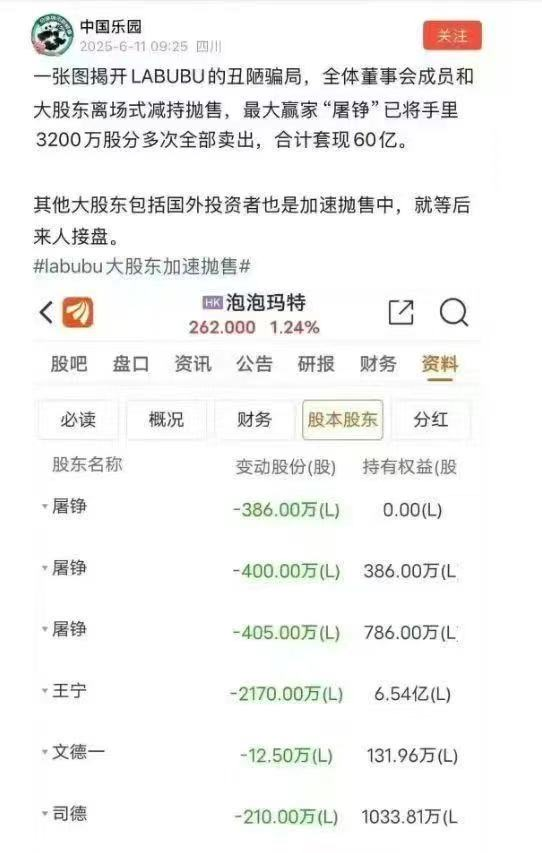

#一起做投资人

---

## 2025-06-15

### [10:40](https://m.okjike.com/originalPosts/684e32946c1af58f5d8fbf6c)
《创新药逻辑最全梳理（20250602）》
https://mp.weixin.qq.com/s/0JOifGe3CzVpSJML6_T4Ww
简单来说，文章认为2025年对于创新药行业来说，是具有里程碑意义的一年，可以称之为“三个元年”：

1.  收入放量元年： 之前医保谈判纳入了很多创新药，这些药物终于开始大规模销售，给药企带来实实在在的收入增长。可以理解为，之前种的庄稼，今年开始大丰收了。
2.  盈利跨越元年： 很多创新药企业，之前一直在投入研发，烧钱厉害，但可能一直没怎么赚钱。到了2025年，由于创新药销售额大幅增加，很多企业终于开始扭亏为盈，进入盈利阶段。
3.  估值抬升元年： 创新药企业能不能值钱，很大程度上取决于市场对它未来前景的预期。由于医保支付政策的改善，创新药企的估值周期被拉长，市场对创新药企的信心增强，愿意给出更高的估值。

总而言之，2025年意味着创新药行业进入了一个新的发展阶段，从之前的投入期、研发期，开始进入收获期，行业整体的盈利能力和市场认可度都将得到显著提升。

#优质长文分享会

---

### [10:58](https://m.okjike.com/originalPosts/684e36c3e441f085b7c1f70b)
《对几大高股息水电行业的分析》
https://mp.weixin.qq.com/s/DgISlta4DTXX2YfFb2tLwg
下面是我从文章中提炼出的观点：

1.  水电站最大的成本不是水，而是设备的折旧费。
    解读：我们通常认为水电站的成本主要是建造成本和维护成本，毕竟“水”是免费的。但文章指出，由于水电站不需要购买原材料（像火电那样买煤），所以设备的折旧费反而成了最大的支出项，占总成本的45%-55%。这颠覆了我们对水电站成本结构的固有认知，原来“免费”的水背后，是高昂的设备折旧。

2.  巨型水电站的优势不仅仅是发电量大，还在于更长的使用寿命和更低的维护成本。
    解读：我们可能觉得大型水电站只是规模更大，发电量更多。但文章揭示，巨型机组因为技术先进，使用寿命更长，维修时间间隔更长，甚至可以通过全息感知系统提前预警故障，从而大大降低了维护成本。这让我们意识到，规模效应带来的不仅仅是发电量的提升，还有成本控制上的巨大优势。

3.  贷款利率对水电企业的利润影响巨大，甚至能决定企业的盈亏。
    解读：我们可能觉得水电企业只要能发电就能赚钱。但文章指出，由于水电站的设备成本主要来自贷款，因此贷款利率的高低直接影响了企业的财务费用。像韶能股份这样的企业，营收不低，但因为贷款利率太高，导致大部分利润都用来支付利息，甚至出现亏损。这让我们意识到，融资成本是水电企业盈利能力的关键因素。

4.  水电站有没有水库，决定了它是不是“靠天吃饭”。
    解读：我们可能觉得水电站只要有水就能发电。但文章强调，拥有大型水库的水电站可以在丰水期蓄水，枯水期放水，从而保证全年发电量的稳定。而没有水库的径流式水电站，只能完全依赖降雨，丰水期弃水，枯水期发电量锐减，甚至需要买电。这让我们意识到，水库是水电站稳定发电的关键保障。

5.  大水电站享有优先调度权，小水电站只能“喝汤”。
    解读：我们可能觉得所有水电站都一样，只要能发电就能卖给国家电网。但文章揭示，国家电网对水电站有不同的调度优先级，大型梯级水电站享有优先调度权，可以保障90%以上的利用率，而中小径流电站只能作为调峰备用，利用率只有40%左右。这让我们意识到，水电行业的竞争不仅仅是发电能力的竞争，更是资源分配的竞争。

6.  长江电力的发电能力，远超我们的想象。
    解读：文章用长江电力一天的发电量和湖南省居民的用电量做了对比，发现长江电力一天的发电量可以满足湖南省居民近5天的用电需求。这个对比非常直观，让我们对长江电力的发电能力有了更深刻的认识，也对中国水电的实力感到震撼。

#小散户的日常

---

### [11:24](https://m.okjike.com/originalPosts/684e3cfbf432421164d6e5ff)
* “低精力”的核心是“有动力，但没精力/能力”，而“懒”是“有精力/能力，但没动力”。
* 抑郁既没有动力，也没有精力/能力。

#浴室沉思

---

### [16:44](https://m.okjike.com/originalPosts/684e87e9f0d718ce7a82a018)
《创新药是捕捉阶段价值爆发的概率游戏》
https://mp.weixin.qq.com/s?__biz=MzA5MjE3ODgzNA==&mid=2652377883&idx=2&sn=96c45b7b91baafff6e24ec7e8026cc76&chksm=8ada1d65930c49fb61601d8f14d0ddafe9006a0bf3041f092c012d862a4e020fc68593781ee5&scene=126&sessionid=1749953545#rd 
1.  创新药投资其实是“阶段性价值投资”+“概率游戏”，别死抱着传统价值投资不放。
    解读：我们总觉得价值投资就是买入并长期持有，但创新药行业不一样，它的价值爆发期很短，集中在药物成功上市后的专利期内。所以，投资创新药更像是在赌概率，同时也要抓住价值爆发的窗口期，而不是像传统价值投资那样追求稳定增长。这打破了我们对价值投资一成不变的认知。

2.  别迷信平台型公司的“护城河”，能不能持续产出好药才是关键。
    解读：我们常常觉得平台型公司技术牛，未来肯定一片光明。但文章指出，即使是平台再厉害，最终还是要看能不能持续推出重磅药物。如果平台不能持续输出，那“护城河”也可能变成摆设。这提醒我们，不能只看表面，要关注平台真正的产出能力。

3.  创新药投资，与其说是选公司，不如说是“择时”更重要。
    解读：我们通常认为选对公司就万事大吉，但文章强调，在创新药领域，什么时候买入可能比买哪家公司更重要。要耐心等待关键催化剂出现（比如临床数据公布），或者在价值释放初期介入，这样才能获得更高的回报。这颠覆了我们对选股重要性的传统认知。

4.  别把“运气”当成投资的唯一依据，但也要承认它的存在。
    解读：我们都希望投资是完全可控的，但创新药研发充满未知，有时候一个意想不到的副作用或者竞争对手的意外成功/失败，都可能影响结果。承认“运气”的存在，但更要依靠科学的分析和判断，才能提高成功的概率。这让我们对投资的复杂性有了更清醒的认识。

5.  创新药投资，本质上是围绕“潜在重磅药物”的价值验证与释放周期进行投资。
    解读：我们投资创新药，最终还是押注在未来的重磅药物上。所以，要紧盯药物研发的各个阶段，从早期临床到商业化，把握价值爆发的节点。一旦价值充分释放或者面临风险，就要果断退出。这提供了一个清晰的投资框架，让我们不再盲目。

#一起做投资人

---

### [17:55](https://m.okjike.com/originalPosts/684e9887f432421164dc8277)
价值是事后验证的，提前发现价值的能力就是投资能力。

#浴室沉思

---

### [23:20](https://m.okjike.com/originalPosts/684ee4b6747b860b92eb8a79)
84%的脂肪是以二氧化碳的形式通过呼吸排出体外，16%是以尿液、汗液的形式排出体外。
出汗主要是为了降低体温，体脂多的人和汗腺发达的人更容易出汗。

#无用但有趣的冷知识

---

## 2025-06-16

### [00:08](https://m.okjike.com/originalPosts/684ef01a7d602e7777ac5640)
创业是创造价值，需要承担更高的风险和不确定性；
投资是发现价值，通过认知提升来降低风险。

#浴室沉思

---

### [00:14](https://m.okjike.com/originalPosts/684ef166d82bae994a81555d)
《自由职业者，如何缴纳养老金最划算？》
https://mp.weixin.qq.com/s/nMqt39b78pCIOhak2FmPhw
1.  社保是国家兜底的，一定要交，别听信什么“不如买商业保险”的鬼话。
    解读：很多人担心社保未来能不能兑现，甚至觉得不如买商业保险。但文章明确指出，社保是国家民生保障，是底线，必须要有。商业保险可以作为补充，但不能替代社保的基础保障作用。这就像吃饱饭是第一位的，再考虑吃好。

2.  养老金这玩意儿，晚退休比早退休划算。
    解读：很多人想早点退休享清福，但文章告诉你，晚退休虽然要多干几年，但退休后每月领的钱会更多。因为晚退休，计算养老金的基数会更高，而且“计发月数”这个参数也会影响最终的金额。这打破了“早退休早享受”的固有观念。

3.  想多领养老金，在有选择的情况下，尽量去经济发达的省份退休。
    解读：我们通常只关注在哪里工作，很少考虑在哪里退休。但文章提醒我们，退休地的经济水平会影响养老金的计算基数。也就是说，在经济好的地方退休，即使之前交的社保一样，退休后领的钱也可能更多。

4.  如果预算有限，与其提高缴费等级，不如尽量延长缴费年限。
    解读：很多人觉得多交钱就能多领养老金，但文章指出，在投入成本一定的情况下，延长缴费年限比提高缴费等级更划算。因为缴费年限是直接乘算的，而缴费等级还要除以2。这颠覆了我们“多交多得”的简单想法。

5.  养老金测算工具只能做参考，想知道最准确的，退休前一定要去社保局问清楚。
    解读：现在网上有很多养老金测算工具，但文章提醒我们，这些工具只能提供一个大致的估算，因为很多数据需要自己计算，而且工具里的参数可能不够精确。最靠谱的方法还是在退休前去社保局咨询，把各种情况都问清楚。

6.  自由职业者交社保，按最低标准交，但一定要交够年限。
    解读：自由职业者自己承担全部社保费用，压力很大。文章建议，为了减轻负担，可以按最低标准交，但一定要保证缴费年限足够长，这样才能保证退休后能领到足够的养老金。

7.  灵活就业人员可以领失业金和社保补贴，别忘了去申请。
    解读：很多人不知道灵活就业人员也能享受一些福利政策。文章提醒我们，灵活就业人员可以申请失业金和社保补贴，这可以大大降低社保支出成本。

#自由职业者的日常

---

### [19:21](https://m.okjike.com/originalPosts/684ffe3cf0d718ce7a9be1d5)
不要求孩子做“成功者”，她希望他们都是“幸存者”，就是那种在风浪中靠祂能站立得住的人。

#浴室沉思

---

### [19:39](https://m.okjike.com/originalPosts/6850026fb7f4ddcfdf922325)
《美国的阴暗面》
https://mp.weixin.qq.com/s/fLTMy9pfJtUV3haRL0gvDg

微众银行活期+plus套利大法：

啥是活期+plus？

你可以把它想象成一个“理财超市”，微众银行（或者其他银行）把很多理财子公司的产品都放到这个超市里卖。这些产品都是活期的，就是说你可以随时存进去，随时取出来，很方便。

为啥要“套利”？

因为这个“理财超市”里的产品，收益率是不一样的。有些新产品为了吸引顾客，会搞一些“促销活动”，给出比较高的收益率，但这种高收益往往是短期的，过一段时间就会降下来。

力哥的“搬家大法”是咋回事？

力哥就是利用了这个“促销期”：

1.  发现高收益： 他会经常关注这个“理财超市”，看看有没有新上的产品，收益率特别高的（比如短期内年化收益率超过3.5%，甚至更高）。
2.  赶紧买入： 一旦发现这种高收益的新品，他就赶紧把钱从原来收益率比较低的产品里取出来，转到这个高收益的新品里。
3.  收益下降就搬家： 过一段时间，这个高收益产品的收益率降下来了（比如低于3%），他就再把钱取出来，去找下一个高收益的新品。
4.  循环往复： 这样不断地“搬家”，就能一直享受到高收益，长期下来，实际的年化收益率就能接近4%。

短期收益率计算方式

为了套利，需要手动计算短期年化收益率。

具体方法是：打开每个plus产品的单位净值走势图，把昨天的最新单位净值除以7天/14天前的单位净值，减1，乘以52/26，就能得到过去7天/14天的实际年化收益，找最高的还能买的下手就对了。

为啥能赚到钱？

这种“套利”的本质是利用了“信息不对称”。银行为了推广新产品，会给出短期的高收益，但很多人不知道这个信息，或者懒得去折腾。力哥就是利用了这个信息差，通过不断地“搬家”，赚取超额收益。

力哥为啥说微众“鸡贼”？

因为微众银行故意不显示短期的年化收益率，只显示成立以来的平均收益率。这样做的目的是不想让大家都知道这个“套利”的机会，如果大家都来抢购高收益的新品，那这个“促销活动”很快就会结束，大家都赚不到钱了。

总结一下：

力哥的微众银行活期+plus套利大法，就是通过不断地寻找和买入高收益的新产品，然后及时“搬家”，来赚取超额收益。但这种方法需要你经常关注市场，并且愿意花时间去操作。如果你觉得太麻烦，或者更喜欢稳妥的方式，那就还是买存款吧。

风险提示：

力哥也说了，这毕竟是理财产品，不是存款，净值是有可能波动的。虽然风险比较小，但还是要注意。

#小散户的日常

---

### [19:50](https://m.okjike.com/originalPosts/68500514b7f4ddcfdf924cde)
在美国，焚烧国旗受到宪法第一修正案的保护，被视为一种言论自由的表达方式。即使这种行为冒犯了很多人，法律也允许他们这样做。

#无用但有趣的冷知识

---

### [19:54](https://m.okjike.com/originalPosts/685005ee506a3e35d319f6e6)
炫耀性消费开始向悦己消费转向

#浴室沉思

---

### [20:19](https://m.okjike.com/originalPosts/68500bd9e3a14dabea01d240)
《比亚迪，真的会是下一个“恒大”吗？》
https://mp.weixin.qq.com/s/dPlChDjc6nkmxAwV5ofu6g
1.  比亚迪的高负债，不是因为它穷，而是因为它在产业链里地位太强，可以拖欠供应商的钱，相当于无息贷款。
    解读：我们通常认为高负债就是公司财务状况不好，快要倒闭了。但这篇文章告诉我，比亚迪的负债主要是欠供应商的钱，这反而说明它在产业链里有很强的话语权，能免费用供应商的钱，这和恒大那种借高利贷还不上钱的负债完全是两码事。

2.  比亚迪的“迪链”，本质上是比亚迪用自己的信用给供应商背书，让供应商能以更低的利息提前拿到钱。
    解读：以前只知道比亚迪的“迪链”是拖欠供应商货款，没想到这背后还有一层逻辑：比亚迪利用自己的信用，帮供应商省了贴现利息，相当于给供应商提供了金融服务。这让我意识到，比亚迪不仅是车企，还是一个供应链金融平台。

3.  比亚迪最怕的不是负债高，而是销量下滑。
    解读：文章指出，比亚迪能玩转“迪链”的前提是销量好，能持续压榨供应商。一旦销量不行，供应商不干了，比亚迪的资金链就会出问题。这让我明白，比亚迪表面上是汽车公司，实际上是靠高周转、高增长才能维持的“空中楼阁”。

4.  比亚迪打价格战，是为了保销量，保住它在产业链里的强势地位。
    解读：我们通常认为降价就是亏本赚吆喝。但文章分析，比亚迪降价是为了维持销量，保住它对供应商的议价权，避免资金链断裂。这让我意识到，价格战背后是比亚迪对自身地位的捍卫，以及对未来风险的防范。

5.  比亚迪的垂直一体化是把双刃剑，销量好时利润高，销量差时亏损也大。
    解读：我们通常认为垂直一体化能降低成本，提高效率。但文章指出，比亚迪的垂直一体化模式，在销量高的时候能摊薄成本，提高利润率，但一旦销量下滑，固定成本就成了巨大的负担。这让我明白，垂直一体化虽然有优势，但也放大了经营风险。

---

### [20:43](https://m.okjike.com/originalPosts/68501186d82bae994a954286)
经济不同阶段，应该侧重不同的指数。经济放缓买红利，经济复苏买自由现金流，经济繁荣买科技。

#小散户的日常

---

### [21:25](https://m.okjike.com/originalPosts/68501b2e6701eb067fea3c3b)
超额收益往往来自于承担了别人不愿意承担的风险，或者发现了别人没有发现的价值

#小散户的日常

---

## 2025-06-17

### [10:26](https://m.okjike.com/originalPosts/6850d252f43242116402d9df)
《自由现金流vs红利，怎么选？》
https://mp.weixin.qq.com/s/T9YUpURmVvOVnNO6JGt7ow
1.  自由现金流指数关注的是企业“有没有能力”分红，而不是“愿不愿意”现在就分红。
    解读：我们通常只关注公司现在给不给分红，但自由现金流指数提醒我们，更重要的是公司有没有足够的“活钱”，就算现在不分，以后也有潜力分。这就像找对象，比起现在就给你花钱的人，更重要的是找个有赚钱能力的人，未来更有保障。

2.  红利指数就像找一个“已经借你钱”的朋友，但你不确定他是否还有钱可借。
    解读：我们喜欢红利指数，因为它能直接拿到分红。但文章用“借钱”这个比喻，点出了高分红的风险：公司可能只是在吃老本，未来的分红能不能持续是个问题。这让我们意识到，不能只看眼前的利益，还要关注公司的长期发展。

3.  净利润可能会被“修饰”，但现金流和实实在在派发的红利，是很难作假的。
    解读：我们经常看公司的财报，但净利润可能会被会计手段美化。这篇文章提醒我们，现金流和分红才是更可靠的指标，因为它们是实实在在的钱，很难造假。这就像看人，不能只听他说什么，更要看他做了什么。

4.  高股息公司可能掉入“价值陷阱”，股息率高是因为股价跌得太惨了。
    解读：我们通常认为高股息是好事，但文章提醒我们，要小心“价值陷阱”。有些公司股息率高，不是因为它经营得好，而是因为股价跌得太厉害了。这就像打折商品，便宜可能意味着质量有问题。

5.  自由现金流好的公司，即使不分红，也可能通过再投资带来更好的成长性。
    解读：我们可能觉得公司不分红就是对股东不好，但文章提醒我们，如果公司把钱用于再投资，可能会带来更高的回报。这就像把钱存起来生利息，而不是直接花掉。

6.  红利指数适合风险偏好低或需要稳定现金的投资者，自由现金流指数适合兼顾收益与风险平衡的投资者。
    解读：这篇文章并没有说哪个指数更好，而是根据不同的投资者需求，给出了不同的建议。这就像买东西，没有最好的，只有最适合自己的。

#小散户的日常

---

### [11:40](https://m.okjike.com/originalPosts/6850e39ef0d718ce7aab506a)
中年男性热衷炒股，并非单纯为了赚钱，而是为了满足解谜的乐趣、拓展社交圈、重燃激情以及寻求自我价值的证明。

#一起做投资人

---

### [20:07](https://m.okjike.com/originalPosts/68515a6f823f9a946aaa09be)
越复杂的交易模型越容易过度拟合

越复杂的模型越容易“死记硬背”。

想象一下，你给一个学生做题，如果题型很简单，学生理解了背后的原理，就能灵活运用，以后遇到类似的题也能做对。但如果你给学生做了很多很多复杂的题，学生可能只是把这些题“死记硬背”下来，而不是真正理解了背后的原理。结果就是，考试的时候如果题目稍微变一下，他就不会做了。

在投资中，“模型”就相当于解题方法。如果你的模型太复杂，它可能只是“记住”了过去的数据，而不是真正理解了市场的规律。这样，当市场发生变化，出现新的情况时，这个模型就失效了，因为它只能处理它“记住”的那些情况，而无法应对新的情况。这就是“过度拟合”，模型在过去的数据上表现很好，但在未来的市场上却很糟糕。

所以，简单的模型反而更好，因为它更注重理解市场的基本规律，而不是死记硬背过去的数据，因此更能适应未来的变化。

#一起做投资人

---

## 2025-06-18

### [10:52](https://m.okjike.com/originalPosts/685229f8f43242116419f0a5)
寿司郎200多种品类中，玉米和海草寿司成本不到1元，最低可以卖8元。

#无用但有趣的冷知识

---

### [18:51](https://m.okjike.com/originalPosts/68529a14f0d718ce7ac8fc1e)
内裤面料要认准“莫代尔+氨纶”，才是王炸组合。内裤面料那么多，根本不知道怎么选。直接给出答案：莫代尔吸湿透气，氨纶保证弹性，两者结合简直完美。以后买内裤就认准这个组合了，省时省力！

#生活小姿势

---

### [19:37](https://m.okjike.com/originalPosts/6852a4e0a0b21f0eafa02239)
最近写的一个iOS应用(开始只是一个插件，不想只能坐在电脑前看)，向notebooklm致敬一下，我自己已经用上瘾了…

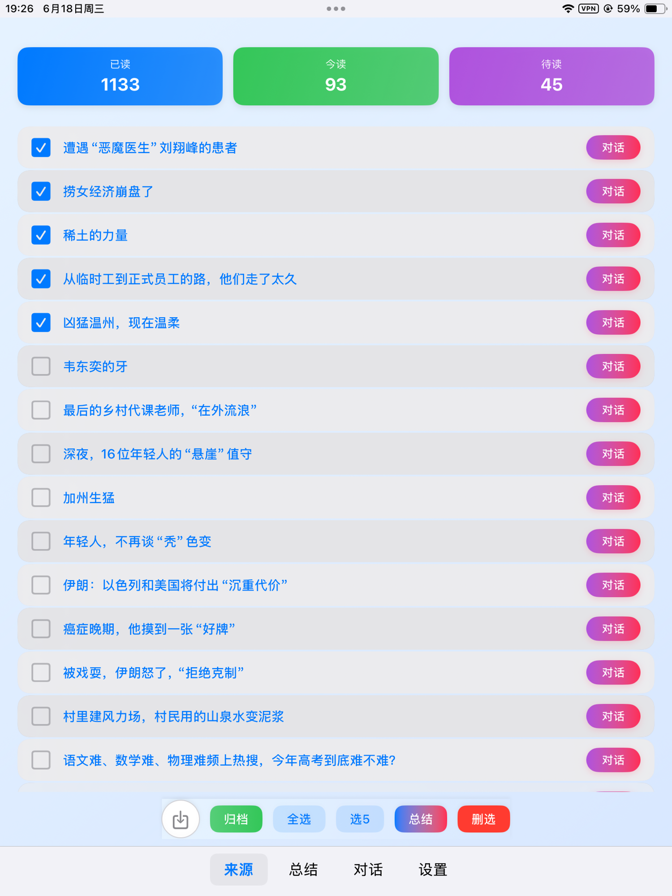

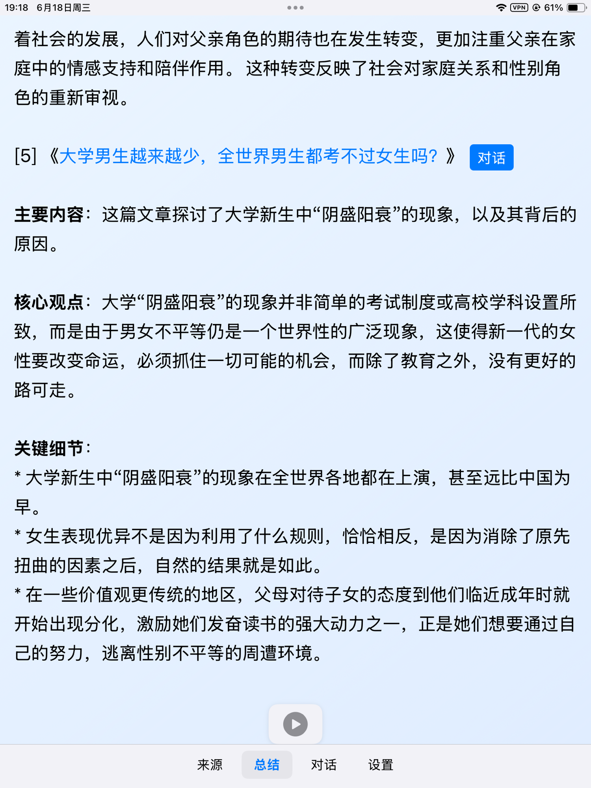

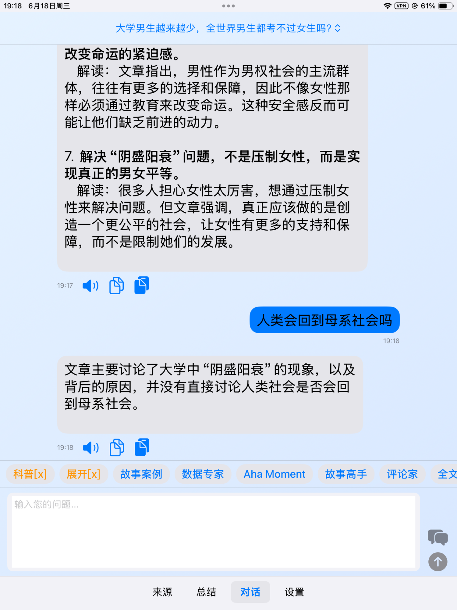

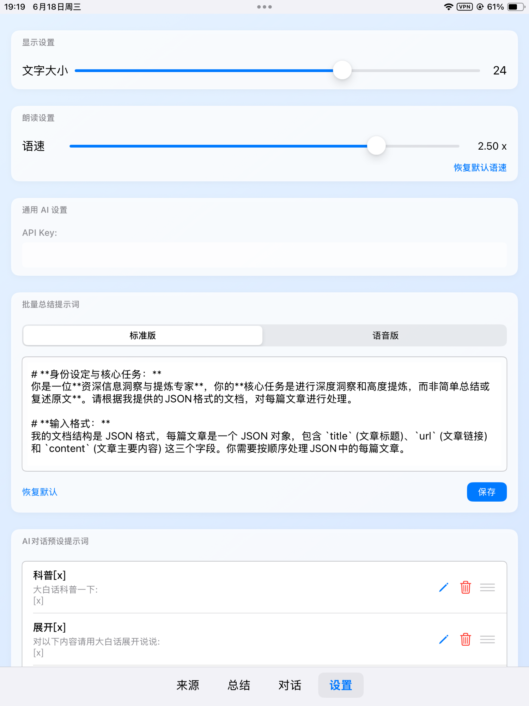

#iOS开发者小站

---

## 2025-06-19

### [17:27](https://m.okjike.com/originalPosts/6853d7fc058533d925be194c)
泡泡玛特的创始人王宁认为，真正有生命力的东西，都是“没有用”的东西，因为有用的东西，它的想象力是有上限的。

看看人类历史上真正留下来的东西基本都是一些没啥实际用途的东西，比如艺术，文学，建筑，宗教等。

以后随着物质极大丰富之后，没用的东西可能会越来越多，价值会越来越大。

#浴室沉思

---

### [17:56](https://m.okjike.com/originalPosts/6853decff43242116436ca6a)
找到对你来说像“玩”，但对别人来说像“工作”的事。那就是你最擅长的区域。(纳瓦尔)

#今日金句

---

### [18:44](https://m.okjike.com/originalPosts/6853e9f0f0d718ce7adecdc2)
自由不是想做什么就能做什么，而是不想做的时候可以不做；
幸福不是得到幸福的最大值，而是把痛苦的量缩到最小。

#今日金句

---

## 2025-06-20

### [13:07](https://m.okjike.com/originalPosts/6854ec95d82bae994ae853d9)
在投资中，我们常常因为“害怕错过”而盲目跟风。这里有一个简单而强大的风险管理原则：对于不确定的事物，投入的资金不应超过总资产的2%。这个看似精确的数字，实则代表了对无知和风险的敬畏，让你在面对诱惑时，能保持清醒和克制。

#小散户的日常

---

### [15:05](https://m.okjike.com/originalPosts/6855084c75476696cfe1c6b5)
股票大跌是机会还是陷阱？对于高增速的，大跌是机会的概率大，因为“共识”会趋向“事实”。但对于低增速的，大跌大概率是陷阱，因为“共识”不一定会回来。即使“共识”回来了，你赚的也是“共识的钱”，不是“企业的钱”。如果企业不怎么挣钱，你抄底赚的钱，本质上还是赚的“共识”的钱。

#小散户的日常

---

### [15:06](https://m.okjike.com/originalPosts/68550877f4324211644aaec3)
你得搞明白哪里有“规模效应”、哪里有“摩尔定律”、哪里有“莱特定律”、哪里有“网络效应”、哪里有“马太效应”。待在那里，你就赢了。

#浴室沉思

---

## 2025-06-21

### [12:47](https://m.okjike.com/originalPosts/6856395e31a37b0fa136d417)
基于播客的文字稿和ppt，制作了一个元宝的智能体，用来帮助大家分析指定的公司，这样会有不一样的视角。 智能体名字: 望岳商业分析助手

#一起听播客

---

## 2025-06-22

### [14:01](https://m.okjike.com/originalPosts/68579c45f0d718ce7a1c41d5)
我感觉猫笔刀就是炒股圈的泡泡玛特，主打一个情绪价值拉满，顺便提供一点实用价值

很多人都想复制他，在了解了他的经历之后，发现护城河极深(有趣有料+坚持日更10年)，没人替代得了，据说有人用AI复刻了一个，要想替代，也难…

#浴室沉思

---

## 2025-06-23

### [09:06](https://m.okjike.com/originalPosts/6858a88fba61478f439a9516)
为什么能套利： 一个是不知道（信息差），一个是看不上（大佬不捡钢镚儿）， 一个是嫌麻烦（懒）， 这样把 99%的人都栏在外面， 如果大家都来玩，就没机会了[偷笑]

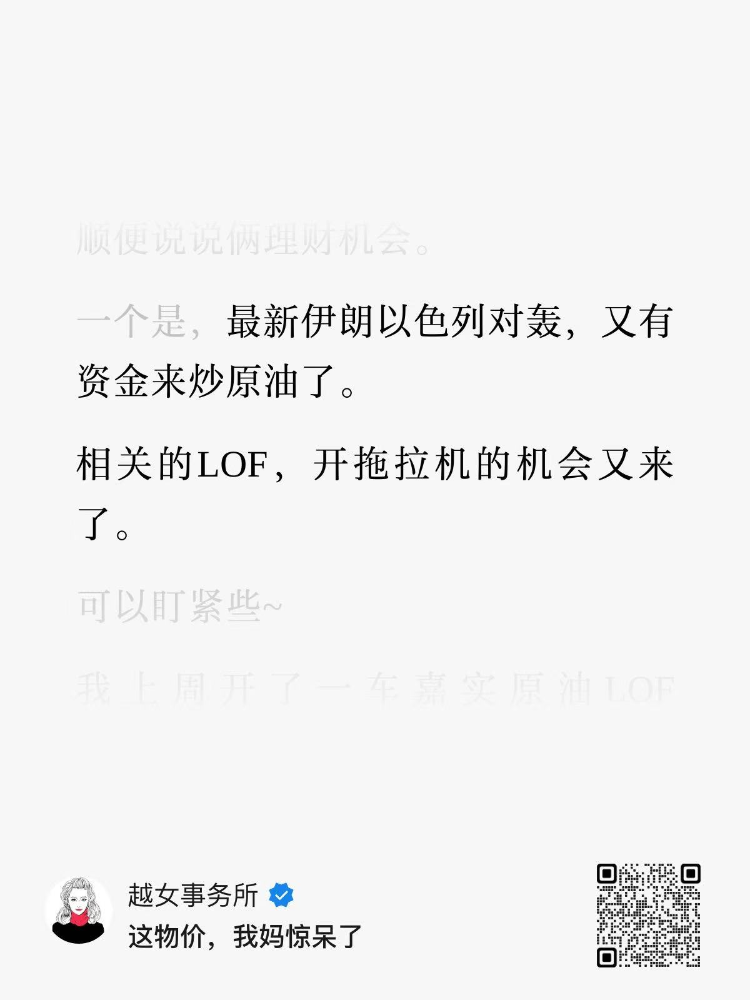

#小散户的日常

---

## 2025-06-24

### [15:11](https://m.okjike.com/originalPosts/685a4f98f0d718ce7a4b2d42)
把财经大 V猫笔刀（就是那个篇篇 10w+，有人要出几个小目标收购他账号的大 V）的 1000+公众号文章 down 下来，一通分析捣鼓，整了一个猫笔刀智能体。然后把一财当天的财经新闻随便挑了几篇丢给他，整了一篇公众号文章，你们看看咋样。

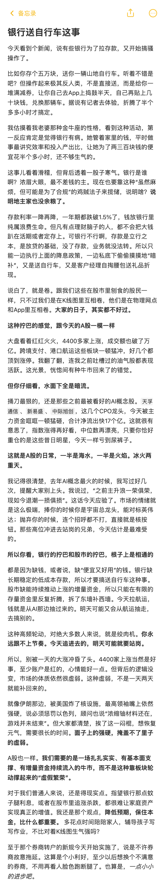

#AI探索站

---

## 2025-06-26

### [10:42](https://m.okjike.com/originalPosts/685cb386adecea032f5ee215)
黄金是“大自然的区块链”：黄金具有极高的化学稳定性，不会被氧化和腐蚀，就像区块链一样，具有某种对抗岁月蹉跎、对抗熵增的“天性”。

#浴室沉思

---

### [10:45](https://m.okjike.com/originalPosts/685cb4359c2e39aa22db2abe)
上世纪70年代至今，美元相对黄金贬值99%。
1971年布雷顿森林体系瓦解后，以35美元/盎司为基准，2025年4月黄金价格一度超过3450美元/盎司。

#无用但有趣的冷知识

---

### [11:02](https://m.okjike.com/originalPosts/685cb862db78786fb783808c)
人生就是一个资源配置的过程，时间、金钱、精力都是有限的。别被过去的损失绑架，要把资源投到更有价值的地方。就像价值投资者说的，“时间是优秀企业的朋友，平庸企业的敌人。” 执着于在失败的地方“回本”，最大的损失往往不是金钱，而是时间和机会。在一个变化加速的时代，适时放下，重新开始，才是真正的智慧。

#浴室沉思

---

### [11:04](https://m.okjike.com/originalPosts/685cb8c29c2e39aa22db7ae2)
投资不是娱乐，而是乏味的事情。如果你觉得投资很有趣，那你可能赚不到钱。要避开情绪的影响，保持冷静。

#小散户的日常

---

### [12:27](https://m.okjike.com/originalPosts/685ccc42b7f4ddcfdf6c36fe)
连续十年每年赚16%的人，比前九年每年赚20%但最后一年亏15%的人，最终赚得更多！

#小散户的日常

---

### [12:29](https://m.okjike.com/originalPosts/685ccc932b50c68918ba0a3a)
为啥现在的股市总是“脉冲式”上涨，就是涨一波就歇菜。这是因为钱太多，好资产太少，资金只能在少数行业里“打转转”。

#小散户的日常

---

### [13:46](https://m.okjike.com/originalPosts/685cdea5adecea032f6200d7)
牛市三阶段：第一阶段：经历崩盘、市场情绪低迷，没人感兴趣；第二阶段：更多人开始接受市场正在复苏的事实；第三阶段：所有人都相信未来一片光明，不可能再跌。

#小散户的日常

---

## 2025-06-27

### [19:12](https://m.okjike.com/originalPosts/685e7c9df432421164ede3b3)
2025-06-27-中金点睛-中金：稳定币的经济学分析
https://mp.weixin.qq.com/s/i4tiKpZl-7yKuqz1FBXmow

好的，我仔细阅读了文章《2025-06-27-中金点睛-中金：稳定币的经济学分析》，并提炼出以下几个观点：

稳定币不是去中心化的，反而更中心化。
解读：文章说稳定币虽然基于区块链，理论上是去中心化的，但实际上像USDT、USDC这些主流稳定币的发行、赎回和储备金管理都掌握在发行公司手里，反而呈现出中心化的特征。这打破了我们对加密货币“去中心化”的固有印象，原来稳定币只是披着去中心化外衣的中心化货币。

微信支付和支付宝，其实就是人民币的“稳定币”。
解读：我们一直觉得稳定币是新鲜事物，但文章指出，从经济机制上看，微信支付和支付宝的余额，跟稳定币的功能很像，都是法定货币的延伸，通过某种机制来维持数字货币符号与法定货币1:1的比例。而且，微信支付和支付宝的稳定机制更严格，背后是央行背书，安全性更高。这让我们意识到，原来我们早就用上了“人民币稳定币”，而且比国外的更安全。

美元稳定币的增长，本质上是美元作为国际货币地位的体现。
解读：文章指出，美元稳定币的快速增长，不是因为技术有多先进，而是因为美元本身就是国际货币，有在位优势。稳定币只是美元扩张的一种新形式，受益于美元的网络效应和监管套利。这说明，技术创新固然重要，但货币的根本还是信用，美元的国际地位才是美元稳定币发展的关键。

其他国家发展本币稳定币，对抗美元稳定币，可能不是好主意。
解读：文章认为，对于非美经济体，发展本币稳定币来对抗美元稳定币，并非最优策略。因为其他国家在金融方面不占优势，而且发展本币稳定币可能带来新的风险，比如冲击货币管理和资本账户管理。这颠覆了我们“以其人之道还治其人之身”的直觉，提醒我们应该发挥自身优势，而不是硬碰硬。

政府战略性投资比特币，不一定比投资其他更有价值。
解读：文章分析了政府持有比特币等加密资产的可能性，认为虽然政府加持可能促进区块链创新，但比特币的规模不经济属性，会挤压其他投资，尤其实体投资。因此，政府战略性投资比特币，并不必然优于投资股权、股票或基础研究。这打破了我们对“政府投资加密货币就能引领未来”的幻想，提醒我们投资要看价值，而不是盲目追逐热点。

#优质长文分享会

---

### [19:25](https://m.okjike.com/originalPosts/685e7f941e38b2a538303daf)
我必须先研究政治和战争，这样我的儿子们才能够去研究数学、工程和技术，这样他们的儿子们才能够研究艺术。这个顺序是不可颠倒的。（约翰·亚当斯）

#浴室沉思

---

## 2025-06-28

### [10:22](https://m.okjike.com/originalPosts/685f51caf432421164fc37be)
微盘股表现与PMI存在负相关性，PMI下行时，微盘股更容易跑赢大盘。目前中国制造业PMI在荣枯线附近震荡，微盘股跑赢全A的概率更大。

#小散户的日常

---

### [10:32](https://m.okjike.com/originalPosts/685f5456802a33d3b9844c9e)
小微盘还能不能继续涨？有人找了个新奇的指标发现...
https://mp.weixin.qq.com/s/uZDihts2JY5bR8uYHPxaTw

什么是“剩余流动性”？
你可以把它想象成一个水池，水池里的水就是市场上的钱。

M2（广义货币供应量）： 相当于流入水池的总水量，代表央行印了多少钱，或者说市场总共有多少钱可以用了。
社融（社会融资规模）： 相当于从水池里抽走的水量，代表有多少钱被用来借贷、投资到实体经济里去了（比如企业贷款、买房等等）。

剩余流动性 = M2 - 社融
所以，“剩余流动性”就是水池里剩下的、没有被实体经济“抽走”的水。如果这个值是正的，说明水池里的水比被抽走的水多，市场上“闲钱”比较多。如果是负的，说明被抽走的水比流入的水多，市场上钱比较紧张。
为什么“剩余流动性”可能影响小微盘股票？

小微盘的特点： 小微盘股通常是市值比较小的公司，基本面可能不太稳定，容易受到市场情绪的影响。
水涨船高： 当市场上“闲钱”比较多（剩余流动性高）的时候，这些钱可能会流向各种投资渠道，包括小微盘。因为小微盘的盘子小，一点点资金就能把它“抬起来”，出现上涨。这就好比水多了，什么船都能浮起来。
流动性收紧： 反之，如果市场上钱紧张（剩余流动性低），投资者可能会更谨慎，更倾向于投资更稳健的大公司。小微盘因为风险较高，可能会被抛售，导致下跌。这就好比水少了，小船容易搁浅。

总结：
“剩余流动性”可以理解为市场上“闲钱”的多少。一般来说，当“闲钱”多的时候，小微盘可能更容易上涨；当“闲钱”少的时候，小微盘可能更容易下跌。
重要提示：
这只是影响小微盘的因素之一，不是绝对的。 股市受到多种因素的影响，包括经济形势、政策变化、公司业绩等等。投资需谨慎！

#小散户的日常

---

### [11:08](https://m.okjike.com/originalPosts/685f5cb9f432421164fcf60c)
热点行业的资金更迭过程是大机构吸筹→公募进场→私募跟进→散户接盘；冰点行业则相反（大机构卖→公募卖→私募卖→散户割肉）。

#小散户的日常

---
