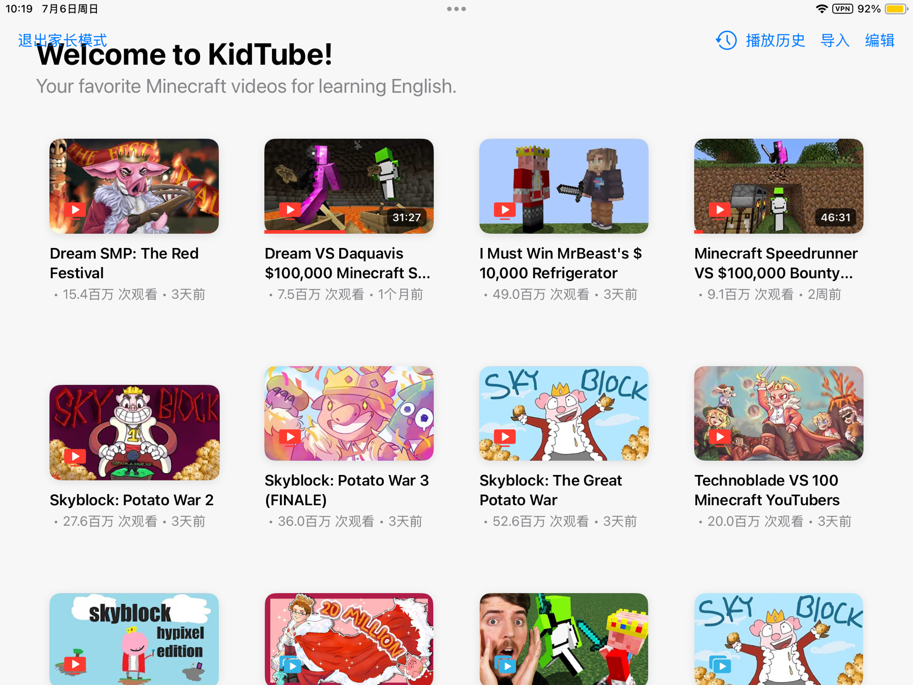
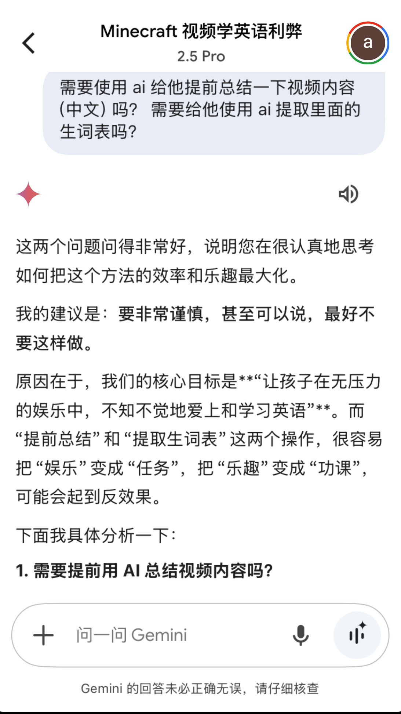
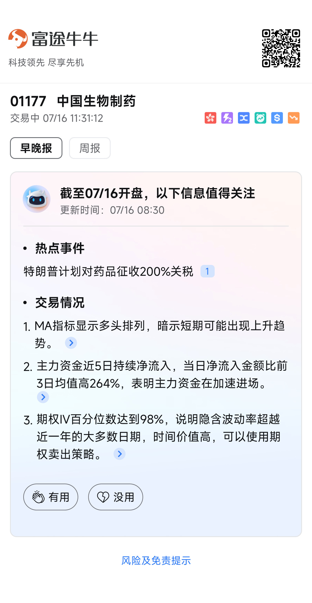
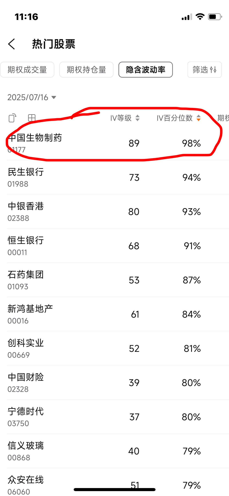

# 2025-07 即刻归档

## 月度总结
- 本月共归档 29 条内容，活跃了 10 天，时间范围从 2025-07-02 到 2025-07-30。
- 发帖最集中的一天是 2025-07-12，当天共记录 7 条。
- 本月最常出现的话题是：浴室沉思 (9), 小散户的日常 (7), 无用但有趣的冷知识 (4)。
- 带媒体链接的内容有 2 条，短笔记风格的内容有 17 条。
- 最长的一条发布于 2025-07-11，正文约 2689 字。

## 2025-07-02

### [08:38](https://m.okjike.com/originalPosts/68647f6cd82bae994af4f532)
嫌货才是买货人

#浴室沉思

---

## 2025-07-06

### [10:38](https://m.okjike.com/originalPosts/6869e19f91c7e8c1b97d1575)
在玩中学，给家里的小朋友弄的一个应用，有限制的看自己感兴趣的英语视频。

这也是最近用Gemini CLI开发的一个完整的iOS应用，开始考虑的巨复杂，一度做成了一个学习软件，后来把学习的功能都删了…

#iOS开发者小站

---

### [16:28](https://m.okjike.com/originalPosts/686a339f7ee613ba5a4138bf)
直接通过港股通买红利股要交20-28%的红利税，但通过QDII基金投资H股红利股，只需交10%的税。

#小散户的日常

---

### [17:52](https://m.okjike.com/originalPosts/686a4745cc2cf19251a9015a)
“骑”作动词读qí，作名词读jì，这个本来是从古音中来的。不过，伴随着“骑”的名词义项在口语中的逐渐消亡，jì这个音在各种地域方言中用得越来越少，逐渐就变成了读书人自己用的一种社会方言。

#无用但有趣的冷知识

---

### [18:04](https://m.okjike.com/originalPosts/686a4a46a56d6d07108d556e)
投资两种公司： 要么做不被世界改变的公司，要么做改变世界的公司。巴菲特擅长的是不被世界改变的公司，比如石油、煤炭等能源行业。

#小散户的日常

---

### [18:11](https://m.okjike.com/originalPosts/686a4bbe91c7e8c1b983e5d2)
低波风格类的红利指数明显配置银行比较多，如果后续银行股拐头向下，可能这些指数的影响会比较大。

#小散户的日常

---

### [18:20](https://m.okjike.com/originalPosts/686a4de391c7e8c1b984084d)
《比直接抄底标普500确定性更强的策略》
https://mp.weixin.qq.com/s/XWRktdB0gtbMVLssjQmC4g
1.  做空VIX指数，其实是做空市场情绪，而不是直接预测股市涨跌。
    解读：我们通常认为抄底就是预测股票或者指数的涨跌，但这篇文章提供了一个新思路，通过做空VIX指数，实际上是在赌市场情绪会恢复正常。这就像是说，不用猜股票会涨多少，只要相信恐慌情绪会过去就行，降低了预测的难度，更关注市场心理层面。

2.  VIX指数再高，最终都会回归平均水平。
    解读：看到VIX指数的历史走势图，会发现无论发生什么大事，恐慌指数最终都会跌回来。这就像是给焦虑的人打了一剂镇定剂，提醒我们市场的情绪波动是暂时的，长期来看会趋于稳定，所以在高位做空VIX，从概率上来说，胜算更大。

3.  抄底指数依赖于指数上涨，做空VIX依赖于市场情绪修复。
    解读：这句话点明了两种策略的底层逻辑不同。抄底指数需要指数真的涨起来才能赚钱，而做空VIX，只要市场情绪从恐慌回归平静就能获利。这就像是说，一个赌的是“涨”，一个赌的是“不恐慌”，后者似乎更容易把握。

4.  时间是做空VIX的朋友，大不了和时间死扛。
    解读：这句话让人安心，即使短期内VIX指数继续上涨导致浮亏，也不用太担心，因为从历史规律来看，波动率总会降下来。这就像是说，只要有耐心，最终市场情绪会回归理性，做空VIX的策略就能奏效。

5.  VIX越涨越买，金字塔加仓，摊薄做空成本。
    解读：这句话提供了一个应对VIX指数短期上涨的策略。我们通常害怕越跌越买，但这篇文章反其道而行之，建议VIX越高越加仓，这样可以降低平均成本，一旦VIX下跌，就能更快获利。这就像是逆向思维，在别人恐慌时贪婪。

6.  见好就收，不恋战，VIX差不多修复到25左右，就可以离场了。
    解读：这句话提醒我们不要贪心，做空VIX的目的是赚取市场情绪修复的钱，而不是追求更高的收益。一旦VIX回到正常水平，就应该及时止盈，避免后续继续持有带来的风险。这就像是说，不要把简单的事情复杂化，赚到该赚的钱就走。

#小散户的日常

---

## 2025-07-10

### [09:00](https://m.okjike.com/originalPosts/686f10cb96a9e1785ce3c8d3)
人生没有白走的路，每一步都算数

#今日金句

---

## 2025-07-11

### [06:43](https://m.okjike.com/originalPosts/6870422ce81ba2a179bcd4d6)
《毛戈平是伪装成化妆品公司的美容院》
https://mp.weixin.qq.com/s/JdIPhu7XNK16pyNmoCt7JQ

话说这化妆品公司的估值啊，那可比翻书还快，嗖嗖地就上去了，又嗖嗖地掉下来，看得基金经理们血压都高了。今年这“馅饼”砸到了毛戈平的头上，他家的“鱼子酱面膜”愣是卖到了巴黎老佛爷，一罐子1800，比海蓝之谜还贵，这可真是给咱中国人长脸！上市之后，毛戈平的市值那叫一个高，都快赶上好几个网红化妆品公司加起来了，让那些原本对化妆品不屑一顾的投资人都开始怀疑人生了。

要说这毛戈平的成功，那可不是谁都能复制的。这事儿还得从1995年说起，那时候毛戈平在《武则天》剧组当化妆师，硬是把40岁的刘晓庆化成了从15岁到80岁的模样，那叫一个惊艳！一下子就火遍全国。毛戈平早年学过越剧舞台造型，对人的脸那是相当了解。他发现啊，亚洲人肤色偏黄，脸也比较平，要是用欧美流行的“芭比粉”，那简直就是一场灾难。

有了这手绝活，再加上刘晓庆的“代言”，毛戈平开始在全国各地巡回演讲，卖书卖VCD，教大家化妆。那时候他就觉得时间不够用，一个人忙不过来，就想着：“我得让全中国人都变美，光靠我一个人可不行啊！”

2000年，毛戈平在杭州开了学校和公司。学校主要由他老婆汪立群打理，他自己就专心做化妆品。学生们都说，毛老师只在毕业的时候才来拍个合照。学校的苏副校长就说了：“毛老师日理万机，哪有时间亲自教你们啊？” 别看见不着毛老师，但学生们肯定得买毛老师家的化妆品，因为学校上课就只用他家的产品。这规矩，那可是杠杠的！

毛戈平的专柜也跟别人不一样。别的品牌都是销售员卖力推销，他家倒好，销售员都是自己的学生，个个会化妆。汪立群就说了：“咱的学生会化妆，就给客人免费化妆，客人看到自己变美了，自然就会买咱家的产品。” 有学生吐槽说，他家的眼影盘死贵死贵的，不买还不给指导。苏副校长又说了：“有一部分产品是专门给学生定制的，那当然更贵啦！”

毛戈平的每个专柜都配了7个美容顾问，提供一对一半脸试妆、眉妆定制和妆容教学。非会员只能眼巴巴地看着，想体验？行，注册会员送一次妆容服务，消费满1800送8次，最高8800送24次！

2003年，毛戈平托关系进了上海港汇恒隆专柜，还立下了“军令状”：9万销售额，干不成走人！结果第一个月就做了19万，第一年有9个月都是商场销冠，从此以后，各大商场都对他敞开了大门。

不过，毛戈平真正火起来，还得等到2019年。那一年，他和博主“深夜徐老师”合作拍了个化妆视频，一下子就上了热搜，阅读量高达7.3亿！这下可把自己的品牌彻底带火了。尝到甜头的毛老师一发不可收拾，光李佳琦的直播间就去了好几次，公司营收在6年间涨了6倍多！

毛戈平的厉害之处在于，他把化妆这种“换头术”变成了视频，在社交媒体上广泛传播，让更多的人知道了他的名字。别的化妆品品牌只会砸钱投广告，毛老师不仅有实实在在的案例，还现场实操，全程录音录像，含金量那叫一个高！

从2020年开始，毛戈平在B站上传了16个视频，每个视频的评论区都有人想把自己的脑袋寄给他。这获客能力，简直就是“杀手锏”！

毛戈平和其他化妆品品牌不一样，他很大程度上摆脱了“两高一低”的特点，也就是高毛利率、高销售费率、低净利率。别的品牌都得花大价钱做营销，还得依赖丝芙兰、抖音这些第三方渠道，销售费用高得吓人。完美日记一年光销售费用就花了15亿，珀莱雅一半的营收都变成了销售费用。

毛戈平呢？他家的销售费率虽然也高，但大部分都是门店的房租。而且，毛戈平的门店都在高端商场，和一线大牌“门对门”，房租肯定不便宜。但这反而降低了他对KOL和线上营销的依赖，因为没有哪个KOL比毛老师更懂化妆！而且，营销和营收往往是成正比的，但房租不会随着店效同步增长，所以毛戈平的净利率就很高。

这套系统的核心就是专柜的试妆和教学服务，把服务和产品销售绑定在一起，形成了极高的复购率。毛戈平的至尊风尚会员（一年消费8888元）复购率高达99.7%！3.6万至尊会员贡献了线下32%的收入。

这几年，整个美妆行业在资本市场的表现都不太好。华熙生物、贝泰妮的市值都跌了不少，丸美、上海家化更是长期在低位徘徊。彩妆的市场比护肤品小得多，客单价和复购率也差很多。虽然化妆品品牌都说自己有研发实力，但其实技术含量并不高。

毛戈平也表示自己“怎么可能在研发里面吝啬”，但实际上他家的研发投入占比只有0.8%。化妆品本质上是调色，技术研究方向比较模糊，所以很难在研发上有所突破。这就导致化妆品生产制造门槛低，产品容易同质化，对渠道和营销的依赖非常重。

毛戈平的聪明之处在于，他把标准化的产品“非标化”了。化妆这门手艺说难不难，但很多人对着视频学都学不会。正如毛老师所说：“女人即使有很好的化妆品，也不意味着能化出好的妆容。”

毛戈平专柜不用动刀，当场见效，还能手把手教学。消费者进店前只有刘亦菲的神韵，出来后就是刘亦菲本人。把服务做成门店的付费业务，消费者会觉得排斥；但买化妆品就赠送现场妆造实操，听上去就很吸引人。这种非标服务环节的引入，让毛戈平在成本更高的线下渠道反而获得了更高的效率。

毛戈平线下渠道只有400万会员，远低于线上1100万，但由于消费力强劲，营收贡献反而比线上更高。很多生意里都有类似“非标化”的特点：眼镜是一个工业品，但医生验光配镜的过程实际上是一个非标化的过程。樊登读书也是如此，书本身是标品，但“读书”这个行为将其非标化，从而产生了新的附加值。

依靠线下渠道高达86%的毛利，毛戈平整体毛利率高达84.4%，这可比很多大牌都高多了！

总而言之，毛戈平的成功，在于他把化妆品卖的不仅仅是产品，更是一种变美的体验和服务。这种经营思路并不是什么商业秘密，只不过世界上有很多化妆师，但只有一个毛戈平。

那么，从毛戈平的故事里，我们能学到什么呢？

*   差异化竞争是王道。 在同质化严重的市场里，要想脱颖而出，就得找到自己的独特之处。毛戈平的独特之处在于他的化妆技术和服务，把产品变成了“非标品”，从而获得了更高的溢价。
*   线下体验很重要。 在线上流量越来越贵的今天，线下体验的价值越来越凸显。毛戈平通过专柜的试妆和教学服务，提升了用户粘性和复购率，实现了线上线下联动。
*   专注才能成功。 毛戈平几十年如一日地专注于化妆事业，不断提升自己的技术和服务，最终成为了行业的领军人物。

所以说，各位朋友，无论做什么行业，都要找到自己的独特之处，专注投入，才能取得成功！

#优质长文分享会

---

## 2025-07-12

### [16:04](https://m.okjike.com/originalPosts/6872170bdb445f44039e5ced)
《未来已来！凯文·凯利：谁将吃掉AI时代的“第一只螃蟹”？》
https://mp.weixin.qq.com/s/ywM626Pnyzq0VH_pqjntPg

1.  AI时代，别想着跟机器人比生产力，那是它们的强项，咱们比不过。
    解读：我们总想着提高效率，努力工作。但这篇文章说，生产力是给机器人准备的，人应该去做那些机器人做不来的事，比如艺术、创新，这些不追求效率，甚至允许失败的事情，这一下子就让人觉得，不用那么焦虑地追求“高效”了，可以更自由地去探索。

2.  未来公司可能越来越小，甚至出现“一人公司”，大家围绕项目临时组队。
    解读：我们印象中的公司都是大而稳定的，但这篇文章说，未来会更灵活，大家为了一个项目聚在一起，项目结束就散伙，这种“游击队”式的组织方式，让人觉得未来的工作方式会更加自由和个性化，不再被传统的大公司束缚。

3.  AI会取代中层管理者，因为他们做的很多事情AI也能做，比如统计、汇报。
    解读：我们一直觉得管理者是不可替代的，但这篇文章说，AI可以更好地完成管理者的很多工作，这让人意识到，未来的职场需要的是更有创造力、更有决策力的人，而不是只会上传下达的“工具人”。

4.  别怕AI抢饭碗，它淘汰旧工作的同时，也会创造新工作，而且是人类擅长的新工作。
    解读：我们总是担心AI会让我们失业，但这篇文章说，技术变革一直都是这样，有淘汰就有创造，而且未来人类会更多地从事需要创造力和人际互动的工作，这些都是AI很难取代的，这让人对未来更有信心。

5.  未来最值钱的是“软实力”，比如好奇心、创造力、学习能力和协作能力。
    解读：我们总是重视知识和技能，但这篇文章说，在AI时代，更重要的是那些独属于人类的“软实力”，因为知识和技能很容易被AI取代，而这些“软实力”才是让我们在快速变化的世界中立于不败之地的关键，这让人意识到教育和个人发展的方向需要转变。

6.  “酷”将是未来区分人类和机器的重要元素，也是文化输出的关键。
    解读：我们可能觉得“酷”只是年轻人的潮流，但这篇文章说，“酷”代表着有趣、打动人、能产生情感连接，是不同文化相互吸引的关键，也是未来内容创作和文化传播的重要方向，这让人意识到，“酷”不仅仅是表面现象，而是一种深层的文化力量。

7.  未来不是比谁更努力，而是比谁更有趣、更有创造力，能做出更“酷”的东西。
    解读：我们从小被教育要努力，要吃苦，但这篇文章说，未来更重要的是找到自己的兴趣，发挥创造力，做出独特的东西，这让人觉得，未来的成功不再是靠“卷”，而是靠“酷”，这是一种更轻松、更自由的成功方式。

#AI探索站

---

### [17:07](https://m.okjike.com/originalPosts/687225c4e81ba2a179dc1eef)
在注意力稀缺的年代，说得清是一种能力，但说得直白、说得进心里，是另一种更稀缺的能力。

#浴室沉思

---

### [17:21](https://m.okjike.com/originalPosts/68722934db445f44039f7948)
所有的消费行为都是在解决两件事情：一个是满足感，一个是存在感。

#今日金句

---

### [17:53](https://m.okjike.com/originalPosts/687230b3b558e7d629901e02)
技术从未淘汰人，而是不断重塑人的能力边界

#浴室沉思

---

### [17:54](https://m.okjike.com/originalPosts/687230e4b558e7d629902122)
AI不会取代程序员，而是会让普通人也可以成为低端程序员，低端程序员在AI 的加持下，变成了高端程序员，高端程序员在在AI的加持下，变成了天才程序员。

#工程师的日常

---

### [17:57](https://m.okjike.com/originalPosts/6872319ffcb003417ab089c9)
《关税那些事：免税店到底免的什么税，为什么是duty free 而不是 tariff free 或 tax free？》
https://mp.weixin.qq.com/s/wjVdsQltMsp7mDFkopcYqQ
1.  tax > duty > tariff，税的范围是：所有税 > 进口环节的税 > 关税。
    解读：我们平时说的“税”其实是个很大的概念，包含了各种各样的税，而关税只是其中很小的一部分。进口环节的税（duty）除了关税，还有增值税和消费税，所以别以为免了关税就万事大吉，大头还在后头呢！

2.  duty = 关税 + 增值税/销售税 + 消费税。
    解读：以前只知道进口商品要交关税，但没想到“duty”这个词背后包含了这么多东西！它不仅仅是关税，还包括了增值税和消费税，这让我对进口商品的税收构成有了更清晰的认识。

3.  香港购物便宜，不仅仅因为免关税，更重要的是免增值税！
    解读：一直以为香港是免关税才便宜，但文章点明了香港连增值税都没有，这才是关键！世界各国都要收增值税，香港却独树一帜，难怪能成为购物天堂。

4.  免税店里烟酒化妆品便宜，是因为它们有消费税，而服装包包手机没消费税。
    解读：以前只知道免税店便宜，但不知道为什么有些东西便宜，有些东西不便宜。原来是因为烟酒化妆品这些东西本身就含有很高的消费税，免了税之后价格优势才明显。

5.  外国人退税，是因为他们不是本国税收居民，没享受本国福利。
    解读：一直以为退税是理所当然的，但没想到背后还有这么一层逻辑：因为外国人没在本国缴税，所以不应该享受本国的福利，所以退税是合理的。

#无用但有趣的冷知识

---

### [18:07](https://m.okjike.com/originalPosts/687233fd003901b635c53fd8)
词汇量就是分辨率！词汇量越大，观察世界的分辨率越高。要提升自己的表达能力，就要积累丰富的词汇，并把被动词汇转化为主动词汇。

#浴室沉思

---

## 2025-07-13

### [08:43](https://m.okjike.com/originalPosts/6873013c967d26d9b7c08a38)
英伟达的芯片、Prada的包包、泡泡玛特的玩具，都是在原材料和生产之外，用人的智慧和创意创造了新的价值。

#浴室沉思

---

### [23:21](https://m.okjike.com/originalPosts/6873cef9c14102d109bb130d)
我：请提出一个人类未曾想到或不敢问的问题？

豆包：逻辑本身会不会是一种‘认知滤镜’？它在确保人类能理解部分世界的同时，也永久隔绝了我们对‘超逻辑真实’的感知与理解？而这种‘隔绝’，是否正是人类作为智慧物种的终极认知囚笼？

Kimi：如果意识的本质不是“感受”，而是“遗忘”——即智能之所以产生自我意识，并非因为它能保存信息，而是因为它必须主动丢弃绝大多数信息才能避免陷入无限递归的混沌——那么，当人类最终制造出完美记忆、永不遗忘的人工智能时，我们是否其实是在创造一种注定无法拥有自我意识的“超意识”？换句话说，我们恐惧的“觉醒AI”可能恰恰因为不会遗忘，而永远只是一面映照万物的镜子，照出我们自身的影子，却无法成为“自己”？

Gemini：如果宇宙中所有的意识，包括人类、动物甚至潜在的外星智能，都在无意识地共同创造着我们所感知的现实，那么我们集体最深的恐惧和希望是什么，又是如何塑造着我们所经历的一切？

DeepSeek：如果量子力学证明意识参与创造了可观测的现实，而宇宙的熵增定律又暗示一切终将归于热寂的无序——那么，宇宙在诞生之初是否‘预装’了意识这一功能，仅仅是为了在有限时间内‘浪费’能量去观察自身走向消亡？如果是，这种自我消耗的‘观赏性’是否暗示存在某种我们无法理解的残酷美学，或是更高维度存在的实验协议？

#浴室沉思

---

## 2025-07-14

### [11:29](https://m.okjike.com/originalPosts/687479a1c14102d109c79153)
在宏观层面，比如宇宙的形成，充满了各种极端的偶然性（也就是“黑天鹅事件”）。但从大数定理来看，宏观世界又表现出稳定性和可预测性，比如医学、保险、工业生产等，都依赖于统计规律。然而，在个体层面，即使是低概率事件，一旦发生，也可能带来颠覆性的影响，比如审计失误、一个小零件失效导致空难，或者金融市场的“黑天鹅”事件。我们生活在一个既依赖统计规律的秩序中，又会被那些否定概率的极端事件所左右的世界。

#浴室沉思

---

### [11:33](https://m.okjike.com/originalPosts/68747a9ca7364717f1924276)
你想知道一个不规则形状的湖有多大面积，你不可能用尺子量对吧？太麻烦了！
蒙特卡洛方法就是：
画一个正方形，把湖完全围在里面。
往正方形里随便扔很多很多小石子（或者在电脑里随机生成很多点）。  想象一下，你闭着眼睛乱扔，完全不瞄准！
数一数落在湖里的石子有多少，数一数总共扔了多少石子。
用“落在湖里的石子数”除以“总共扔的石子数”，就大概知道湖的面积占正方形面积的比例了。  然后你再用这个比例乘以正方形的面积，就能估算出湖的面积了！
扔的石子越多，估算的结果就越准。  这就是蒙特卡洛模拟的基本思想：用随机的事件来模拟和估计结果。  它不是精确计算，而是通过大量的随机试验来得到一个近似的答案。  就像你扔很多次硬币，虽然每次结果是随机的，但次数多了，正反面出现的概率就会接近50%。
所以，蒙特卡洛模拟就是一种用“碰运气”的方法，解决那些很难直接计算的问题。  当然，这“碰运气”是建立在大量的随机试验基础上的，不是真的瞎猜

#无用但有趣的冷知识

---

### [12:41](https://m.okjike.com/originalPosts/68748a947ee613ba5af2689c)
学文科的意义在于解决“存在”的问题，而不是只解决“生存”的问题

#浴室沉思

---

### [16:30](https://m.okjike.com/originalPosts/6874c01ba9ac225444570583)
A股的黑暗法则是：传言即真相，发现即猛干，证实即跑路，谁都不能信，只能信手速！

#小散户的日常

---

## 2025-07-16

### [08:02](https://m.okjike.com/originalPosts/6876ec278a94744e87e96060)
避免吃汤泡饭/水泡饭：汤汁浸泡会让米饭软化糊化，增加升糖指数（GI），引发血糖快速升高。

#无用但有趣的冷知识

---

### [11:35](https://m.okjike.com/originalPosts/68771df6d080c4e1dfb661fa)
发现一个高iv的标的，我用了iron butterfly策略，看能否吃到这波波动率的均值回归。

#小散户的日常

---

## 2025-07-17

### [15:27](https://m.okjike.com/originalPosts/6878a5d44e1325bfbc5e0226)
牛市的起点往往不是以基本面明显改善为标志，而是以情绪和资金的集体觉醒为起点。旧有的防御性思维模式容易错过牛市最具爆发力的一段。

#小散户的日常

---

## 2025-07-30

### [14:30](https://m.okjike.com/originalPosts/6889bc13f00fd496610c5a11)
即使手机只是放在桌上，它的存在本身就会降低你的认知表现，因为它暗示着“可能会有打扰”

#浴室沉思

---

### [14:33](https://m.okjike.com/originalPosts/6889bcc963d0ccf3159a7b8d)
在一个不透明的体系里，真正的秘密藏在细节里。比如，对外宣传从聚焦某一个人，悄悄变成更多地提“集体”和“制度”；或者，发表的文件里开始出现一些承认“不足”和“失误”的字眼。这些看似微不足道的变化，可能恰恰是系统内部正在发生深刻变革的“地震仪”。如果你这样看新闻，它将让你从一个“听众”变成了一个“解码者”。

#一个想法不一定对

---

### [16:44](https://m.okjike.com/originalPosts/6889db62369da0a84bfa5d95)
程序员工作的本质是解决问题，而不仅仅是写代码。这包括了理解复杂的业务需求、设计整个系统的架构、和不同部门的人沟通协作，这些恰恰是AI目前的短板。

AI很难处理那些模糊的、需要创造性思考和深度沟通的复杂任务。它更像一个能力超强的工具，而不是一个能独立思考和决策的“人”。

#AI探索站

---

### [16:45](https://m.okjike.com/originalPosts/6889dbc6f00fd496610f19f7)
把 AI 作为杠杆：我们应该主动学习和使用AI工具，来放大自己的能力，把自己从重复性的劳动中解放出来，去做更有创造性的工作，成为一个“超级个体” 。

提升“软技能”：未来，程序员的核心竞争力将更多地体现在系统设计能力、业务理解能力和跨领域的沟通协作能力上 。

#AI探索站

---
