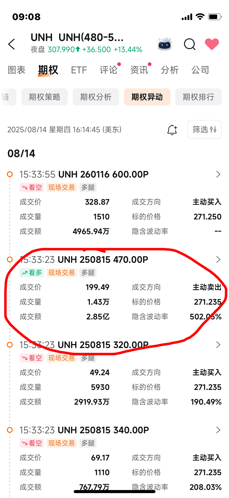
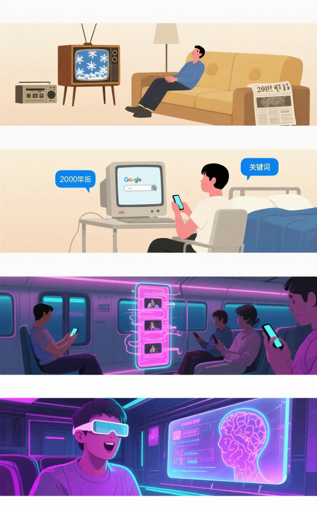

# 2025-08 即刻归档

## 月度总结
- 本月共归档 114 条内容，活跃了 25 天，时间范围从 2025-08-01 到 2025-08-30。
- 发帖最集中的一天是 2025-08-16，当天共记录 16 条。
- 本月最常出现的话题是：小散户的日常 (38), 无用但有趣的冷知识 (15), 优质长文分享会 (11)。
- 带媒体链接的内容有 2 条，短笔记风格的内容有 69 条。
- 最长的一条发布于 2025-08-05，正文约 1509 字。

## 2025-08-01

### [13:40](https://m.okjike.com/originalPosts/688c5360369da0a84b2c61ab)
人类天生就倾向于节省能量，所以“懒”是刻在基因里的

#浴室沉思

---

### [13:42](https://m.okjike.com/originalPosts/688c53d24f390efdee47d5d8)
“久坐是新型吸烟”？不完全对：问题不在于“坐”，而在于“一直坐着不动” 。建议，每隔10到15分钟就站起来活动一下，哪怕只是伸个懒腰，都能激活细胞，帮助降低血糖 。

#健康科普站

---

### [13:43](https://m.okjike.com/originalPosts/688c54154f390efdee47d9fe)
“每天要走一万步”？这个数字最早是日本一个计步器公司在60年代为了卖产品喊出来的口号，并没有什么科学依据 。研究表明，每天走7000到8000步，对健康的益处就已经非常大了 。

#健康科普站

---

### [13:45](https://m.okjike.com/originalPosts/688c54844c983add4f5f56fa)
我们进化的目的不是为了健康、快乐或长寿，而是为了繁衍后代。我们的身体只是一个生存和繁殖的工具。

#浴室沉思

---

### [16:08](https://m.okjike.com/originalPosts/688c75e4aca0a8fd526184e8)
70 Delta的买入期权和30 Delta的卖出期权组合，在60天的到期时间内，表现出了最高的资金效率。

#小散户的日常

---

### [16:30](https://m.okjike.com/originalPosts/688c7b2e63d0ccf315d20c2a)
真正在的王者就是可以通過簡單的形式，高效精準的解決問題

#今日金句

---

### [16:32](https://m.okjike.com/originalPosts/688c7ba463d0ccf315d21504)
释永信打造了一个庞大的“少林商业帝国”，年收入高达数亿甚至十亿。然而，其财务状况极度不透明，为个人侵占寺院资产提供了可能，形成了一个巨大的“黑洞”

#你不知道的行业内幕

---

### [19:44](https://m.okjike.com/originalPosts/688ca8a563d0ccf315d5886e)
我们对时间的感知往往是相对的。对于5岁的孩子来说，1年占了他生命的20%；而对于50岁的人来说，1年只占了生命的2%。所以我们感觉时间在加速。

#浴室沉思

---

## 2025-08-03

### [08:11](https://m.okjike.com/originalPosts/688ea9477ea36f352d13d734)
《2025-06-18-财经奶爸-存款利率这么多低，如何管理现金？》
https://mp.weixin.qq.com/s/FYH4Zriw4i8FTmmbHx_A-Q
1.  利率低的时候，别只盯着银行存款，可以考虑货币基金、债券基金等。
    解读：我们通常觉得钱存在银行最安全，但文章指出在利率越来越低的情况下，货币基金和债券基金可能收益更高，而且风险相对可控。这打破了我们“存款=安全且收益最高”的固有思维，让我们意识到需要根据市场情况灵活调整理财策略。

2.  中期资金（半年到一年）可以考虑债券基金，收益可能比货币基金高。
    解读：很多人觉得债券基金风险高，不敢轻易尝试。但文章推荐了跟踪中债7-10年国开行债券指数的基金，说这类基金波动小，收益相对较高，而且历史数据表现良好。这颠覆了我们对债券基金的刻板印象，让我们意识到债券基金也可以是中期理财的一个不错的选择。

3.  长期资金（一年以上）可以考虑“固收+”产品，牛市不一定跑得过债券基金。
    解读：我们通常认为长期投资就应该买股票或者指数基金，追求高收益。但文章提到“固收+”产品，通过债券打底，少量股票增强收益，长期下来可能跑赢沪深300。这颠覆了我们“长期投资=高风险高收益”的认知，让我们意识到稳健的投资策略在长期也能取得不错的回报。

4.  投资有时候慢就是快，牛市满仓指数基金涨得快，但长期下来可能跑不赢持股比例很低的债券基金。
    解读：我们总是追求短期快速致富，希望抓住牛市机会。但文章告诉我们，长期来看，稳健的投资策略，比如配置债券基金，可能比追涨杀跌的指数基金表现更好。这让我们明白，投资不是短跑冲刺，而是马拉松，稳健才是王道。

#小散户的日常

---

### [08:27](https://m.okjike.com/originalPosts/688eacec63d0ccf315001760)
《2025-07-05-投资聚义厅-千万次的问，美股那些坑》
https://mp.weixin.qq.com/s/wJuIjS0u9tLxTiGNgLvkjQ

1.  A股是写意，美股是写实，想玩转美股得更注重公司基本面。
    解读：我们A股炒概念、讲故事的套路，在美股可能行不通。美股更看重公司实打实的业绩、管理、盈利能力。别想着光靠一个好故事就能把股价吹上天，得拿出真东西才行。这就像从水墨画切换到油画，笔法得更精细，不能光靠脑补。

2.  美股是资本主义丛林，强者恒强，别指望“雨露均沾”。
    解读：A股喜欢轮动，今天涨小盘，明天涨蓝筹，感觉大家都有机会。但美股不一样，它更残酷，好的公司会一直好下去，差的公司直接退市。别想着买个小盘股能补涨，大概率是“老子吹空调，你吹空调外机”。

3.  A股讲“团魂”，美股各走各的路，别指望板块联动。
    解读：A股喜欢一个概念火了，整个板块鸡犬升天。但在美股，就算龙头涨了，其他公司也得自己争气才行。别想着买个“平替”就能跟着喝汤，关键还是看公司有没有真本事。

4.  美股允许“讲坏话”，别怕唱空的声音，要学会辩证看待。
    解读：A股不太喜欢负面消息，总觉得要营造积极氛围。但美股不一样，允许各种看空的声音存在，甚至还有专门靠唱空出名的“末日博士”。这提醒我们，要把风险摆在台面上来讨论，才能更理性地投资，别一听到坏消息就慌了。

5.  人情味浓的市场，长期投资反而难；冷酷的市场，长期投资更容易。
    解读：A股充满人情味，各种消息、概念都能让股票涨一波，但长期来看，激励机制不清晰，容易“劣币驱逐良币”。而美股虽然冷酷，但奖惩分明，好的公司更容易脱颖而出，长期投资反而更省心。这就像中国足球和NBA，一个充满人情世故，一个追求效率至上。

#优质长文分享会

---

### [08:44](https://m.okjike.com/originalPosts/688eb0d77ea36f352d1474ce)
《2025-06-30-远川研究所-小米又赌赢了》
https://mp.weixin.qq.com/s/1hTEPrluIoXPxcg0SsTZeg

小米汽车的车头设计得特别长，这主要是为了好看，营造一种豪华车的感觉。

传统豪华车车头长，是因为它们用的是大排量发动机，发动机体积大，需要占据车头的空间。但是，电动车（比如小米汽车）根本没有发动机，所以车头不需要那么长。

那为什么小米还要把车头设计得这么长呢？就是为了好看！因为在汽车行业里，长车头已经成了豪华车的一种标志。即使没啥实际用处，也能让车看起来更气派、更高级，满足人们的“情绪价值”。

所以，小米汽车的车头长，不是因为技术需要，而是为了迎合人们对豪华车外观的固有印象，说白了就是为了“装”。虽然牺牲了一些空间，但换来了更好的视觉效果，让消费者觉得更有面子。

#无用但有趣的冷知识

---

## 2025-08-04

### [11:36](https://m.okjike.com/originalPosts/68902ada4c983add4fb0695f)
小龙虾的可食部分占比不高，吃1斤带壳小龙虾，实际上进肚子的东西只有135g，如果只吃虾尾肉，那最多只有100g。

---

### [15:13](https://m.okjike.com/originalPosts/68905da6f00fd496619617bd)
统计上死于去机场的路上（车祸）的概率比死于飞机失事的概率高一千倍

#浴室沉思

---

### [15:44](https://m.okjike.com/originalPosts/689064cbd0a8902e4247747c)
幸福感的杀手，往往来自于和他人的比较。我们应该追求的是长期的“满足感”，这种感觉来源于内在的衡量，而不是外在的攀比

#今日金句

---

### [15:50](https://m.okjike.com/originalPosts/6890662a4c983add4fb4fc55)
赚钱的三个层次： 最底层卖的是纯时间，中间层卖的是手艺，最上层玩的是风险。

#浴室沉思

---

### [16:50](https://m.okjike.com/originalPosts/6890745cb41a718c4ad6dbbb)
在一个充满不确定性的时代，连“一眼望得到头”的平庸生活，都成了一种奢侈品。

#浴室沉思

---

### [21:27](https://m.okjike.com/originalPosts/6890b53c7cd8809ac61ba9e5)
胖东来的核心在于它颠覆了传统的商业模式，把顾客的幸福感和员工的归属感放在了利润之上。

#你不知道的行业内幕

---

### [21:27](https://m.okjike.com/originalPosts/6890b550f00fd496619ce293)
上班累，不光是体力活和脑力活，还得付出“情绪劳动”。经济不好的时候，情绪消费的需求反而会上升，这就是“口红经济”。

#浴室沉思

---

## 2025-08-05

### [09:16](https://m.okjike.com/originalPosts/68915b5f306bbda85fcbca0c)
2025-07-07-虎嗅APP-九大消费行业的情绪价值比较
https://mp.weixin.qq.com/s/LUSAx8SY824GJaBuYQBudQ

空姐得永远笑脸迎人，护士得嘘寒问暖，医生得冷静沉着，殡葬从业人员还得表现出悲伤… 这都是“情绪劳动”啊！就算你是个办公室小职员，面对心情不好的老板，你得小心翼翼，面对不配合的同事，你得虚与委蛇。
经济学上说，没有免费的午餐。我跟你说，也没有白干的活！你付出了“情绪劳动”，就得有回报。所以啊，空姐的工资比火车服务员高，星级宾馆的服务员比小旅馆的高。职场上也是，会拍马屁的，就是比老实巴交的升得快，挣得多。这多出来的钱，就是“情绪劳动”的报酬啊！
但是，问题来了，经济好的时候，这“情绪劳动”的报酬还算够，经济不好的时候，你付出的更多，回报却更少。那怎么办呢？为了达到“情绪平衡”，你就得花钱“买”情绪价值！这就是“情绪消费”的来源。经济越不好，大家越想花钱买点开心，这就是所谓的“口红经济”。
说到这儿，我想起我一个朋友，小A，平时工作压力大得要命，每天加班到深夜。有一次，她跟我抱怨说，感觉自己都快崩溃了。我就跟她说，要不你买个盲盒玩玩？她一开始还觉得我脑子瓦特了，说：“这玩意儿有啥用啊？不就是个塑料小人吗？”
结果，你猜怎么着？她后来真买了几个，放在办公桌上。有一天，她加班到很晚，累得眼睛都睁不开了，无意中瞥了一眼桌上的Labubu，突然觉得这小怪物好像在对她咧嘴笑，她一下子就觉得心里轻松了不少。她说，那一刻，她感觉Labubu就像是她的“情绪容器”，帮她装下了所有的委屈和疲惫。
这Labubu啊，就是泡泡玛特旗下的一个IP。说实话，刚开始我也觉得它丑萌丑萌的，不太能get到它的点。但文章里说，这Labubu的形象没有任何内容，就像一个空白的容器，你可以往里面投射自己的情绪。压力大的白领，看到的是倔强的自己；喜欢特立独行的人，看到的是活得自在的怪物；情感受挫的人，看到的是外表坚强内心脆弱的小动物…
这让我想起荣格的“原型理论”，人类对一些具象但留白的形象，天生就有共鸣，因为它们可以承载不同的“心理原型”。就像哈姆雷特，一千个人眼中有一千个哈姆雷特，因为他足够复杂，你可以从不同的角度“读出自己”。但Labubu更厉害，它啥也没有，完全由你来定义。
所以啊，朋友们，如果你也觉得生活压力大，心情不好，不妨也试试买个盲盒玩玩。说不定，你也能找到属于自己的“情绪容器”。
说到这Labubu的爆红，也是个很有意思的故事。它2017年就出道了，但一直是个小透明，因为很多人觉得它“好丑”。但“审丑消费”一直都存在啊，像Crocs洞洞鞋、马面裙，都是“先丑后香”。而且，丑往往代表“个性”、“不媚俗”，是年轻人反抗“老登文化”的符号。
到了2020年，大家对“软萌型”IP审美疲劳了，开始追求更有棱角、更性格化的角色，Labubu就火了。一些小众玩家在小红书、抖音上“晒娃”，到了2021年，Labubu就成了一种审美态度的标签。
但Labubu真正破圈，走的是“出口转内销”的路径。它先在泰国火了，因为泰国年轻人对多元文化的接受度很高，对鬼怪恐怖片、LGBT文化、搞怪短剧、宗教混搭、文化拼贴的接受度非常高。Labubu在国内是“小众丑萌”，但在泰国反而是主流。后来，Labubu在全球多元文化氛围浓的国家和地区爆红，再“出口转内销”，才被国内主流媒体关注。
所以啊，Labubu的出圈，是个特例，但也打开了泡泡玛特IP类型的空间。这告诉我们，人是会成长的，“情绪”并非一成不变，“情绪容器”想要保持商业价值，就得不断在主流与小众中寻找平衡。

#优质长文分享会

---

## 2025-08-06

### [16:00](https://m.okjike.com/originalPosts/68930b854314a09725a00818)
选专业尽量与兴趣有点关系，不然学起来提不起劲，或学起来很费劲。

#一起来学习

---

## 2025-08-08

### [11:59](https://m.okjike.com/originalPosts/6895762c7fc9e07aa4fb0d94)
《2025-07-09-零城投资-红利低波，连涨了6年半，还能涨吗？》
https://mp.weixin.qq.com/s/RLDj5WD9jEtyKP27dAxsVg
别太把“红利低波”这个东西的估值高低太当回事儿。

原因在于，“红利低波”不是那种传统的宽基指数（比如沪深300），它属于“聪明指数”（smart beta）。“聪明指数”会经常调整自己的成分股，比如把一些表现不好的股票踢出去，换成更好的股票。

这就导致“红利低波”的历史估值参考意义不大。因为它的成分股一直在变，今天的“红利低波”和昨天的可能已经很不一样了，所以用过去的估值来判断它现在的价值，就不太靠谱了。

简单来说，就像你不能用一个一直在换零件的汽车的历史价格，来判断它现在的价值一样。因为零件都换了，车已经不是原来的车了。

---

### [11:59](https://m.okjike.com/originalPosts/68957635a934805bf5ce1db6)
真正让你赚钱的，是待在市场中的时间，而不是你能不能精确地择时。

#今日金句

---

### [12:02](https://m.okjike.com/originalPosts/689576cd7fc9e07aa4fb1ada)
牛市有三个阶段。第一阶段：刚经历崩盘、市场情绪低迷，没人感兴趣，只有极少数人开始意识到情况有可能好转；第二阶段：更多人开始接受市场正在复苏的事实；第三阶段：所有人都相信未来一片光明，不可能再跌。

#小散户的日常

---

### [16:19](https://m.okjike.com/originalPosts/6895b31d369da0a84bee8c29)
美股占全球市值的70%，但美国GDP只占全球的25%

#无用但有趣的冷知识

---

## 2025-08-09

### [14:26](https://m.okjike.com/originalPosts/6896ea29369da0a84b08e90a)
苏州自隋朝到清朝末年的科举时代，涌现了51位状元，是中国出状元最多的城市。

#无用但有趣的冷知识

---

### [14:44](https://m.okjike.com/originalPosts/6896ee3d63d0ccf315ab51c3)
餐前用热水烫碗，其实没啥用！想真正杀菌，得用高温煮沸或者消毒柜。

#无用但有趣的冷知识

---

### [14:49](https://m.okjike.com/originalPosts/6896ef8663d0ccf315ab6b86)
当我们的行为和信念发生冲突时，我们的大脑会感到不舒服，为了缓解这种不舒服，我们就会想方设法地改变自己的信念，让自己相信自己做的事情是有意义的。 这就像咱们常说的“死要面子活受罪”，明明心里苦，嘴上却硬撑着说没事儿。

#心理学研究小组

---

### [15:22](https://m.okjike.com/originalPosts/6896f7364c983add4f3d6345)
《2024-10-17-建淞说期权-最高价买废纸认购期权的一定是SB吗？》
https://mp.weixin.qq.com/s?__biz=MzIyNDU2NTgxMA==&mid=2247484264&idx=1&sn=c91b2dfe062a2d0528a10e8535ec676d&chksm=e98a414a39a838724d4a249c43a8c9a2a519ae32e6c1e5839d0bd1e89cefc4a9b2ef8bafc7f9&scene=126&sessionid=1752374128#rd 

话说啊，10月8号那天，股市那叫一个火热，眼瞅着就要冲上天了。很多朋友都觉得，这波肯定能赚一笔，于是就买了认购期权，想着搏一搏单车变摩托。结果呢？股市这玩意儿，说变脸就变脸，没过几天就掉头向下了。那些10月8号买入虚值认购期权的朋友，那真是血本无归，辛辛苦苦攒的钱，一下子就打了水漂。

这时候，肯定有人要说了，这些人就是赌徒，活该！但咱们今天的故事，可不是这么简单。

故事的主人公，咱们就叫他孔乙己先生吧（当然，这只是个代号）。孔乙己先生在9月底的时候，觉得股市可能要跌，就卖出了3600C认购期权。当时300ETF的价格才3块4左右，卖出期权也算是个正常的选择。

可谁知道，国庆长假后，股市一下子就疯涨了！孔乙己先生这下可慌了神，他卖出的期权面临爆仓的风险。这就像啥呢？就像你借了高利贷，眼看着利息越滚越大，要还不起了！

这时候，孔乙己先生有两个选择：要么止损，认栽；要么追加保证金，硬扛。追加保证金，那得有钱啊！孔乙己先生手头紧，一下子拿不出那么多钱。而且，当时3600C的价格已经涨到1块多，止损的话，那损失可就大了，相当于把钱扔水里了。

就在这千钧一发之际，孔乙己先生做了一个看似“最傻”的决定：他买了更虚值的4600C认购期权。这就像啥呢？就像你欠了一屁股债，没钱还，又去借了另一笔高利贷！

当时，4600C的价格已经很高了，0.45元一张，而且几乎是张废纸，眼看着就要归零了。但孔乙己先生买它，可不是为了赚钱，而是为了获得组合保证金，延缓爆仓。

结果呢？奇迹发生了！没过几天，股市开始回调，300ETF的价格跌回了3.9元。4600C归零了，但3600C的价格也从1块多跌回了0.3元。

你算算，孔乙己先生虽然花了0.45元买了废纸，但却让3600C的亏损减少了0.69元！这就像啥呢？就像你用一根稻草，挡住了洪水！

最终，孔乙己先生的亏损控制在了0.71元，比10月8号直接止损要好得多。

怎么样，这个故事是不是很精彩？

这个故事告诉我们什么呢？

首先，期权这玩意儿，风险很高，一不小心就血本无归。所以，咱们在投资的时候，一定要谨慎，不要盲目跟风，更不要把全部身家都押上去。

其次，在面临困境的时候，不要轻易放弃。有时候，看似最傻的决定，反而能救你一命。就像孔乙己先生买废纸一样，虽然看起来很荒唐，但却成功地降低了亏损。

最后，投资是一场长跑，不要只看眼前的得失。有时候，短期的亏损，是为了长期的盈利。就像孔乙己先生，虽然暂时亏了一些钱，但却避免了更大的损失。

当然，孔乙己先生的故事只是个个例，不能完全照搬。但它给我们提供了一个新的思路：在期权交易中，要灵活应对，不要死脑筋。有时候，买入废纸，也是一种自救的方式。

#优质长文分享会

---

### [15:40](https://m.okjike.com/originalPosts/6896fb6563d0ccf315ac5f5f)
当所有人都看好一个东西的时候，往往就是风险最高的时候。

#小散户的日常

---

## 2025-08-10

### [10:58](https://m.okjike.com/originalPosts/68980aec369da0a84b2111b7)
《2025-06-20-丁香医生-早上先刷牙 VS 先吃早饭，哪个对牙齿更好？》
https://mp.weixin.qq.com/s/RaEWOWUdHBMKrsikCdnl7A
1.  先刷牙还是先吃早饭，其实都可以，重要的是每天早晚都刷牙。
    解读：我们总是纠结于先刷牙还是先吃饭哪个更好，好像选错了就会对牙齿不好。但这篇文章直接点明，真正重要的是保证每天刷牙两次，至于顺序，并没有那么重要。这让我们从选择困难中解脱出来，不再为小事纠结，把精力放在更重要的刷牙习惯上。

2.  刷牙不仅仅是为了刷掉食物残渣，更重要的是清除牙菌斑。
    解读：我们通常认为刷牙就是为了把菜叶子、肉丝等食物残渣刷掉。但这篇文章强调，看不见的牙菌斑才是口腔健康的大敌。这让我们意识到，刷牙的重点在于清除牙菌斑，而不是仅仅追求把看得见的脏东西刷掉，从而更加重视刷牙的质量和方法。

3.  就算早上没刷牙就吃饭，也不用太担心，胃能处理掉那些细菌。
    解读：很多人觉得早上起床没刷牙就吃饭很恶心，好像会吃进去很多脏东西。但这篇文章告诉我们，其实没那么可怕，胃酸可以杀死大部分细菌。这让我们不用过度焦虑，即使偶尔没刷牙就吃了早饭，也不必过于担心，减轻了心理负担。

4.  刷牙的重点在于刷牙的方法和时间，而不是早饭前还是早饭后。
    解读：我们总是纠结于刷牙的顺序，却忽略了刷牙的质量。这篇文章强调，比起顺序，更重要的是刷牙的次数、时间和方法，比如每天刷两次，每次刷够两分钟，使用正确的刷牙方法等。这让我们把注意力从无关紧要的顺序转移到真正重要的刷牙技巧上。

5.  刷牙后不漱口，反而更好。
    解读：我们从小就被教育刷完牙要漱口，把牙膏沫都漱干净。但这篇文章却说，刷牙后不漱口，或者少漱口，可以减少氟的流失，更有利于保护牙齿。这个观点完全颠覆了我们从小养成的习惯，让人感到非常意外，但仔细想想，确实有道理。

#医护人员的日常

---

### [11:01](https://m.okjike.com/originalPosts/68980b899a7a8f56b4ad17a5)
《2025-06-20-丁香医生-每天吃鸡蛋的人，后来都怎么样了？》
https://mp.weixin.qq.com/s/IA4UIZFm0CbAIZG9Yxih8g
简单来说，土鸡蛋、红皮鸡蛋和生鸡蛋，在营养上和普通鸡蛋相比，没有特别明显的优势。

*   土鸡蛋 vs 普通鸡蛋： 土鸡蛋的蛋白质、碳水化合物、钙含量可能会稍微高一点点，而普通鸡蛋的脂肪、维生素A、硒含量可能会稍微高一点点。但这些差别都很小，可以忽略不计。土鸡蛋主要胜在风味可能更好，但价格也更贵。
*   红皮鸡蛋 vs 其他颜色鸡蛋： 蛋壳颜色主要取决于鸡的品种和饲料，和鸡蛋的营养价值关系不大。
*   生鸡蛋 vs 熟鸡蛋： 生鸡蛋容易被细菌污染，有食物中毒的风险，特别是老人、小孩和孕妇要小心。如果喜欢吃溏心蛋，最好买专门可以生吃的鸡蛋。

所以，不用太纠结于鸡蛋的种类，选择自己喜欢和放心的就好。

---

### [11:39](https://m.okjike.com/originalPosts/689814595eb46c38d3948efc)
* 蚊子包为什么痒？：蚊子在叮咬我们时，会向皮肤注射含麻醉、抗凝血成分的唾液，这种唾液会激发身体的免疫反应，释放“组胺”及炎性介质，引发瘙痒。
* 冰敷止痒原理：冰敷能减少组胺和炎症介质的扩散，降温还能让我们对痒的感觉变迟钝，达到瞬间止痒的效果。

#无用但有趣的冷知识

---

### [12:00](https://m.okjike.com/originalPosts/6898194e63d0ccf315c46729)
期权买方不要想着“抄底”，而要选择“右侧入场”，等待趋势确立后再买入。因为期权有时间价值损耗，抄底容易被时间耗死。

#小散户的日常

---

### [12:00](https://m.okjike.com/originalPosts/6898196b4c983add4f55bb10)
期权盈利的三维坐标轴：
* Delta，方向维：标的价格变化的幅度和速度是关键。
* Theta，时间维：交易中买期权花费的时间成本至关重要。
* Vega，波动率维：交易时的隐含波动率是高是低？未来波动率会如何变化？

#小散户的日常

---

### [12:01](https://m.okjike.com/originalPosts/68981986369da0a84b224aab)
深度实值期权更贴近方向属性，轻度虚值期权对时间和波动率变化极其敏感。

#小散户的日常

---

### [12:04](https://m.okjike.com/originalPosts/68981a445eb46c38d3950d96)
如果建构X1 Call（虚值一档）买进部位后，目标物价格往上涨到X2，产生不错的获利，X1 Call已跨越Delta＝50的临界值，加速度与杠杆效果递减，如果预期波段涨势还没结束，合理的操作是了结X1 Call，换成X3 Call（虚值一档），重新享受较高的Gamma与杠杆效果。

#小散户的日常

---

### [12:08](https://m.okjike.com/originalPosts/68981b30364d40b9d5f3d499)
关了灯玩手机，屏幕光线直射视网膜，特别是黄斑区，时间长了，黄斑区受损，看东西都模糊变形。

---

### [12:09](https://m.okjike.com/originalPosts/68981b91364d40b9d5f3dcc7)
华中科技大学同济医院研究发现，每天睡眠小于7小时的人，患癌风险增加69%！

---

### [12:14](https://m.okjike.com/originalPosts/68981c8a63d0ccf315c4acb2)
挪威青花鱼（大西洋鲭）营养丰富，富含Omega-3脂肪酸，含量甚至比三文鱼还高！而且价格只有三文鱼的一半不到，是名副其实的「性价比之王」！

---

### [14:36](https://m.okjike.com/originalPosts/68983dee63d0ccf315c76510)
头发自然干需要两个小时，长时间湿润状态下，水分会渗入到头发内部，使其吸水膨胀，导致损伤。
正确方法： 吹风机距离头发15厘米以上移动着吹，不要长时间定在一处，把温度控制在40℃～50℃。

#生活小姿势

---

### [15:08](https://m.okjike.com/originalPosts/68984570369da0a84b25ebc6)
在没有期权的市场里面，我们做交易其实是判断价格的变化涨跌，就是你买入如果它涨了你才能赚钱，跌了你要止损。但如果有期权的交易，我们判断的不是涨跌，判断的是市场的结构，它是一个震荡的结构，还是一个突破的结构，只要你把市场的结构判断正确了，你就可以赚钱。

---

### [15:16](https://m.okjike.com/originalPosts/68984762364d40b9d5f77a0e)
《2025-07-13-丁香医生-这种癌多半是拖出来的！一个方法就可以避免》
https://mp.weixin.qq.com/s/S5F9ABXc7WHNm1x1vEQLwg
1.  肠癌不是突然发生的，而是息肉慢慢变坏的，这个过程长达10年以上。
    解读：我们通常觉得癌症很可怕，好像是突然降临的噩梦。但这个观点告诉我，肠癌其实给了我们很长的预警时间，只要及时做肠镜检查，就能在息肉还没变成癌的时候把它扼杀在摇篮里，这大大减轻了我对肠癌的恐惧感，也让我意识到定期体检的重要性。

2.  肠镜检查是肠癌筛查的金标准。
    解读：虽然知道肠镜可以检查肠道，但一直觉得很麻烦，甚至有点害怕。文章直接点明肠镜是“金标准”，让我意识到它的重要性和不可替代性。如果真的担心肠癌，那肠镜就是最靠谱的办法，其他的检查方法只能作为替代方案。

3.  受伤的肠子多半是吃出来的。
    解读：我们都知道饮食对身体健康很重要，但很少会直接把肠道问题和“吃”联系起来。这个观点让我意识到，很多肠道疾病，比如胃肠炎、寄生虫感染，甚至肠道损伤，都和不卫生的饮食习惯、药物副作用、或者吃饭不小心咽下异物有关，这提醒我以后要更加注意饮食卫生和健康。

4.  不良生活习惯是肠道被重创的罪魁祸首。
    解读：我们都知道久坐不动、吸烟喝酒不好，但很少会把这些习惯和肠道健康直接联系起来。这个观点让我意识到，这些不良生活习惯不仅会增加肠道疾病的风险，甚至可能导致结直肠癌，这让我更加重视健康的生活方式，提醒自己要多运动、戒烟限酒、多吃膳食纤维。

#医护人员的日常

---

### [16:02](https://m.okjike.com/originalPosts/6898520563d0ccf315c91bdb)
《6-24-昨晚内容的继续》
https://mp.weixin.qq.com/s/lQ_9r5c4gzN1nE83AmwUpg

新能源这种成长型的股票，在A股市场有个特点：

*   滞后性： 公司的基本面（比如盈利能力、技术水平）变好，要过一段时间才能反映到股价上，让股价也跟着涨。
*   指数基金的局限： 指数基金是按照既定的规则选股的，它要等到新能源公司的基本面指标“达标”了，才会把这只股票纳入指数。
*   超额收益的消失： 问题就出在这里，等到指数基金“姗姗来迟”地买入的时候，这只股票可能早就涨过一波了，该赚的钱已经被别人赚走了，超额收益已经没有了。

所以，结论是：

*   主动基金更灵活： 对于新能源这种“新概念、新主题”的投资，主动管理的基金经理可以更早地发现机会，提前布局，从而获得更高的收益。
*   指数基金适合更成熟的投资： 指数基金更适合投资那些已经比较成熟、稳定的行业，而不是追逐快速变化的新兴行业。

总而言之，就是说新能源这种行业，变化太快，等指数基金反应过来，可能机会已经过去了，不如让主动基金经理去“冲锋陷阵”，更能抓住机会。

#小散户的日常

---

## 2025-08-12

### [16:23](https://m.okjike.com/originalPosts/689af9feba4e69f5b2ce1fdc)
7月，淘宝闪购花在商家端、消费者端、骑手端的补贴共计超过100亿元，而美团同期花的钱大约是阿里的1/3 - 1/2。

#美团情报站

---

### [16:24](https://m.okjike.com/originalPosts/689afa2a4c983add4f91e896)
大多数城市按最低工资招聘的岗位，需要以翻倍甚至3倍的基数缴纳社保。而今年上半年，北京规模以上住宿和餐饮业利润率是0.33%，上海是1.5%。

#你不知道的行业内幕

---

### [16:58](https://m.okjike.com/originalPosts/689b023949601b2fc86263f5)
《2025-07-19-陈嘉禾的研究-展望高端白酒行业》
https://mp.weixin.qq.com/s/JMRSyGrYmRwu-iDgVPTnjg

高端白酒曾经是A股市场上的香饽饽，那中证白酒指数，包含了茅台、五粮液这些响当当的牌子，从2014年到2021年，那叫一个暴涨，涨了12倍多！简直是坐火箭一样。你想想，如果你那时候买了白酒股，那可真是躺着都能赚钱啊！

可是，好景不长，从2021年开始，这白酒股就像喝醉了酒一样，开始跌跌撞撞，一连跌了五年。到2025年，这指数比最高点跌了一半还多。哎，真是应了那句老话，繁华过后是消沉啊！

作者陈嘉禾说了，聪明的投资者啊，不能光看价格涨跌，得看背后的基本面。价格低了，说不定离底部就近了，风险反而小了；价格高了，那就要小心了，可能离顶部不远了。

那白酒为啥这么赚钱呢？有人说是“成瘾性”，喝了就上瘾，离不开了。作者可不这么认为。你想啊，不管是高端还是低端白酒，喝了都一样醉，为啥高端的就能卖那么贵呢？

作者一语道破天机，这高端白酒啊，卖的不是酒，是“面子”，是“尊重”！你想想，过年过节，或者重要的商务宴请，谁家桌上不得摆几瓶好酒啊？这酒一摆，就代表着对客人的重视，告诉他们：“你看，我为了你这顿饭，可是下了血本的！”

作者还举了两个例子，特别有意思。一个是按摩，一个是去银行取钱。

你说，按摩师按得好不好，完全看他心情，心情好就给你多按几下，心情不好就随便应付一下。但是，你会为了让他好好按，就拼命巴结他吗？不会吧？因为一次按摩的价值太低了，犯不着。

再说说去银行取钱，就算你取一百万，那可是大事啊！但是，银行职员会因为你取钱多，就对你特别客气吗？也不会吧？因为取钱有流程，按规矩办事就行了，用不着你额外表示尊重。

所以，这“尊重”啊，得满足两个条件：一是社交的商业价值要高，二是对方有自由裁量权。

但是，作者也说了，这社会在变，以后在社交场合，可能不需要那么多的“尊重”了。为啥呢？因为社会越来越规范，合同越来越重要，反腐力度也越来越大，很多事情都得按规矩办，不是靠喝酒就能搞定的了。

你想想，以后大家做生意，都靠合同说话，谁还会在饭桌上拼酒啊？那高端白酒的需求，肯定会慢慢减少。

不过，作者也说了，高端白酒企业也不是吃素的，他们有足够的适应能力。首先，他们家底厚，基本没啥负债，抗风险能力强；其次，他们的品牌硬，几十年屹立不倒，不容易被别人取代；最后，他们还可以通过提高经营效率来应对挑战。

那啥时候买白酒股呢？作者说，这可不好说，得看别的股票估值怎么样，还得看白酒企业的盈利能力会不会下降。总之，得综合考虑，才能做出明智的决定。

#优质长文分享会

---

### [17:21](https://m.okjike.com/originalPosts/689b078b2755f0a0bc80a648)
《2025-07-23-浩哥三点下班-如何建立/运营一个高质量的股票群？》
https://mp.weixin.qq.com/s/itFVCfmLAo6oaFxKGeS_Nw
1.  个股/行业群，下跌时容易人心涣散，且容易形成“茧房效应”，难以转换思维。
    解读：我们通常认为抱团取暖能增强信心，但这个观点指出，在下跌趋势中，这种抱团反而会加剧恐慌，并且因为群体内的信息同质化，导致大家难以跳出固有思维，错失止损或转换策略的机会。这颠覆了“人多力量大”的传统认知。

2.  泛化投资探讨群，人一多就容易乱，高手不愿意说话，低质量言论占据主流，扼杀高质量探讨的欲望。
    解读：我们总觉得群里人越多，信息量越大，越能学到东西。但这个观点揭示了，人数过多会导致信息噪音增加，真正有价值的观点反而会被淹没，甚至因为顾虑而无法表达。这打破了“多多益善”的迷思，强调了社群质量的重要性。

3.  超过100人的群，如果大部分人不说话，会给其他人造成一种被窥探的恐惧。
    解读：我们可能没意识到，在一个庞大的沉默群体中发言，会让人感到不自在，仿佛自己的一举一动都被监视。这个观点指出了社交媒体时代，个人隐私和表达自由之间的微妙关系，提醒我们要注意维护社群内的安全感。

4.  建立一个组织很容易，但是持续激活并且建立凝聚力是不容易的。
    解读：我们常常只关注如何快速搭建一个社群，却忽略了后期的维护和运营。这个观点强调了社群的生命力在于持续的互动和共同的价值认同，而不是简单的堆砌人数。这提醒我们，社群运营需要投入时间和精力，才能真正发挥价值。

5.  设定踢人的制度，任何一个组织，如果只进不出，必定僵化。
    解读：我们通常觉得社群应该尽可能包容，但这个观点指出，缺乏淘汰机制会导致社群成员质量下降，最终失去活力。这颠覆了“有容乃大”的传统观念，强调了社群的动态平衡和优胜劣汰的重要性。

6.  风格可以迥异，但是水平必须类似。
    解读：我们可能认为社群应该多元化，允许不同观点碰撞。但这个观点强调，成员之间认知水平的差距过大，会导致沟通效率低下，甚至产生误解和冲突。这提醒我们，社群成员的质量比数量更重要，水平相近才能更好地交流和学习。

#优质长文分享会

---

### [22:49](https://m.okjike.com/originalPosts/689b547649601b2fc868fb69)
英伟达从上市到1万亿美元市值花了24年，但再到4万亿美元，只花了2年多，和 ChatGPT 诞生的时间同步。

#你不知道的行业内幕

---

## 2025-08-13

### [09:42](https://m.okjike.com/originalPosts/689bed964c983add4fa5cb6e)
如今的牛市逻辑是资产荒下资金无处可投，唯有股市相对有点机会。但这轮牛市不是因为基本面好，而是因为基本面不够好。个人只看好基本面稳定的高股息公司的牛市。

#小散户的日常

---

### [16:34](https://m.okjike.com/originalPosts/689c4e06de2e22c9c953d8d9)
给孩子规划未来，不是要“考上大学”，而是要让孩子找到可以糊口而且自己喜欢的方向，或者是培养他们的兴趣到一个可以糊口的程度。

#一个想法不一定对

---

## 2025-08-14

### [06:01](https://m.okjike.com/originalPosts/689d0b4463d0ccf3152ad121)
机会都是跌出来的，风险都是涨出来的

#小散户的日常

---

### [07:08](https://m.okjike.com/originalPosts/689d1ade4c983add4fbe2632)
当前市场疑虑犹存，这恰恰是牛市第一阶段的典型特征：行情总在绝望中诞生，在犹豫中成长。

#小散户的日常

---

### [08:07](https://m.okjike.com/originalPosts/689d28b6acee2860be3c5510)
对于投资，你天天想着赚15%的收益，这没用啊！ 你又不是挖沟的，加班就能多挣钱；也不是计件工人，干得多就挣得多。 投资这事儿，不是你努力就能有回报的，得靠严谨的方法，慢慢积累。

#小散户的日常

---

### [20:20](https://m.okjike.com/originalPosts/689dd47cf00fd49661adbe1f)
你要想知道啥时候该卖，就问自己一个问题：“如果明天股市就掉头向下，现在没卖，跌回去了，你能接受吗？” 如果你能接受，那就说明现在还不用卖。但如果哪天你开始心疼了，觉得“哎呀，这利润眼看着就要没了，不能接受跌回去！”，那就说明该减仓啦！

#小散户的日常

---

## 2025-08-15

### [10:19](https://m.okjike.com/originalPosts/689e9926e3c948a5ca2d1478)
看到一个这周到期两个多亿的超级大单
如果我是巴菲特，在投资公布前sell put或者buy call，岂不是能狠狠的收割一波跟风的韭菜？
PS: 那个超级大单绝对有人提前知道了内幕，和其他的成交量差距太大了…

#财经圈大小事

---

### [19:05](https://m.okjike.com/originalPosts/689f14732393a294a6d99589)
《2025-07-15-少数派投资-现在的伯克希尔更像“标普500增强”！传奇投资者帕伯莱最新访谈，关于阿贝尔、苹果以及两个精彩的投资案例》
https://mp.weixin.qq.com/s/onR9TdxyH4PTDRjWFFYqdA

传奇投资者帕伯莱觉得现在的伯克希尔哈撒韦公司，就像一个升级版的标普500指数基金，而且比直接买指数基金更好。

*   像标普500： 伯克希尔的业务非常多元化，涉及各行各业，就像标普500指数一样，覆盖了美国经济的各个方面。
*   增强版： 帕伯莱认为伯克希尔比标普500更好，因为它有一些独特的优势：
    *   大量现金： 伯克希尔手头握有很多现金，这意味着它可以在市场下跌时抓住机会，买入被低估的优质公司。
    *   估值合理： 伯克希尔的估值并不高，这意味着它未来的上涨空间更大。
    *   年轻领导者： 新的领导人Greg Abel相对年轻，有能力带领伯克希尔继续发展壮大。
*   比被动投资更好： 帕伯莱认为，现在市场上有太多资金盲目地涌入指数基金，导致一些公司（比如“七巨头”）的估值过高。而伯克希尔的投资策略更加灵活，可以避免这种泡沫风险。

所以，帕伯莱的意思是，如果你想投资美国股市，又不想承担过高的风险，那么买伯克希尔的股票可能比直接买指数基金更好，因为它更稳健，更有潜力。

#一起做投资人

---

## 2025-08-16

### [09:28](https://m.okjike.com/originalPosts/689fdec3e5597c28d34859a1)
如果你的认知、性格和能力没有本质改变，即使重来无数次，你很可能还是会做出同样的选择。

#小散户的日常

---

### [09:36](https://m.okjike.com/originalPosts/689fe0a0e5597c28d348825f)
当环境温度高于皮肤温度时，人体会从环境吸收热量，导致体表温度升高。

#无用但有趣的冷知识

---

### [10:02](https://m.okjike.com/originalPosts/689fe6a9e5597c28d349093a)
《2025-07-17-知乎日报-为什么人不能精准地控制自己的每一个器官？》
https://mp.weixin.qq.com/s/9GE6HAjr-E8UApGKWZ1UWA

咱们平时想抬抬手，动动脚，那都是一念之间，指挥得那叫一个精准。可你有没有想过，为啥咱们就没法像指挥手脚一样，指挥自己的心脏砰砰跳，指挥肠胃咕噜噜叫呢？难道这些内脏器官，它们有自己的想法，不听咱们的使唤？

文章里就说了，这事儿啊，还真不是你想的那么简单。咱们的意识，就好像一个权限很低的“小领导”，而咱们的大脑，才是真正的“大老板”。这个“小领导”只能管管咱们的眼耳口鼻，让你看看帅哥美女，想想晚上吃啥，刷刷手机啥的。但是，想让心脏慢点跳，让肠胃别蠕动，那可就超出了它的权限范围了。

这就像啥呢？就像你家小区门口的保安，他能管管进出车辆，登记一下访客信息，但你让他去指挥整个小区的物业管理，那他肯定抓瞎啊！

更逗的是，文章里还说了，其实在你还在娘胎里的时候，压根儿就没啥意识。那时候的你，就是个“无意识发育机器”，身体按照DNA的指令，一步一个脚印地成长。你的神经系统，早就开始控制你的全身了，包括那颗才刚刚形成的小心脏。

这就像啥呢？就像盖房子，还没等你这个“业主”出现，设计师和施工队就已经开始忙活了，打地基、砌墙，一切都井井有条。等你这个“业主”来了，房子都快盖好了！

文章里还提到了一个特别有意思的“突触修剪”过程。啥叫突触修剪呢？就是说，在你两岁的时候，你的大脑里神经元连接那是相当丰富，想法也是天马行空。但是，随着你慢慢长大，大脑会像园丁一样，把一些没用的神经元连接给剪掉，让你变得更加“老实”，更加有逻辑。

这就像啥呢？就像雕刻家雕刻一件艺术品，一开始可能只是粗略地勾勒出轮廓，但随着雕刻的深入，他会不断地修剪、打磨，最终呈现出完美的作品。这个“突触修剪”的过程，就像大脑在雕刻你，塑造你的意识。

所以啊，听完这些，咱们是不是该反思一下了？咱们总觉得自己是身体的主人，可以随心所欲地控制它。但实际上，咱们的意识，只不过是大脑在接收和整合外部信息时，产生的一种特殊的“映射”而已。咱们身体里的每一个细胞，都可以算是独立的生命个体，它们通过复杂的分工合作，才搭建出了咱们这个人。

这就像啥呢？就像一个公司，每个人都有自己的岗位和职责，大家互相配合，才能让公司正常运转。而咱们的意识，只不过是公司里一个普通的员工，虽然很重要，但并不是唯一的“老板”。

所以啊，咱们要对自己的身体多一份敬畏，多一份理解。别老是熬夜刷剧，暴饮暴食，好好爱护它，毕竟，它才是真正的主人，而咱们的意识，只不过是寄居在它身上的一个“过客”而已。

#优质长文分享会

---

### [10:26](https://m.okjike.com/originalPosts/689fec462393a294a6ebd776)
西游记团队中需要裁掉一个人，你会裁掉谁？答：象征式裁员，裁掉白龙马。降本式裁员，裁掉猪八戒。增效式裁员，裁掉沙和尚。自杀式裁员，裁掉孙悟空。转型式裁员，裁掉唐僧，孙悟空带队，回花果山当妖精。

#今天有什么好笑的

---

### [10:31](https://m.okjike.com/originalPosts/689fed95e5597c28d3499e3a)
热吹风止痒真正的原因是，高温刺激了皮肤里的TRPV1，这个“警报器”一开始会觉得灼热，但持续刺激会让它“脱敏”，就像麻木了一样，痒的信号就传不上去，所以就不痒了。这颠覆了我们对止痒原理的认知，原来是靠“麻痹”神经来实现的。

#无用但有趣的冷知识

---

### [10:51](https://m.okjike.com/originalPosts/689ff2454a4574119a7b9848)
股市的规律很简单，对于新手来说是钱换经验，也就是不管你有什么想法，最终这些想法往往都会付出代价，然后随着时间的流逝，等你经验积累够了，变成老手后，这些经验就会让你辨别什么是机会，什么是风险，这个时候，就变成了经验换钱！

#小散户的日常

---

### [11:13](https://m.okjike.com/originalPosts/689ff77209198084b3850c32)
《2025-07-20-雪球-微盘股的神话可以一直持续么？》
https://mp.weixin.qq.com/s/o6zfob3dzMffGERwf1zslA
1.  微盘股的上涨，和公司基本面关系不大。
    解读：我们通常认为股价上涨是因为公司经营得好，业绩增长。但文章指出，微盘股的上涨更多是靠“高抛低吸”这种交易策略，赚的是市场波动的钱，而不是公司成长的钱。这打破了我们对“投资就是投公司”的固有认知，原来还有这种纯粹靠交易策略赚钱的方式。

2.  微盘股指数的超额收益，主要来自高抛低吸的“Alpha”，而不是小盘股的“Beta”。
    解读：很多人以为微盘股赚钱是因为小盘股整体行情好，是“顺势而为”。但文章分析表明，即使小盘股行情一般，微盘股也能通过自身的交易规则获得超额收益。这说明微盘股的赚钱能力，很大程度上来自于它自身的“高抛低吸”策略，而不是单纯依靠市场行情，这让我们对微盘股的认识更深入了一层。

3.  享受微盘股高收益的代价，就是必须承受尾部风险，而且这种风险无法规避。
    解读：我们总想找到一种既能赚钱，又能避免风险的“完美策略”。但文章明确指出，微盘股的高收益和高风险是并存的，想要赚它的钱，就必须接受它可能带来的大幅下跌。这打破了我们对“完美投资”的幻想，让我们认识到任何投资策略都有其局限性，风险和收益永远是相伴相生的。

4.  规避了微盘股的下跌，也就等于规避了微盘股的收益。
    解读：我们总是试图通过择时等手段来躲避微盘股的下跌，从而只享受上涨的收益。但文章一针见血地指出，这种做法是行不通的，因为微盘股的下跌和上涨是其策略的一部分，试图规避下跌，实际上也放弃了上涨的机会。这让我们明白，想要获得微盘股的收益，就必须接受其波动性，不能只想着“好处”，而拒绝“坏处”。

#小散户的日常

---

### [14:08](https://m.okjike.com/originalPosts/68a02072e5597c28d34dd11b)
《2025-07-23-雪球-白酒下行周期中的投资机会》
https://mp.weixin.qq.com/s/x-SrXjeON0dvK3W7wWDbiQ

1.  高档白酒喝的不是饮料，是面子。
    解读：我们通常认为白酒是一种饮品，但这篇文章点明了高档白酒的本质是礼品，是社交货币。它满足的是人们的社交需求和对身份认同的追求，品牌溢价远高于实际的饮用价值。这解释了为什么茅台再贵也有人买，因为买的不是酒，是“我是有身份的人”的信号。

2.  名酒的价格，本质上是和老百姓的收入水平挂钩的。
    解读：我们可能觉得名酒价格高低是商家炒作或者成本决定的，但这篇文章指出，名酒作为礼品，其价格必须与人们的收入水平相匹配，才能体现送礼的心意。茅台的价格围绕“城镇居民人均可支配收入的1/2”波动，这个锚定关系让人意识到，白酒价格的背后是宏观经济和消费能力的支撑。

3.  白酒行业下行期，要选金字塔尖上的茅台，而不是其他品牌。
    解读：在行业好的时候，大家都能分一杯羹。但文章指出，在下行周期，茅台因为其绝对的品牌优势和垄断地位，受到的冲击最小，而其他品牌会面临茅台降价带来的挤压。这颠覆了“鸡蛋不要放在一个篮子里”的传统观念，强调了在行业寒冬时，选择最确定的龙头企业才是更稳妥的策略。

4.  短期经济不好只是白酒下行的催化剂，渠道库存才是根本原因。
    解读：我们容易把白酒的涨跌归因于经济大环境，但这篇文章强调，白酒的库存周期才是更重要的因素。大量的渠道库存积压，导致价格下跌，而经济只是加速了这个过程。这提醒我们，要关注白酒行业的内部供需关系，而不是只看外部的宏观经济。

5.  白酒企业销量好坏，不代表真实消费情况。
    解读：我们通常认为销量上升代表消费需求旺盛，销量下降代表消费低迷。但文章指出，白酒的销售链条长，存在大量的渠道库存和投机需求，所以酒厂的销量并不能完全反映市场的真实消费量。这让我们意识到，不能只看报表数据，要深入了解白酒市场的实际情况。

6.  茅台的需求，很大一部分是投机需求。
    解读：我们可能认为茅台的需求主要来自消费者的饮用和送礼，但文章指出，2018年至2021年的茅台牛市，很大程度上是投机需求推动的。人们囤积茅台，希望价格上涨后卖出获利，这使得茅台的价格远远超过了其本身的价值。这解释了为什么茅台的价格波动如此剧烈，也提醒我们投资茅台要警惕投机风险。

7.  贵州茅台无法阻止飞天茅台批价越过合理的中心点下滑到另一个极端。
    解读：我们可能认为茅台作为行业龙头，有能力控制价格，稳定市场。但文章指出，茅台在价格下跌过程中，面临着多方力量的博弈，无法完全阻止价格下滑。这打破了我们对茅台“无所不能”的印象，让我们意识到即使是强大的企业，也无法对抗市场规律。

#优质长文分享会

---

### [14:36](https://m.okjike.com/originalPosts/68a027092393a294a6f0b4a6)
《2025-07-16-雪球-主动基金又行了？到底什么样的行情才值得配主动基金！》
https://mp.weixin.qq.com/s/34bQ5EIpl13x_j3p0b2HTQ
1.  大多数企业的超额利润，往往只维持一个阶段。
    解读：我们常常觉得好公司就应该一直好下去，但这个观点提醒我们，行业和公司都有周期性，没有永远的常胜将军。抓住企业爆发式增长的阶段性机会，比长期持有更重要，这颠覆了“长期持有优质公司”的传统认知。

2.  A股散户占比高，量化策略更容易跑出超额。
    解读：我们总觉得量化是高深的算法，但这个观点点明了A股的特殊性：散户多，情绪化，容易犯错。量化策略正是利用这些非理性行为来赚钱，这让我们意识到，A股的“不成熟”反而给量化带来了机会。

3.  投资新兴领域，主动基金经理有认知差红利。
    解读：我们通常认为新兴领域风险高，但这个观点指出，由于信息不对称，市场对新兴领域的认知存在滞后，优秀的基金经理可以提前布局，赚取超额收益。这让我们意识到，风险的另一面是机遇，关键在于认知领先。

4.  结构化行情下，主动基金经理更有优势。
    解读：我们常常抱怨A股行情不好，但这个观点指出，在行业轮动频繁的结构性行情中，具备行业轮动和选股能力的主动基金经理反而能脱颖而出。这让我们意识到，市场不好不代表没机会，关键在于找到适应市场变化的投资方式。

5.  指数基金和主动基金，也存在周期轮动。
    解读：我们常常纠结于选指数还是选主动，但这个观点告诉我们，它们各有优势，在不同的市场阶段表现不同。牛市初期指数基金更好，行情深化后主动基金更容易超越指数。分散投资，才能抓住不同阶段的机会。

6.  红利风格的主动基金想要跑赢指数，其实也是比较困难的。
    解读：我们可能会觉得主动基金比指数基金更灵活，应该在任何风格上都能跑赢。但这个观点直接点明，在红利这种机构投资者参与度高、风格成熟的领域，指数基金的优势更明显，主动基金很难超越。这让我们意识到，选择投资工具要考虑风格特点，而不是盲目追求主动管理。

#优质长文分享会

---

### [15:55](https://m.okjike.com/originalPosts/68a039691e5664293d274ead)
1965年，尤金·法玛提出了市场有效理论，认为信息透明的市场股价会秒速到位，没法预测。但现实世界有信息差和情绪，股价反应迟钝，这就给了量化可乘之机。

#小散户的日常

---

### [16:46](https://m.okjike.com/originalPosts/68a0457314af706d82b5f0a9)
接受信息的不同阶段
1️⃣ 有什么看什么(电视广播报纸)
2️⃣ 想看什么搜什么(网上冲浪)
3️⃣ 算法推荐什么看什么(滑短视频)
4️⃣ AI创作什么看什么(AIGC)

感觉自己已经进入了第四阶段，大部分信息先通过AI进行总结摘要，然后再与AI问答来吸收

#浴室沉思

---

### [17:05](https://m.okjike.com/originalPosts/68a049f42393a294a6f38dc5)
《2025-08-04-雪球-牛市三阶段：哪一段最容易“埋人”？》
https://mp.weixin.qq.com/s/3eQG2xtLvnL4jByZLpsfVg

这股市就像个大舞台，牛市就是戏台上最热闹的时候，锣鼓喧天，人声鼎沸。但你可别光顾着看热闹，这戏台子，也藏着不少坑呢！

文章里说了，这牛市啊，分三个阶段，就像人生一样，有少年得志，也有中年危机，最后嘛，可能就是老年痴呆了（开玩笑，别当真）。

第一个阶段，那是“黎明前的黑暗”。 想象一下，刚经历过一场大败仗，遍地狼藉，人心惶惶。这时候，突然有人说：“哎，要涨了！” 你信吗？估计大多数人都会觉得是“狼来了”，继续捂紧口袋，生怕再被割一刀。文章里就说了，2019年一季度，股市涨了快30%，结果呢？六成以上的散户都吓得没敢上车，眼睁睁看着别人捡钱。所以啊，这第一阶段，就是考验你胆量和眼光的时候，敢于在别人恐惧时贪婪，才能吃到第一口肉。

第二个阶段，那是“犹抱琵琶半遮面”。 股市开始涨了，经济数据也开始好转，媒体也开始吹风说“牛市来了”。这时候，你心里开始痒痒了，想进去捞一把，但又怕是“回光返照”。所以，市场就开始震荡，一会儿涨，一会儿跌，每次下跌都让你怀疑人生。文章里提到了2020年7月，股市突破3000点后又回调，很多人都吓尿了，但最终还是稳住了，继续往上走。这个阶段，就是考验你的耐心和理性的时候，要学会控制风险，分批入场，别一下子梭哈。

第三个阶段，那可就是“群魔乱舞”了！ 股市涨疯了，随便买只股票都赚钱，街头巷尾都在讨论股票，好像不炒股就落伍了。这时候，你的肾上腺素开始飙升，感觉自己就是股神，恨不得把房子都抵押了去炒股。文章里就说了，2015年那会儿，创业板的市盈率都超过100倍了，还天天涨停，杠杆资金疯狂涌入；2021年新能源牛市，连亏损的概念股都被炒上天，大家都觉得“成长能消化一切估值”。但你知道吗？这疯狂的背后，是巨大的风险。一旦市场掉头，那就是“高台跳水”，想跑都跑不掉。

为啥这第三阶段最容易“埋人”呢？文章里说，这是人性弱点和资金规律共同作用的结果。你想啊，牛市后期，大家都贪婪，都觉得“这次不一样”，都怕错过机会，所以拼命往里冲。但实际上，这时候机构已经开始悄悄出货了，等你反应过来，已经晚了。更可怕的是，很多人还加了杠杆，一旦市场下跌，杠杆会瞬间放大亏损，让你血本无归。2015年牛市顶峰，场外配资规模超过万亿，结果呢？暴跌中无数账户被强制平仓，多少人倾家荡产，还背上了债务！

#小散户的日常

---

### [17:10](https://m.okjike.com/originalPosts/68a04b1d09198084b38bed69)
“动态再平衡”解决的是“风险问题”，而“定投”主要解决的是“心态问题”(平滑波动，让你更安心)。

#小散户的日常

---

### [17:12](https://m.okjike.com/originalPosts/68a04b7014af706d82b6703d)
彼得·伯恩斯坦的名言： “你真正实现多元化投资的唯一时刻，是你持有一些你并不想拥有的资产的时候。”

#小散户的日常

---

### [17:15](https://m.okjike.com/originalPosts/68a04c399f7381f3b2be5b97)
熊市后期绝望离场，牛市顶峰慕名而来。

#小散户的日常

---

### [17:47](https://m.okjike.com/originalPosts/68a053c12393a294a6f45d4d)
定投适合增值需求，趸投适合保值需求。

#小散户的日常

---

## 2025-08-17

### [09:41](https://m.okjike.com/originalPosts/68a133643cb26e204982954d)
人生从理想主义开始，以英雄主义实践，而以现实主义结束。

#今日金句

---

### [09:48](https://m.okjike.com/originalPosts/68a134d72393a294a6073df5)
幼年期植物最重要的任务是生长发育，这个过程同样需要消耗大量能量，所以幼年期植物只能在能量分配的过程中做出取舍，通过牺牲抗病能力的办法来力保生长发育。

#无用但有趣的冷知识

---

### [09:48](https://m.okjike.com/originalPosts/68a134ee3cb26e204982b393)
现代城市居民一方面摄入了过多的能量，另一方面却又因为久坐而减少了运动代谢率，其结果就是各种慢性病的大爆发。

#健康科普站

---

### [09:51](https://m.okjike.com/originalPosts/68a135be14af706d82ca0cfd)
人脑工作记忆容量极其有限（约4±1个信息组块）。碎片化环境中的干扰与多任务切换，会持续榨干这稀缺的“认知带宽”，导致即使有时间，大脑也无力进行深度加工。

#一起来学习

---

### [10:06](https://m.okjike.com/originalPosts/68a1390d14af706d82ca549a)
上海常住的未婚女性达到了209万人，相较于十年前增长了78.3%。

#你不知道的行业内幕

---

### [10:13](https://m.okjike.com/originalPosts/68a13ac215068f2cb1ac4aeb)
美国4家科技巨头过去5年的资本开支之和达到了5.36万亿人民币，而中国7家互联网头部公司的资本开支合计仅为6300亿人民币。

#你不知道的行业内幕

---

### [12:14](https://m.okjike.com/originalPosts/68a1573b8b7734fd16cb9958)
《2025-08-05-每日人物-2万亿元的大生意，瞄准年轻人的钱包》
https://mp.weixin.qq.com/s/3g5vSfmPInjYeldxcI_w9w

多巴胺、催产素、内啡肽、血清素这四种东西，现在被很多人看作是能让人感到快乐、平静和放松的“精神兴奋剂”。

*   多巴胺： 就像是“奖励”的信号。当你吃好吃的、达成目标、睡个好觉、泡个热水澡的时候，大脑会释放多巴胺，让你感觉爽！
*   催产素： 像是“爱”的信号。当你和朋友社交、被人抚摸、撸猫撸狗、帮助别人的时候，大脑会释放催产素，让你感觉温暖和有归属感。
*   内啡肽： 像是“止痛”的信号。当你运动、大笑、听音乐的时候，大脑会释放内啡肽，让你感觉快乐和放松，甚至能减轻痛苦。
*   血清素： 像是“平静”的信号。当你晒太阳、冥想、在树林里散步的时候，大脑会释放血清素，让你感觉平静和放松。

所以，现代人想要获得平静、快乐、放松的感觉，就会想方设法地去增加这些“精神荷尔蒙”的分泌，让自己感觉更好。

#优质长文分享会

---

### [21:18](https://m.okjike.com/originalPosts/68a1d6a214af706d82d7ab15)
2000年左右，一台电脑要一万块！相当于现在的小10万！

#无用但有趣的冷知识

---

### [21:21](https://m.okjike.com/originalPosts/68a1d74242edb4be6c634c1d)
生菜适合生吃，因为它含有可以杀菌的莴苣素！

#无用但有趣的冷知识

---

### [21:35](https://m.okjike.com/originalPosts/68a1dabe14af706d82d80682)
红利股息率和十年期国债利率之差超过3%才有吸引力。现在A股只高出2.6%，港股高出4.1%。

#小散户的日常

---

### [22:18](https://m.okjike.com/originalPosts/68a1e4d21a72668e1b2853bc)
2025-08-09-南方周末-为什么搬砖和做家务不是体育运动？
https://mp.weixin.qq.com/s/HQzY8Q7PJ4Hqt03rGkahjw

为什么搬砖和做家务通常不被认为是体育运动：
核心区别：感受和目的不一样！

体育运动： 重点在于“玩”和“享受”。虽然运动也会累，但累完之后感觉很爽，很开心，有成就感。就像踢足球，就算抽筋了，也觉得过瘾。而且，体育运动通常是全身性的，比较均衡地锻炼身体。

搬砖和做家务： 重点在于“干活”和“完成任务”。干完之后，感觉是又累又烦，身心俱疲。而且，这些活动往往是重复性的、机械性的，比较枯燥，锻炼的部位也比较单一。

更深层次的原因：

心理因素：

体育运动： 有娱乐性，能带来心理上的成就感，特别是赢了比赛的时候，感觉自己很棒，实现了自我价值。
搬砖和做家务： 缺乏乐趣，感觉像个机器人一样重复劳动，没有成就感，反而觉得很压抑。

基因影响：

文章里提到，有些人天生就喜欢运动，这是基因决定的。他们运动的时候，大脑会分泌让人快乐的物质，所以越动越开心。
而搬砖和做家务，大脑可能不会有这种积极的反应，反而会觉得疲惫和厌烦。

身体反应：

体育运动：通常是全身性的锻炼，身体各个部位都能得到活动，所以感觉更舒服。
搬砖和做家务：往往是集中在某些部位的重复劳动，容易造成肌肉劳损和身体不适。

总结一下：
搬砖和做家务虽然也是体力活动，但它们缺乏体育运动的乐趣、成就感和全身性锻炼，而且容易让人感到枯燥和疲惫。更重要的是，有些人天生就喜欢运动，而有些人则不喜欢，这可能和基因有关。所以，搬砖和做家务通常不被认为是体育运动。
希望这个解释你能明白！

#优质长文分享会

---

## 2025-08-18

### [19:41](https://m.okjike.com/originalPosts/68a3116b2a9def54c7bcd1c5)
为什么学校不该鼓励告密？因为鼓励揭发、举报和告密，会激发人性中阴暗和恶毒的部分，使人与人之间丧失基本的信任！

#浴室沉思

---

### [20:44](https://m.okjike.com/originalPosts/68a3204414af706d82f1df6a)
定投策略（每月投入固定金额）：即使从2000年8月股市最高点开始定投标普500指数基金，也只需要大约4年时间（到2004年1月）就能开始盈利。到2007年金融海啸前，年化收益率已经高达9.4%。即使经历了2008年金融海啸，账户也只在短期内再次亏损，到2009年10月就恢复盈利，并且此后再未出现亏损。这表明定投策略能够有效战胜长期熊市。

一次性投入全部资金的极端策略：如果在2000年8月一次性投入全部资金，那么需要等待大约6年（到2006年底）才能开始盈利。如果投资者能坚持到2024年，年化收益率约为6.9%，资产总额比初始投资翻了近5倍。这个结果虽然不如定投策略，但长期来看依然是盈利的。

#小散户的日常

---

### [20:47](https://m.okjike.com/originalPosts/68a320cf1d0a56f89f654186)
标普500指数在过去153年间的年化收益率约为8.2%，而在过去100年间则为9.5%。

#无用但有趣的冷知识

---

### [20:54](https://m.okjike.com/originalPosts/68a3228e14af706d82f2110e)
美国公司喜欢回购股票而不是像传统分红那样直接给投资者现金主要有两个原因：

为投资者省税：如果公司发放现金分红，投资者需要在当年就缴纳分红税，联邦税最高可达20%。而股票回购会推高股价，投资者只要不卖出股票，就可以递延纳税，直到未来卖出时才需要缴纳资本利得税。

让所有人都感觉良好：文章认为，人们对股价长期大幅增长的感知，远强于每年获得的小额分红。例如，苹果公司通过回购股票，使其股价在十年内上涨了11倍，这让管理层、员工和投资者都感到非常满意。相比之下，如果股价不变而只发放分红，投资者可能会感到不满，甚至认为管理层没有做好工作。

因此，公司选择回购股票，是一种更具税务优势且能提升市场信心的回馈投资者的方式。

#小散户的日常

---

## 2025-08-19

### [11:46](https://m.okjike.com/originalPosts/68a3f391e5597c28d39d7647)
99%的营养靠肠道吸收，70%的免疫力来自肠道，80%的毒素靠肠道排出。

#无用但有趣的冷知识

---

### [17:04](https://m.okjike.com/originalPosts/68a43e0d3c255abeb2f5b1ba)
中国直播电商交易规模达已经达到5~7万亿元，占到线上零售总额的1/3。

#你不知道的行业内幕

---

## 2025-08-20

### [09:50](https://m.okjike.com/originalPosts/68a529e0d4f3f0c43743314f)
2015年牛市数据显示，85%的散户亏了2500亿，而0.5%的大户赚走了2540亿！

#小散户的日常

---

### [09:59](https://m.okjike.com/originalPosts/68a52c0da73f1e33f9fe4dd1)
投资的目的是获得稳定的财产性收入，从而解放双手和思想

#小散户的日常

---

### [10:21](https://m.okjike.com/originalPosts/68a53131a73f1e33f9feb197)
赛道股配置投资：放弃估值，只看景气度和确定性。

#小散户的日常

---

### [10:36](https://m.okjike.com/originalPosts/68a53496aa6da3ba4905c103)
应对牛市的两种方式： 一种是“做预测”，想抓住每次机会，把每笔钱的效应发挥到极致，但难度很高；另一种是“去应对”，只要市场位置不高，就结合自身风险偏好将大部分资金投向权益市场，敢于在下跌时加仓，甘于获取市场平均收益。

#小散户的日常

---

### [10:44](https://m.okjike.com/originalPosts/68a5368c05ef5be9e3a51559)
期权交易是交易“可能性”，而非“确定性”。买方买的是小概率事件带来的巨大回报，卖方卖的是大概率事件发生，赚取稳定“保费”。

#小散户的日常

---

### [17:32](https://m.okjike.com/originalPosts/68a59613bc72b37ddc981c6c)
《249 大展「红」图？聊聊今年的红利指数表现》
https://youzhiyouxing.cn/materials/1968

1.  不能只看基金短期业绩选红利基金，要先搞懂指数的编制规则！
    解读：我们买基金，特别是名字里都带“红利”的，很容易只看哪个涨得多就买哪个。但这篇文章告诉你，这样做很可能踩坑。不同的红利指数，选股策略不一样，导致持仓的行业和个股也不同，最终影响业绩。所以，别光看业绩，先搞清楚基金跟踪的指数是怎么选股的，才能明白它为什么涨，适不适合你。

2.  红利指数差异大，是因为有的更爱银行股！
    解读：都叫红利指数，但有的涨得多，有的涨得少，文章揭示了背后的原因：对银行股的偏爱程度不同！比如“红利低波”指数，特别喜欢买银行股，银行股涨得好，它就涨得好。而其他的红利指数，可能对银行股没那么“专一”，所以业绩就差一些。这个发现打破了我们对红利指数的固有印象，原来它们之间差别这么大。

3.  “红利低波100”比“红利低波”更分散，是为了避免“把鸡蛋放在一个篮子里”！
    解读：同样是“红利低波”系列的指数，“红利低波100”持有的银行股比例更低，这是因为它有规定，一个行业不能占比太高。这个规定让它更分散，风险更小。这个点让我意识到，即使名字很像的指数，也可能因为编制规则的不同，导致风险收益特征差异很大。

4.  选指数基金要反过来思考：先看规则，再看持仓，最后看业绩！
    解读：我们通常是先看哪个基金涨得好，再去了解它。但文章建议我们反过来，先了解指数的编制规则，再看它的持仓，最后才看业绩。这样才能真正理解这个指数的特点，知道它为什么涨，也才能更好地利用它。这个观点颠覆了我们选基金的习惯性思维，让我们更理性。

#小散户的日常

---

## 2025-08-21

### [10:54](https://m.okjike.com/originalPosts/68a68a74d518fe12ce7ed61b)
工作模式正在从“团队协作”向“人与AI协作”转变，催生“超级个体”。

#AI探索站

---

### [16:55](https://m.okjike.com/originalPosts/68a6df06d518fe12ce859a56)
“自由现金流”长期来看表现更好，但“中证红利”的股息率更高。这就像啥呢？就像咱们选工作，有的人看重未来的发展空间，有的人看重眼前的工资待遇。所以啊，投资也得根据自己的需求来选择，没有绝对的好坏，只有适不适合自己。

#小散户的日常

---

### [17:15](https://m.okjike.com/originalPosts/68a6e3992fad277b4891c29c)
美国股市每年有超过180家公司被摘牌，40年里超过半数的公司会破产。

#无用但有趣的冷知识

---

## 2025-08-22

### [07:19](https://m.okjike.com/originalPosts/68a7a982d37f086c5a0e6813)
以前只知道李想学历高中没上过大学，没想到是比尔盖茨，扎克伯格那一挂的：在上大学和创业之间选择了创业。

PS：罗永浩不愧是带货之王，搞得我都想搞辆理想的电动车了

#一起听播客

---

## 2025-08-23

### [12:43](https://m.okjike.com/originalPosts/68a946eae74a4a3ba99b7e67)
市场涨跌很多时候不是因为经济好坏，而是因为钱往哪儿流。

#小散户的日常

---

### [15:21](https://m.okjike.com/originalPosts/68a96bde1e5664293de54fdd)
过去近百年的美国股市数据表明，只要持有标普500指数1年时间，获得正收益的概率就为75%；持有10年，获得正收益的概率为94%；持有超过20年以上，100%会获得正收益。

#小散户的日常

---

### [16:03](https://m.okjike.com/originalPosts/68a975d014af706d8273a488)
美国公司的股票，将近40%是被外国投资人持有的。

#无用但有趣的冷知识

---

### [17:09](https://m.okjike.com/originalPosts/68a985351e5664293de779da)
人们更容易相信自己想听的故事，而不是冷冰冰的数据。
《叙事经济学》

#今日金句

---

## 2025-08-25

### [16:32](https://m.okjike.com/originalPosts/68ac1fa2e5597c28d346caa1)
按照Stock to Flow (S2F) 这个模型，现在比特币应该值25万美金

#Web3研究所

---

### [16:37](https://m.okjike.com/originalPosts/68ac20b42668a8c005979071)
根据 f2pool 的信息，当比特币交易价格低于 58,000 美元时，如果电价为 0.08 美元/千瓦时，效率低于 23 W/T 的 ASIC 矿机将会亏损运行。

#Web3研究所

---

## 2025-08-27

### [11:36](https://m.okjike.com/originalPosts/68ae7d40e5597c28d376d1dc)
2006-2007年，中信证券的股价像坐了火箭，蹭蹭往上涨了30多倍！2014-2015年，券商指数5个月就飙升了260%，简直是印钞机！
但是，如果你在2007年牛市顶峰买了券商股，一直拿到现在，不仅没赚到钱，还亏了！18年时间，券商指数跌了8.5%，连分红都比不上买大盘。

#小散户的日常

---

### [11:46](https://m.okjike.com/originalPosts/68ae7fb1d2a36a8aa15c8133)
以前的牛市，就像年轻的时候，血气方刚，敢打敢拼，但是也容易冲动，容易犯错。
现在的“慢牛”，就像中年的时候，稳重成熟，不再追求一夜暴富，而是追求长期价值。

#小散户的日常

---

### [11:51](https://m.okjike.com/originalPosts/68ae80b75ff3276240772283)
高波动/强周期的资产（如个股、行业基金）适合择时，低波动/稳健收益的资产（如高等级债券、货币基金）不适合择时。

#小散户的日常

---

### [12:12](https://m.okjike.com/originalPosts/68ae85c7e5597c28d377863a)
目前，白酒指数的股息率是4.12%，从历史分位数来看已经到了97.78%。

#你不知道的行业内幕

---

## 2025-08-28

### [07:48](https://m.okjike.com/originalPosts/68af994d2e24ae42a5b5ba0a)
经济上行年代结束后，日本年轻人们不再热衷买房买车，更愿意把钱花在取悦自己的精神消费品上，二次元市场得以蓬勃发展。

#浴室沉思

---

## 2025-08-29

### [06:41](https://m.okjike.com/originalPosts/68b0db35e5597c28d3a7327c)
《2025-08-21-果壳-悄悄告诉你：刷牙之后其实根本不用漱口！》
https://mp.weixin.qq.com/s/Ab6tjZE-tMLz8JlfhgO5Hg
1.  刷牙后不漱口，反而对牙齿更好。
    解读：我们从小就被教育刷完牙要漱口，感觉这样才干净。但这篇文章颠覆了这个认知，告诉我们含氟牙膏里的氟化物才是保护牙齿的关键，漱口会冲走它，反而降低了效果。这就像一直以来都做错了一件事，突然被纠正，感觉恍然大悟。

2.  不漱口是为了让牙膏里的氟化物多待一会儿，更好地保护牙齿。
    解读：以前只知道牙膏能保护牙齿，但不知道具体是怎么保护的。这篇文章解释了氟化物的作用，以及它需要时间才能发挥作用。就像知道了魔术的秘密，原来保护牙齿的关键在于延长氟化物和牙齿的接触时间，而不是简单地刷牙漱口。

3.  刷牙后不漱口带来的好处，只是锦上添花，但成本很低，值得尝试。
    解读：虽然不漱口能略微降低龋齿风险，但文章也坦诚地指出，它带来的影响不如好好刷牙。这就像告诉你一个简单的小技巧，虽然不能完全解决问题，但顺手做一下就能带来额外的好处，何乐而不为呢？

4.  即使不漱口，残留在口腔里的牙膏也不会导致氟中毒。
    解读：很多人可能会担心不漱口会不会导致氟摄入过量。文章用研究数据打消了这种顾虑，告诉我们只要控制牙膏用量，充分吐掉牙膏沫，就不用担心氟中毒。这就像吃了一颗定心丸，可以放心地尝试不漱口这个方法了。

5.  如果实在不习惯不漱口，可以先刷牙前漱口，或者刷牙后等一会儿再漱口。
    解读：文章并没有强迫所有人都不漱口，而是给出了更灵活的建议。如果实在不习惯，可以调整漱口的时间，既能保证口腔清洁，又能让氟化物发挥作用。这就像提供了一个折中的方案，让我们可以根据自己的情况选择最适合自己的方法。

#优质长文分享会

---

### [07:24](https://m.okjike.com/originalPosts/68b0e5172393a294a64a86fb)
吃辣会上瘾，是因为辣椒素激活了痛觉感受器，大脑误以为身体受伤，开始分泌内啡肽，带来了兴奋和愉快的感受。

#无用但有趣的冷知识

---

### [07:40](https://m.okjike.com/originalPosts/68b0e8dd2393a294a64ad4d9)
世界卫生组织的数据显示，中国40岁男性活到80岁的概率是61%，女性更高，达到74%。

#你不知道的行业内幕

---

## 2025-08-30

### [06:47](https://m.okjike.com/originalPosts/68b22df51e5664293d98db76)
AI像哪个阶段的互联网？ 像十几年前移动互联网的阶段，基础设施已经成熟，缺的是应用。医疗、教育等垂直领域有数据壁垒，能诞生多家伟大公司。

#AI探索站

---
