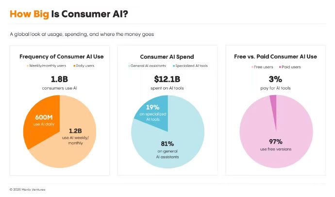
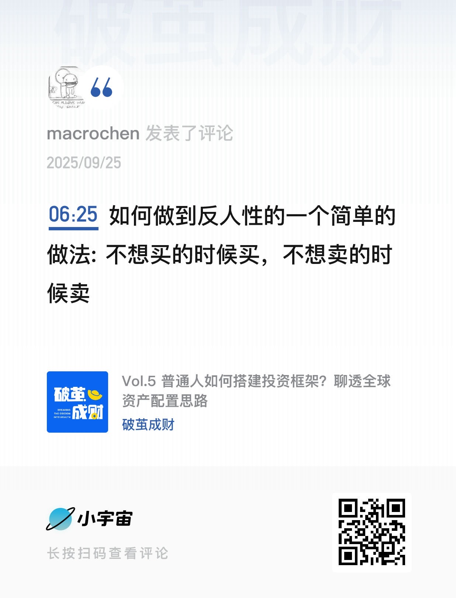
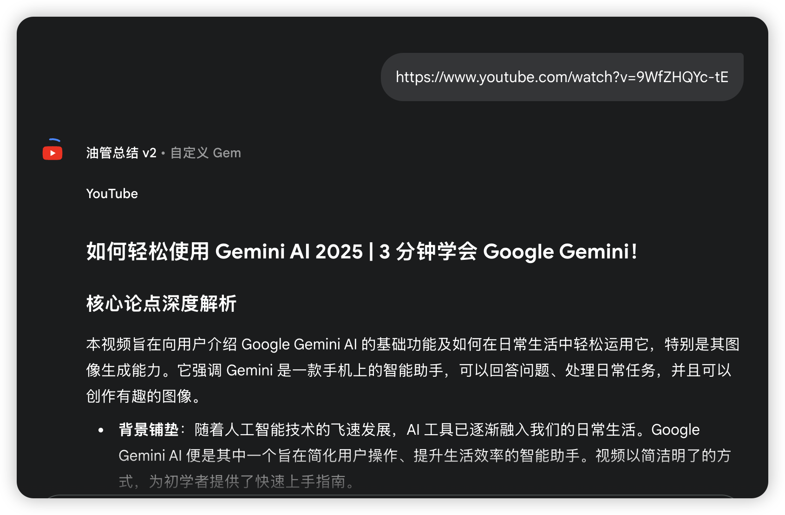

# 2025-09 即刻归档

## 月度总结
- 本月共归档 59 条内容，活跃了 18 天，时间范围从 2025-09-01 到 2025-09-30。
- 发帖最集中的一天是 2025-09-09，当天共记录 11 条。
- 本月最常出现的话题是：小散户的日常 (20), AI探索站 (7), 无用但有趣的冷知识 (7)。
- 带媒体链接的内容有 3 条，短笔记风格的内容有 44 条。
- 最长的一条发布于 2025-09-10，正文约 723 字。

## 2025-09-01

### [18:49](https://m.okjike.com/originalPosts/68b57a29e5597c28d306e977)
用策略换空间、用时间换机会。

#小散户的日常

---

## 2025-09-03

### [19:50](https://m.okjike.com/originalPosts/68b82b782393a294a6dfa95f)
一个国家工业的崛起，不是单点技术的突破，而是整个产业链生态的胜利。

#浴室沉思

---

## 2025-09-04

### [19:06](https://m.okjike.com/originalPosts/68b972c1e5597c28d3575455)
与美国纳斯达克指数40年增长72倍的奇迹相比，中国A股市场30年来计入通胀后的真实增长仅约2.8倍，远远落后于同期增长43倍的中国GDP。

#小散户的日常

---

### [19:08](https://m.okjike.com/originalPosts/68b973462393a294a6f9d87e)
中国上市公司的平均分红率仅为30.17%，远低于48%的世界平均水平。

#小散户的日常

---

### [19:26](https://m.okjike.com/originalPosts/68b977602393a294a6fa2c82)
入围世界500强的中国企业，平均利润率仅为4.4%，远低于美国企业的11.3%。

#你不知道的行业内幕

---

## 2025-09-06

### [09:06](https://m.okjike.com/originalPosts/68bb8916e5597c28d380e213)
选股分三种：
投不被世界改变的（稳定性行业+垄断地位+低负债+长久期+EV/自由现金流20年以内回本）。
投阶段性被世界遗弃但反脆弱的（相对垄断地位+重估净资产后PB0.8以下，最好全行业亏损）。
投改变世界的（需求确定性爆发行业的供给阶段性瓶颈部分）。

#小散户的日常

---

### [09:08](https://m.okjike.com/originalPosts/68bb89a9bb2b256f19f70a6e)
机构反着买，别墅靠大海；两融反着买，坐拥黄金台；IC升水准备卖，逃顶笑开怀！

#小散户的日常

---

### [09:10](https://m.okjike.com/originalPosts/68bb8a0014af706d82e4eff9)
价值投资和投机殊途同归，一个关注长期稀缺性，一个关注短期稀缺性，共性是反人性。

#小散户的日常

---

### [09:52](https://m.okjike.com/originalPosts/68bb93cf9f04981969860e4b)
不要与 AI 拼“生产力”，而要与 AI 拼“人性”。AI 越是泛滥，你身上那些无法被复制的人性特质——原创思想、独特经历、个人品味和情感连接——就越是珍贵。

#AI探索站

---

### [10:04](https://m.okjike.com/originalPosts/68bb96a69f0498196986455c)
《战狼 2》用美式个人英雄主义的外壳，讲述了一个民族主义、国家主义的内核。

#一起看电影

---

### [14:07](https://m.okjike.com/originalPosts/68bbcface5597c28d38638e6)
《2025-08-25-雪球-美联储9月降息在即，会助力A股冲上4000点吗？》
https://mp.weixin.qq.com/s?__biz=MzA5MjE3ODgzNA==&mid=2652380902&idx=3&sn=ae115a25c7741327ded20cb70499887d&chksm=8ada81e4e7878c4b9a896dfd66593603a49769080d1da374d2e1521f687d001b5327eb35df19&scene=126&sessionid=1756382760#rd 

美联储降息会提振新兴市场股市，主要有以下几个原因：

1.  资金流向： 美联储降息后，美元的吸引力可能会下降，一些追求更高回报的国际资金会从美国流出，寻找更有潜力的投资机会。新兴市场，比如A股和港股，通常被认为具有更高的增长潜力，因此会吸引一部分资金流入。

2.  估值优势： 许多新兴市场股市的估值相对较低。当美联储降息导致全球资金重新配置时，这些估值较低的市场会显得更有吸引力。文章中也提到，A股的估值与美股相比仍然很便宜。

3.  汇率影响： 美联储降息可能会导致美元贬值，这有助于减轻新兴市场国家的债务负担，并提高其出口竞争力，从而对股市产生积极影响。

4.  市场情绪： 美联储降息通常被视为一种宽松的货币政策，这会改善市场情绪，增强投资者对新兴市场股市的信心。

总而言之，美联储降息就像给全球经济注入了“兴奋剂”，一部分资金会流向更有增长潜力、估值更低的新兴市场，从而提振这些市场的股市。

#小散户的日常

---

### [16:44](https://m.okjike.com/originalPosts/68bbf4661e5664293d6097b9)
怎么理解“利率下降，折现率就下降，未来现金流的价值就更高”

想象一下，你现在手里有一张“藏宝图”，这张图告诉你，未来某个时间（比如10年后）你能挖到100块钱的宝藏。

*   利率就像“寻宝费用”： 利率越高，就相当于寻宝的成本越高，比如你需要雇佣更贵的向导、购买更高级的工具等等。
*   折现率就像“寻宝折扣”： 折现率是用来计算未来这100块钱的宝藏，现在值多少钱的。如果寻宝费用（利率）很高，那么这张藏宝图的价值就要打个大折扣，因为你觉得未来能拿到手的钱，现在看来没那么值钱了，因为成本太高了。
*   未来现金流的价值： 未来现金流就是指未来能拿到的钱，比如藏宝图里的100块钱。

现在，如果利率下降了：

*   寻宝费用降低了，你雇佣向导和购买工具的成本都降低了。
*   折现率也跟着下降了，因为寻宝成本低了，所以未来能拿到的100块钱，现在看来就更值钱了，藏宝图的价值也更高了。

总结一下：

利率下降，就像寻宝成本降低，导致未来能拿到的钱（未来现金流）的价值，在今天看来就更高了。这就是为什么低利率环境下，股票（尤其是那些未来才有高增长预期的公司）会更受欢迎的原因。因为投资者觉得，即使这些公司现在不赚钱，但未来能赚大钱，而且因为利率低，未来的钱现在也很值钱，所以愿意给它们更高的估值。

#无用但有趣的冷知识

---

## 2025-09-08

### [10:44](https://m.okjike.com/originalPosts/68be43025c4be6b6d0004746)
现货投资者如同只能在平面上看到二维图形的生物，而衍生品投资者则是能感知和理解三维空间的生物，策略和视角更为立体。

#浴室沉思

---

## 2025-09-09

### [07:16](https://m.okjike.com/originalPosts/68bf63d014af706d823078d5)
AI 或许并没有让人变坏，但它为恶意滋生提供了最肥沃的土壤。

#AI探索站

---

### [07:41](https://m.okjike.com/originalPosts/68bf69981e5664293da4bece)
AI时代，就业市场会两极分化，顶尖人才和复合型人才会越来越吃香。所以，要找到自己的热情和天赋，发展软实力，比如建立信任的人际交往能力、精准把握需求的销售技巧、产品设计与用户体验的把控力。最重要的是，要保持学习，成为能驾驭AI的“骑手”，而不是只会某种特定技术的“工匠”。

#AI探索站

---

### [07:56](https://m.okjike.com/originalPosts/68bf6d171e5664293da4fd50)
贵阳夜间餐饮收入占了总收入的70%，超过成都，排名全国第一！

#你不知道的行业内幕

---

### [08:06](https://m.okjike.com/originalPosts/68bf6f912393a294a66fd90f)
一条AI广告的价格，大概是传统制作流程的1/4。

#你不知道的行业内幕

---

### [10:03](https://m.okjike.com/originalPosts/68bf8afaa556d486a9cb60df)
C端几乎都是白嫖党
AI创业避坑指南

---

### [15:35](https://m.okjike.com/originalPosts/68bfd8d614af706d8239dca3)
大同机票有多便宜？ 曼谷往返航班最低350元，莫斯科单程600元，首尔机票甚至不到100元！
为啥大同机票这么便宜？ 因为这些航线都是旅行社包机的，团客不足时，会把剩余的散票低价出售。政府也会给予一定的资金补贴。

#你不知道的行业内幕

---

### [15:44](https://m.okjike.com/originalPosts/68bfdad934c5d0dadef693fd)
自动扶梯本来就不是给人行走的，在上面走容易摔倒，还可能带倒别人。长期“左行右立”会让扶梯单侧磨损，容易出故障。广州地铁的统计显示，近七成的安全事故都和自动扶梯有关。

#无用但有趣的冷知识

---

### [16:30](https://m.okjike.com/originalPosts/68bfe5b3e5597c28d3d70586)
破壁机一般指的是把食物的植物细胞壁给切开，植物细胞壁它是由纤维素、半纤维素、果胶等成分组成的，这些都属于膳食纤维。切开的重点是里边的一些细胞内容物出来了，人体吸收这些营养物质吸收速度会更快了，但是本身这种程度的加工，并不会影响到膳食纤维的总量。

#无用但有趣的冷知识

---

### [17:06](https://m.okjike.com/originalPosts/68bfedfdb7ccef97f71e33a9)
玉米也分三六九等，想减肥或者控制血糖，甜玉米比糯玉米更靠谱！糯玉米热量高，升血糖快，而玉米糁、玉米面这些“老玉米”做的，反而血糖指数低。

#健康科普站

---

### [17:36](https://m.okjike.com/originalPosts/68bff51d2393a294a67a94f7)
虾皮不是虾的皮，而是完整的小虾。虽然钙含量高，但人体吸收不了多少。钠含量却很高，吃多了盐超标。当调料提鲜可以，别指望它补钙。

#健康科普站

---

### [21:26](https://m.okjike.com/originalPosts/68c02b1fe5597c28d3dc8579)
长期正收益，短期负相关

#小散户的日常

---

## 2025-09-10

### [08:23](https://m.okjike.com/originalPosts/68c0c507631c0b75f04f520e)
《2025-09-01-营养师顾中一-别只盯着橄榄油了！这种“国民炒菜油”，健康实惠！》
https://mp.weixin.qq.com/s/R8KHOcpKQAI-FZkK4HjQwA
1.  菜籽油其实很适合炒菜，不输“高端油”。
    解读：我们一直觉得橄榄油、茶籽油这些才是好油，菜籽油就是个平价货。但文章说，菜籽油的单不饱和脂肪酸含量也很高，耐热又健康，而且饱和脂肪酸还少，比橄榄油还好。打破了“便宜没好货”的刻板印象，原来菜籽油这么实在！

2.  “双低”菜籽油才是好选择，能避开芥酸和硫甙的坑。
    解读：以前听说菜籽油不太健康，是因为里面有芥酸和硫甙。文章解释说，现在技术进步了，能生产“双低”菜籽油，把这俩有害成分降得很低。这就像吃东西终于能放心了，原来菜籽油也能吃得健康。

3.  精炼菜籽油更适合炒菜，但香味会打折。
    解读：我们炒菜都喜欢油香，觉得土榨菜籽油才够味。但文章说，精炼油烟点高，炒菜少油烟，更健康。虽然香味淡了点，但为了健康，还是得选精炼油。这就像鱼和熊掌不可兼得，健康和香味要选一个。

4.  ω-3和ω-6的比例很重要，菜籽油在这方面表现不错。
    解读：我们都知道要吃不饱和脂肪酸，但很少关注ω-3和ω-6的比例。文章说，现代人ω-6太多，ω-3太少，要调整比例。菜籽油的ω-3含量相对较高，有助于平衡这个比例。原来吃油还要考虑比例问题，真是涨知识了。

5.  别太纠结压榨还是浸出，精炼油都差不多。
    解读：买油的时候，总觉得压榨的比浸出的好。但文章说，如果买的是精炼油，压榨和浸出差别不大，因为精炼过程会去除杂质和溶剂。这就像买东西不用太在意表面功夫，关键看内在品质。

#优质长文分享会

---

## 2025-09-12

### [10:35](https://m.okjike.com/originalPosts/68c3870bb65508a172c2cd24)
公司还是那个公司，人还是那些人，业绩还是那么个业绩，为什么股价就突突涨了，论讲故事的重要性…

---

## 2025-09-15

### [17:28](https://m.okjike.com/originalPosts/68c7dc4819378b46c95c67d1)
牛市一般要经历估值修复、业绩引领和情绪泡沫三个阶段。

#小散户的日常

---

## 2025-09-19

### [16:58](https://m.okjike.com/originalPosts/68cd1b2b54f81d241db47cf5)
判断一道菜是否为“预制菜”，关键在于风味形成的核心环节在哪里完成 。

食物之所以美味，很大程度上依赖于烹饪过程中的化学反应，例如产生焦香的“美拉德反应”和“焦糖化反应”。这些反应是风味整合的关键。

如果这些核心的化学反应在中央厨房已经完成，门店做的仅仅是复热，那么它就是不折不扣的预制菜。

如果中央厨房只负责切配、腌制等准备工作，而决定风味的炒、炸、烤等关键步骤是在门店厨房完成的，那么它就不应该被算作预制菜。

#无用但有趣的冷知识

---

### [17:02](https://m.okjike.com/originalPosts/68cd1c3dd0b4409eb344833b)
“新鲜”西兰花：从采摘到运输，再到超市货架，最后被你买回家，可能已经过去了好几天甚至一周。在这个过程中，它持续进行着呼吸作用，维生素C和抗氧化剂等营养物质大量流失 。

冷冻西兰花：在采摘后几小时内，就完成了清洗、漂烫（瞬间高温灭活酶的活性）和液氮速冻 。这个过程极大地锁住了营养成分。研究表明，冷冻西兰花的营养价值甚至可能高于那些经过长途跋涉的“新鲜”同类。

这个逻辑同样适用于羊肉。高品质的羊肉通常是在水草最丰美的季节进行屠宰，然后通过速冻技术保存，确保其风味和营养全年都能维持在最佳状态 。所以，“冷冻”并不等于“不新鲜”或“没营养”，它恰恰是现代科技对抗时间、保障食物品质的伟大成果。

#无用但有趣的冷知识

---

### [17:05](https://m.okjike.com/originalPosts/68cd1cbfd9abb9785dc98b5c)
我们对“预制菜”的恐惧，本质上是对整个食品安全体系不信任的体现。争论的焦点不应是“预制”还是“现炒”，而应是“安全”还是“不安全”，“透明”还是“不透明”。

#浴室沉思

---

### [17:25](https://m.okjike.com/originalPosts/68cd217554f81d241db4fdab)
在安全与风味之间，我们往往凭感性偏好做出了选择，却未必是理性的。

#浴室沉思

---

### [17:31](https://m.okjike.com/originalPosts/68cd22d4f15a1d1c8954b05c)
解决未知、复杂且非结构化问题的能力。这是一种AI在短期内难以企及的、属于人类的核心超能力

#今日金句

---

## 2025-09-21

### [12:00](https://m.okjike.com/originalPosts/68cf786400c0686ab5c5c9f3)
几乎所有的地图导航应用都不咋赚钱，用后即走的工具属性是地图应用的原生困境。 天气软件也是

#产品安利社

---

### [16:40](https://m.okjike.com/originalPosts/68cfb9f93ea7571a78f94ddd)
用股息率给红利基金估值，当红利指数股息率高于国债收益率的2倍时（且绝对值大于5%），开始分批买入；当指数股息率低于国债收益率的2倍时（股息率4%）开始分批卖出。

#小散户的日常

---

### [16:44](https://m.okjike.com/originalPosts/68cfbb080d92e3c85c853f0b)
评价一个人或者基金的投资业绩好坏，低于三年的业绩没有观察意义，五年时间比较合适。

#小散户的日常

---

### [17:05](https://m.okjike.com/originalPosts/68cfbfe700c0686ab5cbb826)
无论涨跌，事有不决卖一半

#小散户的日常

---

### [17:14](https://m.okjike.com/originalPosts/68cfc1dcd9abb9785d02668c)
就业冰河期： 日本70后赶上经济衰退，大学毕业即失业，只能做临时工，一辈子收入都很低，被称为“垮掉的一代”。
考公热的幻灭： 90年代日本也流行考公务员，但后来政府财政危机，公务员降薪裁员，这个职业也不香了。

#职场那些事儿

---

### [21:43](https://m.okjike.com/originalPosts/68d000fcdbff5eb4506a1cca)
阿里用淘宝闪购搞“到家”业务，用高德搞“到店”业务

#还有这种操作

---

### [21:46](https://m.okjike.com/originalPosts/68d001ad2a16321ec7e6416c)
中国汽车行业年利润率只有3%，比存银行定期好不了多少。

#你不知道的行业内幕

---

### [22:46](https://m.okjike.com/originalPosts/68d00fb35fd89b775b551a38)
爱是平等的，羡慕是你高我低。

#今日金句

---

### [22:56](https://m.okjike.com/originalPosts/68d0121c5fd89b775b55463a)
全球债务规模是现存货币规模的近3倍，现代经济的本质就是在透支未来。

#无用但有趣的冷知识

---

## 2025-09-22

### [07:00](https://m.okjike.com/originalPosts/68d08394d9abb9785d126664)
AIGC擅长说明性、介绍性、解释性、总结性的内容，但缺乏创造性和启发性。

#AI探索站

---

### [07:01](https://m.okjike.com/originalPosts/68d083cf1ed9b53c78b0be9f)
AIGC适合完成“形式文章”，比如方案、心得、报告、标书、论文等。

#AI探索站

---

### [11:25](https://m.okjike.com/originalPosts/68d0c1b5d9abb9785d177f2a)
骨头里有35%都是蛋白质，蛋白质不够，骨骼就没法好好生长和维持。而且，蛋白质还能帮你长肌肉，肌肉强壮了，对骨骼也是一种刺激，能让骨头更结实。

#健康科普站

---

### [11:57](https://m.okjike.com/originalPosts/68d0c943a90738f815d3438e)
西兰花冷冻过程中，维生素C的损失可能接近30%，甚至更多。

#无用但有趣的冷知识

---

### [12:51](https://m.okjike.com/originalPosts/68d0d5cacbd2659e46e2e45f)
骆驼奶：
优势：脂肪更健康，对乳糖不耐者更友好，致敏性或许低，一些抗炎成分高。
缺点：生产成本高，非常贵，有病毒和细菌的感染风险。
水牛奶：
优势：蛋白质、脂肪、糖、钙含量都更高。
缺点：脂肪太高，会有较多的饱和脂肪酸。
羊奶：
优势：天然脂肪球小，致敏性可能低，钙含量高于牛奶。
缺点：均质后脂肪颗粒已经很小，羊奶并没有优势。

#健康科普站

---

## 2025-09-23

### [08:42](https://m.okjike.com/originalPosts/68d1ecf61ed9b53c78ce4f24)
哈佛大学的研究团队通过分析美国6200万打工人的就业数据，发现了一个残酷现象：​​AI最先抢走的不是所有人的饭碗，而是初级岗位（Junior-level）的工作机会​​。

#AI探索站

---

### [08:46](https://m.okjike.com/originalPosts/68d1ede67576353239c50871)
研究发现，AI对不同学历背景的初级员工影响不同，呈现​​“U型曲线”​​：

​​顶尖名校（Tier 1）​​：受影响小，因为公司愿意为他们的潜力买单；

​​普通大学（Tier 5）​​：受影响小，因为工资低，性价比高；

​​中上等大学（Tier 2-3）​​：受影响最大！
薪资要求不低，但工作内容易被AI替代；
高不成低不就，成了“优化”首选。

#AI探索站

---

### [09:20](https://m.okjike.com/originalPosts/68d1f5eb8742b20165662c15)
自己的亏损固然心疼，但别人的盈利，更让人扎心

#小散户的日常

---

## 2025-09-25

### [08:20](https://m.okjike.com/originalPosts/68d48ac9d9abb9785d65f861)
(no text content)

#小散户的日常

---

## 2025-09-26

### [06:36](https://m.okjike.com/originalPosts/68d5c3e3a35b52138ea3cf3e)
牛市在悲观中诞生，在怀疑中成长，在乐观中成熟，在兴奋中死亡

#小散户的日常

---

### [07:13](https://m.okjike.com/originalPosts/68d5ccafd9abb9785d80ca26)
普通人的牛市： 该买的时候犹豫，该卖的时候贪婪，全程参与却没赚到钱。

#小散户的日常

---

### [07:22](https://m.okjike.com/originalPosts/68d5cea31ed9b53c781f1ef1)
历史上，大国崛起往往伴随着货币升值

---

### [07:24](https://m.okjike.com/originalPosts/68d5cf1896f72501599232d5)
人人都懂的白酒股，价格往往反映了真实价值。但B股、港股、飞机租赁等冷门领域，价值和价格错配的机会更大。

#小散户的日常

---

### [07:28](https://m.okjike.com/originalPosts/68d5d03596f7250159924c64)
要预测市场，得知道每个经济、金融、商业变量的变动，还得知道投资者情绪的起伏。

#小散户的日常

---

## 2025-09-27

### [07:56](https://m.okjike.com/originalPosts/68d728213ea7571a7894e0d0)
如果你对汇川技术、比亚迪、三花智控这些股票没有特别的喜欢或者不喜欢，那么可以考虑把创业板新能源ETF(159387.SZ)、CS电池和新能电池这几个ETF都买一点，平均分配一下资金。

#小散户的日常

---

## 2025-09-28

### [14:58](https://m.okjike.com/originalPosts/68d8dcae3ea7571a78b79fce)
在中证1000指增这个领域，由于市场的主要参与者是散户，所以定价效率不高，超额相对就好做许多。

#小散户的日常

---

### [22:21](https://m.okjike.com/originalPosts/68d944557b506ea0e7b3567c)
最近写了一个插件，可以点击youtube 中的任何一个视频节目，跳转到 gemini 的 定义好的 gem 进行总结以及对话

#产品安利社

---

## 2025-09-30

### [16:57](https://m.okjike.com/originalPosts/68db9b7ac29dd3743f6f7c76)
靠谱的人：主动、负责、想办法解决问题、拥抱变化、沟通清晰。

不靠谱的人：被动、推卸责任、抱怨问题、抗拒改变、表达模糊。

#浴室沉思

---
