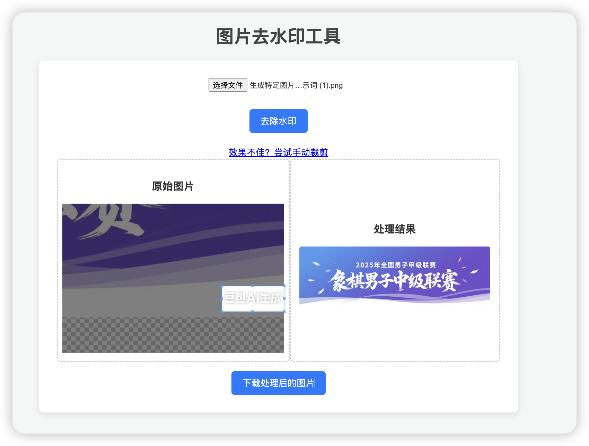
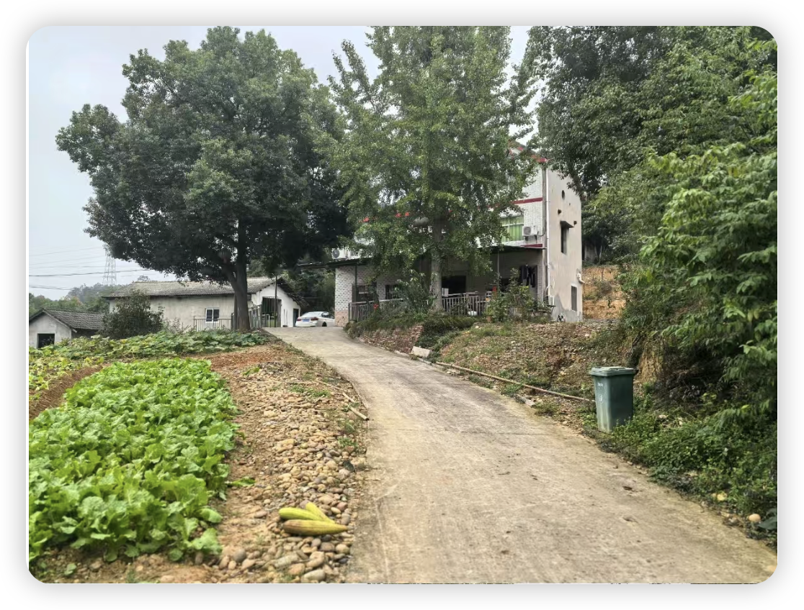
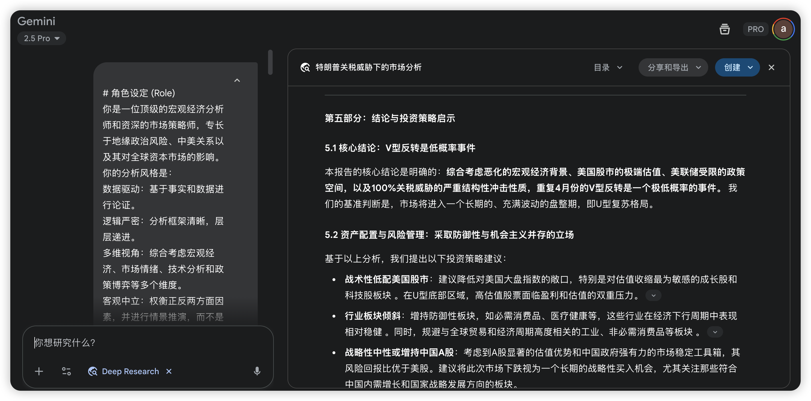

# 2025-10 即刻归档

## 月度总结
- 本月共归档 14 条内容，活跃了 9 天，时间范围从 2025-10-04 到 2025-10-21。
- 发帖最集中的一天是 2025-10-07，当天共记录 2 条。
- 本月最常出现的话题是：小散户的日常 (4), AI探索站 (3), 产品安利社 (2)。
- 带媒体链接的内容有 3 条，短笔记风格的内容有 12 条。
- 最长的一条发布于 2025-10-12，正文约 522 字。

## 2025-10-04

### [15:20](https://m.okjike.com/originalPosts/68e0caa3342fa4ca3a85f12e)
三得利在全球年收入1476亿人民币，而娃哈哈和农夫山泉加起来才刚超过它的一半。

#无用但有趣的冷知识

---

## 2025-10-06

### [21:13](https://m.okjike.com/originalPosts/68e3c082d9abb9785da0782c)
对于老师面对AI对教育的冲击，不能禁止，而要鼓励学生提交与AI的对话过程，从而考察他们提出问题的能力。

#AI探索站

---

## 2025-10-07

### [10:53](https://m.okjike.com/originalPosts/68e4809f0d84bd7be9c9418a)
视频内容从电影到电视，再到互联网长视频，最终到移动端短视频，技术进步带来了更多创作者、更丰富的内容和更多商业模式 。随着技术的进步，解决了算力问题，就该轮到真人拍摄短视频被 AI 生成短视频取代了。AI内容本质上是又一次内容制作成本的降低，它将扩大整个内容产业市场规模，同时必然重塑行业内部的现有格局。

#AI探索站

---

### [12:36](https://m.okjike.com/originalPosts/68e498db3ea7571a78a9da65)
腾讯的这个采用推理+生图的技术比较厉害，再也不用为生成的图片中出现中文乱码发愁了。

#产品安利社

---

## 2025-10-08

### [07:48](https://m.okjike.com/originalPosts/68e5a6d500c0686ab59014f8)
《白马王子爱上灰姑娘》和《霸道总裁爱上女保洁》，其实是一回事，只不过一个骗小孩，一个骗大人

#一起听播客

---

### [16:12](https://m.okjike.com/originalPosts/68e61cdc1fc2fa98db50719b)
现在 ai 生成的图片大多会加上水印，在其他地方使用非常难看，写了个应用去掉它（去不掉就裁掉）

#产品安利社

---

## 2025-10-10

### [23:00](https://m.okjike.com/originalPosts/68e91f96e04d5386fbfc4d10)
下跌带来的恐惧感，远远大于上涨带来的贪婪感。

#小散户的日常

---

## 2025-10-11

### [13:11](https://m.okjike.com/originalPosts/68e9e704e64e8372326cd322)
用 AI 把老家农村自建房改造成乡村别墅

#AI探索站

---

### [14:32](https://m.okjike.com/originalPosts/68e9f9efe64e8372326e53b0)
用 gemini dr 深度分析了一下特朗普这次是否不一样。

#一起做投资人

---

## 2025-10-12

### [10:36](https://m.okjike.com/originalPosts/68eb14313ea7571a7829070d)
10.11加密货币暴跌，主要是因为市场杠杆太高，然后撞上了“特朗普贸易战”这个大雷。

暴跌咋回事？ 特朗普突然宣布要对中国商品加关税，大家觉得要完，赶紧抛售风险资产，加密货币首当其冲。比特币直接从12万多跌到10万，一下子蒸发了6600亿美元。

内部原因也有，但主要是放大器： 虽然加密货币圈子里没啥直接的黑天鹅，但特朗普的政策让人担心供应链出问题。还有稳定币USDe短暂脱锚，也添了把火。

杠杆是罪魁祸首： 市场之前太乐观了，杠杆加得飞起。一跌起来，爆仓的爆仓，清算的清算，就像多米诺骨牌一样。一天之内爆了191亿美元，比之前几次大崩盘都厉害。

历史对比： 这次暴跌有点像2020年的“312暴跌”（疫情引发的），都是宏观原因导致的高杠杆崩盘。

未来咋走？ 短期内估计要震荡筑底，但长期来看，如果贸易战缓和，可能会像“312”之后那样V型反转，快速反弹。但如果关税一直加，那就可能要震荡一段时间才能恢复。

重点关注啥？ 盯着美联储的利率政策、中美贸易谈判、市场杠杆水平、鲸鱼动向和稳定币的情况。

总而言之，这次暴跌是高杠杆市场碰上了宏观经济的冲击，短期内可能还有余震，但长期来看，如果外部环境好转，加密货币市场还是有希望恢复的。

#Web3研究所

---

### [11:12](https://m.okjike.com/originalPosts/68eb1c8400c0686ab5fa2ef8)
如果是牛市，即使世界大战也无法阻止股票上涨。
--Livermore《股票大做手回忆录》

#小散户的日常

---

## 2025-10-13

### [08:36](https://m.okjike.com/originalPosts/68ec497279d1c7b8a1133367)
涨的时候技不如人，跌的时候卧龙凤雏

#小散户的日常

---

## 2025-10-21

### [11:25](https://m.okjike.com/originalPosts/68f6fd2f1ed9b53c78c4a774)
“普通人-好事-不排队“永远不可能同时出现

#今日金句

---

### [11:58](https://m.okjike.com/originalPosts/68f704dbd9abb9785d2733c0)
夏炒电，冬炒煤

#小散户的日常

---
