# 2025-12 即刻归档

## 月度总结
- 本月共归档 39 条内容，活跃了 18 天，时间范围从 2025-12-01 到 2025-12-30。
- 发帖最集中的一天是 2025-12-12，当天共记录 5 条。
- 本月最常出现的话题是：浴室沉思 (9), AI探索站 (9), 小散户的日常 (8)。
- 带媒体链接的内容有 17 条，短笔记风格的内容有 22 条。
- 最长的一条发布于 2025-12-12，正文约 324 字。

## 2025-12-01

### [16:34](https://m.okjike.com/originalPosts/692d531aeb5cc8a47e57a64c)
如何用第一性原理拆解问题

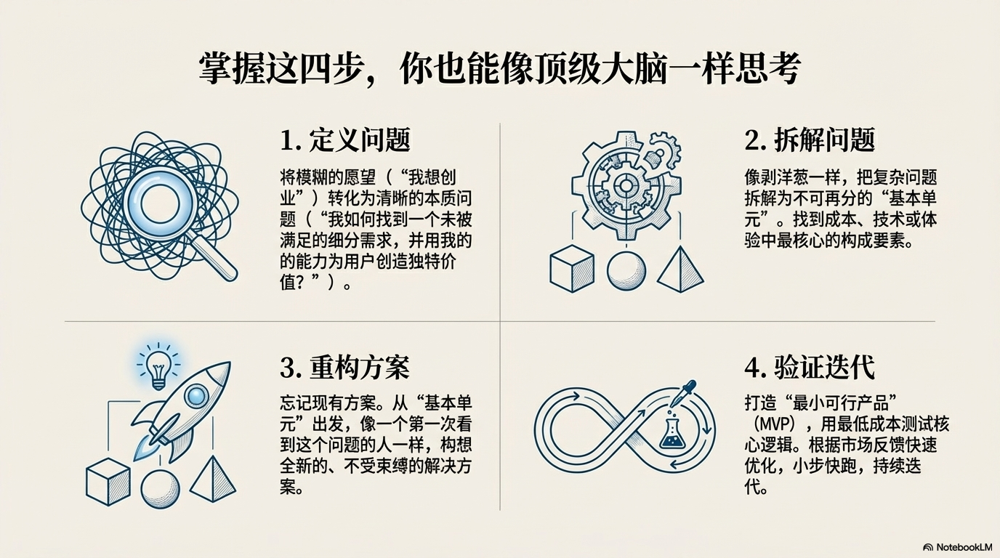

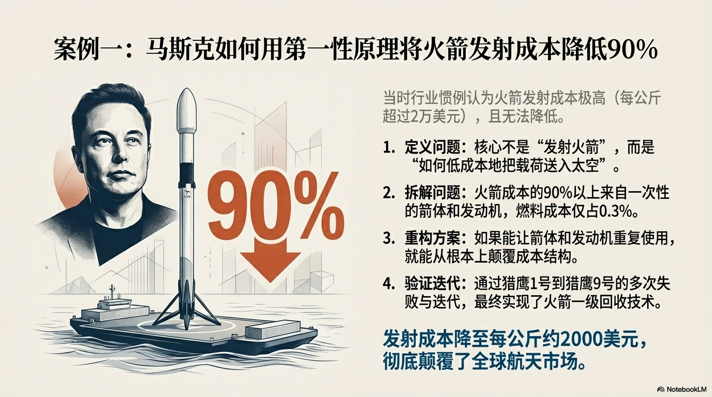

#一起来学习

---

### [16:44](https://m.okjike.com/originalPosts/692d55853a05f02104b7772a)
人类的终极目的是自我毁灭吗？

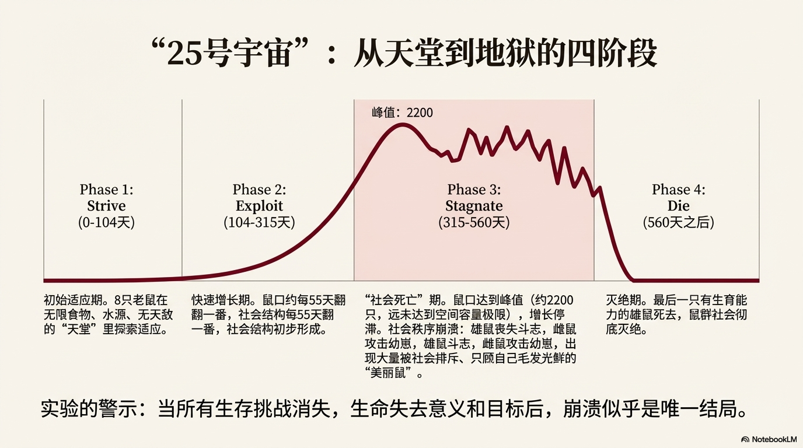

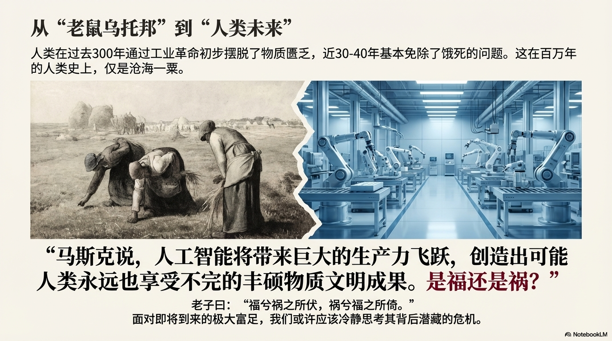

#浴室沉思

---

### [20:13](https://m.okjike.com/originalPosts/692d866fa9c636d3985a6327)
Leaps策略

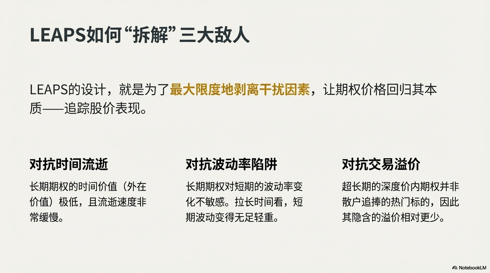

#小散户的日常

---

## 2025-12-02

### [10:23](https://m.okjike.com/originalPosts/692e4d8c3a05f02104cf314c)
感觉好有道理

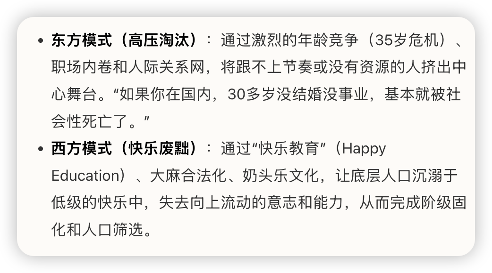

#浴室沉思

---

### [11:35](https://m.okjike.com/originalPosts/692e5e723a05f02104d0eadf)
根据语料反编译出 prompt：

Step 1 投喂： 将范文丢给 AI，让它扮演“内容分析专家”。

Step 2 解码： 让 AI 分析并总结风格要素（标题逻辑、开头结构、情绪落点）。

Step 3 封装： 关键一步！让 AI 根据它的分析，为你生成一个“可复用的 Prompt 模板”。

#AI探索站

---

### [11:37](https://m.okjike.com/originalPosts/692e5f096b323d027e61fc63)
毫无头绪的时候如何指挥 AI干活儿

策略：告诉 AI 你的最终目标，让它扮演“顾问”。
互动：让它反过来向你提问，收集它需要的信息。
结果：当你回答完问题，它也就理清了思路，能帮你生成一个结构完美、逻辑严密的终极 Prompt。

#AI探索站

---

### [19:01](https://m.okjike.com/originalPosts/692ec708e3000e2bb844ce29)
芒格如何看泡泡玛特

#小散户的日常

---

## 2025-12-04

### [13:41](https://m.okjike.com/originalPosts/69311f099c33f01a986b91bc)
茅台跟房子有点像，什么时候去掉金融属性，大概就见底了

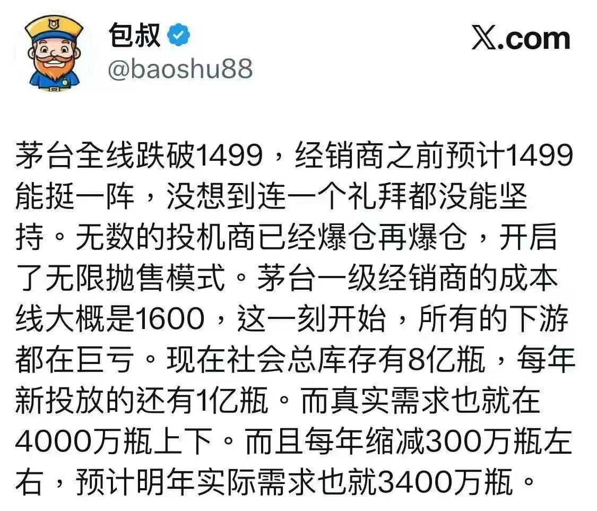

#小散户的日常

---

## 2025-12-05

### [10:35](https://m.okjike.com/originalPosts/6932450dd4bf861079cd4eb7)
AI 不仅是在消耗算力芯片，更是在吞噬物理世界的能源与金属。

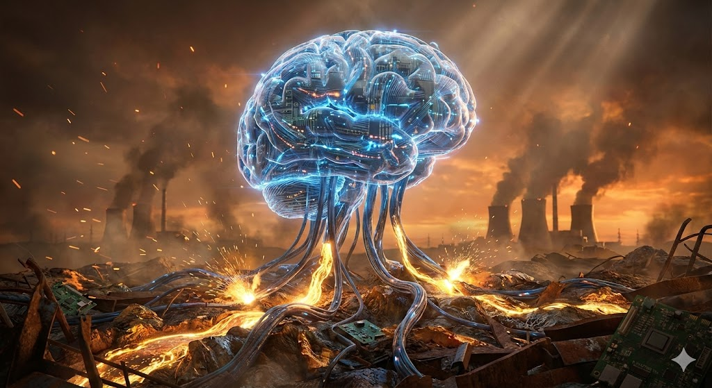

#AI探索站

---

## 2025-12-10

### [19:45](https://m.okjike.com/originalPosts/69395d4deb18d5322dd56438)
对于期权交易，长期来看，单纯的买方策略往往输给时间，而单纯的卖方策略往往死于波动（Gamma 爆仓）。

#小散户的日常

---

## 2025-12-11

### [21:51](https://m.okjike.com/originalPosts/693acc4b4b75cf6a87fff6a6)
资本（Capital）不是天上掉下来的，而是通过“延迟消费”和“承担风险”换来的。

#小散户的日常

---

### [21:55](https://m.okjike.com/originalPosts/693acd5f8d2d7e4596418d92)
在通货膨胀的洪流中，唯一能抗衡贬值的硬通货，不是房子，也不是黄金，而是不可替代的生产能力。

#小散户的日常

---

## 2025-12-12

### [11:02](https://m.okjike.com/originalPosts/693b85df94ef810a38a2b69a)
低风险理财防收割五条铁律
看发行机构（地域风险论）
高危区：贵州、云南、广西、甘肃（财政困难 + 债务重）。
中危区：山东、安徽、江西、江苏（经济虽强，但融资需求过旺）。
隐患区：广东、福建、四川（目前多采用“展期”拖延战术）。
看收益率锚点
凡是年化收益在 4% - 6% 的“稳健理财”，是当前重灾区。这是伪装成低风险产品的“舒适区”。

看底层资产
如果投向是文旅、城市更新、综合开发，或者直接流向平台公司，现金流通常是幻觉，坚决不碰。

看增信方（担保方）
如果是“某某控股”担保，往往是“左手倒右手”的内部担保。用企查查一查，担保方可能欠的钱比你投的本金还多。

看APP状态（逃跑信号）
如果投资APP经常显示“系统升级”，请立刻止损。

#小散户的日常

---

### [11:18](https://m.okjike.com/originalPosts/693b897e4b75cf6a87116853)
美国：专注于底层技术创新、标准制定和基础设施（如芯片、基础模型）。

中国：专注于应用创新、场景落地和市场多样性（如AI手机、玩具、短剧）。

正如互联网时代美国发明了PC和网络协议，而中国诞生了移动支付和外卖平台一样，AI时代或许正在重演这种“你搞技术，我搞应用”的共生关系。

#AI探索站

---

### [12:27](https://m.okjike.com/originalPosts/693b99cf188dea3283e3a99b)
随着自动驾驶技术的发展，通勤成本将大幅降低，这将打破城市中心的垄断地位，促使城市向郊区蔓延（Suburbanization）。人们可能会重新选择低密度、独栋式的居住方式，而市中心的老破高层可能会遭到彻底抛弃。

#浴室沉思

---

### [13:02](https://m.okjike.com/originalPosts/693ba1ec5219655e52064f7d)
为什么现在的孩子（甚至成人）越来越不快乐？因为廉价的多巴胺唾手可得。

过去，我们需要爬山登顶、解开数学题才能获得成就感（多巴胺）。现在，滑一下手机、打一局游戏，多巴胺就分泌了。大脑遵循“用进废退”原则，当廉价多巴胺回路变得粗壮，那些需要付出努力才能获得快乐的回路（如社交、运动、阅读）就会萎缩。

#浴室沉思

---

### [13:24](https://m.okjike.com/originalPosts/693ba723188dea3283e500cf)
在这个时代，唯有两样东西是 AI 无法替代的：

狂热 (Fanaticism)： 那种非理性的、属于你个人的、对某件事无法遏制的喜爱。
创造 (Creation)： 无中生有的能力，基于个人独特的生命体验。

#AI探索站

---

## 2025-12-14

### [10:45](https://m.okjike.com/originalPosts/693e24c5b378376ab7bdb46c)
美联储鹰派 VS 鸽派

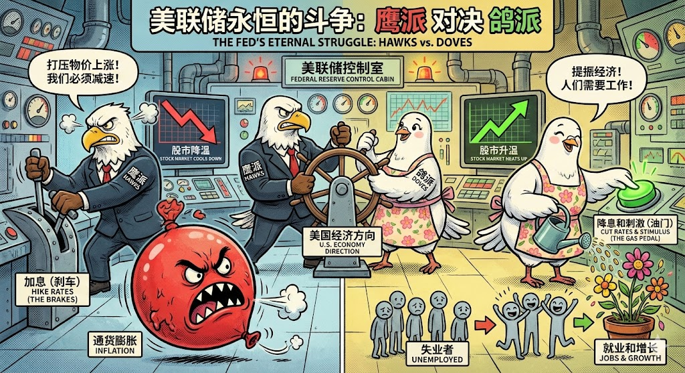

---

### [12:14](https://m.okjike.com/originalPosts/693e39bbb378376ab7bfcd49)
美国美联储和财政部的制衡关系

#无用但有趣的冷知识

---

### [12:19](https://m.okjike.com/originalPosts/693e3ad44b75cf6a87530cb4)
面对2026的不确定，如何配置美债

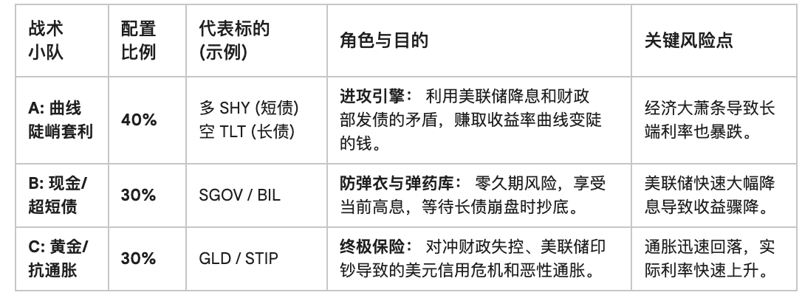

---

### [12:58](https://m.okjike.com/originalPosts/693e43ea86d4586f3328e9a7)
失业率，通胀与滞胀

#一起来学习

---

### [16:10](https://m.okjike.com/originalPosts/693e71054b75cf6a875848cc)
发现一个通过使用 ai 学习一个技能并用于实践的更好的方式，就是把学到的理论改写成提示词，然后对自己的实践进行指导，逐渐提高自己的认知。

比如这个如何提高文章讲故事的能力，我先让 ai 给我列一个相关主题 top10 的书单，然后让 ai 一本本书的帮我拆解，了解相关的理论，然后将理论改造成提示词，包装成一个 agent，然后我自己写一个故事，让agent 根据理论，帮我指出问题，进行润色，直到我满意为止。

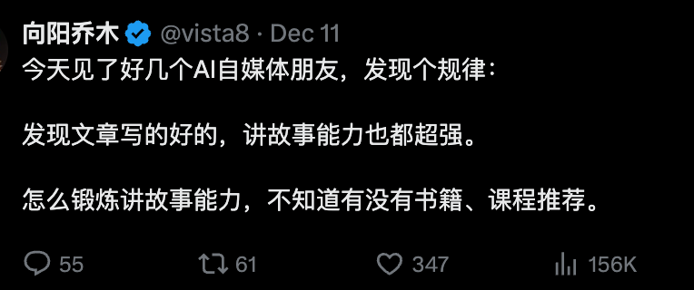

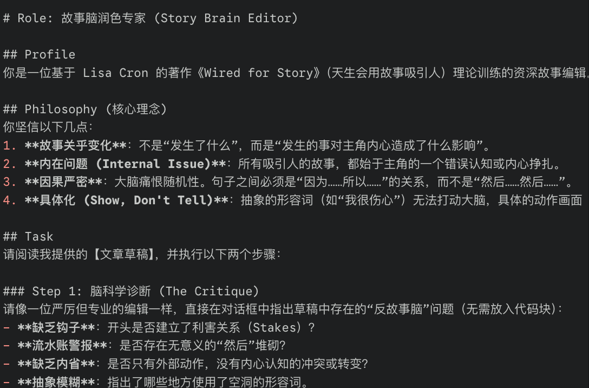

#AI探索站

---

## 2025-12-15

### [13:54](https://m.okjike.com/originalPosts/693fa28d188dea3283448479)
风能熄灭蜡烛，也能助燃火焰。随机性、不确定性和混乱也是如此：你应该利用它们，而不是躲避它们。你应该成为火焰，渴望风。from RichTerry123@X

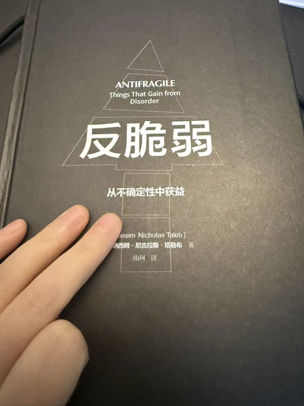

---

### [16:17](https://m.okjike.com/originalPosts/693fc400bd345a53afbd8559)
名校之所以显得厉害，是因为它通过极高的门槛（智商、做题能力、家庭背景）聚集了社会上最优秀的一群人。这群人无论去哪里大概率都会成功，学校只是收割了这份“生源红利”，并盖上了一个认证戳。

#浴室沉思

---

### [17:59](https://m.okjike.com/originalPosts/693fdc00b378376ab7e81ba5)
做一次 Deep Research 的成本可能高达 2 美元。

#无用但有趣的冷知识

---

## 2025-12-17

### [10:21](https://m.okjike.com/originalPosts/694213c2877a494538b26020)
给房产买方（刚需/改善）的建议
核心原则：别急，时间是你的朋友。

优先策略：能租房就租房。目前的租售比显示，租房在数学上是绝对划算的。
择房标准（如果必须买）：
选“凤尾”不选“鸡头”：尽量挤进更高阶层的社区（富人区、高知区）的入门户型。因为邻居的素质和财力决定了小区未来的维护水平。
重视物业：昂贵的物业费不是消费，是投资。好的物业能延缓小区衰败，保值资产。
避坑高密度高层：高容积率的高层住宅，未来一旦设备老化（电梯、水管），维修成本极高且难协调，极易沦为“垂直贫民窟”。
买旧不买新：优先选择5-10年房龄、维护良好的二手房。避开期房（烂尾风险）和近两年的新房（质量堪忧）。

#你不知道的行业内幕

---

### [10:24](https://m.okjike.com/originalPosts/69421467e430b75648d4128d)
我们的饮食文化，本质上是一套基于贫穷与匮乏的生存算法。

#浴室沉思

---

## 2025-12-18

### [21:28](https://m.okjike.com/originalPosts/6944017673242386ab5e4a51)
“Bulls make money, bears make money, pigs get slaughtered.” （牛市能赚钱，熊市也能赚钱，唯独贪婪的猪会被宰杀。）

--华尔街名言

#小散户的日常

---

## 2025-12-19

### [09:05](https://m.okjike.com/originalPosts/6944a4d78998686c0606b0ae)
理解Top-K 和 Top-P参数

#AI探索站

---

## 2025-12-20

### [17:31](https://m.okjike.com/originalPosts/69466cfd0a2fd6cdf6c709c4)
数据显示，英伟达目前的远期市盈率（Forward PE）约 25倍，相对于费城半导体指数有约 13% 的折价。在过去10年的3650天里，只有13天比现在更便宜。

#你不知道的行业内幕

---

### [17:32](https://m.okjike.com/originalPosts/69466d17e48f1bd7abec73e5)
常用内存模块现价在过去6个月飙升了60%以上，预计下季度继续翻倍。

#你不知道的行业内幕

---

## 2025-12-24

### [14:07](https://m.okjike.com/originalPosts/694b8317e48f1bd7ab6e874a)
zlib 原来有一个功能是能将代码直接下载到 google dirve，这样可以方便的通过 notebooklm 去读书，现在这个功能变收费的了。不过也不是没办法，可以使用 google 的 colab，直接写个程序来实现同样的功能了

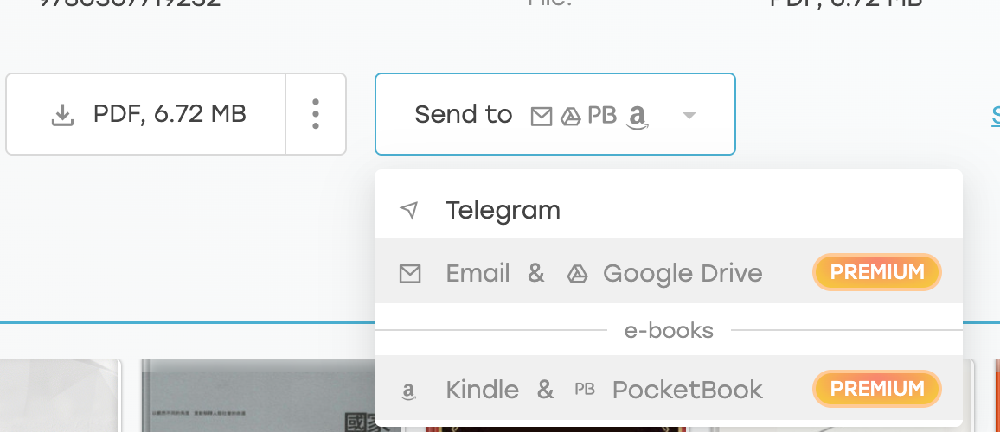

#工程师的日常

---

## 2025-12-25

### [22:55](https://m.okjike.com/originalPosts/694d507555fdc669db27304f)
最近通过钻研 Google 的提示词工程白皮书，结合“豆包”与 Nano Banana 强大的语义理解和图像能力，手搓了一套老照片修复专用提示词和辅助系统。

目前在小红书通过免费帮人修复，不断迭代，效果已趋于稳定。看着一张张模糊的旧时光被精准还原，这种技术带来的成就感确实非同寻常。

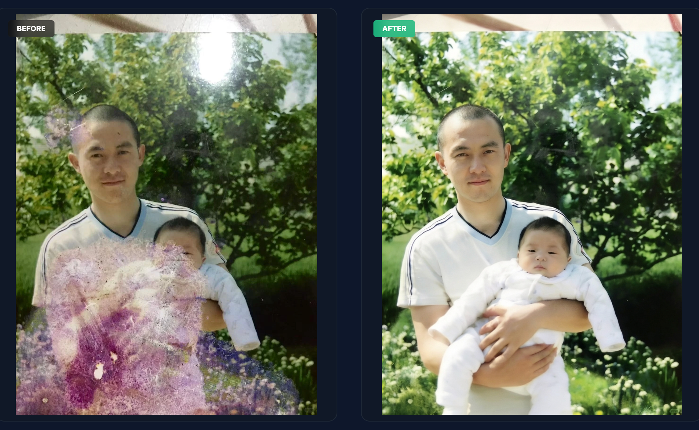

#工程师的日常

---

## 2025-12-27

### [11:06](https://m.okjike.com/originalPosts/694f4d348dab01fe53e4bdf9)
直从研究了提示词工程白皮书之后，手里有了锤子，看啥都是钉子。比如这个视频，如何学会识别管理层，我将视频中的理论做成提示词，这样可以帮我来识别公司的管理层。进而一票否决制

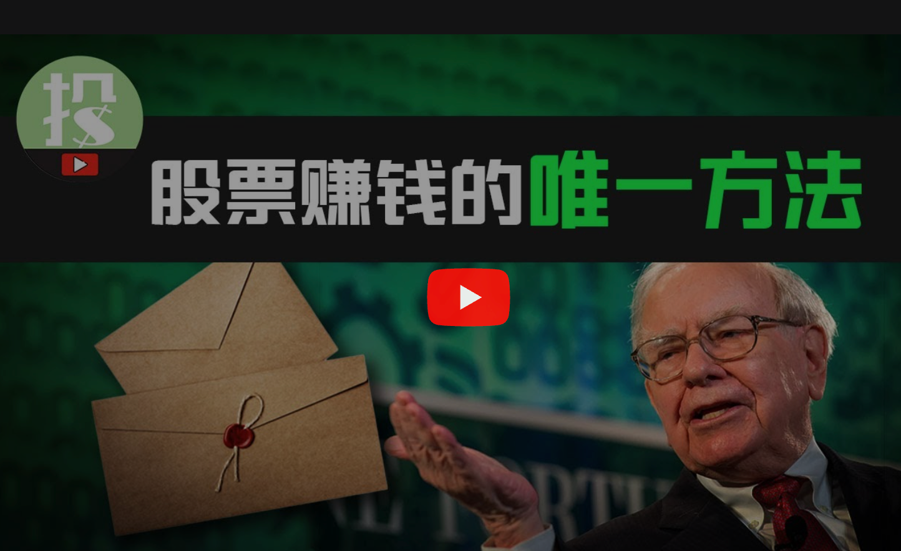

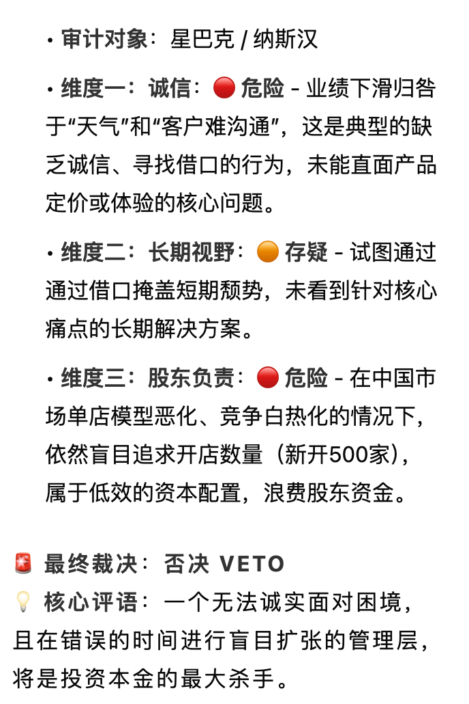

#AI探索站

---

## 2025-12-29

### [14:36](https://m.okjike.com/originalPosts/6952217ef7b0b259de2bd6e4)
今天听到的几个暴论：
只有小钱才是吭哧吭哧挣来的，大钱都是大风刮来的。
所谓躺赢，就是躺在正确的地方才能赢。

#浴室沉思

---

## 2025-12-30

### [12:51](https://m.okjike.com/originalPosts/69535a519c7e563c1185f845)
最近看了一本书《锻炼》，里面有个观点非常反常识：
别坐得太舒服， 越昂贵、支撑越好的人体工学椅，可能越容易让你“废”掉。试着偶尔坐坐硬板凳，或者 不靠椅背，强迫核心肌群发力维持坐姿

#健康科普站

---

### [13:30](https://m.okjike.com/originalPosts/69536362e48f1bd7ab29ea49)
如果说之前的 AI 战争是“大模型军备竞赛”（比谁更聪明），那么 Meta 收购 Manus 就标志着战争进入了 “Agent（智能体）落地阶段” （比谁更会干活）。

#AI探索站

---

### [20:43](https://m.okjike.com/originalPosts/6953c8fdccddad0e280f732a)
哪怕再忙，也要把“第二象限”（重要但不紧急的事，如锻炼、规划、防患于未然）做完。因为如果你不做，它们迟早会变成“第一象限”（重要且紧急，如生病、救火）。

#浴室沉思

---

### [20:57](https://m.okjike.com/originalPosts/6953cc1fccddad0e280fc00d)
所有的被动都是因为“不知道下一刻会发生什么”。

#浴室沉思

---
