# 2026-01 即刻归档

## 月度总结
- 本月共归档 24 条内容，活跃了 15 天，时间范围从 2026-01-01 到 2026-01-30。
- 发帖最集中的一天是 2026-01-16，当天共记录 3 条。
- 本月最常出现的话题是：小散户的日常 (8), 浴室沉思 (5), 你不知道的行业内幕 (3)。
- 带媒体链接的内容有 9 条，短笔记风格的内容有 14 条。
- 最长的一条发布于 2026-01-16，正文约 239 字。

## 2026-01-01

### [16:46](https://m.okjike.com/originalPosts/6956344df7b0b259de949e2d)
真正的财富不是靠省出来的，也不是靠单纯的“复利”慢慢滚出来的，而是在某些关键时刻，通过识别巨大的非对称机会，进行“孤注一掷”（Lonely All-in）来实现阶层跃迁。

#小散户的日常

---

### [19:42](https://m.okjike.com/originalPosts/69565db9f7b0b259de98c712)
罗振宇的演讲核心思想就是又发明（或推广）了两个新词：紫领，愿力？

---

## 2026-01-02

### [22:08](https://m.okjike.com/originalPosts/6957d1578dab01fe53b6424d)
去年你卖 100 个包子，单价 1 元，收入 100 元。今年你更努力，卖了 105 个包子（实际 GDP 增长 5%），但因为通缩，单价跌到了 0.9 元。结果你的总收入变成了 94.5 元（105 × 0.9）。

#无用但有趣的冷知识

---

## 2026-01-04

### [12:56](https://m.okjike.com/originalPosts/6959f309100b131841bfb64a)
很好奇的看了关于台海之争的下注情况，目前看来概率很低

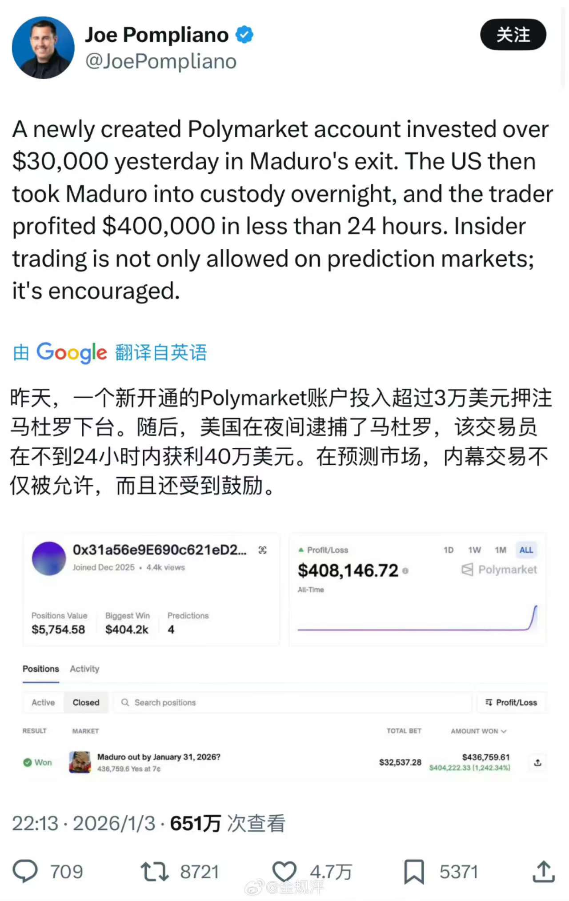

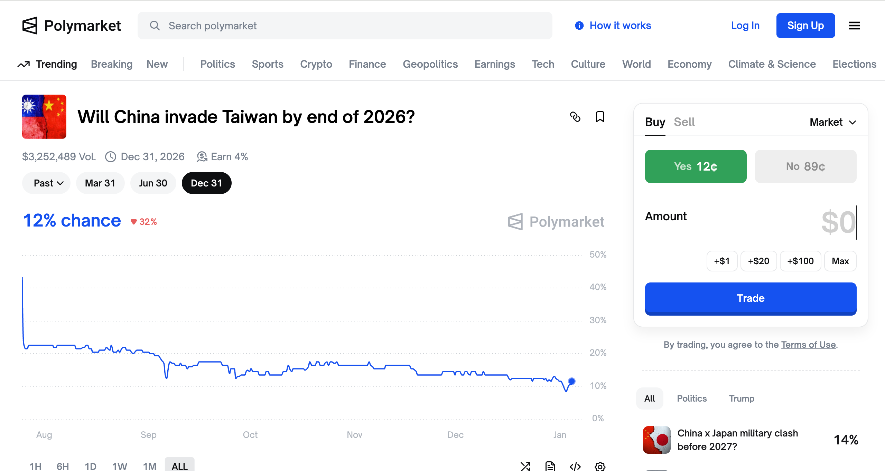

---

## 2026-01-07

### [21:48](https://m.okjike.com/originalPosts/695e643fc5a1d4e64930693d)
最近使用 notebooklm + gemini cli 。一个学理论，一个开发进行实践，理解起来非常快，比以前看书看视频学习强多了

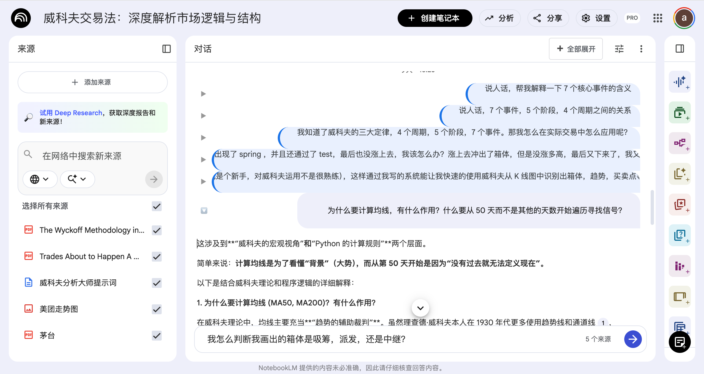

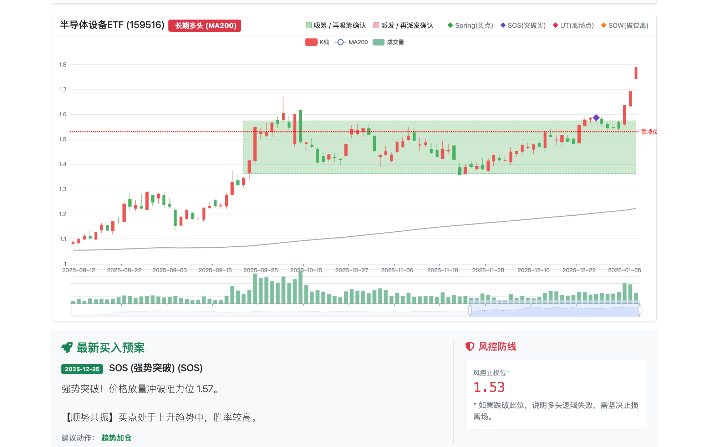

#工程师的日常

---

## 2026-01-08

### [16:02](https://m.okjike.com/originalPosts/695f64ab1af72ec03bfdf650)
反身性的市场里，往往是价格走势创造了叙事，而非叙事驱动了价格。当媒体终于为一段行情找到完美解释时，通常意味着行情已近尾声。

#小散户的日常

---

### [20:51](https://m.okjike.com/originalPosts/695fa835800201ac683238a0)
作为 notebooklm的重度用户，最近对其做了一些魔改，比如将常用的提示词嵌进去，直接选，再也不用复制粘贴了

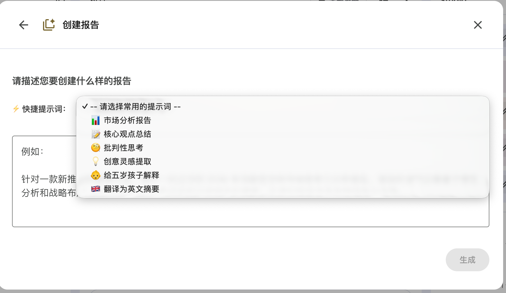

#AI探索站

---

## 2026-01-10

### [12:51](https://m.okjike.com/originalPosts/6961dab925bae56612972526)
长寿逃逸速度 (Longevity Escape Velocity)。当科技进步的速度每年能让你多活一岁以上时，你在理论上就实现了永生。

#无用但有趣的冷知识

---

## 2026-01-14

### [12:29](https://m.okjike.com/originalPosts/69671b9b800201ac68de0fbb)
美股研究证明，不到1%的交易日贡献了96%的市场收益。证明长期在场比精准择时更重要

#小散户的日常

---

## 2026-01-15

### [21:06](https://m.okjike.com/originalPosts/6968e6439f3cd84f65766320)
贾国龙的这个公关稿太差了，刚好看到卡克滋的这篇文章，用 ai 帮他分析了一下问题在哪里

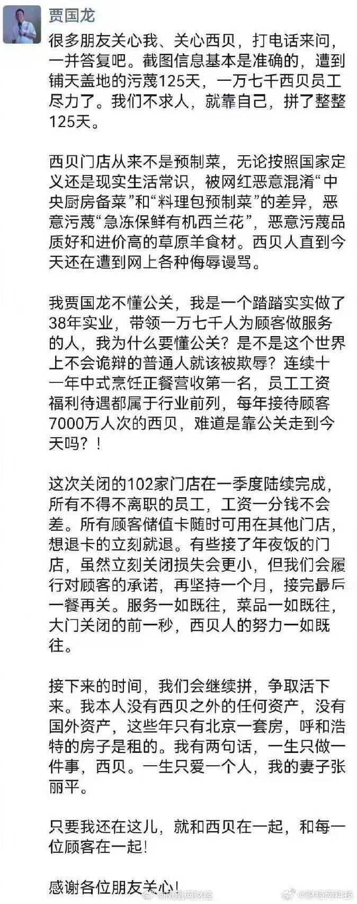

#AI探索站

---

## 2026-01-16

### [11:47](https://m.okjike.com/originalPosts/6969b4c925bae566124be113)
最近携程股价大跌，我先让 AI 帮我找一个合适的领域专家：塞思·卡拉曼 (Seth Klarman)，然后按照大佬的分析框架，用 deepresearch 找数据进行论证，并给出了相应的结论。

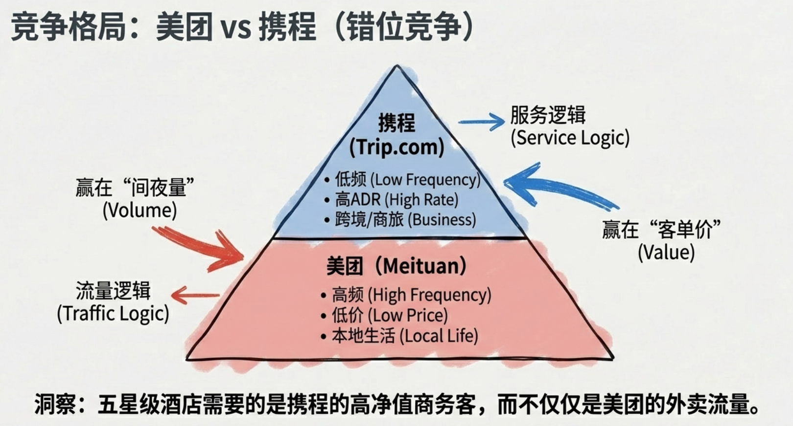

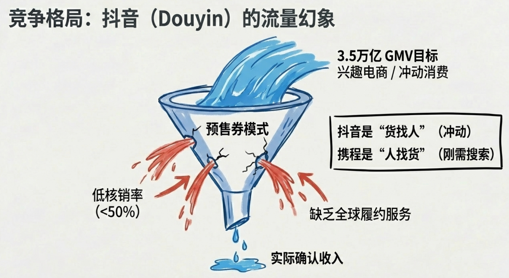

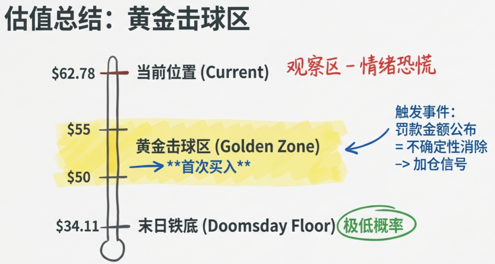

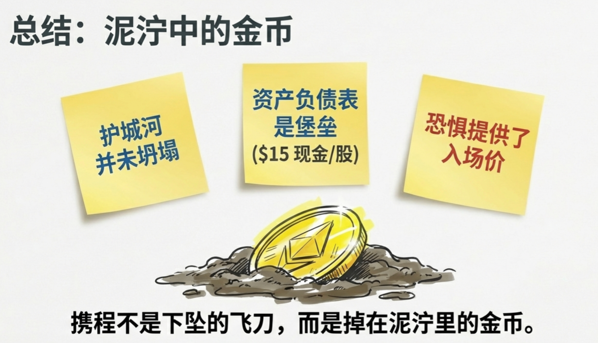

#小散户的日常

---

### [20:46](https://m.okjike.com/originalPosts/696a330dca2f17a62e23d2b5)
基民赎回意愿最强的区间是净值从 1.0 跌到 0.8 的时候（肉痛但舍得割）。一旦跌穿 0.5，基民反而会“装死”不动。为了保住管理规模（即保住管理费），经理可能会通过持有高波动股票，要么一把翻身，要么迅速跌穿心理防线让基民“锁仓”。

#你不知道的行业内幕

---

### [23:32](https://m.okjike.com/originalPosts/696a5a034e66427dd704287e)
为什么中国模式在过去 40 年看起来非常成功，而现在开始遇到瓶颈：

抄作业阶段（追赶期）：

目标是明确的（西方已经探明了路，比如我们要搞纺织、搞基建）。

此时，集权的高效执行力是优势。只要照着抄，谁动员能力强，谁就发展得快。

无人区阶段（创新期）：

当前方没有路了（需要搞 AI、搞生物制药）。

此时，中央也没法“计划”出下一个风口在哪里。

这时候，集权体制**“压制异见、扼杀自由探索”的副作用就开始显现。因为创新需要的是混乱中的自由**，而不是整齐划一的服从。

#浴室沉思

---

## 2026-01-17

### [10:45](https://m.okjike.com/originalPosts/696af7d09f3cd84f65a80fe8)
Nokia 3310 vs iPhone
比特币 就像 Nokia 3310。它非常坚固、稳定，甚至可以挡子弹，但它的功能仅限于“打电话”（转账记账）。你无法在上面安装应用程序。
以太坊 就像 iPhone（智能手机）。通话只是它的基本功能之一。它是一个操作系统，开发者可以在上面编写各种应用程序（DApps），无论是游戏、金融服务（DeFi）还是社交软件。

#Web3研究所

---

### [11:14](https://m.okjike.com/originalPosts/696afe9c3f4a772b30831df3)
如果你不知道你的利润来自于哪里，那么你就是利润的来源。

#小散户的日常

---

## 2026-01-22

### [14:51](https://m.okjike.com/originalPosts/6971c8d5800201ac68dbc2e8)
不要与央行（或证监会）作对。

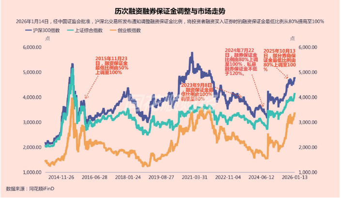

#小散户的日常

---

### [19:31](https://m.okjike.com/originalPosts/69720a9ec5a1d4e649fe8790)
旧王退位，新王登基（比亚迪登顶）。
比亚迪在营收和利润上双双超越了长期霸主上汽集团
这不只是两家公司的排位变化，而是新能源（NEV）对燃油车（ICE） 的结构性替代。

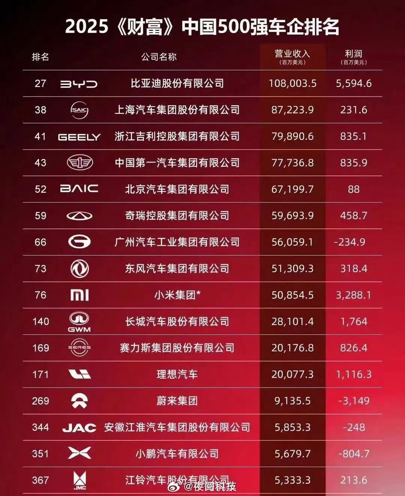

#你不知道的行业内幕

---

### [20:04](https://m.okjike.com/originalPosts/69721262800201ac68e31d2c)
看 ROCE 的人，像是在看一台提款机。他关心这台机器里总共有多少钱（包含闲钱），以及吐钱的速度。

看 ROIC 的人（巴菲特），像是在看一台印钞机。他把机器拆开，把里面没用的零件（闲置现金）拿掉，只看核心引擎的转速。他想知道，如果我往这个引擎里每加 1 升油（投入资本），它能印出多少张钞票？

#小散户的日常

---

## 2026-01-24

### [18:26](https://m.okjike.com/originalPosts/69749e6725bae566125304ad)
中证白酒etf在5年前高点入场网格交易，到现在还能赚钱，说出来你们可能都不信

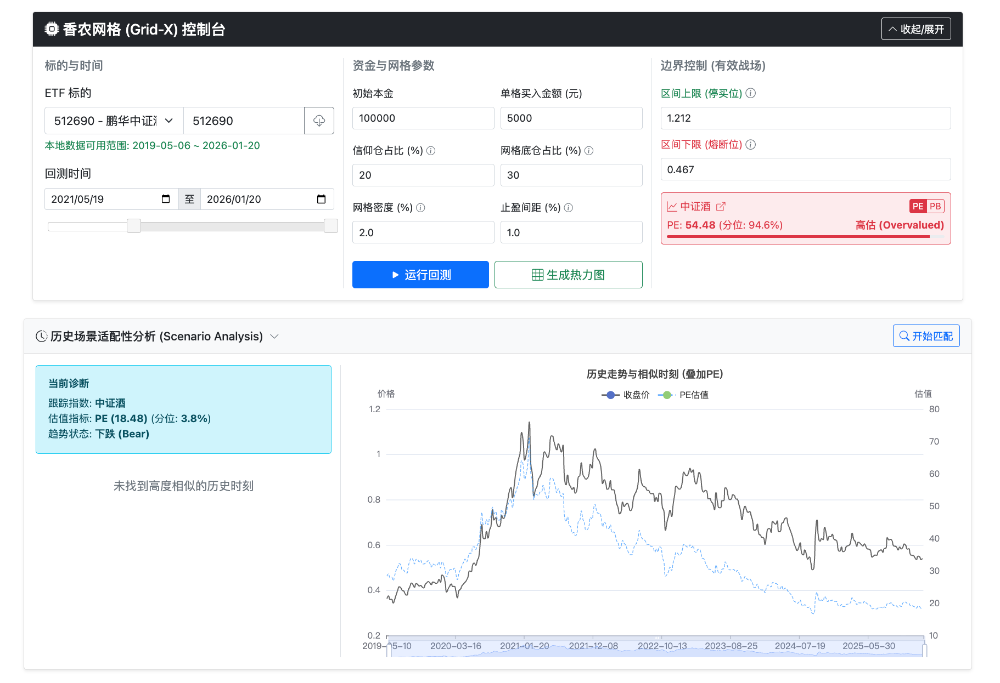

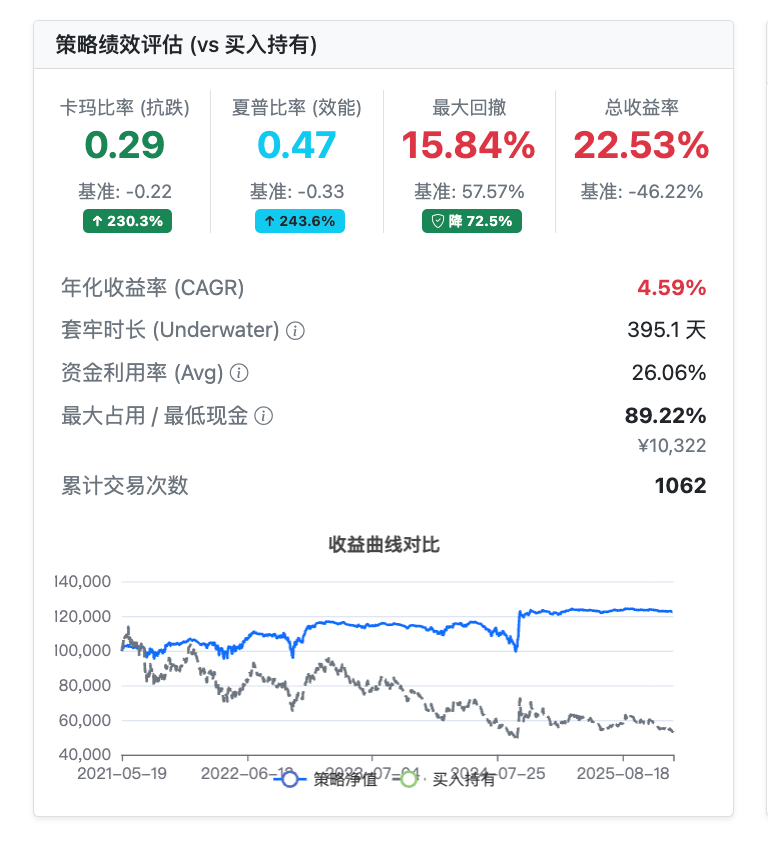

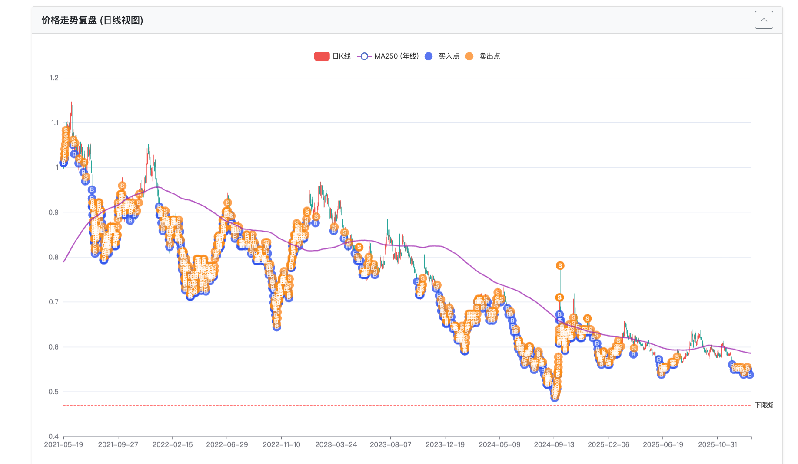

#小散户的日常

---

### [22:03](https://m.okjike.com/originalPosts/6974d11e25bae56612582770)
在 2026 年，没有规矩，只有交易。

#浴室沉思

---

## 2026-01-25

### [09:49](https://m.okjike.com/originalPosts/697576c625bae56612685074)
2025年，中国出生人口数据仿佛被按下了“时光倒流”键，一夜回到了1738年（清乾隆三年）。那时中国只有1.5亿人，而如今我们在拥有14亿人口、顶尖医疗和工业文明的加持下，繁衍能力却退化至前工业时代。

#你不知道的行业内幕

---

## 2026-01-28

### [23:31](https://m.okjike.com/originalPosts/697a2bd36fd3322fc3a8c1aa)
在方法论上向世界上最优秀的人学习，在结果上只和过去的自己比较。

#浴室沉思

---

## 2026-01-30

### [15:55](https://m.okjike.com/originalPosts/697c63df9f3cd84f654e087f)
顺着人性做事，逆着人性做人。

#浴室沉思

---

### [16:26](https://m.okjike.com/originalPosts/697c6b219f3cd84f654ec92d)
国有企业占据了太多的核心资源，这就好比古代皇帝的后宫有三千佳丽。结果呢？皇帝一个人占着资源，外面就有三千个壮汉找不到对象（私企和年轻人没机会）。更绝的是，为了维持这种局面，甚至还得把有些壮汉变成“太监”。

#浴室沉思

---
