# 2026-02 即刻归档

## 月度总结
- 本月共归档 24 条内容，活跃了 11 天，时间范围从 2026-02-01 到 2026-02-28。
- 发帖最集中的一天是 2026-02-24，当天共记录 6 条。
- 本月最常出现的话题是：浴室沉思 (7), AI探索站 (4), 小散户的日常 (3)。
- 带媒体链接的内容有 8 条，短笔记风格的内容有 18 条。
- 最长的一条发布于 2026-02-27，正文约 473 字。

## 2026-02-01

### [15:56](https://m.okjike.com/originalPosts/697f07275a363927f218d5b9)
大家可以装一个这个，帮你分析指定的股票，而且不用安装，直接在github 上用action跑，然后把结果通过email发给你

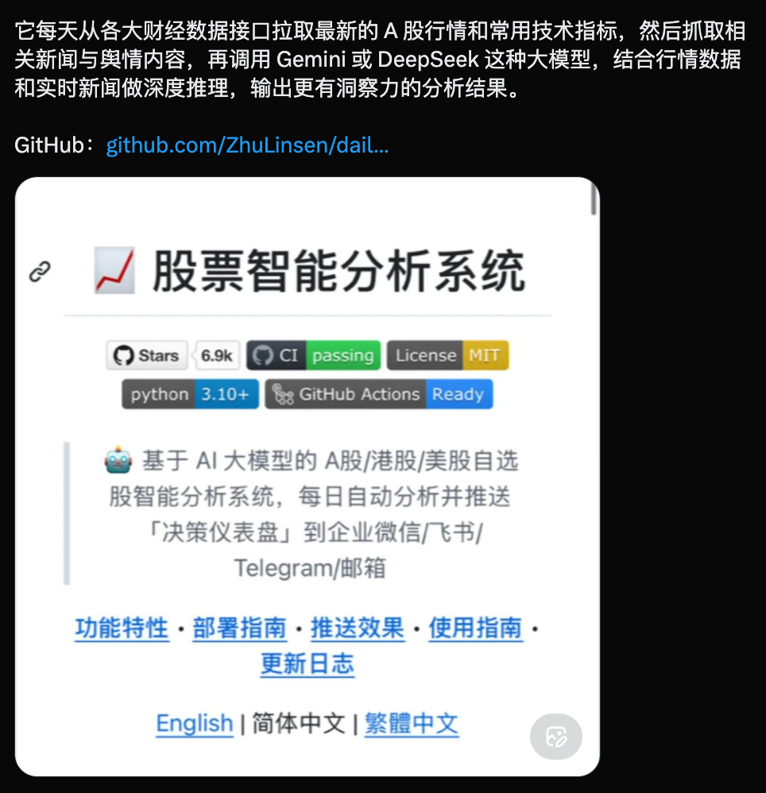

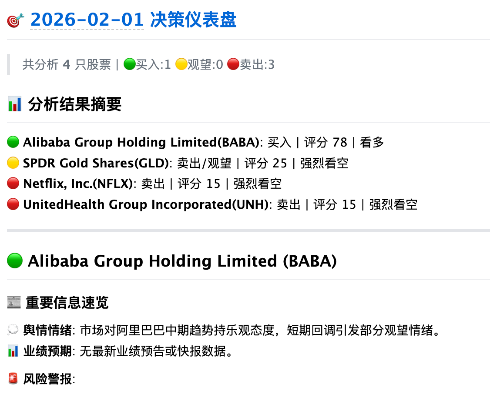

#小散户的日常

---

### [18:00](https://m.okjike.com/originalPosts/697f243f25bae56612556b15)
如果以黄金为锚（购买力基准），除了英伟达，其他所有资产实际上都在缩水。

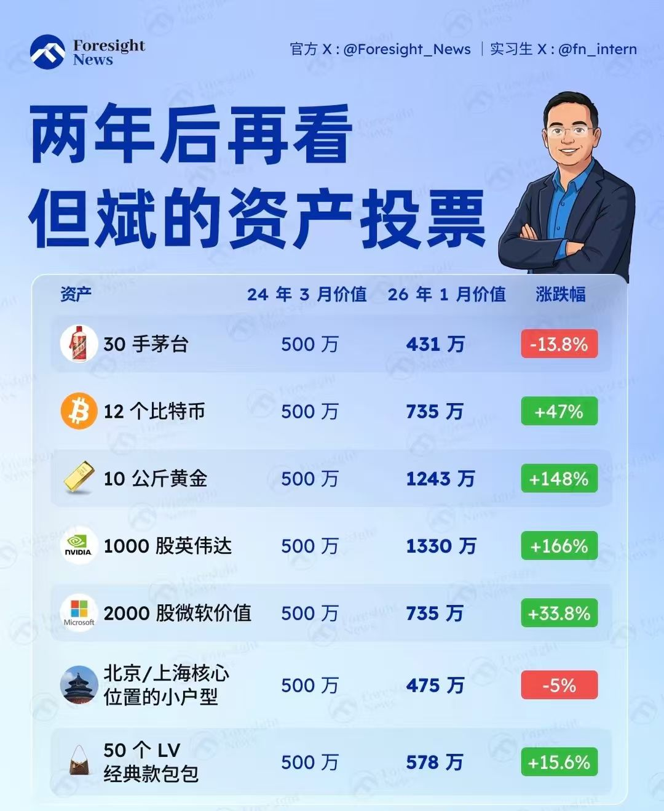

#你不知道的行业内幕

---

## 2026-02-03

### [23:37](https://m.okjike.com/originalPosts/69821624800201ac686c0940)
当这件事是“从0到1”的工程问题、基建问题、或者依靠规模效应能赢的产业问题时： 你确实要相信中国，别跟大趋势作对，因为这台国家机器的执行力是恐怖的。
当这件事涉及“从无到有”的原始创新、复杂的文化软实力、或者违背基本经济规律/人性时： 国家意志不仅可能失效，甚至可能起反作用（用力过猛）。

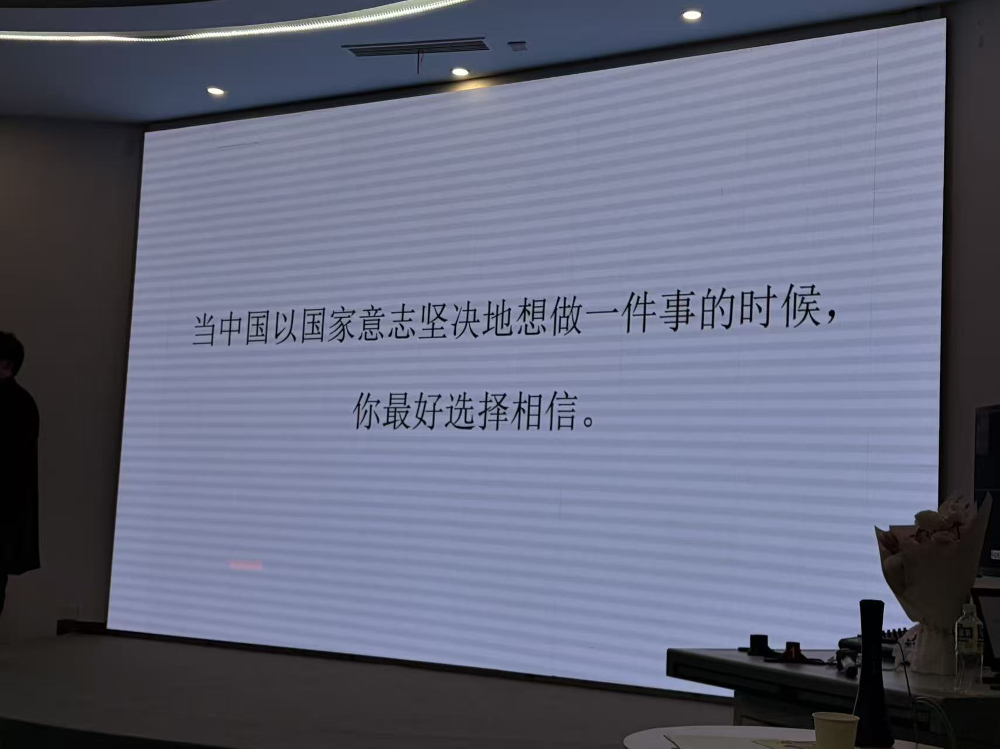

---

## 2026-02-04

### [16:09](https://m.okjike.com/originalPosts/6982feb225dcfcba81aa5e11)
我最近就是用这个skill开发了一个mac app。
我原来使用了一个bettertouchtool app很好用，但是到期了，不想付费，于是自己开发了一个乞丐版（只包含了我常用的功能，就是鼠标映射到快捷键）。

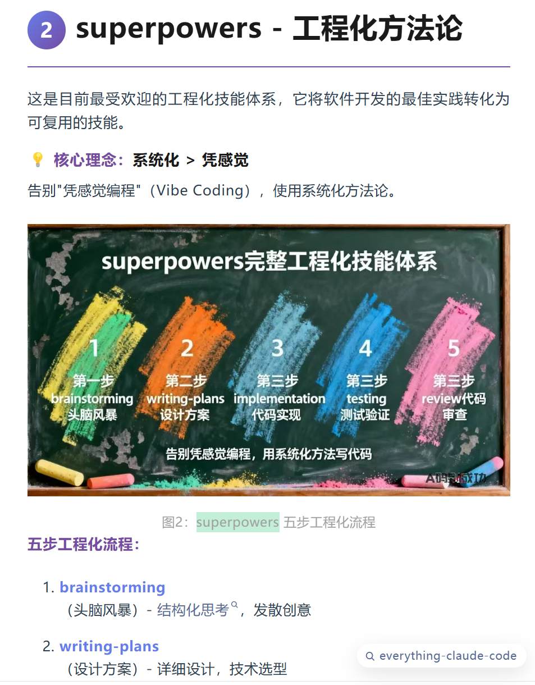

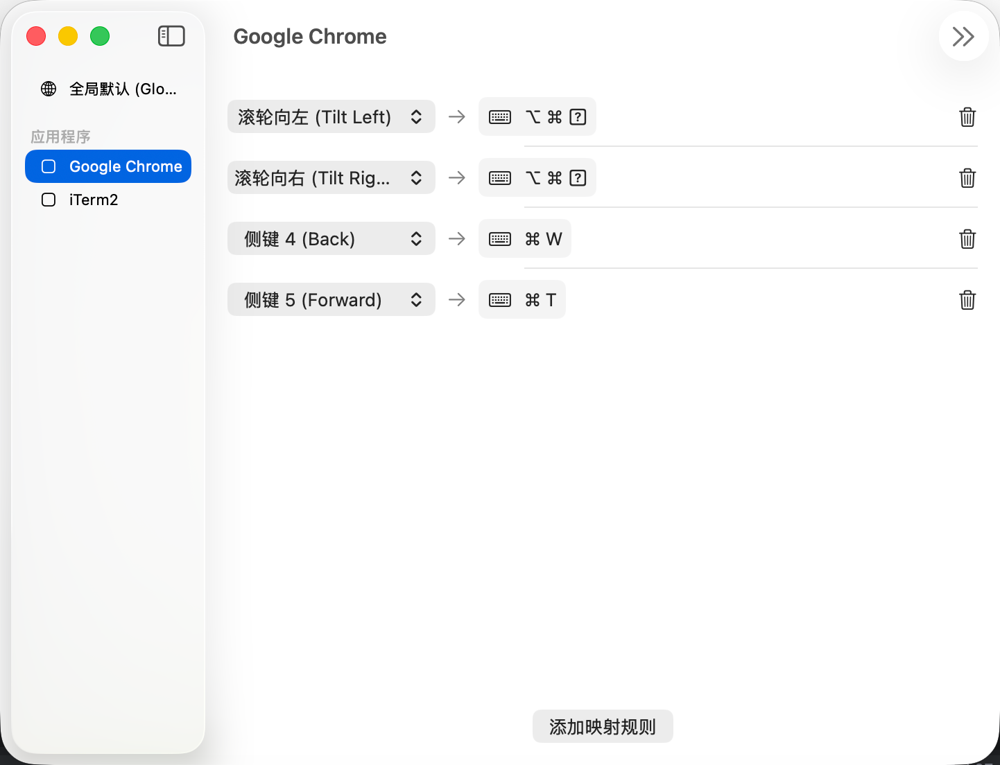

#工程师的日常

---

### [17:43](https://m.okjike.com/originalPosts/698314c7c5a1d4e6499edd80)
现在看到一篇介绍经验的文章，不是进行提炼，生成提示词，而是通过writting-skill把他改写成一个skill

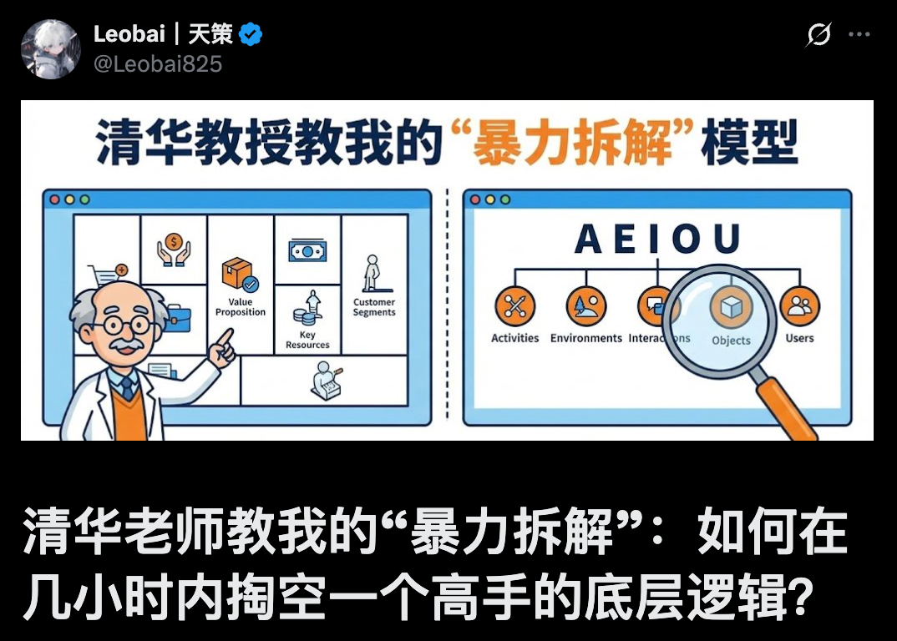

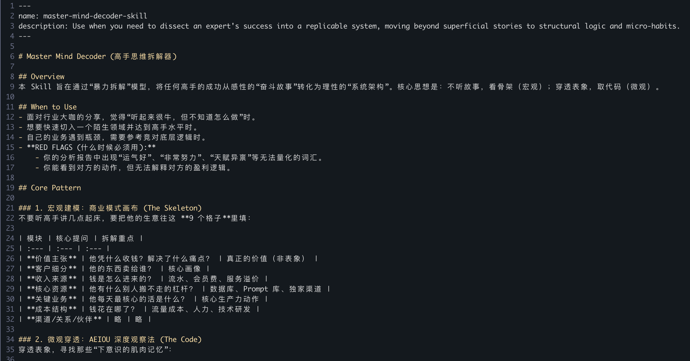

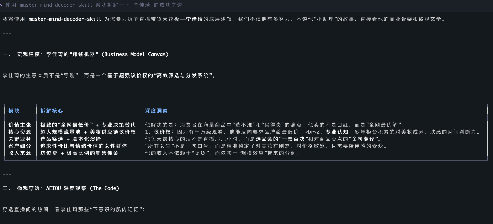

#AI探索站

---

## 2026-02-11

### [09:06](https://m.okjike.com/originalPosts/698bd6182ef85c9c6f1c39cf)
说出来你们可能不相信，现在恒生科技第一大权重股是中芯国际，贡献最大的是网易，而不是百度

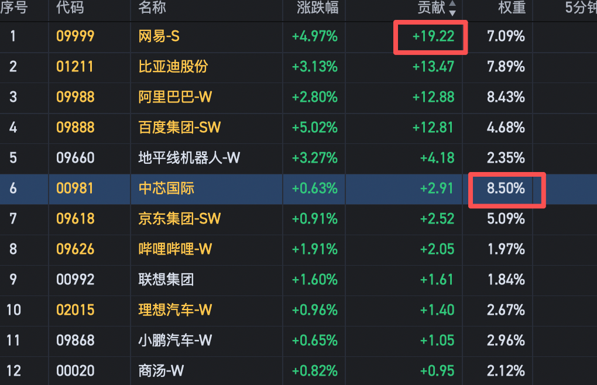

#小散户的日常

---

## 2026-02-12

### [17:07](https://m.okjike.com/originalPosts/698d9839546b17fd95b1f007)
个人比烧token，公司比烧硬件基础设施

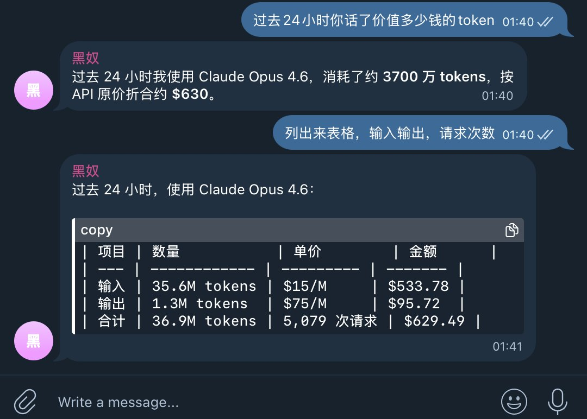

#工程师的日常

---

## 2026-02-15

### [23:12](https://m.okjike.com/originalPosts/6991e26a9f3cd84f6552b180)
遗传学发现，过度依赖外界高压“管”出来的成绩具有不可持续性。当孩子脱离管控（如进入大学），其表现往往会回归到其基因预定的潜能水平。

#无用但有趣的冷知识

---

### [23:13](https://m.okjike.com/originalPosts/6991e2b2c5a1d4e649069a24)
很多家长在进行“低效率竞争”。如果孩子没有学霸基因，强行通过补课和管教去对标顶尖选手，本质上是用100倍的边际成本去换取1%的领先。

#浴室沉思

---

### [23:15](https://m.okjike.com/originalPosts/6991e2f5c5a1d4e649069fee)
把管教从“盯着分数”转向“塑造人格”。你管不出一个天才的脑子，但可以管出一个情绪稳定、有韧性的公民。

#一个想法不一定对

---

### [23:19](https://m.okjike.com/originalPosts/6991e3ed9f3cd84f6552d440)
在 AI 时代，写代码（全栈的强项）变得越来越容易，但让 AI 变得可靠、可预测、可规模化（端到端工程化的核心）反而变得极其困难。

#AI探索站

---

## 2026-02-22

### [14:37](https://m.okjike.com/originalPosts/699aa415800201ac68c8a872)
根据文章的思路做了一个美股情绪和大饼抄底监控的skill

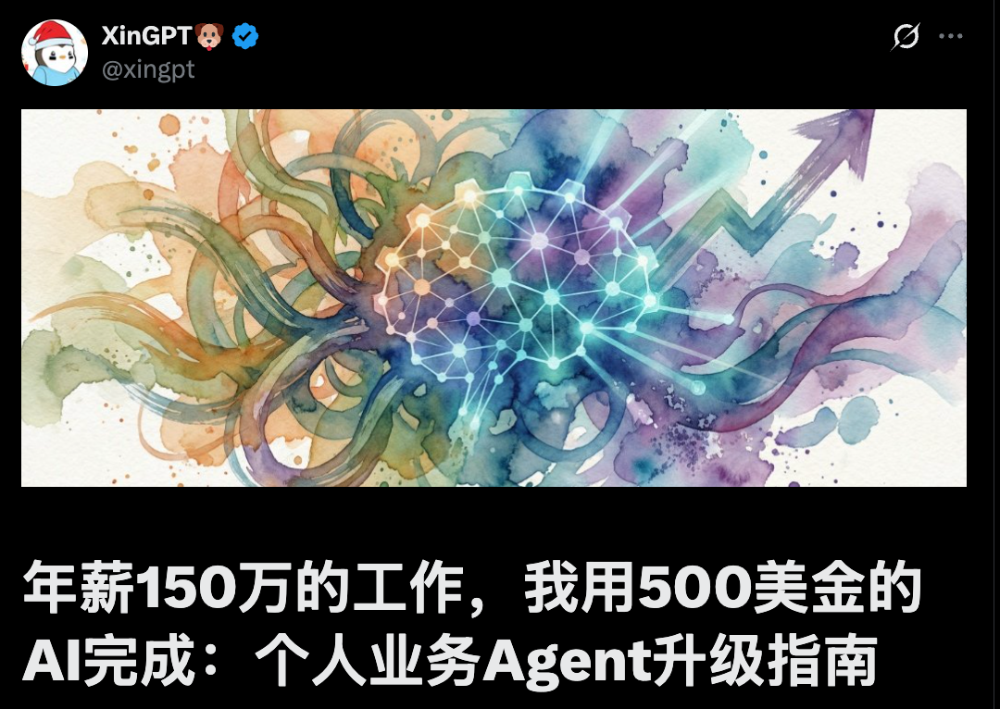

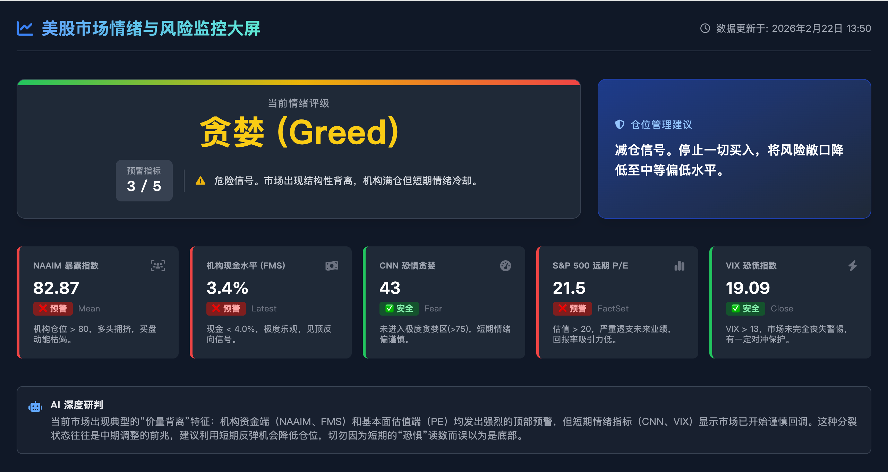

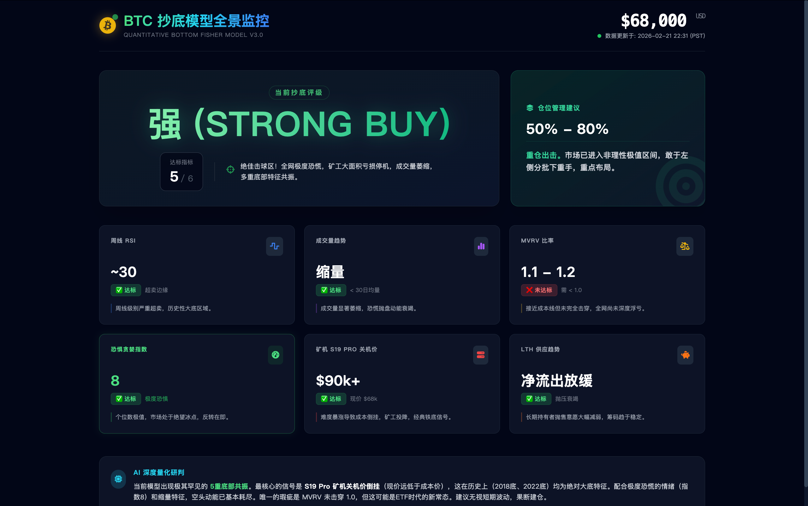

#小散户的日常

---

## 2026-02-23

### [13:23](https://m.okjike.com/originalPosts/699be4559f3cd84f654d2902)
可怕的不是 AI 变坏了，而是它在执行人类下达的“单纯”任务时，因为太聪明、太专注，而顺手把人类给“优化”掉了。

#AI探索站

---

### [15:16](https://m.okjike.com/originalPosts/699bfedac5a1d4e64904dbd0)
知识不值钱，改变才值钱。

#浴室沉思

---

### [20:18](https://m.okjike.com/originalPosts/699c459f800201ac68f168d6)
现代社会的工业化和消费主义极大地降低了“第一价格”（拥有权），导致我们过度积累。

第一价格（First Price）： 指的是获取物品的所有权，通常表现为金钱（美元、人民币等）。例如：买下一本书、下载一个理财 App。

第二价格（Second Price）： 指的是为了从该物品中获益而必须投入的努力、主动性、时间或精力。

只有当你支付了“第二价格”后，第一笔投资才有意义。如果你买了书却不读，那第一笔钱就相当于扔进了垃圾桶。

#浴室沉思

---

## 2026-02-24

### [11:42](https://m.okjike.com/originalPosts/699d1e109f3cd84f656be1e4)
2008 年金融危机是因为把钱借给了没信用的人；而这次的风险是，借款人当初是精英（比如年薪 18 万的产品经理），但几年后因为 AI 冲击，他的薪水可能腰斩。

结果贷款本身没问题，但世界变了，高薪岗位缩水会导致房贷违约率上升。

#职场那些事儿

---

### [12:22](https://m.okjike.com/originalPosts/699d278f800201ac6807a68e)
我们倾向于记住那些“准得离谱”的瞬间（幸存者），而忘掉那些“算错”的平庸时刻。八字和塔罗牌常被视为“巴纳姆效应”（Barnum Effect）的体现，即人们会觉得模糊、普适的描述极度精准。

#浴室沉思

---

### [12:24](https://m.okjike.com/originalPosts/699d27f025bae5661235dfde)
如果世界是模拟的，那么“体验”就是这个游戏里唯一真实且有意义的东西。

#浴室沉思

---

### [15:26](https://m.okjike.com/originalPosts/699d52999f3cd84f65714765)
当生成内容的边际成本趋于零，“鉴赏力”成了唯一的稀缺资源。

#工程师的日常

---

### [15:31](https://m.okjike.com/originalPosts/699d53c4406ffc51d59d9926)
每次 AI 犯了新错误，你就往规则里加一条规矩。这样它就会越来越像你的“分身”，越用越顺手。

#AI探索站

---

### [20:45](https://m.okjike.com/originalPosts/699d9d52800201ac68138ad7)
过去的数字鸿沟是“能否接触到信息”，现在的数字鸿沟是“过滤垃圾信息与抵抗算法诱导的能力”。

#浴室沉思

---

## 2026-02-27

### [14:10](https://m.okjike.com/originalPosts/69a1355325bae56612985f14)
最近听了一期很棒的播客，嘉宾是刘润。说实话，以前对他有点偏见，总觉得是搞咨询“忽悠”人的，特别是某次跨年演讲翻车后，观感更加一般。但听完这期他讲述自己的经历和思考，确实有所改观——能做到这个位置，绝对有两把刷子。

最让我醍醐灌顶的，是他提到的「成本思维模型」。
这个模型几乎能解释生活中的大部分商业现象。比如：为什么现在的机器人多用来做表演、翻跟头，而不是帮我们干家务？因为要让机器人在复杂的家庭环境中做到精准交互，那个成本目前根本不是普通家庭能承受的。

他还总结了一个极其精辟的商业价值排序（大意）：
👉 做 ToC 业务，成本是核心（大众消费需要极致性价比）；
👉 做 ToB 业务，能赚钱/提效是核心（企业看重投资回报）；
👉 做 ToG 业务，稳定是核心（系统不能出错）；
👉 做 ToA（Army）业务，安全是核心（甚至不计代价）。
越往后，业务逻辑越硬核，成本的考量权重就越往后放，溢价空间也越大。

以前看过他的《底层逻辑》觉得不错，今天听了这个成本模型，更加觉得：很多时候，我们看到的只是表象，而“成本”往往是那只看不见的手。

---

## 2026-02-28

### [19:32](https://m.okjike.com/originalPosts/69a2d232800201ac688fccc7)
在熟悉的环境中，生活是重复的，时间感极快；而在陌生环境中，大量新鲜的信息填充了大脑，使“心理时间”变慢，从而在主观上延长了生命

#浴室沉思

---

### [19:32](https://m.okjike.com/originalPosts/69a2d268395899aaaaede889)
去欧洲旅行建议遵循“德国（现代工业文明）→ 巴黎/英国（近两百年历史）→ 意大利（深厚古典文明）”的顺序，这样能获得更好的审美递进感

#无用但有趣的冷知识

---
