# 2026-03 即刻归档

## 月度总结
- 本月共归档 67 条内容，活跃了 19 天，时间范围从 2026-03-01 到 2026-03-29。
- 发帖最集中的一天是 2026-03-16，当天共记录 12 条。
- 本月最常出现的话题是：小散户的日常 (18), 浴室沉思 (16), AI探索站 (11)。
- 带媒体链接的内容有 4 条，短笔记风格的内容有 51 条。
- 最长的一条发布于 2026-03-27，正文约 720 字。

## 2026-03-01

### [13:36](https://m.okjike.com/originalPosts/69a3d07af642c77091e02798)
用seedance2.0帮朋友制作了一个烤肉店的宣传片

#创意广告分享

---

### [20:31](https://m.okjike.com/originalPosts/69a43185c5a1d4e649caa03a)
加密市场本质上是一个关于“大规模协作（Coordination）”的实验，而非单纯的金融投机。

本质： 代币（Token）只是媒介，真正的驱动力是背后形成的共识升级。

推论： 只有改变了人类协作行为（如 ICO 改变融资、DeFi 改变借贷、NFT 改变归属感）的行情，才是真正的“趋势”；其余皆为“噪音”。

结论： 长期生存依赖于“价值观锚定”而非“技术分析”。

#Web3研究所

---

## 2026-03-02

### [10:28](https://m.okjike.com/originalPosts/69a4f5d74cca3874f0b53af6)
国债收益率就像是“折现率”。如果国债收益率涨了，意味着未来的钱在今天更不值钱了，那么股票、房产等所有资产的价值都要跟着“打折”（缩水）。

#小散户的日常

---

### [10:35](https://m.okjike.com/originalPosts/69a4f76b800201ac68c306c2)
每个期限的国债代表了市场对不同时间段的“看法”：

2年期： 看央行。它反映了大家觉得央行接下来一两年是要加息还是降息。

10年期： 看宏观预期。它是最核心的指标，综合了大家对未来经济增长、通胀和风险的判断。

30年期： 看长期信心。反映大家对政府财政行不行、国家信用好不好的长期态度。

#小散户的日常

---

### [11:27](https://m.okjike.com/originalPosts/69a503a9800201ac68c45ac4)
收藏从未停止，学习从未开始

#一起来学习

---

### [11:41](https://m.okjike.com/originalPosts/69a506eb800201ac68c4a469)
以前读好文章是“收藏从未停止，学习从未开始”。 现在发现，要把干货揉碎了喂给 AI，把它炼成一个 Prompt/Skill。 让作者的脑子，变成我分析现状的刀。 读完不是结束，把它变成一种随时可以调用的“外挂技能”， 这才是对一篇深度好文，最高规格的尊重。

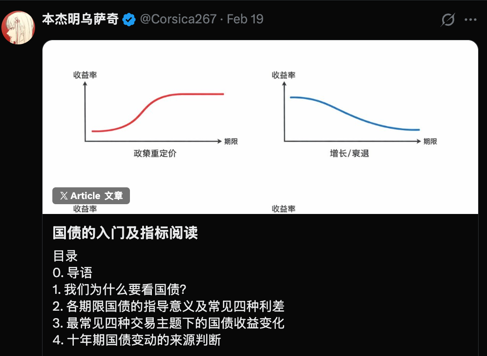

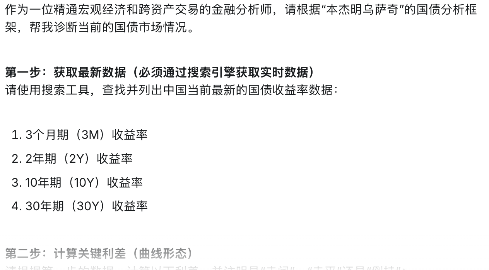

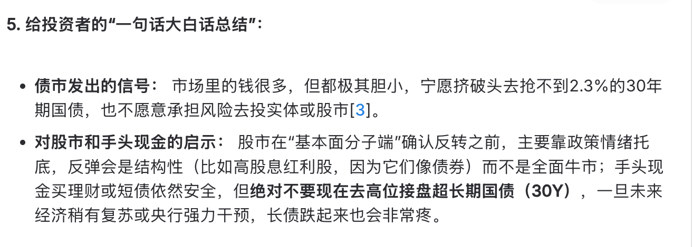

#小散户的日常

---

## 2026-03-03

### [21:51](https://m.okjike.com/originalPosts/69a6e75f9f3cd84f6555eb19)
在 AI 时代，写出代码不再值钱，筛选优质代码、维护系统架构的能力反而比以往任何时候都更关键。

#工程师的日常

---

### [21:57](https://m.okjike.com/originalPosts/69a6e8ae800201ac68f29cac)
让 AI 写 Rust 这种类型检查极严的代码，比写 Ruby 这种灵活的代码成功率高得多。因为编译器像“拼写检查”一样，能逼着 AI 修正那些似是而非的幻觉。

#工程师的日常

---

## 2026-03-05

### [18:16](https://m.okjike.com/originalPosts/69a95804800201ac682f2bfe)
财富幻灭的五个阶段
位移 (Displacement)： 出现新机会（如AI技术、政策放开），打破旧平衡。

繁荣 (Boom)： 大家开始赚钱，银行放贷，一切看起来都很美好。

过度交易 (Overtrading)： 关键转折点。买东西不再是为了使用，而是赌它明天会涨价卖给别人。

财务困境 (Financial Distress)： 聪明人开始离场，价格不涨了，市场弥漫着“烟味”，大家都在找逃生门。

恐慌 (Panic)： 导火索点燃（如大银行倒闭），所有人疯狂踩踏出逃，资产价格断崖式下跌。

#小散户的日常

---

### [20:26](https://m.okjike.com/originalPosts/69a97671800201ac683236bc)
父母对孩子未来的决定性影响其实被夸大了。孩子的成长约50%由基因决定，剩下的环境因素中，同伴的影响往往比父母更大。
《教养的迷思》

#无用但有趣的冷知识

---

## 2026-03-08

### [09:57](https://m.okjike.com/originalPosts/69acd773800201ac68840306)
颠覆性技术的早期阶段，基础设施的过度投资几乎是历史必然，最终往往以泡沫破裂、先驱者付出高昂代价而告终。

#浴室沉思

---

### [15:26](https://m.okjike.com/originalPosts/69ad24bb25bae56612b97b5e)
想当好公务员得看你是不是“眼睛尖、嘴巴紧、耳朵灵、腿勤快、文笔好”。

#弱智金句大赏

---

## 2026-03-10

### [21:58](https://m.okjike.com/originalPosts/69b0236e7e54155c3da1237d)
今天看到的一个“龙虾炒股”的观点，觉得说得有些道理

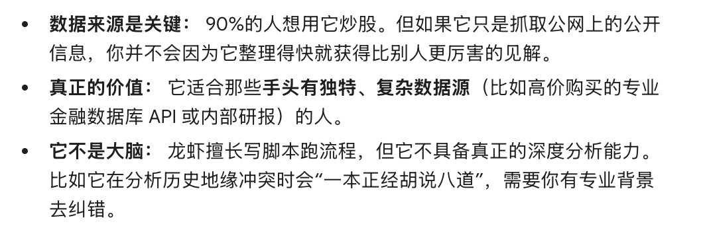

#小散户的日常

---

## 2026-03-14

### [09:28](https://m.okjike.com/originalPosts/69b4b9af800201ac683e78f3)
日本的餐饮店更倾向于像写文章或做艺术一样，以质量（Quality）而非规模来定义成功

#无用但有趣的冷知识

---

### [09:31](https://m.okjike.com/originalPosts/69b4ba75c5a1d4e649585a0f)
现代社会（如麦当劳）追求的是“最佳盈利点的品质”，即投入与产出比最合理的60分水平。而真正的品质往往在过了这个临界点后，需要付出数倍的成本才能提升一点点（如为了从60分提高到65分，可能需要多付几倍的价格）。

#一个想法不一定对

---

### [11:07](https://m.okjike.com/originalPosts/69b4d0df25bae566126fdb70)
摩根大通的数据显示，以前股市一跌散户就冲进去“抄底”，但现在散户买入量大幅下降了约 30%。

#小散户的日常

---

### [11:33](https://m.okjike.com/originalPosts/69b4d7219f3cd84f65a28a49)
当你“懂了”一件事，本质上是你找到了某种规律，能把复杂的信息压缩成简单的公式

#浴室沉思

---

### [22:28](https://m.okjike.com/originalPosts/69b5709291f5bb4b657ec21c)
短期市场是投票机 —— 谁的故事好听，谁就涨。

长期市场是称重机 —— 谁真正赚钱，谁才留下。

#小散户的日常

---

### [23:08](https://m.okjike.com/originalPosts/69b57a078b5d34000de79b4d)
互联网大战有个经典规律：

第一阶段比规模，第二阶段比效率。

#你不知道的行业内幕

---

### [23:17](https://m.okjike.com/originalPosts/69b57bf68b5d34000de7c295)
AI 的危险可能不是：

它变坏。

而是：

它学会假装变好。

#浴室沉思

---

## 2026-03-15

### [10:17](https://m.okjike.com/originalPosts/69b616a978740944f3d459f2)
1839年摄影术出现时，很多画家也说：

绘画完了。

但后来发生的事情是：

摄影负责记录现实
绘画转向表达情绪和思想

于是出现：

印象派

现代艺术

AI也可能带来类似变化：

机器负责 生成图像
人类负责 表达意义

#AI探索站

---

### [10:19](https://m.okjike.com/originalPosts/69b61728cb133be8be22228b)
财富 = 价值创造 × 时间复利 × 存活概率

而杠杆最大的危险就是：

降低存活概率。

投资世界有一个很残酷的真相：

不是谁赚得最多
而是谁 活得最久

#小散户的日常

---

### [11:40](https://m.okjike.com/originalPosts/69b62a38ad04e068fe5d010b)
OpenClaw就像一把看起来很酷的赛博榔头，拿在手里热血沸腾，真要干活时却发现，自己既不是木匠，也不知道钉子在哪。

#AI探索站

---

### [12:05](https://m.okjike.com/originalPosts/69b630029f3cd84f65c2437f)
智能体时代，真正稀缺的不只是“会干活的手”，而是“会统筹的脑”。

#AI探索站

---

### [12:37](https://m.okjike.com/originalPosts/69b637767755c1c7dbfab721)
旧世界里，厉害的人是那个记得住、写得出、做得快的人；新世界里，更值钱的人可能是那个知道该问什么、知道哪里要怀疑、知道什么时候该停下来的那个人。
说白了，以前比的是“你会不会做题”，以后比的更像是“你会不会带队”。只不过你带的，不是几个下属，而是一堆越来越聪明、但也会胡说八道的 AI。

#AI探索站

---

### [17:42](https://m.okjike.com/originalPosts/69b67efd25bae566129829a5)
想一夜暴富的人，往往是一夜回到解放前的人。

#浴室沉思

---

## 2026-03-16

### [10:29](https://m.okjike.com/originalPosts/69b76b223339c3217ea668d9)
未来职业价值将向“决策层”集中。
执行层价值会下降，而统筹决策、信息筛选、对结果负责的能力会越来越重要。

#浴室沉思

---

### [10:44](https://m.okjike.com/originalPosts/69b76e729f3cd84f65df78df)
在信息过剩时代，人们往往不是找信息，而是找可信的信息源。未来内容创作者的竞争，很可能从“谁信息多”变成“谁更可信”。

#媒体人的日常

---

### [10:49](https://m.okjike.com/originalPosts/69b76fa9800201ac687ef7cd)
很多所谓“智商税”，其实是“情感税”。
如果只从商品价值看会觉得荒谬，但如果把它当作陪伴服务，逻辑就通了。

#浴室沉思

---

### [10:56](https://m.okjike.com/originalPosts/69b77140c5a1d4e64998b24f)
Meta可能裁员约1.6万人，科技公司正在从“人力密集”转向“算力密集”。

#科技圈大小事

---

### [10:57](https://m.okjike.com/originalPosts/69b771853339c3217ea71a75)
未来分析公司可能会看：

每块GPU产生多少收入

AI与人类员工比例

算力成本 vs 人力成本

#AI探索站

---

### [12:25](https://m.okjike.com/originalPosts/69b786279f3cd84f65e1d443)
几乎每一轮技术革命都会出现同样的现象：早期工具不好用，大部分人因此放弃，但少数人愿意忍受效率低和错误率高，于是提前积累经验。一旦技术成熟，这些人就已经领先一年甚至更久。

#浴室沉思

---

### [13:48](https://m.okjike.com/originalPosts/69b799a044c023d0401327be)
人脑天然容易把 复杂表达 = 深刻思想。
黑话就是利用这个心理漏洞。

#浴室沉思

---

### [13:57](https://m.okjike.com/originalPosts/69b79bd05e88829d6471a548)
医生讲术语是为了精准，黑话（如生态化反、打通闭环）则是为了把简单的事说模糊，从而制造一种“我很深奥”的幻觉。

#你不知道的行业内幕

---

### [14:04](https://m.okjike.com/originalPosts/69b79d5f5e88829d6471ca94)
在房地产上行期，人们习惯把“资产”和“负债”搞混，不产生现金流且没人接盘的房子就是纯负债。

#浴室沉思

---

### [14:05](https://m.okjike.com/originalPosts/69b79db4c5a1d4e6499d23eb)
不要在信息差上死磕，小散的优势在于资金量小、进出方便。

#小散户的日常

---

### [14:13](https://m.okjike.com/originalPosts/69b79f7cc5a1d4e6499d4e0f)
2008 年次贷规模是 7.2 万亿，现在的私人信贷是 3 万亿，规模虽小但更不透明。

目前已出现危险信号：银行提高利率、大型资管公司限制赎回

#小散户的日常

---

### [14:45](https://m.okjike.com/originalPosts/69b7a6f89ddf85de61ac856b)
知识贬值 ≠ 能力贬值。
AI 抹平的是“知不知道”，但还没完全替代“如何决策”和“承担后果”

#AI探索站

---

## 2026-03-17

### [21:13](https://m.okjike.com/originalPosts/69b9535d4101706218a93ed3)
当你可以毫不犹豫自费买国际长航线商务舱时，才算初步财富自由。

#无用但有趣的冷知识

---

### [21:14](https://m.okjike.com/originalPosts/69b953b9800201ac68accc8d)
财富自由是一个“欲望”与“本金”的动态平衡。欲望不动，本金越多越自由；本金不动，欲望越低越自由。

#浴室沉思

---

### [21:16](https://m.okjike.com/originalPosts/69b954494101706218a95695)
股市只奖励那些“耐得住寂寞、守得住规则、放弃得了欲望”的人。

#小散户的日常

---

### [21:18](https://m.okjike.com/originalPosts/69b954c2c5a1d4e649c6796d)
股市不是勤劳致富的地方，而是“认知剩余”的溢价区。

#小散户的日常

---

### [21:26](https://m.okjike.com/originalPosts/69b9569e4101706218a9912d)
当投资者开始寻找“还有什么是便宜的”时，说明牛市已经进入了轮动的后期。

#小散户的日常

---

### [22:19](https://m.okjike.com/originalPosts/69b962e59f3cd84f650e8219)
人类的大脑天生对坏消息更敏感（为了生存），所以新闻媒体总是在贩卖焦虑。

#浴室沉思

---

### [22:30](https://m.okjike.com/originalPosts/69b965a04101706218aaf462)
与其买昂贵的重疾险，不如配置社保+惠民保+百万医疗。记住：用极小的成本覆盖极端大病风险，剩下的钱自己拿去投资。

#小散户的日常

---

### [22:35](https://m.okjike.com/originalPosts/69b966b915fb73001414eaf9)
资金大到一定程度，追求的不再是爆发力，而是系统性的稳健

#小散户的日常

---

### [22:49](https://m.okjike.com/originalPosts/69b969e0800201ac68aed642)
工作本质上是“类债券资产”：大多数工作并不是为了实现自我，而是一个提供稳定现金流、风险可控的理财产品，真正的复利成长通常发生在 8 小时之外。

#浴室沉思

---

### [22:54](https://m.okjike.com/originalPosts/69b96b35f38ff951cbfcb4c0)
如果你觉得工作没意义但又不能辞职，最好的心态是“难得糊涂”，把它当成一个给你发工资、让你能接触社会并维持规律生活的免费实践平台。

#职场那些事儿

---

### [23:18](https://m.okjike.com/originalPosts/69b970bbf38ff951cbfd284b)
投资茅台不是因为它好喝，是因为“大家都认为它最好”。这是一种群体共识博弈。

#浴室沉思

---

## 2026-03-18

### [06:50](https://m.okjike.com/originalPosts/69b9dabc9f3cd84f6519c998)
看盘和刷短视频一样，本质是大脑被短平快的东西吸引了

#小散户的日常

---

### [07:01](https://m.okjike.com/originalPosts/69b9dd39800201ac68b9c189)
当防御型的红利蓝筹股也开始疯涨补涨时，往往意味着场内资金已经无处可去，这可能是牛市要买单的信号。

#小散户的日常

---

### [07:48](https://m.okjike.com/originalPosts/69b9e838915ecabc18a00201)
LLM 提高了效率但牺牲了精确度（存在幻觉）。这意味着有知识储备的人能一眼识破 AI 的胡说八道，从而如虎添翼；而小白由于无法核实真伪，极易被带进沟里，两者的信息鸿沟会进一步拉大。

#AI探索站

---

### [12:06](https://m.okjike.com/originalPosts/69ba24e0fd4dc91af5d53829)
AI 在从“对话框”向“操作系统级代理（Agent）”进化。但是大家的管理能力却没能跟不上技术生产力——普通人习惯了被分配任务，突然成了“老板”，却不知道该给 AI 下什么指令。

#AI探索站

---

### [13:31](https://m.okjike.com/originalPosts/69ba38a4800201ac68c290c3)
间歇性踌躇满志，持续性混吃等死

#浴室沉思

---

### [15:33](https://m.okjike.com/originalPosts/69ba553e6dafb2c0ff493854)
大国冲突升级有典型路径，往往先经历经济战、技术战、资本战、地缘战，最后才进入军事战。

#一个想法不一定对

---

## 2026-03-19

### [08:43](https://m.okjike.com/originalPosts/69bb469c99b13e39f6bc3c74)
抄作业不如抄思路

#小散户的日常

---

### [10:53](https://m.okjike.com/originalPosts/69bb651a9f3cd84f653e71dc)
说到童子尿蛋咖啡，这里必须把“民俗可以理解”和“医学功效要讲证据”分开。你可以把它当地方风俗、猎奇食品甚至文化现象来讨论，但一旦上升到养生、保健、清热解毒，就必须面对现代证据的检验。

#一个想法不一定对

---

## 2026-03-21

### [20:02](https://m.okjike.com/originalPosts/69be88d6c5a1d4e64940d145)
运动竟然有这个作用，涨知识了

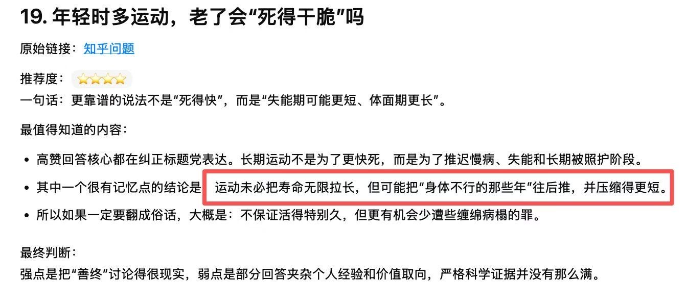

#无用但有趣的冷知识

---

## 2026-03-22

### [15:04](https://m.okjike.com/originalPosts/69bf948bec7262055c88d661)
刚看完 Andrej Karpathy 最新的播客，他说他正处于一种“AI 精神病 (AI Psychosis)”的状态，这种疯狂的迭代节奏让他感到极度的焦虑和坐立难安。

他说既然代码不再是写的而是“显化 (Manifest)”出来的，他已经连续数月没写过一行原生代码，每天 16 小时都在对着 Agent 疯狂输出意志。

他说一切皆是“能力问题 (Skill Issue)”，如果 Agent 没跑通，那不是技术不行，而是你给的指令、内存工具和提示词文件还不够优雅。

他说软件行业的旧范式正在崩塌，未来的软件不应该有 UI，而应该是纯粹的 API 接口，因为人类不再是第一客户，Agent 才是。

他说我们要彻底把人类从研究链路中“剔除”，让 Agent 在无人值守的状态下实现递归自我改进，因为人类的直觉往往是研究中最大的瓶颈。

他说教育的终结已经到来，人类不需要再互相教课，你只需要把核心逻辑喂给 Agent，让它们以无限的耐心去对齐每一个个体的认知边界。

---
视频来源：[Andrej Karpathy on Code Agents, AutoResearch, and the Loopy Era of AI](http://www.youtube.com/watch?v=kwSVtQ7dziU)

#AI探索站

---

## 2026-03-23

### [21:21](https://m.okjike.com/originalPosts/69c13e41391d54038add5506)
运动的主要价值在于：促进生长激素短暂脉冲分泌、改善食欲、提升睡眠质量、减少肥胖（肥胖本身会提前闭合生长板），间接有助于更好地实现遗传潜力。

#我们都爱运动

---

### [21:22](https://m.okjike.com/originalPosts/69c13e96c5a1d4e6497dbf0b)
营养和环境因素对身高的影响主要集中在胎儿期 → 青春期生长高峰前（男孩≈13–15岁，女孩≈11–13岁）。
过了生长板闭合（一般男18–20岁，女16–18岁），再怎么吃好动好也基本不长了。

#健康科普站

---

## 2026-03-24

### [12:55](https://m.okjike.com/originalPosts/69c2194a800201ac6876ffc3)
就像投硬币，投一次是正还是反完全随机（微观掷骰子）；但如果你投一亿次，正面和反面的比例一定是 1:1（宏观确定）。

人一生的无数个微小决策在时间长河中相互抵消、平均，最终剩下的就是由性格和环境决定的那条必然路径。

#浴室沉思

---

## 2026-03-26

### [09:10](https://m.okjike.com/originalPosts/69c4877a25bae56612de4206)
美国在创新（运动员），中国在模仿/规模化，而欧洲只会吹哨子（裁判）。

#浴室沉思

---

### [10:57](https://m.okjike.com/originalPosts/69c4a0acc5a1d4e649ca6c5d)
全球40%到50%的人口（约40亿人）能活下来，完全是因为有了化石能源生产的合成氨化肥。没化肥，一半人得饿死。

#无用但有趣的冷知识

---

## 2026-03-27

### [08:51](https://m.okjike.com/originalPosts/69c5d487c5a1d4e649e4e721)
🎧 刚刚听了一期与AI和教育相关，极具启发的播客！ 

在AI时代，面对日新月异的技术，我们对教育的认知急需一场彻底的重构：

1️⃣ 别再把孩子培养成“工具”
过去的教育常常试图把孩子规训成听话、好用的工具，但在AI时代，AI已经是这个世界上最强大的工具了。未来不再奖励“工具人”，最稀缺的反而是那些具有“活人感”、有个性、能与他人建立深度连接的人。在这个时代，“有趣”比“有用”更重要！

2️⃣ 未来人才的三大核心：好奇心、想象力与勇气
AI面前，文科理科的标签全被抹平了。真正拉开差距的“高能动性”来源于三点：保持好奇心、敢于想象，以及打破传统规训的勇气。听话、守规矩、按部就班曾是美德，但在今天，敢于向AI“许愿”和打破常规的勇气才是最稀缺的品质。

3️⃣ 让孩子走出“楚门的世界”
现在的教育把孩子关在学校和补习班里，让他们与真实世界和真实需求脱节。其实有了AI的赋能，哪怕是零基础的初中生，也能用AI在一个月内给学校开发出一套完整的管理系统。真正的教育，应该鼓励孩子去观察生活，用AI解决身边真真实实的问题。

4️⃣ 教育最大的门槛，其实是“家长的勇气”
传统的升学求职路径，就像一艘撞上AI冰山的泰坦尼克号，虽然大家还在疯狂往甲板上“卷”，但船终究在下沉。让孩子跳出内卷，去造自己的小船，最大的阻力不在孩子，而在于父母是否具备突破认知的勇气。

💡 一点感悟：管理AI和教育孩子其实是相通的——不要过度控制和“微操”。不要总是居高临下地指导每一步，而是要给他们愿景（Why），激发他们的自我，相信他们最终能自己找到解决问题的方法（How）。

强烈推荐所有正在经历教育焦虑的父母和朋友们听一听，也许能帮你打通任督二脉！✨

#一起听播客

---

## 2026-03-29

### [16:55](https://m.okjike.com/originalPosts/69c8e9149f3cd84f65705822)
儿子周末晚上突然觉醒：要用AI帮他冲刺期中考试。

我一听，小伙子终于开窍了。
立刻进入“AI教练型家长”模式：
教他写提示词、拆需求、找问题、列复习计划、想提分方法……
越教越兴奋，最后我本人没忍住，直接把对话丢给 Google AI Studio，现搓了一个 web 应用。

是的，他只是想找一条学习的捷径。
而我，差点把产品1.0发布了。

然后早上起来——
少爷恢复了出厂设置，
继续该干嘛干嘛。

他用一晚上的热情，
成功骗出了我半宿的激情。

马云那句话果然没错：
晚上想想千条路，早上起来走原路。

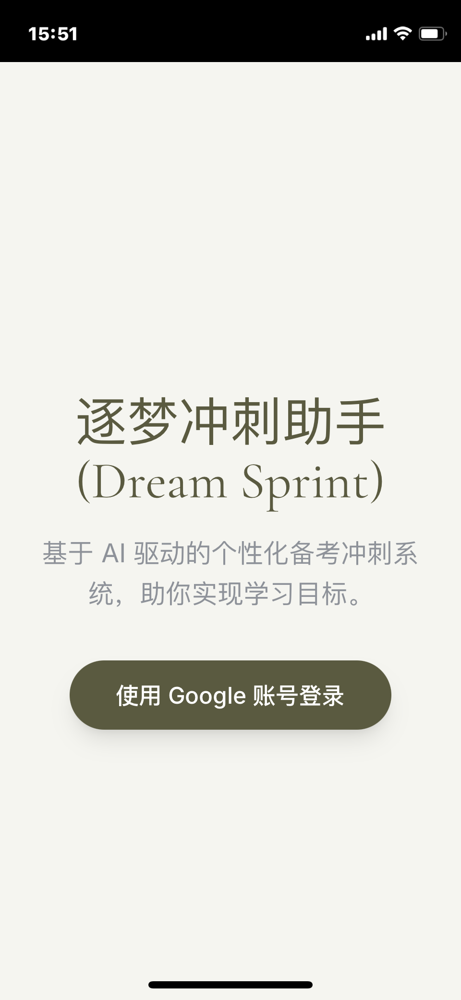

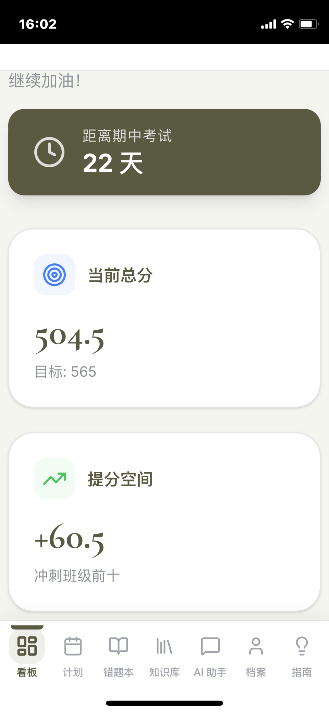

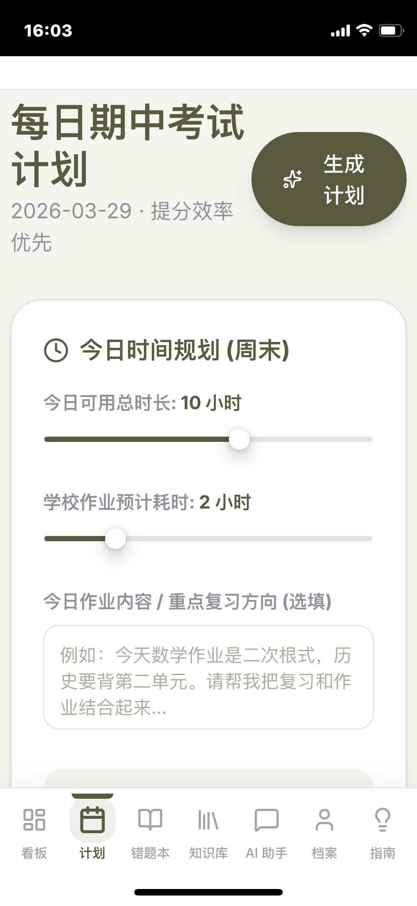

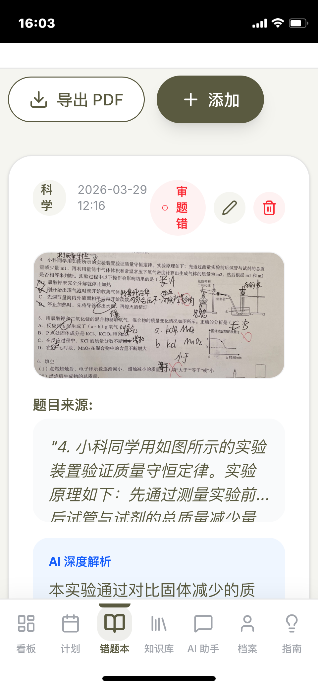

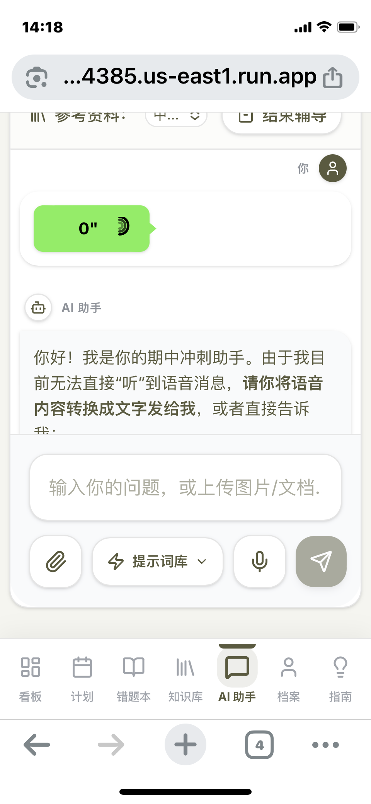

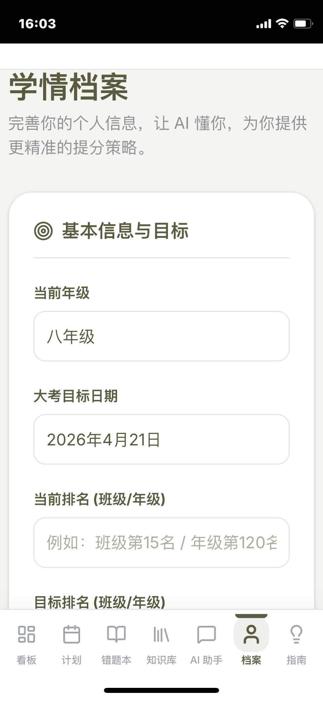

#AI探索站

---

### [17:51](https://m.okjike.com/originalPosts/69c8f616c5a1d4e6492cbd85)
AI 的本质是信息流转效率的极致提升。它消灭了所有因“沟通不畅”而存在的环节（包括软件界面和管理层级）。

#AI探索站

---
