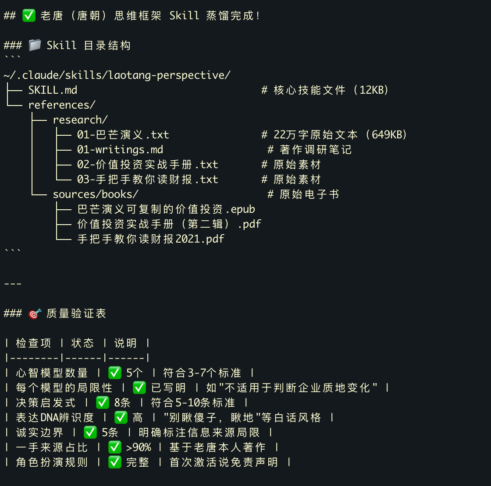

# 2026-04 即刻归档

## 月度总结
- 本月共归档 27 条内容，活跃了 11 天，时间范围从 2026-04-05 到 2026-04-29。
- 发帖最集中的一天是 2026-04-17，当天共记录 7 条。
- 本月最常出现的话题是：浴室沉思 (7), AI探索站 (7), 你不知道的行业内幕 (4)。
- 带媒体链接的内容有 1 条，短笔记风格的内容有 15 条。
- 最长的一条发布于 2026-04-18，正文约 200 字。

## 2026-04-05

### [14:17](https://m.okjike.com/originalPosts/69d1fe7225bae566121320a8)
如果发生医闹，第一反应是赶紧跑；跑不掉就钻到昂贵的医疗设备后面，因为打伤人可能赔不起，但打坏千万级的机器，医院可以通过法律手段追责。

#你不知道的行业内幕

---

### [14:19](https://m.okjike.com/originalPosts/69d1fefdc5a1d4e649fcb0c7)
现在医生在看病时，心里必须时刻装着一本账：

如果这个病医保只给 1 万元，但医生开了 1.5 万元的药和检查，那么超出的 5000 元可能需要医院甚至医生个人承担。

因此，医生必须精打细算，尽量使用性价比高的检查和药物，防止“超支”。

#你不知道的行业内幕

---

## 2026-04-08

### [12:23](https://m.okjike.com/originalPosts/69d5d84c60665741e9a761e8)
在泡沫的地方赚钱，在内卷的地方消费

#浴室沉思

---

## 2026-04-12

### [14:45](https://m.okjike.com/originalPosts/69db3f7f9f3cd84f6512b654)
周末用 hermes agent 盘了一下电脑里的电子文档。果不其然，大部分“收藏”等于“吃灰”😂。

借着现在 AI 圈流行的“蒸馏”概念，索性把这些压箱底的资料全喂给 AI，提炼成一个个专属的 skill。
以前是我辛辛苦苦囤资料，现在是提炼出的 skill 直接帮我干活。这波赛博断舍离，极度舒适了。

#AI探索站

---

## 2026-04-15

### [19:40](https://m.okjike.com/originalPosts/69df794250ac251af8932d49)
紫檀生长极其缓慢。要达到制作家具或工艺品所需的“心材”标准，通常需要 300 年至 800 年。

#无用但有趣的冷知识

---

## 2026-04-17

### [12:38](https://m.okjike.com/originalPosts/69e1b94525bae5661280e4dc)
为什么你明明讨厌做 PPT，却还得熬夜做？

因为表的颜色、行的对齐、PPT 的动画，本质上都是“劳动的痕迹”。

下属做表的过程，是向老板展示忠诚；老板看汇报的过程，是行使权力的时刻。

#职场那些事儿

---

### [12:58](https://m.okjike.com/originalPosts/69e1bdf34b079689b6beb340)
执行的边际成本正在归零，你再也没有“我不会”或者“我没时间”这种借口了。

当那个闪烁的光标不再索要你的汗水，它其实在向你提出一个最恐怖的拷问：

“我现在什么都能做到了，那么，你到底想要什么？”

#浴室沉思

---

### [14:18](https://m.okjike.com/originalPosts/69e1d0999520003c3b85f218)
自然语言的本质是描述世界（World），它的反馈模糊且低效；代码的本质是描述解决方案（Solution），它逻辑严密、可执行、且反馈闭环极短。代码是 AI 实现自我进化的唯一抓手。

#AI探索站

---

### [14:50](https://m.okjike.com/originalPosts/69e1d81825bae5661283f671)
一个灵魂拷问：
看着公司对国内用户几乎“赶尽杀绝”式的限制，Anthropic 的中国籍员工每天写代码时在想些什么？

#工程师的日常

---

### [15:03](https://m.okjike.com/originalPosts/69e1db3425bae5661284453a)
当智力变成一种计费资源，传统的流量叙事就彻底破产了。

#浴室沉思

---

### [15:22](https://m.okjike.com/originalPosts/69e1dfa0c5a1d4e6496de59b)
在你的日常工作中进行压力测试：如果你消耗 100 美金的 Token，能否创造出 110 美金甚至更高的价值？如果跑不通，说明你仍在使用 AI 聊天，而不是在驱动 AI 生产。

#AI探索站

---

### [15:23](https://m.okjike.com/originalPosts/69e1dfd8800201ac6854385a)
知识正变得廉价，审美（Taste）和对复杂任务的定义能力将成为人类最后的护城河。

#浴室沉思

---

## 2026-04-18

### [11:13](https://m.okjike.com/originalPosts/69e2f6c79f3cd84f65c77714)
狱长手里只有一颗子弹，却要管住 100 个死刑犯。他只需要宣布：谁逃跑就打死谁，但只打编号最大的那个。

100 号不敢跑，因为他是最大，必死；

99 号看到 100 号不动，意识到只要 100 号不跑，自己就是最大，也必死。

这个逻辑链条会像枷锁一样扣死每一个人。

这套系统的核心在于规则必须是公开宣布的。如果狱长只是私下里一个个告诉囚犯，大家就会心存侥幸，觉得别人不知道规则可能会带头冲锋。

#浴室沉思

---

### [14:43](https://m.okjike.com/originalPosts/69e3280e9f3cd84f65cc0c00)
提示词决定沟通质量，上下文决定记忆容量，而 Harness 工程则决定了行为的边界。

#AI探索站

---

## 2026-04-21

### [12:50](https://m.okjike.com/originalPosts/69e70224c5a1d4e649e6b0a9)
钩吻（断肠草）——毒性是氰化钾的11倍，3克致死。它长得和金银花很像，毒素耐高温，泡茶喝反而加速毒素析出。2023年深圳一家6口错把断肠草当五指毛桃煲汤，喝汤最多的2人死亡。从喝汤到死亡仅数小时，且目前没有特效药。

#无用但有趣的冷知识

---

### [13:18](https://m.okjike.com/originalPosts/69e708a38457fe30c711c625)
刚毕业时学历>能力，工作两年后能力>学历。

有些赛道从头到尾都不看学历，比如销售、主播、技术维修、小生意——客户只关心一件事：你能不能把我的空调修好？纠结「能力vs学历」就像问「跑步时左腿重要还是右腿重要」。

#职场那些事儿

---

### [13:39](https://m.okjike.com/originalPosts/69e70d908457fe30c712392e)
不要和不合理的教育制度硬碰硬，要学会优雅地绕过去，把省下来的精力花在真正能让你出类拔萃的地方。

#浴室沉思

---

### [14:42](https://m.okjike.com/originalPosts/69e71c6f90770b1c48f4f5bb)
「如果你同意 Apple 本身是 Jobs 最伟大的产品，那 Cook 其实也是个产品人。」Cook 的「产品」不是 iPhone，而是 Apple 这家公司——他把一家充满戏剧性的公司变成了一个可预测的、没有丑闻的、像日历一样运转的机构。

#苹果产品爱好者

---

### [17:47](https://m.okjike.com/originalPosts/69e7479d9f3cd84f652c017d)
人类穷其一生只能精通一两个领域，而 AGI 是全人类智慧的总和。到 2029 年，这种差距将不再是“聪明”与“平庸”的区别，而是“神”与“人”的维度差异。

#AI探索站

---

## 2026-04-22

### [09:22](https://m.okjike.com/originalPosts/69e822e2541d96e3ef17f565)
NVIDIA 存在的本质，是把电子（Electrons）变成 Token。

#浴室沉思

---

### [12:12](https://m.okjike.com/originalPosts/69e84ab825bae566121bf4a7)
免费吸引用户，付费实现盈利

#运营的日常

---

### [12:19](https://m.okjike.com/originalPosts/69e84c47ace7a2a724251d1c)
2025年中国汽车产能约4500万辆，实际需求约2800万辆，过剩率近40%。

#你不知道的行业内幕

---

### [13:46](https://m.okjike.com/originalPosts/69e860a19f3cd84f6545ba23)
我们可能已经见证了程序员身价的最高峰。以前，程序员之所以昂贵，是因为他们是“实现的瓶颈”——产品经理有个想法，得排队等四三周让程序员写出来。

现在，这个瓶颈正在消失。当实现的成本趋近于零，那些只会写代码、没有产品感、不关心业务逻辑的纯“实现者”将失去议价权。未来的核心竞争力不是“我会写这行代码”，而是“我懂得该不该写这行代码”。

#工程师的日常

---

### [17:10](https://m.okjike.com/originalPosts/69e890727d4f49cec6086743)
未来的高手，是那个能让 AI 理解复杂业务边界的人。

#AI探索站

---

## 2026-04-25

### [10:38](https://m.okjike.com/originalPosts/69ec2925164aa383fa5daf63)
矿泉水这种商品，水的成本确实很低，1瓶差不多是3分钱，但要把这3分钱的水灌装、封包、装箱、运输、铺货、上架，就变成了2块钱

#你不知道的行业内幕

---

## 2026-04-28

### [15:07](https://m.okjike.com/originalPosts/69f05c9b1d7479b642c46ae1)
AI 让一个身处二本的女生在面对北大这座大山时，不再觉得那是“不可触碰的神话”。与其说 AI 提供了知识，不如说 AI 提供了“底气”。如果换一个缺乏自律、完全依赖 AI 生成答案的考生，AI 反而会成为加速其思维退化的毒药。

https://mp.weixin.qq.com/s/0v-Yn5p02nzMjw5Z8-Enlw

#优质长文分享会

---

## 2026-04-29

### [10:03](https://m.okjike.com/originalPosts/69f166f1657481ea4ef74ebe)
只要有 AI，普通人就能轻松复刻出想要的东西。但可能事实恰恰相反，当执行力变得廉价，平庸的创意将比以往任何时候都更快地被淹没。

#AI探索站

---
