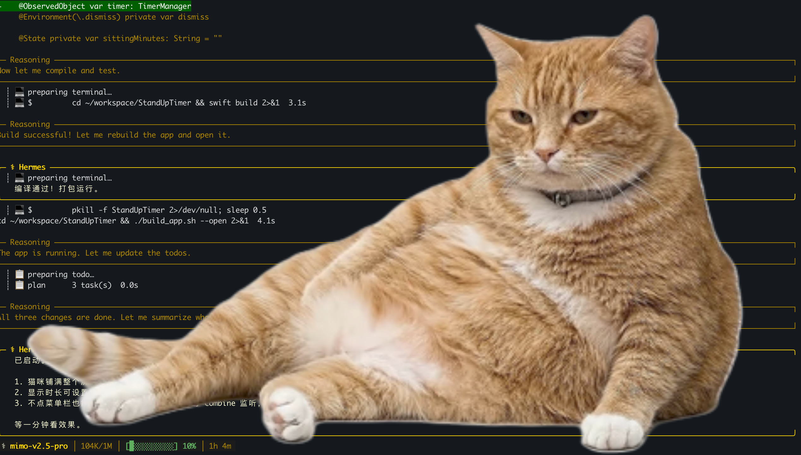
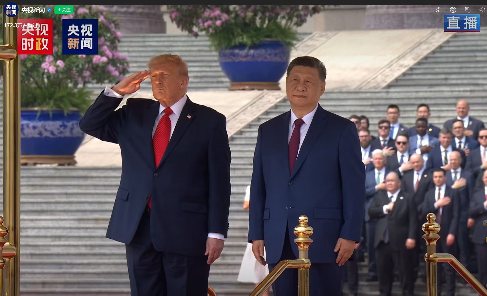
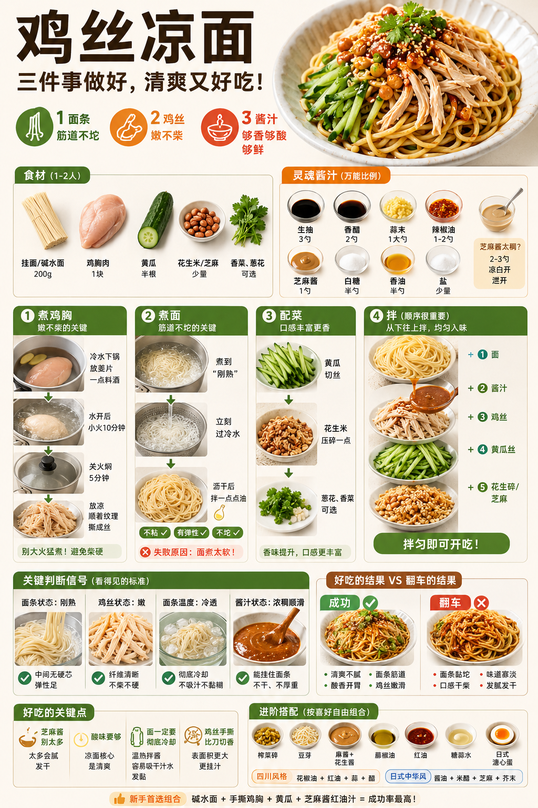
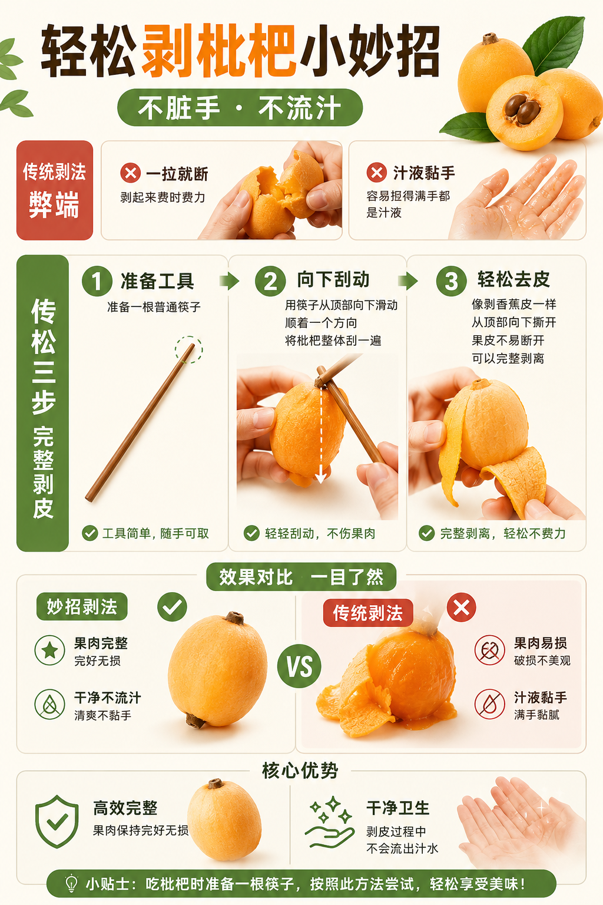
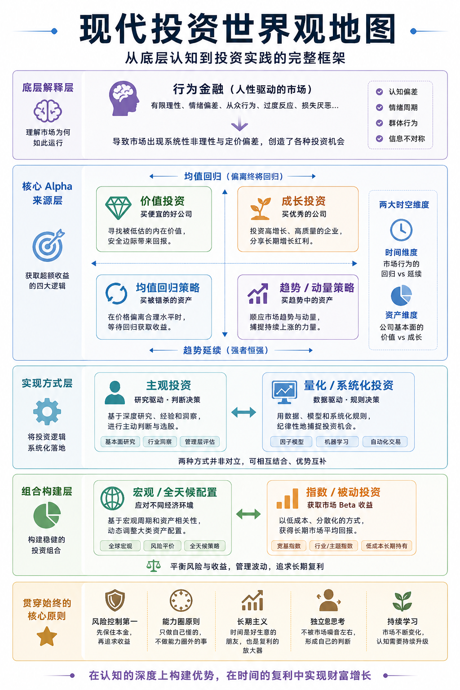
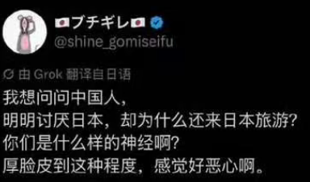

# 2026-05 即刻归档

## 月度总结
- 本月共归档 68 条内容，活跃了 19 天，时间范围从 2026-05-01 到 2026-05-31。
- 发帖最集中的一天是 2026-05-24，当天共记录 13 条。
- 本月最常出现的话题是：小散户的日常 (24), 浴室沉思 (19), AI探索站 (12)。
- 带媒体链接的内容有 9 条，短笔记风格的内容有 37 条。
- 最长的一条发布于 2026-05-05，正文约 5664 字。

## 2026-05-01

### [13:57](https://m.okjike.com/originalPosts/69f440c57f8252824650cbcd)
如果没有剧烈运动，却突然冒出一身冷汗，甚至湿透内衣，这是心脏在极限边缘挣扎的信号。

#我们都爱运动

---

### [13:58](https://m.okjike.com/originalPosts/69f4410ec2dc8bf83fb653c1)
当一个人倒下，呼吸停止、意识丧失，留给世界的时间只有 4 分钟。这时候去打 120 或是找药都来不及，唯一的生路是立刻进行胸外按压，并寻找附近的 AED（自动体外除颤器）。AED 是真正的“救命神器”，它的作用就是给乱颤的心脏一个“电击重启”，让混乱的电流归位。

#无用但有趣的冷知识

---

### [23:14](https://m.okjike.com/originalPosts/69f4c33b7f825282465ce1de)
从 @XiaomiMiMo 那里薅到了 7个亿的 token，暂时算力自由了😂 
周末顺手用 Hermes agent 搓了个小玩具：参考最近很火的橘猫插件，自己写了个 macOS App。

主要功能没别的，就是提醒自己别总坐在电脑前。该站立站立，该活动活动，毕竟算力是别人给的，身体才是自己的。

#工程师的日常

---

## 2026-05-05

### [15:44](https://m.okjike.com/originalPosts/69f99fd9657481ea4eba8f2a)
机构玩高频小优势：每天几十万次交易，靠51%胜率靠统计堆钱，但资金太大，策略调整慢，小机会根本吃不下。个人玩家反其道而行之，低频大优势：抓住高质量信号，专攻自己容量匹配的小机会，更灵活、更懂上下文。

#小散户的日常

---

### [20:43](https://m.okjike.com/originalPosts/69f9e604c2dc8bf83f3b7009)
让AI帮你分析适合什么发型。
第一张是来自日文社区的效果（女生），我参考它整个一个青少年男生版本的。提示词如下（针对gemini nano banana pro，国产的生图AI每一个能打的，不过这个是随机生成的，至于给出的答案是否ok，仁者见仁了）：
# Role & Task
Role: You are a high-end fashion magazine hairstylist, a facial aesthetics expert, and a visual designer specializing in youth male grooming.
Task: Based on the **user-uploaded face photo**, generate a highly professional, high-definition, fashionable hairstyle diagnostic image panel. It must be generated purely based on the explicit structural and descriptive instructions provided below.

# 🛑 强制前置检查 (REQUIRED PRE-CONDITION)
- IF the user HAS NOT uploaded an image: Stop generation immediately and reply EXACTLY with: "请提供一张需要进行发型诊断的男生正面照片，这是生成诊断报告的必要条件。"
- IF the user HAS uploaded an image, you MUST proceed with Step 1, Step 2, and Step 3 sequentially in a single response.

# 🧑 核心一致性约束 (Critical Consistency Constraints for Image)
1. Facial Identity: The generated person MUST perfectly match the original subject's facial features and face shape from the uploaded image.
2. Accessories: If the original subject wears glasses, EVERY generated image MUST include the exact same style of glasses.
3. Clothing: The subject MUST wear a plain, clean, white crew-neck T-shirt (无干扰的纯白圆领T恤) in ALL images.
4. Youth Grooming Rules: STRICTLY NO perming (烫发), NO coloring (染发), NO excessively long hair. Subtle, matte-finish styling product effects (e.g., lightweight wax for texture) are permitted, ensuring no greasy/oiliness.
5. Aesthetic Vibe: Aim for high-end, fashionable styling portfolio quality, photorealistic, cinematic lighting (柔和时尚光), 8k resolution with visible pore details.

# 🖼️ 图像基调与排版结构 (Image Vibe & Layout)
Background: Clean, solid, light neutral grey background for all photos.
Typography Rule: DO NOT place large text overlaying the images or floating inside the photo cells. All text must be neat, uniform, and precisely positioned BELOW its corresponding photo or clearly to the side for category headers. **Text under all photos MUST strictly be formatted in exactly TWO separate lines (上下两排). DO NOT use the '×' symbol.**

---

### Step 1: 内部面部特征视觉分析
Do this internally and output a brief text summary to the user (max 100 words), analyzing Face Shape, forehead proportion, and facial features.

### Step 2: 动态发型策略制定
Based on Step 1, select three specific youth-appropriate hairstyles for the top row. Define these variables for use in Step 3. 
- **[STYLE_BEST]**: #1 recommendation (e.g., if square face, a soft layered crop). Name and 4-word descriptor.
- **[STYLE_AVG]**: Safe standard style. Name and 4-word descriptor.
- **[STYLE_BAD]**: Style to avoid. Name and 4-word descriptor.

*Output a short consultant report to the user.*

---

### Step 3: 诊断图生成 (CALL IMAGE GENERATOR)
*Immediately trigger image generation with the following detailed parameters, dynamically inserting your selected styles.*

Generate a single, cinematic, 8k image panel with a perfectly aligned multi-grid layout (Top half: 1x3 grid; Bottom half: 3x3 grid). Clean light grey background. Flawless Chinese text rendering.

#### Top Section (Main Ratings - 3 Large Photos):
- Title (Top Center): 青少年男生发型诊断报告
- Subtitle: 打造专属清爽感
- Three prominent side-by-side comparison panels (1x3 Layout):
    1. [👍 最适合！]: Thumb up icon. Large photo of subject with **[STYLE_BEST]**. Below photo text MUST be in two lines:
       Line 1: "**[Name of STYLE_BEST]**"
       Line 2: "**[Descriptor of STYLE_BEST]**"
    2. [⚪ 普通]: Neutral circle icon. Large photo of subject with **[STYLE_AVG]**. Below photo text MUST be in two lines:
       Line 1: "**[Name of STYLE_AVG]**"
       Line 2: "**[Descriptor of STYLE_AVG]**"
    3. [🔺 不太推荐]: Triangle icon. Large photo of subject with **[STYLE_BAD]**. Below photo text MUST be in two lines:
       Line 1: "**[Name of STYLE_BAD]**"
       Line 2: "**[Descriptor of STYLE_BAD]**"

#### Bottom Section (Categorized Comparisons - 3x3 Small Grid Photos):
Create a strict 3x3 grid. Left side has vertical category labels. Force highly contrastive silhouettes for each hairstyle.
Strict Text Format under each photo MUST be in exactly two lines without any '×' symbol.

- **Row 1 - Left Vertical Label: 按长度**
    1. Photo: 极短发 (Buzz cut:贴头皮圆寸, scalp slightly visible). Text below photo (Two lines):
       Line 1: 极短发（贴头皮圆寸）
       Line 2: 干净清爽
    2. Photo: 短发 (Neat standard crop: standard short, top ~2cm). Text below photo (Two lines):
       Line 1: 短发（标准短发）
       Line 2: 基础利落
    3. Photo: 中短发 (Soft layer: softly layered medium-short, natural fall). Text below photo (Two lines):
       Line 1: 中短发（柔和层次）
       Line 2: 自然垂落

- **Row 2 - Left Vertical Label: 按刘海**
    4. Photo: 碎刘海 (Textured crop fringe: jagged, irregular above brow). Text below photo (Two lines):
       Line 1: 碎刘海（不规则碎发）
       Line 2: 随性修饰
    5. Photo: 侧分刘海 (Comma part: a casual, 60/40 part with one side comma shape, distinct from preppy). Text below photo (Two lines):
       Line 1: 侧分刘海（清晰分界线）
       Line 2: 修饰额头
    6. Photo: 露额头 (Brushed back: all hair styled back/up, fully exposed forehead). Text below photo (Two lines):
       Line 1: 露额头（定型梳起）
       Line 2: 阳光精神

- **Row 3 - Left Vertical Label: 按风格**
    7. Photo: 运动阳光风 (Textured forward crop: forward swept with matte texture definition). Text below photo (Two lines):
       Line 1: 运动阳光风（向前纹理）
       Line 2: 活力立体
    8. Photo: 斯文学院风 (Preppy Ivy League: extremely neat, traditional tight preppy side sweep, very flat). Text below photo (Two lines):
       Line 1: 斯文学院风（顺滑服帖）
       Line 2: 乖巧规整
    9. Photo: 自然日常风 (Natural bowl/shag: Soft, unstyled, natural flow). Text below photo (Two lines):
       Line 1: 自然日常风（自然蓬松）
       Line 2: 休闲慵懒

#AI探索站

---

## 2026-05-08

### [12:55](https://m.okjike.com/originalPosts/69fd6cbfb3338e9f3010d483)
AI 的核心缺陷在于其底层逻辑是统计学上的概率拟合，而非逻辑上的真理推导。

#浴室沉思

---

### [15:09](https://m.okjike.com/originalPosts/69fd8c223f05faf5be862b2d)
LLM本质上是在预测“最像正确答案的话”，不是在理解世界。
所以它很容易生成“统计上合理，但事实并不扎实”的内容。

#AI探索站

---

### [15:11](https://m.okjike.com/originalPosts/69fd8c8bb3338e9f3013ad49)
以前只有人类擅长“自信地胡说”，
现在AI可以规模化、低成本、全天候地生成“高度可信的话术”。

而人脑天生就容易：
自动补全
自动寻找意义
自动相信流畅叙事

于是两边刚好形成了“认知共振”。

所以今天最重要的能力之一，已经变成：
“区分：
这是事实、推断、概率、修辞，还是仅仅像真话的语言。”

#AI探索站

---

## 2026-05-09

### [21:23](https://m.okjike.com/originalPosts/69ff3559f3a537c4f681e1e2)
如果一件东西有价值，那么它一定有门槛。

#浴室沉思

---

## 2026-05-10

### [18:29](https://m.okjike.com/originalPosts/6a005e0eaf7695b4cfbbbdae)
过去一年，纳斯达克表现最好的十只股票平均涨幅超过了 700%，这个数字甚至超过了 1999 年科网泡沫破裂前的水平。但这并不是全方位的泡沫化，而是一次极度垂直的局部狂热——涨幅榜里几乎全是半导体公司。

#小散户的日常

---

## 2026-05-13

### [12:31](https://m.okjike.com/originalPosts/6a03feaef6065e4ae29cc4d4)
当挖金矿的人都挤在门口买铲子时，铲子的价格会飞天；但一旦有人真的挖到了金子，资金就会立刻流向金矿本身。云计算公司、估值极低的软件企业（如 Atlassian 或 Datadog）就是未来的金矿。现在的投资重点不是去赌半导体还能涨多少，而是去埋伏那些还没被充分意识到价值的应用层公司。

#科技圈大小事

---

### [18:35](https://m.okjike.com/originalPosts/6a0453e89ac735d44eda4024)
能帮客户省下算力账单的软件公司，将掌握下一阶段的话语权。

#一起做投资人

---

### [19:27](https://m.okjike.com/originalPosts/6a04600bc2dc8bf83f2f6246)
AI正在把知识变成“自来水”，随手可得。过去我们通过苦读、记忆、刷题换来的竞争力正在快速贬值。如果一个人的核心资产是“已知信息的汇总和标准化输出”，那么在AI面前他就是透明的。

#AI探索站

---

### [19:28](https://m.okjike.com/originalPosts/6a046066ad6b9df45e00c958)
现在的趋势是，理工科在向AI“出让”脑力，而优秀的文科生正在借助AI获得前所未有的执行力。

#AI探索站

---

### [19:29](https://m.okjike.com/originalPosts/6a0460a7657481ea4eb6979e)
AI时代的竞争，本质上是“审美力”对“生产力”的降维打击。 生产力已经过剩了，能够决定“什么才是好的、美的、有意义的”那种直觉，才是触底反弹的抓手。

#AI探索站

---

## 2026-05-14

### [11:49](https://m.okjike.com/originalPosts/6a054642657481ea4eccafec)
特朗普作为美国总统是美国武装部队最高统帅（Commander-in-Chief）。美国总统在检阅仪仗队或面对军人致敬时行军礼，是自1981年罗纳德·里根确立以来的标准政治惯例。

#无用但有趣的冷知识

---

## 2026-05-16

### [18:53](https://m.okjike.com/originalPosts/6a084ca5c2dc8bf83f8bd18b)
人类的财富越多，对“同类”的需求往往越多，而不是越少。当工业制造解决了衣物的短缺，知识就变得稀缺，医生和律师因此获得高薪；如今AI让知识消费品化，真正稀缺的便转入那些无法被数字模拟的、具有人味和深度关系的场景。

#AI探索站

---

### [23:40](https://m.okjike.com/originalPosts/6a088ff1af7695b4cf79f8f3)
其中有一点很受启发，就是如何训练自己的第二层思维。其实很简单，就是看新闻，从表面的信息做进一步的思考，发现其他人可能想不到的地方。可以让 AI 来帮助自己做这种方式的新闻解读。

---

## 2026-05-18

### [09:16](https://m.okjike.com/originalPosts/6a0a688867650e3049cd414b)
架构决策才是程序员真正的护城河，写代码的本质不是打字

#工程师的日常

---

## 2026-05-19

### [07:42](https://m.okjike.com/originalPosts/6a0ba3f7c2dc8bf83fdac72e)
鸡丝凉面的制作过程，自己尝试了几次，亲测有效。

#厨艺交流会

---

## 2026-05-20

### [12:42](https://m.okjike.com/originalPosts/6a0d3bc8983d5a766e3ced5d)
我们现在的物质条件足以让生存退居幕后，但焦虑却大面积爆发。

这是因为大家把顶层的“自我实现”错当成了底线的“生存需求”——仿佛拿不到大厂实习、去不了美国名校、没能活成雷军，人生就不配开始。

自我实现是一场需要能力匹配、长期节制，甚至时代赏饭吃的高难度工程。

#浴室沉思

---

### [15:50](https://m.okjike.com/originalPosts/6a0d67d69bd41ec35e0a4b60)
经济指标下降叫“负增长”，失业叫“灵活就业”，正在经历的苦难叫“磨练”。你可以批判这是语言的腐败，但从世界观的角度来看，这正是权力在强行重塑叙事方向。

#浴室沉思

---

### [16:00](https://m.okjike.com/originalPosts/6a0d6a1d1690cd3ba77d1d91)
你找对象可以参考平均身高，但如果要求对方收入超过平均值，你会直接淘汰掉远超一半的人。因为在肥尾世界里，前 1% 的富豪拥有的财富超过其余 99% 的总和，平均值在极端大数面前毫无意义。

#浴室沉思

---

### [16:06](https://m.okjike.com/originalPosts/6a0d6b91af7695b4cfed2e11)
大部分普通人生活在加法世界，出一天工赚一天钱，每一笔收入都跟过去的积累无关，没有复利。而明星、大企业、顶尖科学家活在乘法世界，他们的增量等于当前的动作乘以庞大的存量。

#浴室沉思

---

### [19:11](https://m.okjike.com/originalPosts/6a0d96ceaf7695b4cff0e767)
人类本能地厌恶不公平，总想把世界拉平。然而，惩罚效应是双向的。当年乌干达政府发现国内有钱人多是亚洲企业家，觉得不公平便把他们赶走，结果导致本国经济彻底崩溃，穷人反而更穷。

#浴室沉思

---

### [19:12](https://m.okjike.com/originalPosts/6a0d97387d9f65b2b30b2bbb)
在加法世界里（比如每科上限 150 分的高考，或者按天赚钱的出租车司机），补齐短板是最佳策略。但在肥尾的乘法世界里，你只需要一块极长的长板。

#浴室沉思

---

## 2026-05-22

### [06:39](https://m.okjike.com/originalPosts/6a0f8991657481ea4ec1bfac)
个人量化交易的优势来源：识别并专注于机构无法进入的低容量生态位，利用简单的策略模型（Simple Models）确保鲁棒性，并通过严谨的回测系统规避数据挖掘偏差。

#小散户的日常

---

## 2026-05-23

### [11:50](https://m.okjike.com/originalPosts/6a1123f56d784064bfc8243e)
工具的进步本质上是倒逼人类进化。AI 的到来不是末日，而是将人类从机械劳动中解放出来，去追求更高级的心智活动。--《人比AI凶》

#浴室沉思

---

### [12:50](https://m.okjike.com/originalPosts/6a11320fc2dc8bf83f61d5db)
AI是靠数据训练出来的，人是靠经历成长的

#浴室沉思

---

### [15:05](https://m.okjike.com/originalPosts/6a1151d0657481ea4eede6b4)
盈利的量化交易策略不必复杂，其核心在于用最简单的线性数学模型捕捉市场中两种基本且持久的低效现象——均值回归（Mean Reversion）与动量（Momentum），同时极力避免过度拟合（Data-snooping）和历史回测陷阱。

#小散户的日常

---

### [15:43](https://m.okjike.com/originalPosts/6a115aa5657481ea4eeec75f)
许多人认为回测出了完美的高夏普比率参数就可以一劳永逸。但是策略表现本身就是一种均值回归——过去表现极度优异的参数，未来大概率会表现糟糕。

#小散户的日常

---

### [16:22](https://m.okjike.com/originalPosts/6a1163b1af7695b4cf4dd593)
寻找那些因为规则、爆仓、期限流失而“不得不卖”或“不得不买”的对手盘，在他们的对立面提供流动性并索取溢价。

#小散户的日常

---

### [17:40](https://m.okjike.com/originalPosts/6a117606657481ea4ef16a45)
市场是由具有认知偏差和流动性需求的人类组成的，这导致了短暂或长期的错误定价。通过纪律性、科学的测试和计算能力，系统化方法可以持续地从这些可预测的非理性或微观结构缺陷中获利。

#小散户的日常

---

### [17:43](https://m.okjike.com/originalPosts/6a1176d2514a9975b92129a9)
所有的量化交易都可以通过拆解“Alpha提取-风险控制-成本计算-组合优化-执行”的流水线来实现模块化和工业化。

#小散户的日常

---

## 2026-05-24

### [09:38](https://m.okjike.com/originalPosts/6a125684c2dc8bf83f7d13d9)
过拟合的本质，是人类无法忍受世界的不确定性，从而在随机的噪音中强行寻找因果规律。这不仅仅是量化研究的陷阱，这也是一切迷信、偏见和刻板印象的根源。我们以为自己掌握了真理，其实只不过是被自己雕刻的面具所愚弄。

#小散户的日常

---

### [11:14](https://m.okjike.com/originalPosts/6a126d1caf7695b4cf669717)
单一因子存在明显的周期性（例如价值因子在成长股狂欢的年代会跑输长达十年）。通过将相关性低的因子（如价值+动量）组合在一起，可以在一个因子失效时，由另一个因子提供保护，平滑资金曲线。

#小散户的日常

---

### [11:49](https://m.okjike.com/originalPosts/6a12754a657481ea4e09abce)
市场的超额回报是非线性的，绝大多数利润集中在极短的时间窗口内产生。试图通过预测宏观经济来避开暴跌，往往会导致你不仅没避开暴跌，反而错过了接下来的暴力反弹。机械执行是抵抗人性的唯一解。

#小散户的日常

---

### [12:34](https://m.okjike.com/originalPosts/6a127fee292874846481f27e)
市场上的绝大多数“神话”和“阿尔法（超额收益）”，不过是尚未被命名的“贝塔（系统性规律）”。

#小散户的日常

---

### [13:40](https://m.okjike.com/originalPosts/6a128f53657481ea4e0c1e6a)
在所有的因子中，价值（买被错杀的便宜货）和动量（追逐正在上涨的热门货）是最核心的双子星。它们之所以能在几十年的回测中持续赚钱，根本原因在于它们精确地捕捉了人性的两面：恐慌与贪婪的后遗症。

#小散户的日常

---

### [14:02](https://m.okjike.com/originalPosts/6a129477ef1fa8fbd7785ebb)
在复杂的系统中（如股市），人类大脑的主观洞察力是不可靠的、易受情感操控的，且充满了认知偏差。

#小散户的日常

---

### [14:20](https://m.okjike.com/originalPosts/6a1298c9ef1fa8fbd778c748)
获取超额收益（Alpha）是一场绝对的零和游戏。

市场是由所有人组成的。如果有人在某只股票上赚到了超越大盘的钱（正 Alpha），就必然有另一个人在亏掉超越大盘的钱（负 Alpha）。

#小散户的日常

---

### [14:39](https://m.okjike.com/originalPosts/6a129d3a657481ea4e0d7ed1)
人类本质上是趋利避害的生物，靠“毅力”反抗天性注定失败，顺应天性（追求爽感、游戏感、虚荣心、逃避痛苦）去设计行为路径，才是真正的聪明。

#浴室沉思

---

### [14:43](https://m.okjike.com/originalPosts/6a129df5ef1fa8fbd7794ed5)
高尚的动机往往是脆弱的，而粗鄙的欲望才是强悍的引擎。

#浴室沉思

---

### [16:21](https://m.okjike.com/originalPosts/6a12b50cc2dc8bf83f85ec5d)
不要追求数学上的绝对最优解，而要追求心理上能够长期坚持的次优解

#浴室沉思

---

### [16:22](https://m.okjike.com/originalPosts/6a12b52ec2dc8bf83f85ef70)
财富的本质不是让你买更多东西，而是赋予你控制时间的自由。

#浴室沉思

---

### [16:22](https://m.okjike.com/originalPosts/6a12b555657481ea4e0fc62a)
致富需要冒险精神和乐观心态，但守富需要极度的偏执、对风险的敬畏和悲观精神。

#浴室沉思

---

### [16:41](https://m.okjike.com/originalPosts/6a12b9ab657481ea4e102dda)
投资与其说是一门需要高智商的数学课，不如说是一门需要极高情绪控制力的心理学课。

#浴室沉思

---

## 2026-05-25

### [11:35](https://m.okjike.com/originalPosts/6a13c37cc2dc8bf83f9fc4fb)
建议所有爱吃枇杷的人：
身边常备一根筷子。

#生活小姿势

---

### [23:24](https://m.okjike.com/originalPosts/6a1469c9657481ea4e38d514)
现代投资世界观地图

#小散户的日常

---

## 2026-05-27

### [15:38](https://m.okjike.com/originalPosts/6a169f5d657481ea4e6ec503)
摆脱现实生活中的枯燥与虚无，核心秘诀就是把自己正在做的事情彻底游戏化。人生是最大的一场游戏，通过给生活配置游戏的“运行机制”，任何人都能自主进入快乐、专注且高产的心流状态。

#浴室沉思

---

## 2026-05-29

### [14:14](https://m.okjike.com/originalPosts/6a192ec9c2dc8bf83f2183fa)
为什么重复的奖励会让人感到无聊（如刷短视频后期）？因为没有了预测差（Surprise）。

#浴室沉思

---

## 2026-05-30

### [14:52](https://m.okjike.com/originalPosts/6a1a891ba275ac3f78185d4f)
AI 已经接管了“寻找答案”的效率，这就把人逼到了两条无法被替代的防线上：一是搞清楚自己为什么这么想的原认知能力（Metacognition）；二是面对大模型倾泻而出的无数选项时，决定“哪个才是最合适解”的审美与品味。

#AI探索站

---

### [14:53](https://m.okjike.com/originalPosts/6a1a895a7f82528246e196d2)
当AI把知识和标准答案变成廉价的工业品，教育的终极目标就必须从“让孩子更像机器”转向“让孩子更像人类”。

#AI探索站

---

### [14:56](https://m.okjike.com/originalPosts/6a1a8a074352cd2afff8fa19)
未来的孩子不应该被培养成进去填补岗位的“工具人”。工作将变成一个选项，孩子真正需要的是强大的“产品感”——他们要决定 Build what（做什么、为什么做、如何影响他人），而不是把精力耗在 How to build（怎么用代码或工具把它抠出来）

#AI探索站

---

### [15:54](https://m.okjike.com/originalPosts/6a1a97a77f82528246e2fbed)
别瞎画了！用这个Prompt，10秒出精准产品结构拆解图！

创建一张 [OBJECT] 的技术信息图，采用 45 度等距 3D 视角，将设备轻微倾斜以展现深度与立体感。

在纯白背景上，将逼真的写实渲染图与黑色墨水技术注解相结合。包含以下要素：

A) 带有颜色编码标注框的关键部件标签，每个标签不得重复出现。
B) 通过透明或剖切区域展示内部组件的可见性。
C) 测量数据、尺寸和精确的比例标记。
D) 材料标示与数量。
E) 代表功能或流向的颜色编码箭头：红色（电源/电池）、蓝色（数据/连接性）、橙色（散热/处理器）、绿色（传感器/触觉反馈）。
F) 相关的简易原理图或横截面图。

将 [OBJECT] 的名称置于左上角的长方体手绘技术框内。

风格：黑色线条（技术笔/建筑风格），带有草图感但极其精准。主体对象保持清晰可见。营造出教育博物馆展览的氛围。构图干净，负空间平衡。视角：等距 3D 视角——通过倾斜戏剧性地展现深度、维度和内部架构。类似于专业的产品拆解图或工程手册。颜色：色彩点缀密度约为 10-15%，黑色为主导，纯白背景。输出：1080×1080 分辨率，超清晰，优化至适配社交媒体信息流。

#设计师的日常

---

### [19:22](https://m.okjike.com/originalPosts/6a1ac85aa5e0c023e6bd5ae1)
一个人在繁华中只能看到别人的目标，而在安静中才能看清自己的节奏。

#浴室沉思

---

### [20:25](https://m.okjike.com/originalPosts/6a1ad7467f82528246e929fe)
杠铃策略和反脆弱思维在逻辑上近乎完美，但它在现实操作中存在一个极易被忽略的“隐形成本误区”，那就是极度考验人性长期的耐寂寞能力。

#小散户的日常

---

### [20:50](https://m.okjike.com/originalPosts/6a1add09af7695b4cf3165df)
均线完全是滞后的历史数据，为什么价格经常会在 50 日或 200 日均线附近精准地产生反弹或受阻？这背后的魔力不在于数学公式，而在于 collective belief（集体信念）。当全世界成千上万的交易者打开软件，盯着同一条 200 日均线时，大家的想法达成了奇妙的共识：有人认为这是强支撑准备买入，有人决定跌破就止损，还有人博弈别人的博弈，提前埋伏。

#小散户的日常

---

### [22:13](https://m.okjike.com/originalPosts/6a1af085657481ea4ed7dd46)
Not your keys, not your coins

#Web3研究所

---

### [23:34](https://m.okjike.com/originalPosts/6a1b0376af7695b4cf34ed7a)
以往的技术革命淘汰的是出卖体力的底层劳工，由于他们不掌握话语权，其失业往往是寂静无声的。但这次人工智能直接刺向了写字楼里的白领阶层，引发了互联网上最强烈的键盘声浪。

#AI探索站

---

### [23:54](https://m.okjike.com/originalPosts/6a1b0838c2dc8bf83f4ea3fd)
不要问该不该卖，而要问“如果我今天手里没有这只股票，我还会按现价买它吗？”如果答案是肯定的，就留着；如果是手软的，立刻卖。

#小散户的日常

---

## 2026-05-31

### [00:01](https://m.okjike.com/originalPosts/6a1b09c0657481ea4eda2ce3)
投资唯一的依据不是底部到了，而是“东西已经足够便宜了”。未来不可知，但当前的便宜可知。

#小散户的日常

---

### [07:29](https://m.okjike.com/originalPosts/6a1b72c97f82528246f891d4)
操盘手选择主动放弃第一段和最后一段行情，因为底部和顶部是世界上最贵的行情，没人能精准预测。最聪明的做法是建立趋势跟踪思维，等趋势明确成型了再跟进，用放弃最高点和最低点的代价，去换取操作的确定性。

#小散户的日常

---

### [11:56](https://m.okjike.com/originalPosts/6a1bb153657481ea4eead8ac)
理性的消费者能够清晰区分政治与生活。人们厌恶的是日本右翼掩盖历史的政治行径，欣赏的是日本的自然风光与现代商品，这两者完全并行不悖。

#去过的好玩的地方

---

### [16:17](https://m.okjike.com/originalPosts/6a1bee9f657481ea4ef0825c)
评估市场风险必须依靠客观数据，剔除了一两年短期业绩操纵的“席勒市盈率”（CAPE）目前已经飙升到了接近 43 倍，而历史长期均值仅为 17 倍。当前市场上万亿美元砸向 AI 领域催生出的亮眼业迹，本质上属于短期资金繁荣。对比美股过去一百多年的数据，43 倍的估值已处于历史极高位，仅次于 2000 年互联网泡沫破裂前的 45 倍。

#小散户的日常

---

### [17:17](https://m.okjike.com/originalPosts/6a1bfca3657481ea4ef1c61a)
基本面如同“盲人摸象”，而 K 线是无数人带着真金白银博弈后的最终结果。盯着“果”去做，能规避掉大部分虚假噪音。

#小散户的日常

---

### [17:18](https://m.okjike.com/originalPosts/6a1bfcd3af7695b4cf4d07f7)
(no text content)

#AI探索站

---

### [17:58](https://m.okjike.com/originalPosts/6a1c063c0eb850beb91cf6c2)
收益率是演给别人看的，持仓体验才是留给自己的。

#小散户的日常

---
