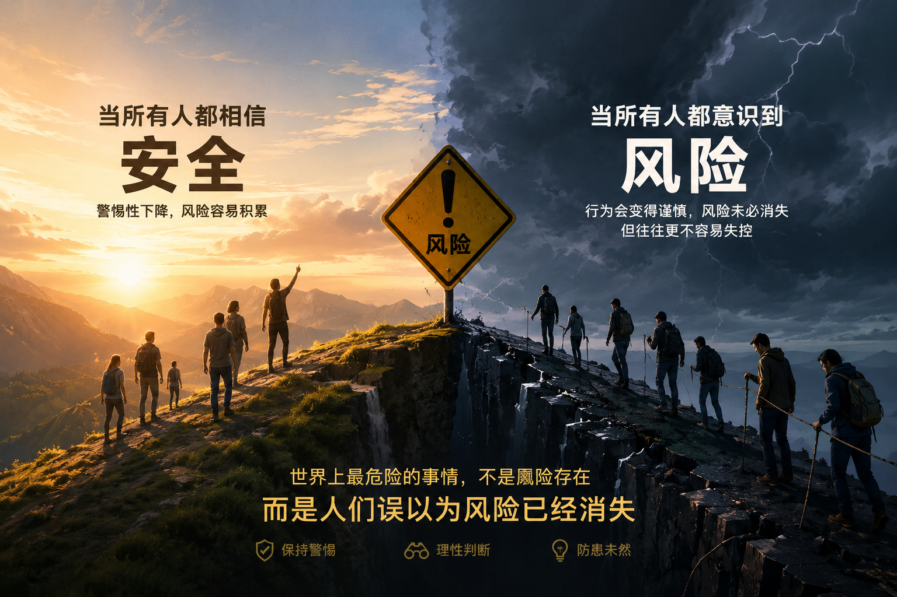
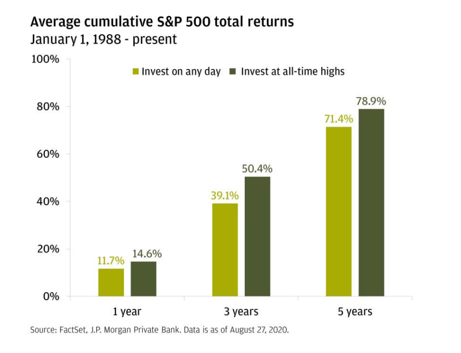
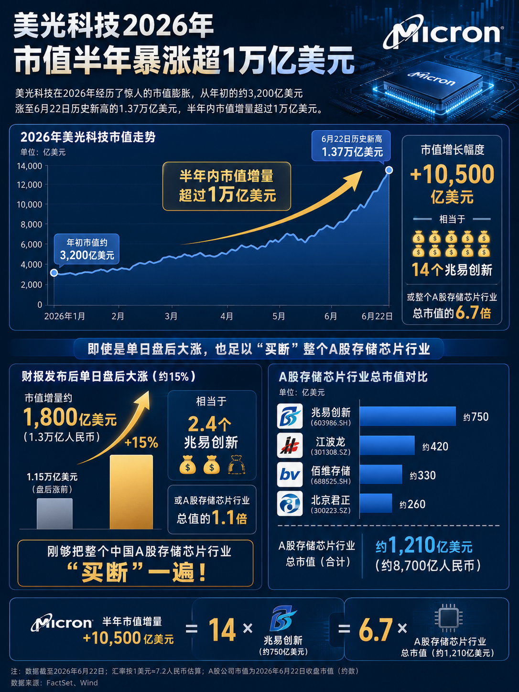
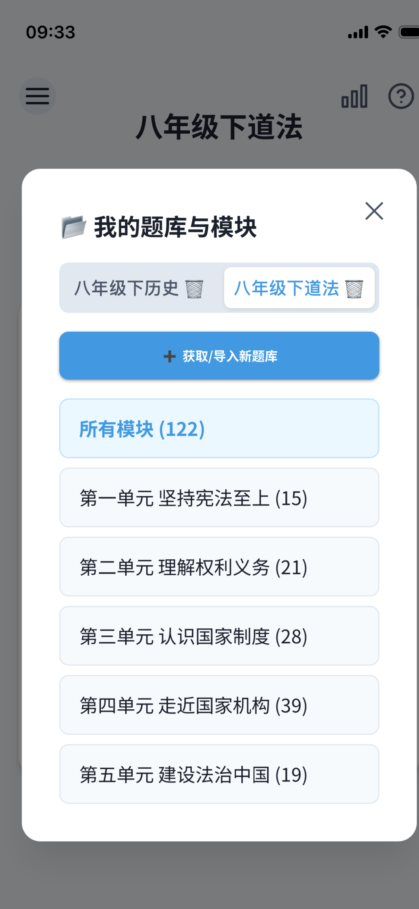
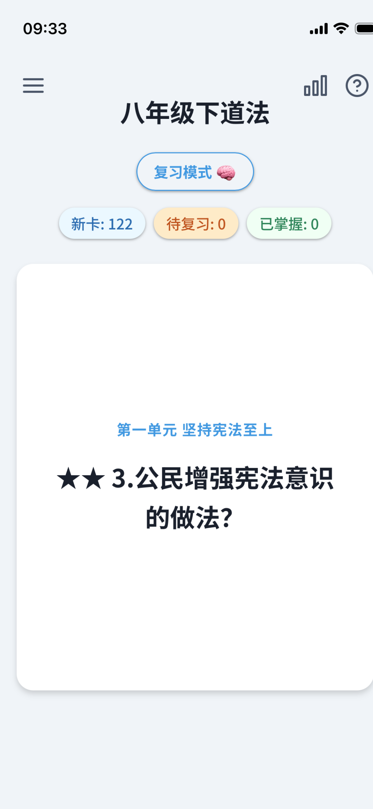
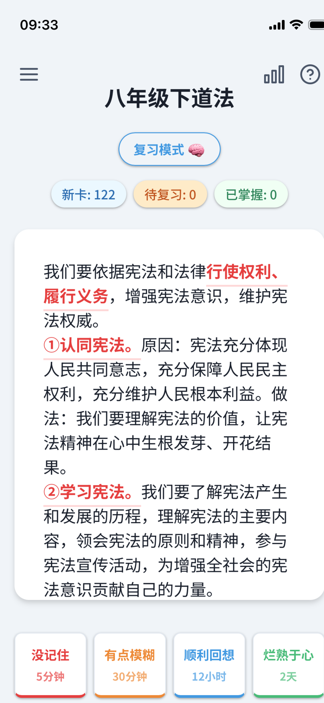
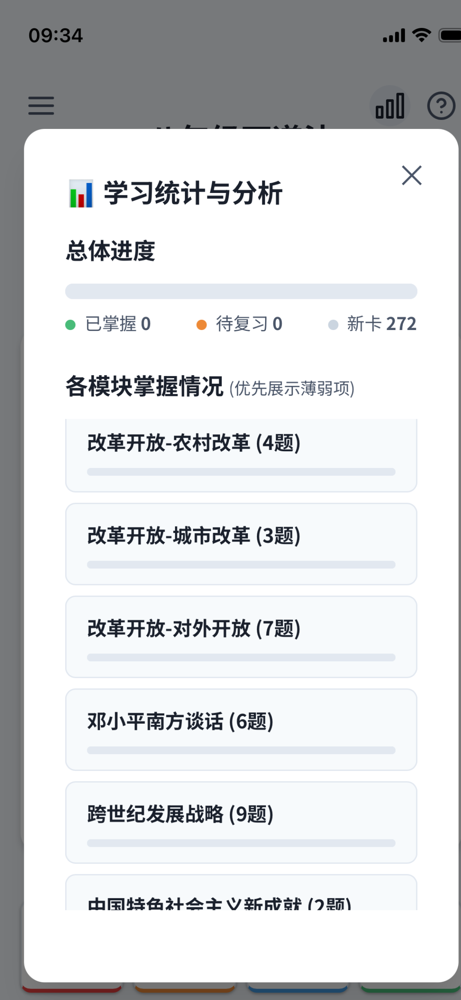
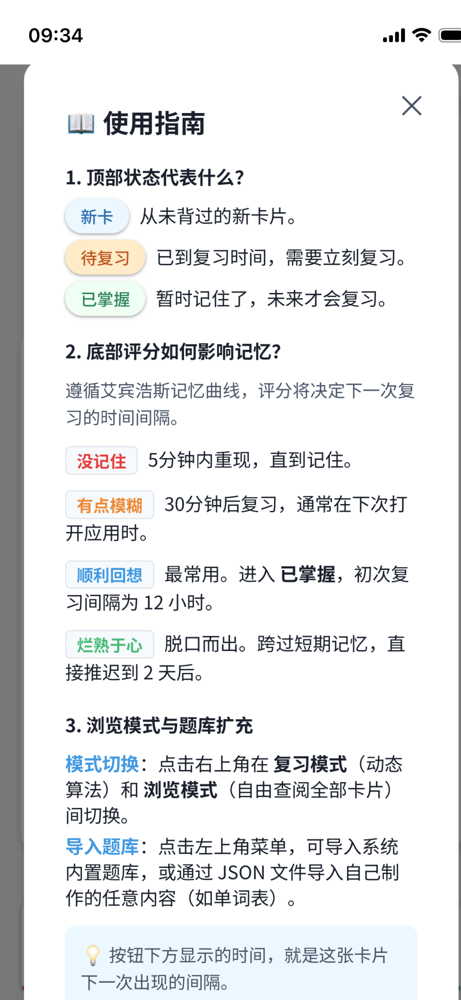
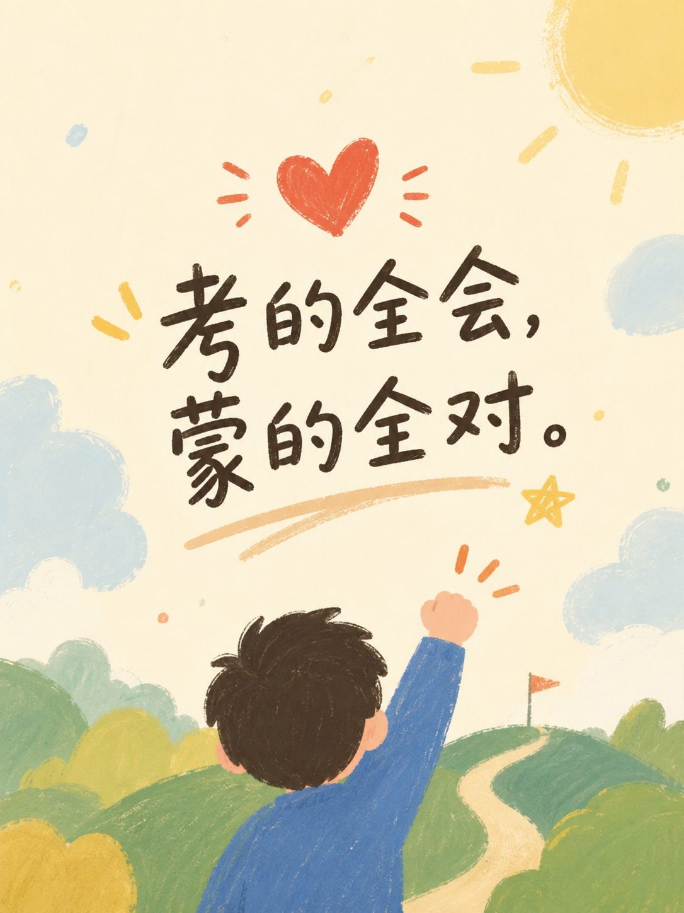

# 2026-06 即刻归档

## 月度总结
- 本月共归档 38 条内容，活跃了 17 天，时间范围从 2026-06-01 到 2026-06-29。
- 发帖最集中的一天是 2026-06-14，当天共记录 12 条。
- 本月最常出现的话题是：小散户的日常 (10), AI探索站 (5), 浴室沉思 (5)。
- 带媒体链接的内容有 4 条，短笔记风格的内容有 17 条。
- 最长的一条发布于 2026-06-25，正文约 245 字。

## 2026-06-01

### [15:12](https://m.okjike.com/originalPosts/6a1d30e456d2e0cb34fdc891)
科技行业占了韩国GDP的10%，引爆了全国近一半的增长，但它创造的就业岗位却仅占1%

#你不知道的行业内幕

---

## 2026-06-02

### [10:29](https://m.okjike.com/originalPosts/6a1e4018b90d7a448aad3c58)
当下的AI浪潮可能并不是一场“把人解放出来去享受生活”的科技乌托邦，而是一场正在加速发生的、由资本和预期驱动的“21世纪白领圈地运动”。它打破了劳动力与消费之间的良性循环，使全球经济面临生产力狂飙但有效需求萎缩的宏观通缩风险。

#AI探索站

---

### [10:33](https://m.okjike.com/originalPosts/6a1e40fb7f825282463bad00)
以往老员工负责智能、小白负责人工的模式被AI彻底打破了。

#AI探索站

---

### [10:34](https://m.okjike.com/originalPosts/6a1e411f289e2a4389bd94ef)
青年时期的失业会像纹身一样伴随整个人生轨迹。它不仅让职场新人被迫接受不合适的工作、长久偏离正常的职业轨道，还让他们在最需要密集学习的阶段丢失了沉淀技能和积累人脉的机会。最糟糕的是，简历上的空白期会被后续的雇主解读为能力不足的负面信号，形成“早期多失业一天，壮年期多失业几天”的恶性循环。

#职场那些事儿

---

### [10:42](https://m.okjike.com/originalPosts/6a1e431daf7695b4cf834113)
当你因为强烈反感某种观点而一秒钟划走，并故意投向对立阵营的怀抱时，平台的算法比你更清楚你的软肋，它会源源不断地为你推送定制化的精神快餐。这种被同质化信息紧紧包裹的舒适感，恰恰是步入愚昧的开始。

#浴室沉思

---

### [10:45](https://m.okjike.com/originalPosts/6a1e43d6505039ecb7b2f7ad)
人与人之间的深度连接，绝不是靠表达欲的滔滔不绝，而是靠一种克制的、能把对方真实情绪稳稳接住的理解能力。

#浴室沉思

---

### [10:51](https://m.okjike.com/originalPosts/6a1e4547c2dc8bf83f9cd9e0)
AI的出现其实是一次让人类心碎的觉醒机会，因为它在工具属性上远比人类好用。当作为工具的退路被切断，人类才不得不重新直面自己无法被定价的生存价值。

#AI探索站

---

## 2026-06-07

### [06:50](https://m.okjike.com/originalPosts/6a24a4488694679c36e2573b)
金融的本质是跨越时空的价值交换，敢把今天的钱留给未来，或者敢把未来的钱透支到今天，核心纽带是“信任”。如果一个社会的法治不健全、契约无保障、缺乏有效的制度信用，那么金融工具极易异化为大鳄围猎普通人的掠夺工具，非但无法带来自由，反而会制造更深的债务枷锁与信任危机。

#浴室沉思

---

## 2026-06-08

### [21:25](https://m.okjike.com/originalPosts/6a26c2b51bd695bf20255b89)
世间几乎所有荒诞的社会乱象，本质上都是“政治逻辑”对“经济逻辑”的强行扭曲；任何打着高尚旗号、违背经济规律的公共政策，最终都会被冰冷的激励机制无情反噬。

#浴室沉思

---

## 2026-06-09

### [21:15](https://m.okjike.com/originalPosts/6a2811ea4eabc800c122f7cc)
投资在本质上是预判未来，而预判未来如果缺乏超越均值的认知，本质上就是一场必输的赌博。

#小散户的日常

---

## 2026-06-10

### [19:38](https://m.okjike.com/originalPosts/6a294cb28694679c365dd34a)
过拟合自信

---

## 2026-06-11

### [14:53](https://m.okjike.com/originalPosts/6a2a5b524eabc800c15f37e9)
预测网站Polymarket上，人们对年底前AI泡沫破灭的押注概率定格在26%。

这个数字看似不高，但对赌的条件却极为严苛。规则规定，在2026年底前，以下六个指标只要在90天内同时触发任意三个，即判定AI破灭：

* 英伟达从高点跌幅达50%
* SOXX半导体ETF从高点跌幅达40%
* OpenAI或Anthropic宣布破产
* OpenAI被收购
* H100芯片租赁价格连续五天跌破1美元
* 台积电、阿斯麦、博通、ANET或SMCI等核心硬件供应商股价从高点腰斩

#AI探索站

---

## 2026-06-12

### [15:04](https://m.okjike.com/originalPosts/6a2baf854eabc800c182570b)
《股票投资之道》（全7课）宋玉臣教授讲解股票投资知识 幽默风趣，全程干货！股票入门基础知识讲解 适合股市新手和股市老手

无意间发现一个吉林大学的博导讲股市投资的。基本可以当脱口秀来听。

#小散户的日常

---

## 2026-06-13

### [17:01](https://m.okjike.com/originalPosts/6a2d1c4daa39df51048e281b)
现代社会赖以生存的基石，是阶级之间的“相互需要”。资本家需要工人的劳动，统治者需要被统治者的纳税与兵源，正是这种拉扯构成了福利制度和人权的底层土壤。当AI剥夺了99%普通人的劳动价值，社会学意义上的“剥削”甚至成了一种奢望，很多人连被剥削的资格都没有了。顶层1%的寡头在经济上完成了与底层的脱钩，也随之失去了向底层妥协、提供社会福利和维持基本尊严的动机。这才是真正让人窒息的世纪难题。

#AI探索站

---

### [17:02](https://m.okjike.com/originalPosts/6a2d1cb01bd695bf20cd94dc)
算法永远在寻找概率最大、最符合规律的节点。而人类历史上的伟大创新往往来自于不合常理的灵光一现和叛逆直觉。

#浴室沉思

---

### [17:27](https://m.okjike.com/originalPosts/6a2d2282aa39df51048ec42a)
频繁操作往往只是在消耗运气的概率，拉长时间看，大部分玩高抛低吸的人甚至跑不赢大盘

#小散户的日常

---

## 2026-06-14

### [10:21](https://m.okjike.com/originalPosts/6a2e101d8694679c36dc098e)
当下底层的快消与餐饮市场正在发生一场底层逻辑的质变。过去企业靠卖商品给消费者赚钱，现在大量野牌子甚至山寨企业，已经彻底放弃了靠售卖商品盈利的传统模式。它们发现了一种更快、更暴利的公开套利模型：不再向消费者卖奶茶，而是向渴望赚钱的普通人贩卖“赚钱的梦想” 。

#你不知道的行业内幕

---

### [10:27](https://m.okjike.com/originalPosts/6a2e119c1ca15d1941e1e058)
普通人遇到市场波动，最习惯的动作是发微信问懂行的朋友：现在能卖点黄金吗？现在能换点美元吗？这种提问本质上不是在寻求客观分析，而是在“求共识”——他们内心已经有了买卖的倾向，只是想找个聪明人为自己的心理冲动背书。

#小散户的日常

---

### [10:39](https://m.okjike.com/originalPosts/6a2e146a1bd695bf20e6b0b6)
清华大学的一项小样本调查显示，有相当一部分考上清华的孩子，初中、高中都在玩，某一天突然开窍就考上了。这撕碎了“军备竞赛式教育”的谎言：如果孩子是那块料，不怎么按部就班地卷也能考上；如果不是，七八个家长的“军备竞赛”只会把孩子逼向深渊。

#亲子教育小课堂

---

### [13:45](https://m.okjike.com/originalPosts/6a2e40101bd695bf20eb2733)
高考就是今天我们拿给国家看的一份诚意。你连死记硬背、应付考试的苦都不愿意吃，国家怎么能相信你未来能成为栋梁之才？

#高考加油站

---

### [14:24](https://m.okjike.com/originalPosts/6a2e492339822f304610cdb8)
人类的大脑天然存在“跨期不一致”的bug，对当下的快乐贴现率极高，对长期的未来贴现率极低 。

#一个想法不一定对

---

### [14:26](https://m.okjike.com/originalPosts/6a2e4983aa39df5104ac80c7)
所有的“七天无理由退货”表面上是给消费者的福利，实际上是利用了人性弱点 。只要你把衣服或电器拿回家用上三天，它就在你的大脑中自动归属为“我的财产”，此时退货带来的损失感会远大于拿回退款的快乐，绝大多数人最终都会选择留下它 。

#你不知道的行业内幕

---

### [15:02](https://m.okjike.com/originalPosts/6a2e51f91bd695bf20ecdff3)
为了不把人活活饿死，大脑的“守门人”海马体每天都在疯狂删文件，把那些不能吃、不保命的现代科学和商业逻辑无情扔进回收站。

#无用但有趣的冷知识

---

### [15:28](https://m.okjike.com/originalPosts/6a2e58078694679c36e34ff0)
世界上最危险的事情，不是风险存在，而是人们误以为风险已经消失。当所有人都相信安全时，警惕性下降，风险容易积累；当所有人都意识到风险时，行为会变得谨慎，风险未必消失，但往往更不容易失控。

#小散户的日常

---

### [16:50](https://m.okjike.com/originalPosts/6a2e6b688694679c36e54444)
“想要”则是由多巴胺驱动的欲望系统，多巴胺不是快乐分子，而是欲望分子，它不负责让你爽，只负责制造一种“还没得到但迫切想得到”的紧迫感和向前的驱动力

#心理学研究小组

---

### [16:52](https://m.okjike.com/originalPosts/6a2e6be0aa39df5104afe711)
在交友和选择工作环境时，主动去靠近那些认可你、能放大你优势的圈子。

#一个想法不一定对

---

### [16:58](https://m.okjike.com/originalPosts/6a2e6d2d1bd695bf20efa242)
觉得不高兴时，在嘴里叼一根棒棒糖，被迫张开的嘴角会强行营造出一种“假笑”的肌肉记忆。多假笑几次，神经元可塑性就会被触发，大脑就会误以为你真的很开心，进而把假笑变成真高兴。

#无用但有趣的冷知识

---

### [22:53](https://m.okjike.com/originalPosts/6a2ec0591bd695bf20f7e319)
自1988年以来的30多年数据表明，在S&P 500指数的历史最高点买入并持有一年，赚钱的概率高达88%，平均回报率为+14.6% 。相比之下，在任意一天随机买入的赚钱概率只有83%，平均回报率为+11.7% 。这种优势在拉长到三年和五年的周期里依然成立 。

#小散户的日常

---

## 2026-06-15

### [07:19](https://m.okjike.com/originalPosts/6a2f36f24eabc800c1de8382)
在长线投资里，真正拉开财富差距的是“留在市场里的时间”，而不是“进入市场的时间”。

#小散户的日常

---

## 2026-06-16

### [12:00](https://m.okjike.com/originalPosts/6a30ca704eabc800c108f575)
决定楼市能不能撑住的试金石，正是接下来的6、7、8三个月。这三个月是传统的中夏楼市淡季，如果淡季的成交量能够稳住不发生大跳水，才能证明市场具备了阶段性构筑底部的韧性；如果淡季一来销售立刻掉头向下，那之前所有的热闹，都只是楼市回归居住属性过程中的一次普通波动

#一个想法不一定对

---

## 2026-06-19

### [15:09](https://m.okjike.com/originalPosts/6a34eb433d621d786204b4eb)
我们在熟悉的城市里朝九晚五，一万个日子过得像同一天，心理时间便快得像指间沙，一眨眼一年就没了。但当你置身于完全陌生的环境，哪怕只有三天，你的大脑为了生存和适应，必须全神贯注地接收全新的细节——找住处、适应饮食、辨别方向。这种信息密度的暴增，会在主观上把时间拉得极长。

#一个想法不一定对

---

## 2026-06-21

### [19:51](https://m.okjike.com/originalPosts/6a37d054228d9ca169c8746d)
普通人笃信“高风险高回报”，而顶级生意人永远在寻找成本无限接近于零、失败也能全身而退的“不对称机会” 。在这个维度里，生存是复利的前提。如果一次失败能让人伤筋动骨，利润再高也不具备实操价值。

#小散户的日常

---

## 2026-06-25

### [12:26](https://m.okjike.com/originalPosts/6a3cae113d621d7862e768f5)
A股存储芯片大有可为[偷笑]

#小散户的日常

---

### [13:45](https://m.okjike.com/originalPosts/6a3cc065228d9ca16959cebf)
这一集播客太有感触了。

当孩子的生活被固定在同样的轨道，他接触到的新事物、新体验和新可能性会越来越少。世界变得越来越熟悉，也越来越缺少值得探索的地方。

而好奇心，恰恰诞生于“我没见过”“我不知道”“为什么会这样”的瞬间。

只有接触未知，才会产生好奇；只有产生好奇，才会主动发问；只有不断发问，才会获得新知。

在AI时代，获取答案正变得越来越容易。相比于记住答案，一个人能否保持对世界的好奇，能否发现值得追问的问题，正在变得越来越重要。

答案可以被生成，但问题往往只能由好奇心孕育。

#一起听播客

---

## 2026-06-28

### [08:26](https://m.okjike.com/originalPosts/6a406a4b78e3636d902becfd)
低质量的勤奋，只会感动自己；高质量的努力，是认知、选择和执行三者共同作用的结果。

#今日金句

---

### [10:19](https://m.okjike.com/originalPosts/6a4084a178e3636d902edfe6)
期末考前阶段，为了对付一大堆要背的知识点，连夜给儿子搓了一个“记忆闪卡”应用出来。
临时抱佛脚专用，希望能帮他多记两道题🙏🏻

https://study-notes-emm.pages.dev/

---

### [10:42](https://m.okjike.com/originalPosts/6a408a1b3d621d7862577cc7)
如果让我挑选一些希望孩子能够更早接触的“成人世界”观念，那么“反直觉思维”一定名列前茅。填鸭式、死记硬背的教育有一个问题：它不仅教会孩子记住答案，也会让他们误以为真理本该显而易见；然而，真实的世界恰恰相反——真正的答案，往往出人意料。
(paul graham)

#今日金句

---

## 2026-06-29

### [16:40](https://m.okjike.com/originalPosts/6a422f74228d9ca169f5d4f6)
1978年，投资总监提拔25岁的斯坦利·德鲁肯米勒做研究部主管，理由很残酷——"我们这些老家伙身上全是熊市伤疤，真到了该扣动扳机的时候下不去手，所以需要个年轻、不知道害怕的人冲进去。

#小散户的日常

---
