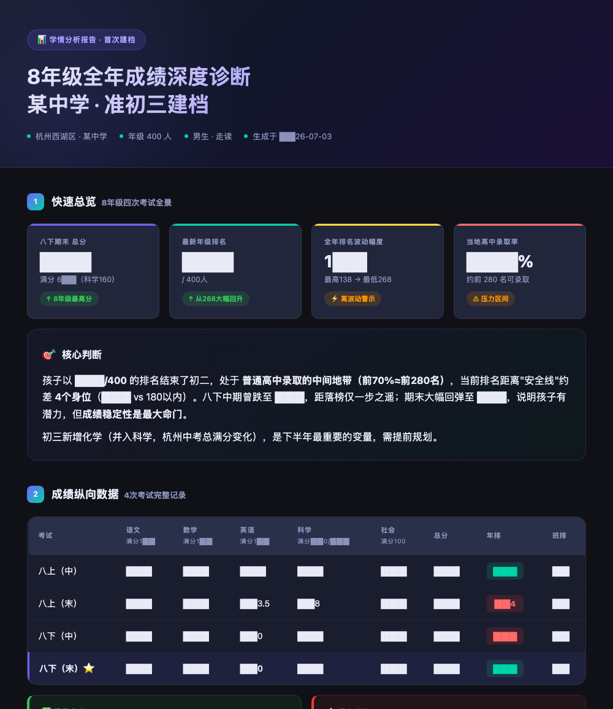
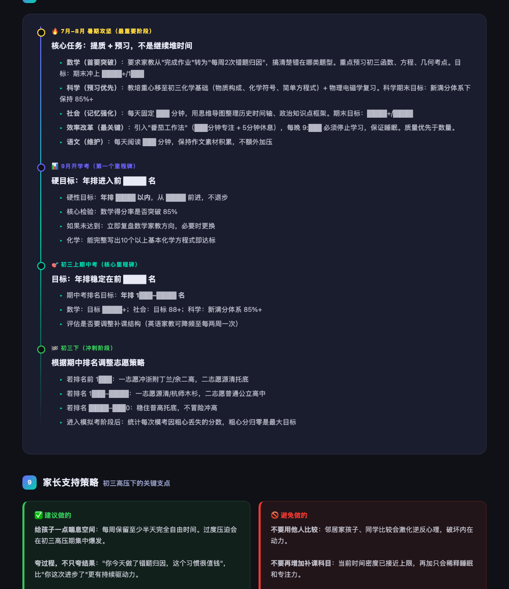
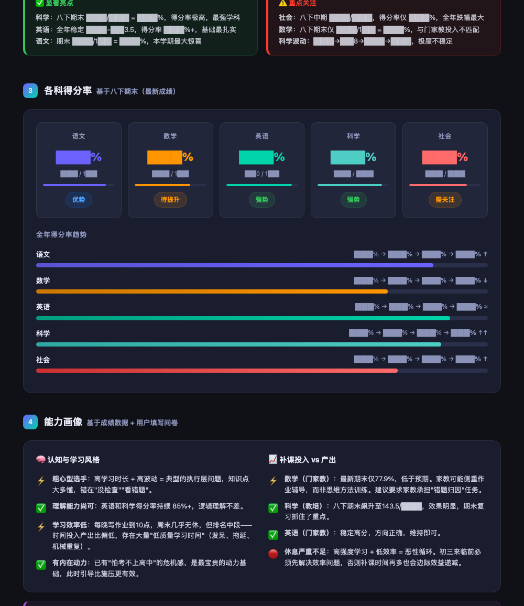

# 2026-07 即刻归档

## 月度总结
- 本月共归档 8 条内容，活跃了 4 天，时间范围从 2026-07-01 到 2026-07-11。
- 发帖最集中的一天是 2026-07-11，当天共记录 4 条。
- 本月最常出现的话题是：浴室沉思 (3), 小散户的日常 (2), 一起来学习 (2)。
- 带媒体链接的内容有 1 条，短笔记风格的内容有 6 条。
- 最长的一条发布于 2026-07-06，正文约 292 字。

## 2026-07-01

### [14:29](https://m.okjike.com/originalPosts/6a44b3d173763cc9952ddb83)
信普涨买宽基，信分化买精选。

#小散户的日常

---

### [14:29](https://m.okjike.com/originalPosts/6a44b3e5684509082c79d3c2)
用终局视角选定方向，用第一性原理把启动成本降到最低，然后用系统化的每日习惯去对冲聪明人特有的三分钟热度。

#浴室沉思

---

## 2026-07-03

### [23:50](https://m.okjike.com/originalPosts/6a47da30228d9ca169949f8f)
考试终于结束了。

顺手写了个 Skill，拿来分析一下孩子这次的成绩单，看看哪些地方学得还不错，哪些地方还有短板，也顺便理一理初三最后这一年该怎么调整，希望少走点弯路。

#一起来学习

---

## 2026-07-06

### [16:39](https://m.okjike.com/originalPosts/6a4b69d254aae0885e998899)
考试结束了，分享一个我最近写的小应用：学生学习能力智能评估系统

平时拿到成绩单光看分数和名次，大概知道孩子具体的薄弱点在哪，到底是偏科、吃老本还是发挥不稳定。为了让接下来的暑假的查缺补漏更有针对性，我做了一个配合AI使用的数据分析工具。

把最近几次的成绩和相应的问卷回答填进去，生成提示词，然后利用Kimi的大模型，它会自动计算得分率、方差和偏科指数，通过数据量化的方式直观地告诉你哪些科目是真的有优势，哪些处于需要优先干预的危险区，辅助调整时间分配。

提一句，这个纯粹是我自己做给自家孩子用的，没有任何商业关联。网页代码也是开源的，你们输入的成绩数据我也看不到，隐私绝对安全。

#一起来学习

---

## 2026-07-11

### [11:08](https://m.okjike.com/originalPosts/6a51b3aa228d9ca1698bd351)
景区的餐饮不好吃，因为流量是景区带来的，做好产品也没有复购。

#浴室沉思

---

### [11:09](https://m.okjike.com/originalPosts/6a51b3f254aae0885e33edb6)
所有的一鸣惊人，都是蓄谋已久。（王濛）

#今日金句

---

### [11:20](https://m.okjike.com/originalPosts/6a51b692228d9ca1698c1a5a)
37%法则——前37%的时间只观察不出手，后面遇到超过之前水平的就当机立断。

#小散户的日常

---

### [11:22](https://m.okjike.com/originalPosts/6a51b70b228d9ca1698c22c7)
从自己筛选信息，到让 AI替你整理答案，效率高了，但主动思考的机会也被剥夺了。

#浴室沉思

---
